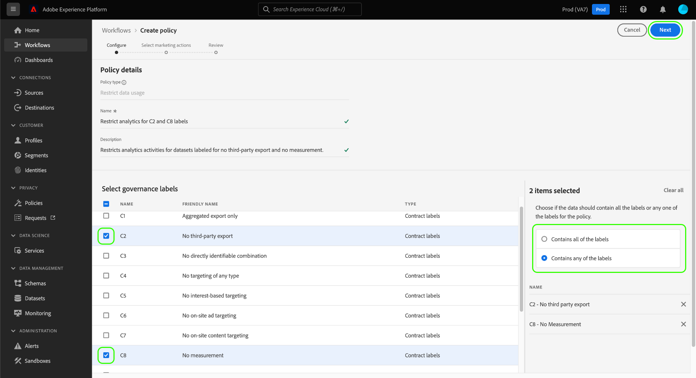
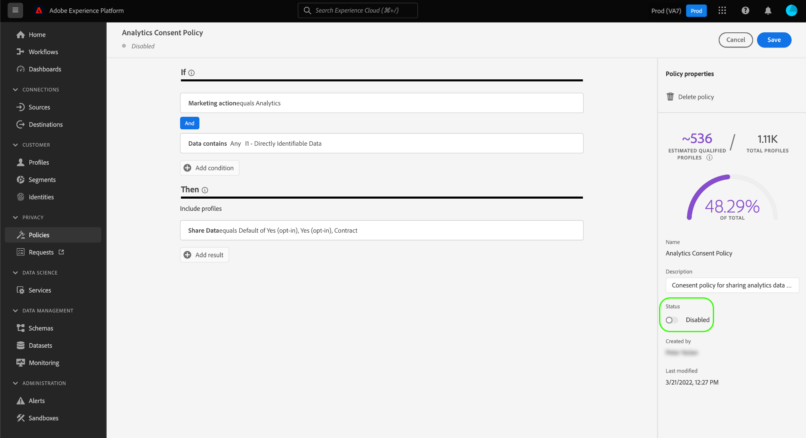

# 在UI中管理資料使用原則

本檔案說明如何使用 **[!UICONTROL 原則]** 工作區，以建立和管理資料使用原則。

>[!NOTE]
>
>有關如何在UI中管理存取控制原則的資訊，請參閱 [基於屬性的訪問控制UI指南](../../access-control/abac/ui/policies.md) 。

>[!IMPORTANT]
>
>預設會停用所有資料使用原則(包括Adobe提供的核心原則)。 為了考慮執行單個策略，必須手動啟用該策略。 請參閱 [啟用策略](#enable) 以取得在UI中執行此動作的步驟。

## 先決條件

本指南需要妥善了解下列項目 [!DNL Experience Platform] 概念：

* [資料控管](../home.md)
* [資料使用原則](./overview.md)

## 查看現有策略 {#view-policies}

在 [!DNL Experience Platform] UI, select **[!UICONTROL 原則]** 開啟 **[!UICONTROL 原則]** 工作區。 在 **[!UICONTROL 瀏覽]** 標籤中，您可以看到可用策略的清單，包括其關聯標籤、行銷操作和狀態。

如果您有權存取同意原則，請選取 **[!UICONTROL 同意原則]** 切換為在中檢視 [!UICONTROL 瀏覽] 標籤。

選擇列出的策略以查看其說明和類型。 如果選擇了自定義策略，則顯示其他控制項以編輯、刪除或 [啟用/停用原則](#enable).

## 建立自訂原則 {#create-policy}

要建立新的自定義資料使用策略，請選擇 **[!UICONTROL 建立原則]** 在 **[!UICONTROL 瀏覽]** 標籤 **[!UICONTROL 原則]** 工作區。

視您是否為同意政策測試版的一部分而定，會發生下列其中一項情況：

* 如果您不是測試版的一部分，系統會立即將您帶入的工作流程 [建立資料控管原則](#create-governance-policy).
* 如果您是測試版的一部分，對話方塊會提供額外的選項，供您 [建立同意原則](#consent-policy).
   

### 建立資料控管原則 {#create-governance-policy}

此 **[!UICONTROL 建立原則]** 工作流程隨即出現。 首先，提供新策略的名稱和說明。

接下來，選擇策略將基於的資料使用量標籤。 選擇多個標籤時，您可以選擇資料應包含所有標籤還是僅包含其中一個標籤，以便應用策略。 選擇 **[!UICONTROL 下一個]** 完成時。

此 **[!UICONTROL 選取行銷動作]** 步驟。 從提供的清單中選擇適當的行銷動作，然後選取 **[!UICONTROL 下一個]** 繼續。

>[!NOTE]
>
>選取多個行銷動作時，原則會將其解譯為「OR」規則。 換言之，若 **any** 中指定的URL。

此 **[!UICONTROL 檢閱]** 步驟，允許您在建立新策略之前查看其詳細資訊。 在您滿意後，選取 **[!UICONTROL 完成]** 來建立策略。

此 **[!UICONTROL 瀏覽]** 頁簽重新顯示，該頁簽將列出新建立的「草稿」狀態策略。 要啟用策略，請參閱下一節。

### 建立同意原則 {#consent-policy}

>[!IMPORTANT]
>
>同意政策僅適用於已購買的組織 **Adobe醫療保健盾** 或 **Adobe隱私與安全防護**.

如果選擇建立同意策略，則會出現一個新螢幕，允許您配置新策略。

若要使用同意政策，您的設定檔資料中必須有同意屬性。 請參閱 [同意處理Experience Platform](../../landing/governance-privacy-security/consent/adobe/overview.md) 以取得如何在聯合結構中包含必要屬性的詳細步驟。

同意政策由兩個邏輯元件組成：

* **[!UICONTROL 若]**:將觸發策略檢查的條件。 這可以根據要執行的特定行銷動作、是否有特定資料使用標籤，或兩者的組合。
* **[!UICONTROL 然後]**:必須存在的同意屬性，才會將設定檔納入觸發原則的動作中。

#### 設定條件 {#consent-conditions}

>[!CONTEXTUALHELP]
>id="platform_governance_policies_consentif"
>title="If條件"
>abstract="首先，定義將觸發策略檢查的條件。 條件包括要採取的特定行銷動作、要呈現的特定資料控管標籤，或兩者的組合。"

在 **[!UICONTROL 若]** 區段中，選取應觸發此原則的行銷動作和/或資料使用標籤。 選擇 **[!UICONTROL 查看全部]** 和 **[!UICONTROL 選擇標籤]** 檢視可用行銷動作和標籤的完整清單。

新增至少一個條件後，您可以選取 **[!UICONTROL 新增條件]** 若要視需要繼續新增其他條件，請從下拉式清單中選擇適當的條件類型。

如果您選取多個條件，您可以使用它們之間顯示的圖示，來切換&quot;AND&quot;與&quot;OR&quot;之間的條件關係。

#### 選取同意屬性 {#consent-attributes}

>[!CONTEXTUALHELP]
>id="platform_governance_policies_consentthen"
>title="Then條件"
>abstract="定義「If」條件後，請使用「Then」區段，從聯合架構中選取至少一個同意屬性。 這是必須存在的屬性，配置檔案才能包含在此策略所管轄的操作中。"

在 **[!UICONTROL 然後]** 節，從聯合架構中至少選擇一個同意屬性。 這是必須存在的屬性，配置檔案才能包含在此策略所管轄的操作中。 您可以從清單中選擇一個提供的選項，或選擇 **[!UICONTROL 查看全部]** 從聯合架構中直接選擇屬性。

選擇同意屬性時，選擇要此策略檢查的屬性值。

選取至少一個同意屬性後， **[!UICONTROL 策略屬性]** 面板更新，顯示此政策允許的預估設定檔數量，包括設定檔存放區總數的百分比。 當您調整策略配置時，此估計會自動更新。

要向策略添加更多同意屬性，請選擇 **[!UICONTROL 添加結果]**.

您可以視需要繼續新增及調整條件和同意屬性至原則。 對配置感到滿意時，請在選擇之前提供策略的名稱和可選說明 **[!UICONTROL 儲存]**.

現在已建立同意政策，其狀態已設為 [!UICONTROL 已停用] 依預設。 要立即啟用策略，請選擇 **[!UICONTROL 狀態]** 在右側邊欄中切換。

#### 驗證策略實施

建立並啟用同意原則後，您可以在將區段啟用至目的地時，預覽它對已同意對象的影響。 請參閱 [同意政策評估](../enforcement/auto-enforcement.md#consent-policy-evaluation) 以取得更多資訊。

## 啟用或禁用策略 {#enable}

預設會停用所有資料使用原則(包括Adobe提供的核心原則)。 若要考慮實施個別原則，您必須透過API或UI手動啟用該原則。

您可以從 **[!UICONTROL 瀏覽]** 標籤 **[!UICONTROL 原則]** 工作區。 從清單中選取自訂原則，以在右側顯示其詳細資訊。 在 **[!UICONTROL 狀態]**，選擇啟用或禁用策略的切換按鈕。

## 檢視行銷動作 {#view-marketing-actions}

在 **[!UICONTROL 原則]** 工作區，選取 **[!UICONTROL 行銷動作]** 標籤來檢視由Adobe和您自己的組織定義的可用行銷動作清單。

## 建立行銷動作 {#create-marketing-action}

若要建立新的自訂行銷動作，請選取 **[!UICONTROL 建立行銷動作]** 在 **[!UICONTROL 行銷動作]** 標籤 **[!UICONTROL 原則]** 工作區。

此 **[!UICONTROL 建立行銷動作]** 對話框。 輸入行銷動作的名稱和說明，然後選取 **[!UICONTROL 建立]**.

新建立的動作會顯示在 **[!UICONTROL 行銷動作]** 標籤。 您現在可以在 [建立新資料使用策略](#create-policy).

## 編輯或刪除行銷動作 {#edit-delete-marketing-action}

>[!NOTE]
>
>您的組織所定義的自訂行銷動作只能編輯。 無法變更或刪除由Adobe定義的行銷動作。

在 **[!UICONTROL 原則]** 工作區，選取 **[!UICONTROL 行銷動作]** 標籤來檢視由Adobe和您自己的組織定義的可用行銷動作清單。 從清單中選取自訂行銷動作，然後使用右側區段中提供的欄位來編輯行銷動作的詳細資訊。

如果任何現有使用原則未使用行銷動作，您可以選取 **[!UICONTROL 刪除行銷動作]**.

>[!NOTE]
>
>嘗試刪除現有策略正在使用的市場營銷操作會導致出現一條錯誤消息，表明刪除嘗試失敗。

## 後續步驟

本檔案概述如何在 [!DNL Experience Platform] UI。 有關如何使用 [!DNL Policy Service API]，請參閱 [開發人員指南](../api/getting-started.md). 如需如何強制執行資料使用原則的資訊，請參閱 [策略實施概述](../enforcement/overview.md).

以下影片示範如何使用 [!DNL Experience Platform] UI:

>[!VIDEO](https://video.tv.adobe.com/v/32977?quality=12&learn=on)
