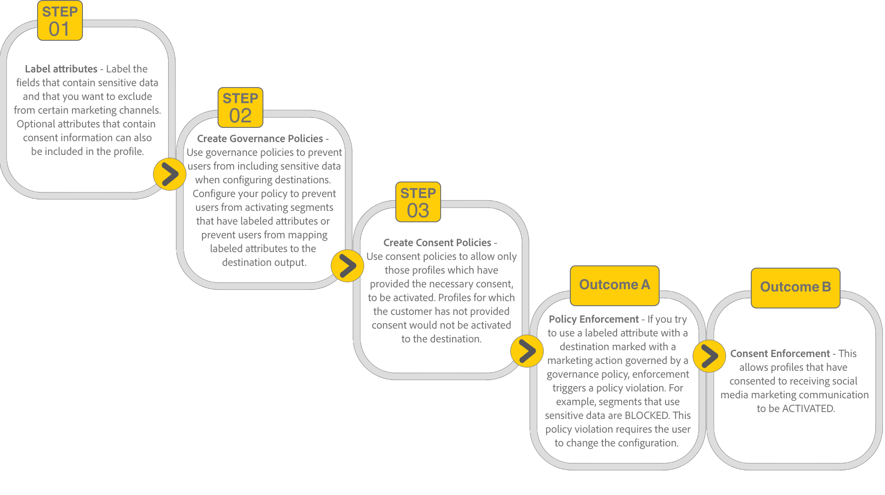

# 在UI中管理資料使用原則 {#user-guide}

>[!CONTEXTUALHELP]
>id="platform_privacyConsole_dataUsagePolicies_description"
>title="在您的設定檔資料中整合並強制執行客戶同意"
>abstract="<h2>說明</h2>
Platform 可讓您將從客戶收集來的同意資料整合到他們各自的設定檔中。然後，您可以設定同意原則以確定此資料是否可以包含在已啟用至特定目的地的區段中。
"

本檔案說明如何使用 **[!UICONTROL 原則]** Adobe Experience Platform UI中的工作區，用來建立和管理資料使用原則。

>[!NOTE]
>
>有關如何在UI中管理存取控制原則的資訊，請參閱 [屬性型存取控制UI指南](../../access-control/abac/ui/policies.md) 而非。

>[!IMPORTANT]
>
>所有資料使用原則(包括Adobe提供的核心原則)預設為停用。 為了考慮執行個別原則，您必須手動啟用該原則。 請參閱以下小節： [啟用原則](#enable) 以瞭解如何在UI中執行此動作的步驟。

## 先決條件

本指南需要您深入瞭解下列事項 [!DNL Experience Platform] 概念：

* [資料控管](../home.md)
* [資料使用原則](./overview.md)

## 檢視現有原則 {#view-policies}

在 [!DNL Experience Platform] UI，選取 **[!UICONTROL 原則]** 以開啟 **[!UICONTROL 原則]** 工作區。 在 **[!UICONTROL 瀏覽]** 索引標籤上，您可以看到可用原則的清單，包括其關聯的標籤、行銷動作和狀態。

如果您有權存取同意政策，請選取 **[!UICONTROL 同意原則]** 切換即可在 [!UICONTROL 瀏覽] 標籤。

選取列出的原則以檢視其說明和型別。 如果選取自訂原則，則會顯示其他控制項以編輯、刪除或 [啟用/停用原則](#enable).

## 建立自訂原則 {#create-policy}

若要建立新的自訂資料使用原則，請選取 **[!UICONTROL 建立原則]** 位於的右上角 **[!UICONTROL 瀏覽]** 索引標籤中的 **[!UICONTROL 原則]** 工作區。

根據您是否為同意政策Beta版的一部分，會發生下列其中一種情況：

* 如果您不屬於Beta版，系統會立即帶您進入工作流程進行 [建立資料治理原則](#create-governance-policy).
* 如果您隸屬於測試版，對話方塊會提供額外選項，可 [建立同意原則](#consent-policy).
  

### 同時使用資料控管和同意原則 {#combine-policies}

>[!NOTE]
>
>同意原則目前僅適用於已購買Adobe Healthcare Shield或Adobe Privacy &amp; Security Shield的組織。

控管和同意原則可搭配使用，以建立強大的規則來控管對應至目的地的對象。 同意原則本質上具包容性，這表示它們指定可包含在每個行銷體驗中的設定檔。 反之，治理原則會排除使用特定標籤屬性，以免設定為要啟動。

使用此行為，您可以設定包含正確設定檔的原則和同意規則組合，但阻止您包含違反已設定組織規則的資料。 範例情境為，您想要排除敏感性資料不包含在內，但仍可透過社群媒體將目標定位為同意的行銷使用者。 此情境的必要步驟概述於以下資訊圖。

### 建立資料治理原則 {#create-governance-policy}

此 **[!UICONTROL 建立原則]** 工作流程隨即顯示。 首先，提供新原則的名稱和說明。

接著，選取原則將依據的資料使用標籤。 選取多個標籤時，您可以選擇資料應包含所有標籤，還是僅包含其中一個，才能套用原則。 選取 **[!UICONTROL 下一個]** 完成後。

此 **[!UICONTROL 選取行銷動作]** 步驟隨即顯示。 從提供的清單中選擇適當的行銷動作，然後選取「 」 **[!UICONTROL 下一個]** 以繼續。

>[!NOTE]
>
>選取多個行銷動作時，原則會將它們解譯為「OR」規則。 換言之，此原則適用於 **任何** 所選行銷動作中的最後一個專案。

此 **[!UICONTROL 檢閱]** 步驟隨即顯示，可讓您在建立新原則之前先檢閱其詳細資訊。 在您滿意後，請選取 **[!UICONTROL 完成]** 以建立原則。

此 **[!UICONTROL 瀏覽]** 標籤會重新出現，現在會以「草稿」狀態列出新建立的原則。 若要啟用此原則，請參閱下一節。

### 建立同意原則 {#consent-policy}

>[!CONTEXTUALHELP]
>id="platform_privacyConsole_dataUsagePolicies_instructions"
>title="說明"
>abstract="<ul><li>確保您透過 OneTrust 來源連接器或標準 XDM 結構描述，將偏好設定資料擷取到您的聯合結構描述以取得同意。</li><li>在左側導覽中選取<a href="https://experienceleague.adobe.com/docs/experience-platform/data-governance/policies/overview.html?lang=zh-Hant">原則</a>，然後選取<a href="https://experienceleague.adobe.com/docs/experience-platform/data-governance/policies/user-guide.html?lang=zh-Hant#create-governance-policy">建立原則</a>。</li><li>在 <b>If</b> 區段下，描述將觸發原則檢查的條件或動作。</li><li>在 <b>Then</b> 區段下，輸入同意屬性，此同意屬性必須存在才能將設定檔包含在觸發原則的動作中。</li><li>選取<b>儲存</b>以建立原則。若要啟用原則，請選取右側邊欄中的 <b>狀態</b>切換。</li><li>當您將區段啟用到目的地時，Experience Platform 會自動強制執行您的已啟用同意原則，並提供每個原則如何影響對象大小的詳細資訊。</li><li>如需有關此功能的更多說明，請參閱 Experience League 上的<a href="https://experienceleague.adobe.com/docs/experience-platform/data-governance/policies/user-guide.html?lang=zh-Hant#consent-policy">建立同意原則</a>指南。</li></ul>"

>[!IMPORTANT]
>
>同意原則僅適用於已購買的組織 **AdobeHealthcare Shield** 或 **Adobe隱私權與安全防護板**.

如果您選擇建立同意原則，則會顯示一個新畫面，供您設定新原則。

為了使用同意政策，您的設定檔資料中必須有同意屬性。 請參閱以下指南： [Experience Platform中的同意處理](../../landing/governance-privacy-security/consent/adobe/overview.md) 有關如何將所需屬性包含在聯合結構描述中的詳細步驟。

同意原則包含兩個邏輯元件：

* **[!UICONTROL 如果]**：將觸發原則檢查的條件。 這可能根據所執行的特定行銷動作、特定資料使用標籤的出現或兩者的組合。
* **[!UICONTROL 則]**：設定檔必須存在的同意屬性，才能納入觸發原則的動作中。

#### 設定條件 {#consent-conditions}

>[!CONTEXTUALHELP]
>id="platform_governance_policies_consentif"
>title="If 條件"
>abstract="首先定義將觸發原則檢查的條件。條件可以包括正在採取的特定行銷動作、存在的特定資料控管標籤，或兩者的組合。"

在 **[!UICONTROL 如果]** 區段，選取應該觸發此原則的行銷動作和/或資料使用標籤。 選取 **[!UICONTROL 檢視全部]** 和 **[!UICONTROL 選取標籤]** 以分別檢視可用行銷動作和標籤的完整清單。

新增至少一個條件後，您可以選取 **[!UICONTROL 新增條件]** 若要繼續視需要新增其他條件，請從下拉式選單中選擇適當的條件型別。

如果您選取多個條件，您可以使用它們之間顯示的圖示，來切換「與」與「或」之間的條件式關係。

#### 選取同意屬性 {#consent-attributes}

>[!CONTEXTUALHELP]
>id="platform_governance_policies_consentthen"
>title="Then 條件"
>abstract="定義「If」條件後，使用「Then」部分從聯合方案中選擇至少一個同意屬性。此屬性必須存在，如此設定檔才能包含在此原則控管的動作中。"

在 **[!UICONTROL 則]** 區段，從聯合結構描述中選取至少一個同意屬性。 此屬性必須存在，如此設定檔才能包含在此原則控管的動作中。您可以從清單中選擇其中一個提供的選項，或選取 **[!UICONTROL 檢視全部]** 以直接從聯合結構描述選擇屬性。

選取同意屬性時，請選擇您要此原則檢查的屬性值。

選取至少一個同意屬性後， **[!UICONTROL 原則屬性]** 面板更新會顯示此原則允許的預估設定檔數量，包括設定檔存放區總數的百分比。 當您調整原則設定時，此估計會自動更新。

若要進一步新增同意屬性至原則，請選取 **[!UICONTROL 新增結果]**.

您可以視需要繼續新增及調整條件和同意屬性至原則。 當您對設定感到滿意時，請先提供原則的名稱和可選說明，然後再選取 **[!UICONTROL 儲存]**.

同意原則現在已建立，其狀態已設為 [!UICONTROL 已停用] 依預設。 若要立即啟用原則，請選取 **[!UICONTROL 狀態]** 在右側邊欄中切換。

#### 驗證原則執行

建立並啟用同意原則後，您可以預覽原則在啟用區段至目的地時，對您同意的對象有何影響。 請參閱以下小節： [同意原則評估](../enforcement/auto-enforcement.md#consent-policy-evaluation) 以取得詳細資訊。

## 啟用或停用原則 {#enable}

所有資料使用原則(包括Adobe提供的核心原則)預設為停用。 對於要考慮強制執行的個別原則，您必須透過API或UI手動啟用該原則。

您可以從以下位置啟用或停用原則： **[!UICONTROL 瀏覽]** 索引標籤中的 **[!UICONTROL 原則]** 工作區。 從清單中選取自訂原則，以在右側顯示其詳細資訊。 在 **[!UICONTROL 狀態]**，選取切換按鈕以啟用或停用原則。

## 檢視行銷動作 {#view-marketing-actions}

在 **[!UICONTROL 原則]** 工作區中，選取 **[!UICONTROL 行銷動作]** 標籤以檢視Adobe及您自己的組織所定義的可用行銷動作清單。

## 建立行銷動作 {#create-marketing-action}

若要建立新的自訂行銷動作，請選取 **[!UICONTROL 建立行銷動作]** 位於的右上角 **[!UICONTROL 行銷動作]** 索引標籤中的 **[!UICONTROL 原則]** 工作區。

此 **[!UICONTROL 建立行銷動作]** 對話方塊隨即顯示。 輸入行銷動作的名稱和說明，然後選取 **[!UICONTROL 建立]**.

新建立的動作會顯示在 **[!UICONTROL 行銷動作]** 標籤。 您現在可以在以下情況下使用行銷動作： [建立新的資料使用原則](#create-policy).

## 編輯或刪除行銷動作 {#edit-delete-marketing-action}

>[!NOTE]
>
>只能編輯您組織定義的自訂行銷動作。 Adobe定義的行銷動作無法變更或刪除。

在 **[!UICONTROL 原則]** 工作區中，選取 **[!UICONTROL 行銷動作]** 標籤以檢視Adobe及您自己的組織所定義的可用行銷動作清單。 從清單中選取自訂行銷動作，然後使用右側區段中提供的欄位來編輯行銷動作的詳細資訊。

如果任何現有使用原則未使用行銷動作，您可以選取「 」，將其刪除 **[!UICONTROL 刪除行銷動作]**.

>[!NOTE]
>
>嘗試刪除現有原則正在使用的行銷動作會導致出現錯誤訊息，指出刪除嘗試失敗。

## 後續步驟

本檔案概述如何在中管理資料使用原則 [!DNL Experience Platform] UI。 有關如何使用管理原則的步驟 [!DNL Policy Service API]，請參閱 [開發人員指南](../api/getting-started.md). 如需如何強制執行資料使用原則的詳細資訊，請參閱 [原則執行概觀](../enforcement/overview.md).

以下影片示範如何在中使用使用原則 [!DNL Experience Platform] UI：

>[!VIDEO](https://video.tv.adobe.com/v/32977?quality=12&learn=on)
