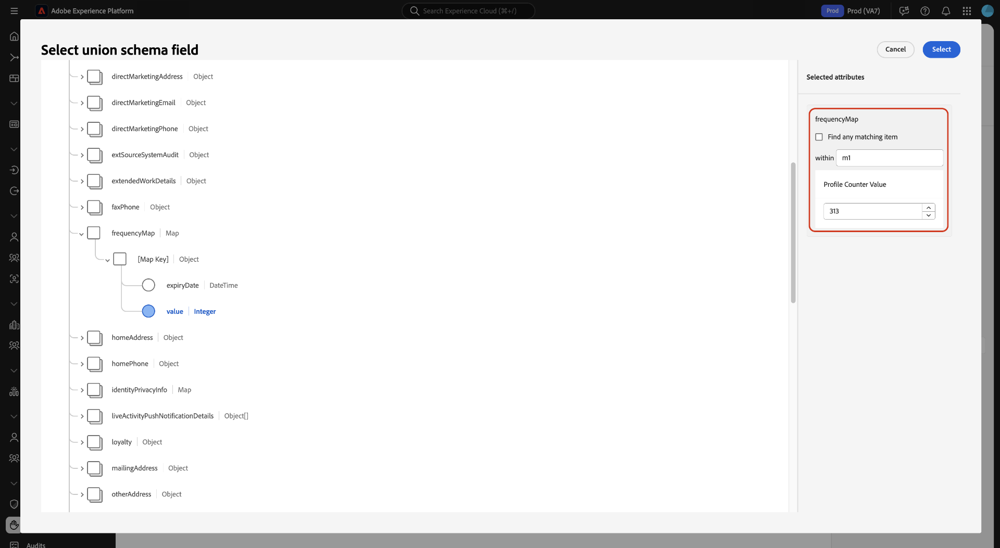

# 管理 UI 中的資料使用原則 {#user-guide}

>[!CONTEXTUALHELP]
>id="platform_privacyConsole_dataUsagePolicies_description"
>title="在您的設定檔資料中整合並強制執行客戶同意"
>abstract="<h2>說明</h2>
您可以使用 Experience Platform 將向客戶收集而來的同意資料整合到其各自的輪廓中。然後，您可以設定同意原則來確定在已對特定目的地啟用的區段中，是否可以包含這些資料。
"

本文介紹如何在Adobe Experience Platform UI中使用&#x200B;**[!UICONTROL Policies]**&#x200B;工作區來建立及管理資料使用原則。

>[!NOTE]
>
>如需有關如何在UI中管理存取控制原則的資訊，請參閱[屬性型存取控制UI指南](../../access-control/abac/ui/policies.md)。

>[!IMPORTANT]
>
>所有資料使用原則(包括Adobe提供的核心原則)預設為停用。 為了考慮執行個別原則，您必須手動啟用該原則。 請參閱[啟用原則](#enable)的相關小節，以瞭解如何在UI中執行此動作的步驟。

## 先決條件

本指南需要深入瞭解下列[!DNL Experience Platform]概念：

* [資料治理](../home.md)
* [資料使用原則](./overview.md)

## 檢視現有原則 {#view-policies}

在[!DNL Experience Platform] UI中，選取&#x200B;**[!UICONTROL Policies]**&#x200B;以開啟&#x200B;**[!UICONTROL Policies]**&#x200B;工作區。 在「**[!UICONTROL Browse]**」標籤中，您可以看到可用原則的清單，包括其相關標籤、行銷動作和狀態。

如果您有權存取同意原則，請選取&#x200B;**[!UICONTROL Consent policies]**&#x200B;切換按鈕，以便在[!UICONTROL Browse]索引標籤中檢視這些原則。

選取列出的原則以檢視其說明和型別。 如果選取自訂原則，則會顯示其他控制項以編輯、刪除或[啟用/停用原則](#enable)。

## 建立自訂原則 {#create-policy}

若要建立新的自訂資料使用原則，請在&#x200B;**[!UICONTROL Create policy]**&#x200B;工作區的&#x200B;**[!UICONTROL Browse]**&#x200B;索引標籤右上角選取&#x200B;**[!UICONTROL Policies]**。

[!UICONTROL Choose type of policy]對話方塊隨即顯示。 選取[同意原則](#consent-policy)或[資料治理原則](#create-governance-policy)。

### 同時使用資料控管和同意原則 {#combine-policies}

>[!NOTE]
>
>同意原則目前僅適用於已購買Adobe Healthcare Shield或Adobe Privacy &amp; Security Shield的組織。

控管和同意原則可搭配使用，以建立強大的規則來控管對應至目的地的對象。 同意原則本質上具包容性，這表示它們指定可包含在每個行銷體驗中的設定檔。 反之，治理原則會排除使用特定標籤屬性，以免設定為要啟動。

使用此行為，您可以設定包含正確設定檔的原則和同意規則組合，但阻止您包含違反已設定組織規則的資料。 範例情境為，您想要排除敏感性資料不包含在內，但仍可透過社群媒體將目標定位為同意的行銷使用者。 此情境的必要步驟概述於以下資訊圖。

### 建立資料治理原則 {#create-governance-policy}

**[!UICONTROL Create policy]**&#x200B;工作流程隨即顯示。 首先，提供新原則的名稱和說明。

接著，選取原則將依據的資料使用標籤。 選取多個標籤時，您可以選擇資料應包含所有標籤，還是僅包含其中一個，才能套用原則。 完成後選取「**[!UICONTROL Next]**」。

**[!UICONTROL Select marketing actions]**&#x200B;步驟隨即顯示。 從提供的清單中選擇適當的行銷動作，然後選取&#x200B;**[!UICONTROL Next]**&#x200B;以繼續。

>[!NOTE]
>
>選取多個行銷動作時，原則會將它們解譯為「OR」規則。 換言之，如果執行&#x200B;**任何**&#x200B;選取的行銷動作，就會套用原則。

**[!UICONTROL Review]**&#x200B;步驟隨即顯示，可讓您在建立新原則之前先檢閱其詳細資訊。 在您滿意後，請選取&#x200B;**[!UICONTROL Finish]**&#x200B;以建立原則。

**[!UICONTROL Browse]**&#x200B;索引標籤會重新出現，現在會以「草稿」狀態列出新建立的原則。 若要啟用此原則，請參閱下一節。

### 建立內容原則 {#consent-policy}

>[!CONTEXTUALHELP]
>id="platform_privacyConsole_dataUsagePolicies_instructions"
>title="說明"
>abstract="<ul><li>確保您透過 OneTrust 來源連接器或標準 XDM 結構描述，將偏好設定資料擷取到您的聯合結構描述以取得同意。</li><li>在左側導覽中選取<a href="https://experienceleague.adobe.com/docs/experience-platform/data-governance/policies/overview.html?lang=zh-Hant">原則</a>，然後選取<a href="https://experienceleague.adobe.com/docs/experience-platform/data-governance/policies/user-guide.html#create-governance-policy">建立原則</a>。</li><li>在 <b>If</b> 區段下，描述將觸發原則檢查的條件或動作。</li><li>在 <b>Then</b> 區塊下，輸入同意屬性，此同意屬性必須存在才能將設定檔包含在觸發原則的動作中。</li><li>選取<b>儲存</b>以建立原則。若要啟用原則，請選取右側邊欄中的 <b>狀態</b>切換。</li><li>當您將區段啟用到目的地時，Experience Platform 會自動強制執行您的已啟用同意原則，並提供每個原則如何影響對象大小的詳細資訊。</li><li>如需有關此功能的更多說明，請參閱 Experience League 上的<a href="https://experienceleague.adobe.com/docs/experience-platform/data-governance/policies/user-guide.html?lang=zh-Hant#consent-policy">建立同意原則</a>指南。</li></ul>"

>[!IMPORTANT]
>
>同意原則僅適用於已購買&#x200B;**Adobe Healthcare Shield**&#x200B;或&#x200B;**Adobe Privacy &amp; Security Shield**&#x200B;的組織。

如果您選擇建立同意原則，則會顯示一個新畫面，供您設定新原則。

為了使用同意政策，您的設定檔資料中必須有同意屬性。 如需如何在聯合結構描述中包含必要屬性的詳細步驟，請參閱Experience Platform[中的](../../landing/governance-privacy-security/consent/adobe/overview.md)同意處理指南。

同意原則包含兩個邏輯元件：

* **[!UICONTROL If]**：將觸發原則檢查的條件。 這可能根據所執行的特定行銷動作、特定資料使用標籤的出現或兩者的組合。
* **[!UICONTROL Then]**：設定檔必須具備的同意屬性，才能包含在觸發原則的動作中。

>[!NOTE]
>
>同意原則支援使用各種欄位型別和運運算元來建置進階規則。 如需支援欄位型別、運運算元和規則建置範例的完整參考，請參閱[同意原則規則參考](./consent-policy-rule-building-reference.md)。

#### 設定條件 {#consent-conditions}

>[!CONTEXTUALHELP]
>id="platform_governance_policies_consentif"
>title="If 條件"
>abstract="首先定義將觸發原則檢查的條件。條件可能包括已執行的特定行銷動作、出現的特定資料治理標籤，或兩者的組合。 使用AND/OR邏輯在多個條件之間建立複雜的條件關係。"

在&#x200B;**[!UICONTROL If]**&#x200B;區段下，選取應觸發此原則的行銷動作和/或資料使用標籤。 選取&#x200B;**[!UICONTROL View all]**&#x200B;和&#x200B;**[!UICONTROL Select labels]**&#x200B;以分別檢視可用行銷動作和標籤的完整清單。

新增至少一個條件後，您可以選取&#x200B;**[!UICONTROL Add condition]**&#x200B;來繼續新增其他必要的條件，並從下拉式清單中選擇適當的條件型別。

如果您選取多個條件，您可以使用它們之間顯示的圖示，來切換「與」與「或」之間的條件式關係。

#### 選取同意屬性 {#consent-attributes}

>[!CONTEXTUALHELP]
>id="platform_governance_policies_consentthen"
>title="Then 條件"
>abstract="定義「If」條件後，使用「Then」部分從聯合結構描述中選擇至少一個同意屬性。您必須導覽容器欄位（物件、地圖、陣列）以存取用於建立規則的基本欄位（字串、數字、布林值等）。 此基本欄位是必須存在的屬性，才能將設定檔包含在此原則所控管的動作中。"

在&#x200B;**[!UICONTROL Then]**&#x200B;區段下，從聯合結構描述中選取至少一個同意屬性。 這是必須存在的屬性，才能將設定檔納入此原則所控管的動作中。 您可以選擇其中一個建議的選項，或選取&#x200B;**[!UICONTROL View all]**&#x200B;直接從聯合結構描述中選擇屬性。

>[!NOTE]
>
>同意原則支援基本欄位型別（字串、數字、布林值、日期）和容器型別（物件、地圖、陣列）。 您可以導覽至容器以選取特定屬性，並套用AND/OR邏輯來合併規則。 如需支援欄位型別、運運算元和規則建置範例的完整參考，請參閱[同意原則規則建置參考](./consent-policy-rule-building-reference.md)。

若您選取&#x200B;**[!UICONTROL View all]**，**[!UICONTROL Select consent attribute]**&#x200B;對話方塊就會顯示。 選取您要檢查此原則的同意屬性。 或者，您可以在此對話方塊中選取&#x200B;**[!UICONTROL Advanced Schema search]**，以選擇要作為原則一部分的巢狀基本欄位。 選取&#x200B;**[!UICONTROL Done]**&#x200B;以確認您的設定。

### 進階結構描述搜尋 {#advanced-schema-search}

在&#x200B;**[!UICONTROL Select consent attribute]**&#x200B;對話方塊中，選取&#x200B;**[!UICONTROL Advanced Schema search]**&#x200B;以開啟&#x200B;**[!UICONTROL Select union schema field]**&#x200B;對話方塊。 從此檢視中，選取基本欄位型別（如字串、數字、布林值和日期）的根層級或巢狀屬性，以及容器型別（如物件、對映和陣列）。

#### 原則條件的固定值欄位 {#fixed-value-fields}

當您選取固定值欄位作為原則條件時，[!UICONTROL Selected attributes]面板會顯示資料結構描述中定義的預先定義值。

>[!NOTE]
>
>如果欄位設定了固定的值集（例如，作為列舉或其他控制的辭彙），原則產生器會強制該限制以確保僅根據有效的標準化資料評估條件。

為了維持資料品質和一致性，UI會將這些值呈現為可選取的核取方塊，而不是任意文字欄位。 此方法可減少手動驗證，並協助您的同意原則可靠地評估資料。

若要定義條件，請選取要原則評估的值核取方塊。

#### 對應原則條件的資料型別欄位 {#map-data-type-fields}

當您選取包含在Map資料型別中的基本欄位時，**[!UICONTROL Selected attributes]**&#x200B;面板中會出現其他組態選項。 使用這些選項可跨多個金鑰設定同意檢查，而不需要每個金鑰的個別原則。 此設定方法可減少您需要建立的原則數目，進而簡化原則管理。

##### 設定地圖資料型別屬性 {#configure-map-attributes}

若要設定Map-type屬性，請遵循下列步驟：

在聯合結構描述圖表中，選取包含在Map資料型別中的基本欄位（例如字串或數字）。 **[!UICONTROL Selected attributes]**&#x200B;面板會更新，顯示該欄位的其他設定選項。

在&#x200B;**[!UICONTROL Selected attributes]**&#x200B;面板中，選取或清除&#x200B;**[!UICONTROL Find any matching item]**&#x200B;核取方塊，設定原則評估對應金鑰的方式。

| 選項 | 動作 | 原則行為 |
| --- | --- | --- |
| **[!UICONTROL Find any matching item]**&#x200B;核取方塊為&#x200B;**已選取** | **[!UICONTROL within]**&#x200B;文字欄位已停用。 | 原則會檢查對應中的&#x200B;**每個索引鍵**。 巢狀欄位符合值條件的任何索引鍵都會被視為符合原則。 這對於在動態鍵控屬性間強制實施全域規範很有用。 |
| **[!UICONTROL Find any matching item]**&#x200B;核取方塊為&#x200B;**已取消選取** | 您必須在&#x200B;**[!UICONTROL within]**&#x200B;文字欄位中輸入特定的金鑰名稱。 | 原則只會檢查&#x200B;**[!UICONTROL within]**&#x200B;欄位中指定的對應金鑰。 只有特定索引鍵的巢狀欄位符合定義值的設定檔才會相符。 這對於以特定方案或頻率索引鍵（例如，`frequencyMap.m1`）為目標的原則很有用。 |

輸入原則應該評估的所選基本欄位的值。 例如，如果欄位型別為`Integer`，請輸入數值。

選取&#x200B;**[!UICONTROL Select]**&#x200B;以確認您的設定並返回原則產生器。

在您選取至少一個同意屬性後，**[!UICONTROL Policy properties]**&#x200B;面板會更新，以顯示此原則中包含的估計設定檔數目，以及設定檔存放區中受影響的設定檔百分比。 當您變更原則設定時，預估的設定檔計數會自動更新。

若要新增其他同意屬性，請選取&#x200B;**[!UICONTROL Add result]**。 這會根據這些屬性建立另一個包含設定檔的規則。

>[!NOTE]
>
>若要編輯現有屬性，請選取屬性名稱，然後選取鉛筆圖示（)。 **[!UICONTROL Select union schema field]**&#x200B;對話方塊會開啟，供您進行變更。
>
>

繼續新增或調整條件和同意屬性，直到原則符合您的需求為止。 完成後，輸入名稱和（選擇性）說明，然後選取&#x200B;**[!UICONTROL Save]**&#x200B;以建立原則。

同意原則現在已建立，其狀態預設為[!UICONTROL Disabled]。 若要立即啟用原則，請選取右側邊欄中的&#x200B;**[!UICONTROL Status]**&#x200B;切換按鈕。

#### 驗證原則執行

建立並啟用同意原則後，您可以預覽原則在啟用區段至目的地時，對您同意的對象有何影響。 如需詳細資訊，請參閱[同意原則評估](../enforcement/auto-enforcement.md#consent-policy-evaluation)的相關章節。

## 啟用或停用原則 {#enable}

所有資料使用原則(包括Adobe提供的核心原則)預設為停用。 對於要考慮強制執行的個別原則，您必須透過API或UI手動啟用該原則。

您可以從&#x200B;**[!UICONTROL Browse]**&#x200B;工作區的&#x200B;**[!UICONTROL Policies]**&#x200B;索引標籤啟用或停用原則。 從清單中選取自訂原則，以在右側顯示其詳細資訊。 在&#x200B;**[!UICONTROL Status]**&#x200B;下，選取切換按鈕以啟用或停用原則。

## 檢視行銷動作 {#view-marketing-actions}

在&#x200B;**[!UICONTROL Policies]**&#x200B;工作區中，選取「**[!UICONTROL Marketing actions]**」索引標籤以檢視Adobe與您自己的組織所定義的可用行銷動作清單。

## 建立行銷動作 {#create-marketing-action}

若要建立新的自訂行銷動作，請選取&#x200B;**[!UICONTROL Create marketing action]**&#x200B;工作區中&#x200B;**[!UICONTROL Marketing actions]**&#x200B;索引標籤右上角的&#x200B;**[!UICONTROL Policies]**。

**[!UICONTROL Create marketing action]**&#x200B;對話方塊隨即顯示。 輸入行銷動作的名稱和描述，然後選取&#x200B;**[!UICONTROL Create]**。

新建立的動作會出現在&#x200B;**[!UICONTROL Marketing actions]**&#x200B;索引標籤中。 您現在可以在[建立新的資料使用原則](#create-policy)時使用行銷動作。

## 編輯或刪除行銷動作 {#edit-delete-marketing-action}

>[!NOTE]
>
>只能編輯您組織定義的自訂行銷動作。 Adobe定義的行銷動作無法變更或刪除。

在&#x200B;**[!UICONTROL Policies]**&#x200B;工作區中，選取「**[!UICONTROL Marketing actions]**」索引標籤以檢視Adobe與您自己的組織所定義的可用行銷動作清單。 從清單中選取自訂行銷動作，然後使用右側區段中提供的欄位來編輯行銷動作的詳細資訊。

如果任何現有使用原則未使用行銷動作，您可以選取&#x200B;**[!UICONTROL Delete marketing action]**&#x200B;以刪除它。

>[!NOTE]
>
>嘗試刪除現有原則正在使用的行銷動作會導致出現錯誤訊息，指出刪除嘗試失敗。

## 後續步驟

本檔案概述如何在[!DNL Experience Platform] UI中管理資料使用原則。 如需有關如何使用[!DNL Policy Service API]管理原則的步驟，請參閱[開發人員指南](../api/getting-started.md)。 如需如何強制執行資料使用原則的相關資訊，請參閱[原則執行概觀](../enforcement/overview.md)。

下列影片示範如何在[!DNL Experience Platform] UI中使用使用原則：

>[!VIDEO](https://video.tv.adobe.com/v/32977?quality=12&learn=on)
