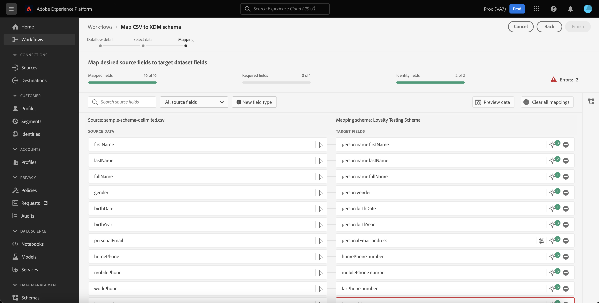
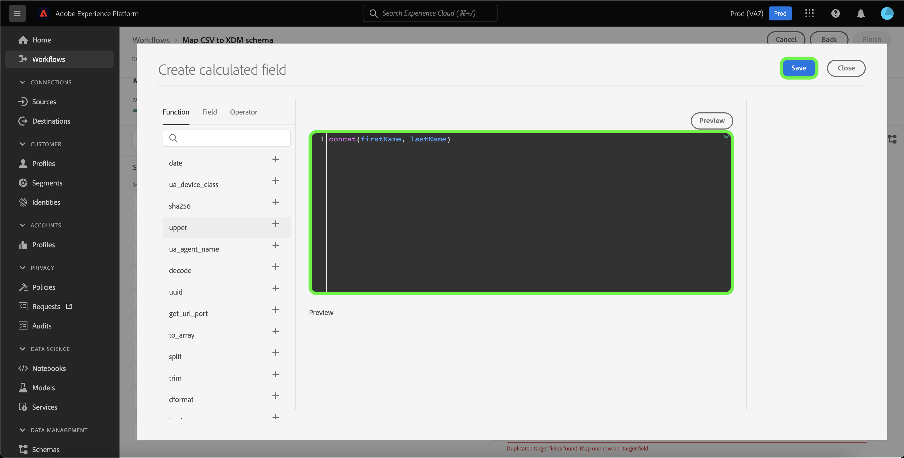
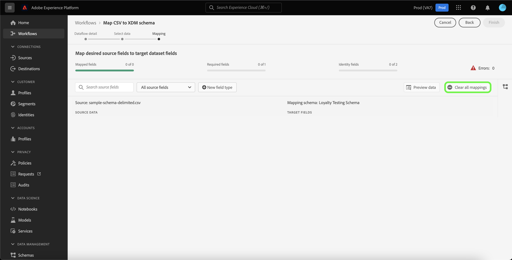

# 資料準備UI指南

本檔案說明如何在Adobe Experience Platform使用者介面中使用資料準備功能，將CSV檔案對應至XDM結構描述。

## 快速入門

本教學課程需要您深入瞭解下列平台元件：

* [[!DNL Experience Data Model (XDM)] 系統](../../xdm/home.md)：Platform組織客戶體驗資料的標準化架構。
   * [結構描述組合基本概念](../../xdm/schema/composition.md)：瞭解XDM結構描述的基本建置組塊，包括結構描述組合中的關鍵原則和最佳實務。
   * [結構描述編輯器教學課程](../../xdm/tutorials/create-schema-ui.md)：瞭解如何使用結構描述編輯器UI建立自訂結構描述。
* [Identity Service](../../identity-service/home.md)：透過跨裝置和系統橋接身分，更能瞭解個別客戶及其行為。
* [[!DNL Real-Time Customer Profile]](../../profile/home.md)：根據來自多個來源的彙總資料，提供統一的即時消費者設定檔。
* [來源](../../sources/home.md)：Experience Platform可讓您從各種來源擷取資料，同時使用Platform服務來建構、加標籤及增強傳入資料。

## 資料流詳細資訊

>[!TIP]
>
>您可以從來源目錄選取任何來源，以存取資料流詳細資料。 如需詳細資訊，請參閱 [來源概觀](../../sources/home.md).

您必須先建立資料流的詳細資訊，才能將CSV資料對應到XDM結構描述。

此 [!UICONTROL 資料流詳細資料] 頁面可讓您選擇是否要將CSV資料擷取至現有目標資料集或新目標資料集。 現有資料集附帶預先建立的目標結構描述可將您的資料對應至，而新資料集則需要您選取現有結構描述或建立新結構描述以將您的資料對應至。

### 使用現有的目標資料集

若要將CSV資料內嵌至現有資料集，請選取 **[!UICONTROL 現有資料集]**. 您可以使用來擷取現有的資料集 [!UICONTROL 進階搜尋] 選項，或是透過在下拉式選單中捲動現有資料集清單的方式。

選取資料集後，為資料流命名並選填說明。

在此過程中，您也可以啟用 [!UICONTROL 錯誤診斷] 和 [!UICONTROL 部分擷取]. [!UICONTROL 錯誤診斷] 針對資料流中發生的任何錯誤記錄，啟用詳細的錯誤訊息產生，同時 [!UICONTROL 部分擷取] 可讓您擷取包含錯誤的資料，最多可擷取您手動定義的特定臨界值。 請參閱 [部分批次擷取概觀](../../ingestion/batch-ingestion/partial.md) 以取得詳細資訊。

### 使用新的目標資料集

若要將CSV資料內嵌至新資料集，請選取「 」 **[!UICONTROL 新資料集]** 然後提供輸出資料集名稱和選擇性說明。 接下來，使用 [!UICONTROL 進階搜尋] 選項或透過捲動下拉式選單中的現有結構描述清單的方式。

在選取結構描述後，為您的資料流命名並選填說明，然後套用 [!UICONTROL 錯誤診斷] 和 [!UICONTROL 部分擷取] 資料流所需設定。 完成後，選取 **[!UICONTROL 下一個]**.

## 選取資料

此 [!UICONTROL 選取資料] 步驟隨即顯示，為您提供可上傳本機檔案並預覽其結構和內容的介面。 選取 **[!UICONTROL 選擇檔案]** 以從您的本機系統上傳CSV檔案。 或者，您也可以將要上傳的CSV檔案拖放至 [!UICONTROL 拖放檔案] 面板。

>[!TIP]
>
>本機檔案上傳目前僅支援CSV檔案。 每個檔案的最大檔案大小為1 GB。

上傳檔案後，預覽介面會更新以顯示檔案的內容和結構。

根據您的檔案，您可以選取欄分隔符號，例如定位字元、逗號、垂直號，或是來源資料的自訂欄分隔符號。 選取 **[!UICONTROL 分隔符號]** 下拉式箭頭，然後從選單中選取適當的分隔符號。

完成後，選取 **[!UICONTROL 下一個]**.

## 映射

此 **[!UICONTROL 對應]** 介面提供完整的工具，可將來源結構描述中的來源欄位對應到目標結構描述中適當的目標XDM欄位。

### 瞭解對應介面 {#mapping-interface}

對應介面包括儀表板，提供有關內嵌工作流程內容中對應欄位健全狀況的資訊。 控制面板會顯示下列有關對應欄位的詳細資訊：

| 屬性 | 說明 |
| --- | --- |
| [!UICONTROL 對應的欄位] | 顯示已對應至目標XDM欄位的來源欄位總數（無論是否有錯誤）。 |
| [!UICONTROL 必填欄位] | 顯示必要對應欄位的數量。 |
| [!UICONTROL 身分欄位] | 顯示定義為身分的對應欄位總數。 這些對應欄位以指紋圖示表示。 |
| [!UICONTROL 錯誤] | 顯示錯誤對應欄位的數量。 |

對應介面還提供了選項面板，您可以選擇這些選項，以便透過對應欄位進行更好的互動或篩選。

若要搜尋特定的對應集，請選取 **[!UICONTROL 搜尋來源欄位]** 並輸入您要隔離的來源資料名稱。

選取 **[!UICONTROL 所有來源欄位]** 檢視篩選選項的下拉式選單，以縮小對應介面的檢視。

篩選選項包括：

| 來源欄位 | 說明 |
| --- | --- |
| [!UICONTROL 所有來源欄位] | 此選項會顯示來源結構描述的所有來源欄位。 依預設，會顯示此選項。 |
| [!UICONTROL 必填欄位] | 此選項會篩選來源結構描述，以僅顯示完成對應所需的欄位。 |
| [!UICONTROL 身分欄位] | 此選項會篩選來源結構描述，以僅顯示標籤為身分的欄位。 |
| [!UICONTROL 對應的欄位] | 此選項會篩選來源結構描述，以僅顯示已對應的欄位。 |
| [!UICONTROL 未對應的欄位] | 此選項會篩選來源結構描述，以僅顯示尚未對應的欄位。 |
| [!UICONTROL 含有建議的欄位] | 此選項會篩選來源結構描述，以僅顯示包含對應建議的欄位。 |

選取 **[!UICONTROL 有錯誤的欄位]** 以檢視所有出現錯誤的對應欄位。

錯誤對應欄位的獨立檢視會出現，可讓您透過智慧型對應建議或手動對應樹狀結構來解決錯誤。

### 新增欄位型別

您可以選取「 」，以新增對應欄位或計算欄位 **[!UICONTROL 新欄位型別]**.

#### 新對應欄位

若要新增對應欄位，請選取 **[!UICONTROL 新欄位型別]** 然後選取 **[!UICONTROL 新增欄位]** 從出現的下拉式功能表中。

接下來，從出現的來源結構樹狀結構中，選取您要新增的來源欄位，然後選取 **[!UICONTROL 選取]**.

對應介面會以您選取的來源欄位和空的目標欄位更新。 選取 **[!UICONTROL 對應目標欄位]** 開始將新的來源欄位對應到其適當的目標XDM欄位。

會出現互動式目標結構描述樹狀結構，可讓您手動遍歷目標結構描述，並為您的來源欄位找到適當的目標XDM欄位。

完成後，選取架構圖示以關閉目標架構介面。

#### 計算欄位 {#calculated-fields}

計算欄位允許根據輸入結構描述中的屬性建立值。 然後可以將這些值指派給目標結構描述中的屬性，並提供名稱和說明，以便更輕鬆地參考。 計算欄位的長度上限為4096個字元。

若要建立計算欄位，請選取 **[!UICONTROL 新欄位型別]** 然後選取 **[!UICONTROL 新增計算欄位]**

此 **[!UICONTROL 建立計算欄位]** 面板隨即顯示。 左側對話方塊包含計算欄位支援的欄位、函式和運運算元。 選取其中一個標籤，以開始將函式、欄位或運運算元新增至運算式編輯器。

| 標記 | 說明 |
| --- | ----------- |
| [!UICONTROL 函數] | 函式標籤會列出可用來轉換資料的函式。 若要進一步瞭解您可以在計算欄位中使用的函式，請閱讀以下指南： [使用資料準備（對應程式）函式](../functions.md). |
| [!UICONTROL 欄位] | 欄位索引標籤會列出來源結構描述中可用的欄位和屬性。 |
| [!UICONTROL 運算子] | 運運算元索引標籤會列出可用於轉換資料的運運算元。 |

您可以使用中央的運算式編輯器，手動新增欄位、函式和運運算元。 選取編輯器以開始建立運算式。 完成後，選取 **[!UICONTROL 儲存]** 以繼續進行。

### 匯入對應 {#import}

您可以重複使用現有資料流的對應，以減少手動設定資料擷取的時間，並限制錯誤。 選取 **[!UICONTROL 匯入對應]** 以重複使用現有的對應。

此 [!UICONTROL 匯入對應] 視窗隨即顯示，為您提供資料流清單以供選擇。

選取預覽圖示以預覽您選取的資料流對應。

預覽視窗可讓您在匯入至資料流之前檢查現有的對應。 驗證對應後，您可以選取 **[!UICONTROL 返回]** 返回資料流清單並檢查另一組對應，或者您可以選取 **[!UICONTROL 選取]** 以繼續進行。

或者，您可以從資料流視窗清單中選取要匯入的對應。 選取包含您要匯入之對應的資料流，然後選取 **[!UICONTROL 選取]** 以繼續進行。

介面會隨著您匯入的對應而更新。

>[!NOTE]
>
>您建立或ML對應建議的任何現有對應集，都會取代為您從現有資料流匯入的對應。

選取 **[!UICONTROL 預覽資料]** 檢視所選資料集中最多100列範例資料的對應結果。

在預覽期間，身分資料行會優先作為第一個欄位，因為它是驗證對應結果時所需的關鍵資訊。 完成後，選取 **[!UICONTROL 關閉]**.

若要移除所有對應欄位，請選取 **[!UICONTROL 清除所有對應]**.

### 使用對應介面

Platform會根據您選取的目標結構描述或資料集，自動為自動對應的欄位提供智慧型建議。 您可以手動調整對應規則以符合您的使用案例，或修正任何重複的對應欄位以清除任何錯誤。

在要調整的目標欄位中選取燈泡圖示。

此 [!UICONTROL 對應建議] 彈出式面板隨即出現，顯示可對應至特定來源欄位的建議目標欄位清單。 依預設，會自動套用第一個建議。

有時候，來源結構描述會提供多個建議。 發生此情況時，對應卡片會顯示最顯眼的建議，後面會有一個圖示，其中包含可用的其他建議數量。 選取燈泡圖示將顯示其他建議的清單。 您可以選取您要對應至的建議旁邊的核取方塊，以選擇其中一個替代建議。

從這裡，您可以變更所選目標欄位以修正錯誤或符合您的使用案例。

或者，您可以選取 **[!UICONTROL 手動選取]** 以手動使用互動式目標結構描述對應樹狀結構。

目標結構描述對應介面會出現在與對應欄位相同的檢視中，可讓您在同一畫面中修改對應配對。 選取適合您使用案例的目標欄位或修正您的錯誤。

完成後，選取 **[!UICONTROL 完成]** 以繼續進行。

## 後續步驟

透過閱讀本檔案，您已使用Platform UI中的對應介面，成功將CSV檔案對應至目標XDM結構描述。 如需詳細資訊，請參閱下列檔案：

* [資料準備總覽](../home.md)
* [來源概觀](../../sources/home.md)
* [在UI中監視來源資料流](../../dataflows/ui/monitor-sources.md)
