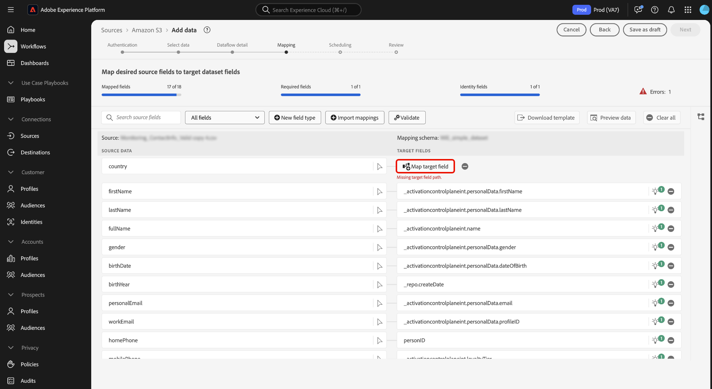
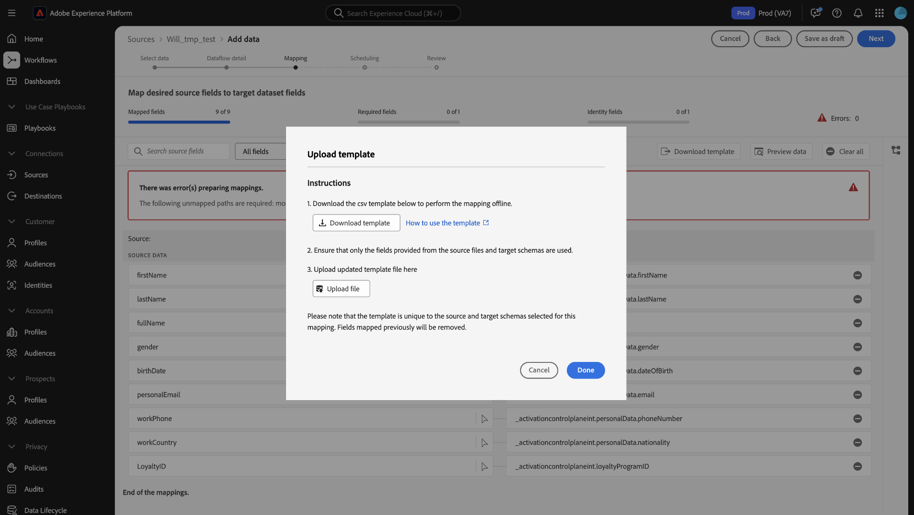

# 資料準備UI指南

閱讀本指南，瞭解如何在Adobe Experience Platform使用者介面中使用[資料準備](../home.md)對應函式，將CSV檔案對應至[體驗資料模型(XDM)結構描述](../../xdm/home.md)。

## 開始使用

本教學課程需要您實際瞭解下列Experience Platform元件：

* [[!DNL Experience Data Model (XDM)] 系統](../../xdm/home.md)： Experience Platform用來組織客戶體驗資料的標準化架構。
   * [結構描述組合的基本概念](../../xdm/schema/composition.md)：瞭解XDM結構描述的基本建置區塊，包括結構描述組合中的關鍵原則和最佳實務。
   * [結構描述編輯器教學課程](../../xdm/tutorials/create-schema-ui.md)：瞭解如何使用結構描述編輯器使用者介面建立自訂結構描述。
* [身分識別服務](../../identity-service/home.md)：透過跨裝置和系統橋接身分，以更清楚瞭解個別客戶及其行為。
* [[!DNL Real-Time Customer Profile]](../../profile/home.md)：根據來自多個來源的彙總資料，提供統一的即時消費者設定檔。
* [來源](../../sources/home.md)： Experience Platform允許從各種來源擷取資料，同時讓您能夠使用Experience Platform服務來建構、加標籤以及增強傳入的資料。

## 存取UI中的對應介面

您可以透過兩個不同的路徑存取UI中的對應介面。

1. 在Experience Platform UI中，從左側導覽選取&#x200B;**[!UICONTROL 工作流程]**，然後選取&#x200B;**[!UICONTROL 將CSV對應至XDM結構描述]**。 接下來，提供您的資料流詳細資料，並選取您要擷取的資料。 完成後，您將進入對應介面，您可以在其中設定來源資料和XDM結構描述之間的對應。
2. 您也可以透過來源工作區存取對應介面。

## 將CSV檔案對應至XDM結構描述

使用對應介面和它提供的完整工具集，成功將來源結構描述中的資料欄位對應到目標結構描述中適當的目標XDM欄位。

### 瞭解對應介面 {#mapping-interface}

如需內嵌工作流程內容中對應欄位健康情況的相關資訊，請參閱介面頂端的儀表板。 控制面板會顯示下列有關對應欄位的詳細資訊：

| 屬性 | 說明 |
| --- | --- |
| [!UICONTROL 對應的欄位] | 顯示已對應至目標XDM欄位的來源欄位總數（無論是否有錯誤）。 |
| [!UICONTROL 必要欄位] | 顯示必要對應欄位的數量。 |
| [!UICONTROL 身分識別欄位] | 顯示定義為身分的對應欄位總數。 這些對應欄位會以指紋圖示表示。 |
| [!UICONTROL 個錯誤] | 顯示錯誤對應欄位的數量。 |

{style="table-layout:auto"}

接下來，您可以使用標頭中列出的選項，以便更妥善地透過對應欄位進行互動或篩選。

| 選項 | 說明 |
| --- | --- |
| [!UICONTROL 搜尋來源欄位] | 使用搜尋列導覽至特定來源欄位。 |
| [!UICONTROL 所有欄位] | 選取&#x200B;**[!UICONTROL 所有欄位]**&#x200B;以檢視篩選對應所依據的選項下拉式功能表。 可用的篩選選項包括：<ul><li>**[!UICONTROL 必要欄位]**：篩選介面以僅顯示完成工作流程所需的欄位。</li><li> **[!UICONTROL 身分欄位]**：篩選介面以僅顯示標示為身分的欄位。</li><li>**[!UICONTROL 對應的欄位]**：篩選介面以僅顯示已經對應的欄位。</li><li>**[!UICONTROL 未對應的欄位]**：篩選介面以僅顯示尚未對應的欄位。</li><li>**[!UICONTROL 有錯誤的欄位]**：篩選介面以僅顯示有錯誤的欄位。</li></ul> |
| [!UICONTROL 新欄位型別] | 選取&#x200B;**[!UICONTROL 新欄位型別]**&#x200B;以新增欄位或計算欄位。 如需詳細資訊，請閱讀[新增欄位型別](#add-a-new-field-type)的章節。 |
| [!UICONTROL 匯入對應] | 選取&#x200B;**[!UICONTROL 匯入對應]**&#x200B;以從現有的檔案或資料流匯入對應。 如需詳細資訊，請閱讀有關[匯入對應](#import-mapping)的章節。 |
| [!UICONTROL 驗證] | 選取&#x200B;**[!UICONTROL 驗證]**&#x200B;以檢查對應中的錯誤。 |
| [!UICONTROL 下載範本] | 選取&#x200B;**[!UICONTROL 下載範本]**&#x200B;以匯出並下載您的對應CSV檔案。 |
| [!UICONTROL 預覽資料] | 選取&#x200B;**[!UICONTROL 預覽資料]**&#x200B;以使用預覽面板，並檢查來源資料集的結構和內容。 |
| [!UICONTROL 全部清除] | 選取&#x200B;**[!UICONTROL 全部清除]**&#x200B;以刪除介面中的所有對應。 |

{style="table-layout:auto"}

### 新增欄位型別 {#add-a-new-field-type}

您可以選取&#x200B;**[!UICONTROL 新增欄位型別]**，以新增對應欄位或計算欄位。

#### 新對應欄位

若要新增對應欄位，請選取&#x200B;**[!UICONTROL 新增欄位型別]**，然後從出現的下拉式功能表中選取&#x200B;**[!UICONTROL 新增欄位]**。

![已選取[新增欄位]按鈕的對映介面。](../images/ui/mapping/add_new_field.png)

接著，從出現的來源結構描述樹狀結構中選取您要新增的來源欄位，然後選取&#x200B;**[!UICONTROL 選取]**。

對應介面會以您選取的來源欄位和空的目標欄位更新。 選取&#x200B;**[!UICONTROL 對應目標欄位]**&#x200B;以開始將新的來源欄位對應到其適當的目標XDM欄位。

互動式目標結構描述樹狀目錄隨即顯示，可讓您手動瀏覽目標結構描述，並為您的來源欄位找到適當的目標XDM欄位。

#### 計算欄位 {#calculated-fields}

計算欄位允許根據輸入結構描述中的屬性建立值。 然後可以將這些值指派給目標架構中的屬性，並提供名稱和說明以便更輕鬆地參考。 計算欄位的長度上限為4096個字元。

若要建立計算欄位，請選取&#x200B;**[!UICONTROL 新增欄位型別]**，然後選取&#x200B;**[!UICONTROL 新增計算欄位]**

![已選取[新增計算欄位]按鈕的對映介面。](../images/ui/mapping/new_calculated_field.png)

**[!UICONTROL 建立計算欄位]**&#x200B;視窗會出現。 使用介面輸入計算欄位，並參閱左側的對話方塊，瞭解支援的欄位、函式和運運算元。

| 標記 | 說明 |
| --- | ----------- |
| [!UICONTROL 函式] | 函式標籤會列出可用來轉換資料的函式。 若要深入瞭解您可以在計算欄位中使用的函式，請參閱[使用資料準備（對應程式）函式](../functions.md)的指南。 |
| [!UICONTROL 欄位] | 欄位索引標籤會列出來源結構描述中可用的欄位和屬性。 |
| [!UICONTROL 運運算元] | 運運算元索引標籤會列出可用於轉換資料的運運算元。 |

您可以使用中央的運算式編輯器，手動新增欄位、函式和運運算元。 選取編輯器以開始建立運算式。 完成之後，請選取&#x200B;**[!UICONTROL 儲存]**&#x200B;以繼續。

### 匯入對應 {#import-mapping}

您可以使用資料準備的匯入對應功能，減少資料擷取程式的手動設定時間，並限制錯誤。 您可以從現有流程或匯出的檔案匯入對應。

>[!BEGINTABS]

>[!TAB 從流程]匯入對應

如果您有多個資料流是根據類似的來源檔案和目標結構描述，那麼您可以匯入現有的對應，並將其重複用於新的資料流。

若要從現有的資料流匯入對應，請選取&#x200B;**[!UICONTROL 匯入對應]**，然後選取&#x200B;**[!UICONTROL 從資料流]**&#x200B;匯入對應。

接下來，使用快顯視窗來尋找您要匯入其對應的資料流。 在此步驟中，您也可以使用搜尋功能來隔離特定資料流並擷取其對應。 完成後，選取&#x200B;**[!UICONTROL 選取]**。

>[!TAB 從檔案匯入對應]

在某些情況下，您可能需要為資料實作大量對應。 您可以使用對應介面手動執行此操作，但也可以匯出對應範本並在離線試算表上設定對應，以節省時間並避免Experience Platform上的使用者逾時。

若要從匯出的檔案匯入對應，請選取&#x200B;**[!UICONTROL 匯入對應]**，然後選取&#x200B;**[!UICONTROL 從檔案匯入對應]**。

接著，使用[!UICONTROL 上載範本]視窗下載對映的CSV復本。 然後，您可以使用任何支援編輯CSV檔案型別的軟體，在本機裝置上設定對應。 在此步驟中，您必須確保僅使用來源檔案和目標結構描述中提供的欄位。

+++選取此選項可檢視匯出的對應檔案範例

+++

完成時，請選取&#x200B;**[!UICONTROL 上傳檔案]**，然後選取您對應的更新csv檔案。 請讓系統處理一段時間，然後選取&#x200B;**[!UICONTROL 完成]**。

>[!ENDTABS]

完成對應後，您現在可以選取&#x200B;**[!UICONTROL 完成]**，然後繼續下一個步驟以完成您的資料流。

## 後續步驟

您現在可以使用Experience Platform UI中的對應介面，成功將CSV檔案對應至目標XDM結構描述。 如需詳細資訊，請閱讀下列檔案：

* [資料準備總覽](../home.md)
* [來源概觀](../../sources/home.md)
* [在UI中監視來源資料流](../../dataflows/ui/monitor-sources.md)
