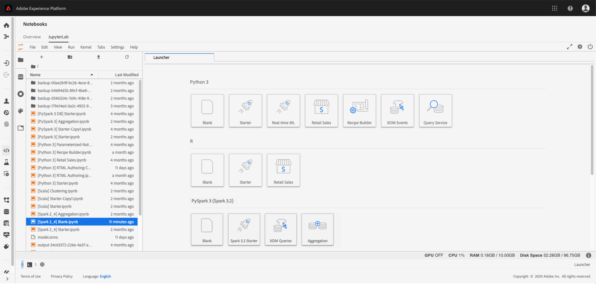

# 資料科學工作區概觀

Adobe Experience Platform [!DNL Data Science Workspace] 使用機器學習和人工智慧從您的資料中釋放見解。 整合至Adobe Experience Platform， [!DNL Data Science Workspace] 可協助您在各種Adobe解決方案中使用您的內容和資料資產進行預測。

所有技能水準的資料科學家都會找到複雜、易用的工具，這些工具可支援機器學習方法的快速開發、訓練和調整，這些都是AI技術的優點，而不會造成複雜性。

替換為 [!DNL Data Science Workspace]，資料科學家可輕鬆建立由機器學習提供支援的Intelligent Services API。 這些服務可搭配其他Adobe服務(包括Adobe Target和Adobe Analytics Cloud)使用，協助您在網頁、案頭和行動應用程式中自動提供個人化、目標定位的數位體驗。

本指南提供與以下專案相關的主要概念概觀： [!DNL Data Science Workspace].

## 簡介

現今的企業高度重視發掘巨量資料用於預測和深入分析，以協助他們打造個人化客戶體驗，並為客戶及企業帶來更多價值。
從資料獲得深入見解固然重要，但成本卻很高。 這通常需要技術熟練的資料科學家進行密集且耗時的資料研究，以開發機器學習模型或配方，進而提供智慧型服務。 這個過程漫長，技術複雜，而且很難找到技術熟練的資料科學家。

替換為 [!DNL Data Science Workspace]，Adobe Experience Platform可讓您在整個企業內帶來以體驗為中心的AI，透過以下方式簡化及加速資料轉換成見解 — 程式碼：
- 機器學習架構和執行階段
- 整合式存取儲存在Adobe Experience Platform中的資料
- 建置在基礎上的統一資料結構 [!DNL Experience Data Model] (XDM)
- 機器學習/AI與管理大型資料集所需的運算能力
- 預先建立的機器學習方法，可加速邁向AI導向式體驗
- 簡化不同技能層級資料科學家的編寫、重複使用和修改配方
- 只要按幾下滑鼠（無需開發人員），即可進行智慧型服務發佈和分享，並監控及重新訓練，持續最佳化個人化客戶體驗

所有技能等級的資料科學家將更快地獲得見解並取得更有效的數位體驗。

## 快速入門

在深入瞭解詳細資訊之前 [!DNL Data Science Workspace]，以下是主要術語的簡短摘要：

| 詞語 | 定義 |
|---------------------|------------------------------------------------------------------------------------------------------------------------------------------------------------------------------------------------------------------------------------------------------------------------------------------------------------------------------------------------------------------------------------------------------------------------------------------------------------------|
| [!DNL Data Science Workspace] | [!DNL Data Science Workspace] 範圍 [!DNL Experience Platform] 可讓客戶利用以下各項的資料，建立機器學習模型： [!DNL Experience Platform] 和Adobe解決方案，以產生智慧型分析和預測，以編織出可喜的一般使用者數位體驗。 |
| 人工智慧 | 人工智慧是電腦系統的理論和發展，能夠執行通常需要人類智慧的工作，例如視覺感知、語音識別、決策和語言之間的翻譯。 |
| 機器學習 | 機器學習是研究領域，可讓電腦不需要明確設定程式就能學習。 |
| [!DNL Sensei] ML框架 | [!DNL Sensei] ML Framework是跨Adobe的統一機器學習架構，可運用資料於 [!DNL Experience Platform] 讓資料科學家能夠以更快、可擴充和可重複使用的方式，開發機器學習導向的智慧服務。 |
| [!DNL Experience Data Model] | [!DNL Experience Data Model] (XDM)是Adobe所領導的標準化工作，以定義標準結構描述，例如 [!DNL Profile] 和 [!DNL ExperienceEvent]，適用於客戶體驗管理。 |
| [!DNL JupyterLab] | [!DNL JupyterLab] 是Project Jupyter的開放原始碼Web型介面，並緊密整合至 [!DNL Experience Platform]. |
| 配方 | 配方是模型規格的Adobe術語，是代表特定機器學習、AI演演算法或演演算法組合、處理邏輯和設定的頂層容器，這些是建立和執行經過訓練的模型，從而幫助解決特定業務問題所需的設定。 |
| 模型 | 模型是機器學習方法的執行個體，會使用歷史資料和設定進行訓練，以針對業務使用案例進行解析。 |
| 訓練 | 訓練是從標籤資料中學習模式和深入分析的程式。 |
| 已訓練模型 | 已訓練的模型代表模型訓練流程的可執行輸出，其中一組訓練資料被應用於模型例項。 經過訓練的模型將保留對從中建立的任何智慧型Web服務的參考。 經過訓練的模型適用於評分和建立智慧型Web服務。 已訓練模型的修改可作為新版本進行追蹤。 |
| 評分 | 評分是使用經過訓練的模型，從資料產生深入分析的程式。 |
| 服務 | 部署的服務會透過API公開人工智慧、機器學習模型或進階演演算法的功能，以供其他服務或應用程式使用來建立智慧型應用程式。 |

下表概述配方、模型、訓練回合和評分回合之間的階層式關係。

## 瞭解 [!DNL Data Science Workspace]

替換為 [!DNL Data Science Workspace]，您的資料科學家可以簡化在大型資料集中發現深入洞察的繁瑣程式。 建置在通用機器學習架構和執行階段上， [!DNL Data Science Workspace] 提供進階的工作流程管理、模型管理和擴充能力。 智慧型服務可支援重複使用機器學習配方，以支援使用Adobe產品和解決方案建立的各種應用程式。

### 一站式資料存取

資料是AI和機器學習的基礎。

[!DNL Data Science Workspace] 已與Adobe Experience Platform完全整合，包括資料湖， [!DNL Real-Time Customer Profile]、和 [!DNL Unified Edge]. 一次探索儲存在Adobe Experience Platform中的所有組織資料，以及常見的大型資料和深度學習資料庫，例如 [!DNL Spark] ML和 [!DNL TensorFlow]. 如果您找不到所需的資料，請使用XDM標準化結構描述擷取您自己的資料集。

### 預先建立的機器學習配方

[!DNL Data Science Workspace] 包括預先建立的機器學習配方，可滿足常見業務需求，例如零售預測和異常偵測，因此資料科學家和開發人員不必從頭開始。 目前提供三種配方， [產品購買預測](./pre-built-recipes/product-purchase-prediction.md)， [產品推薦](./pre-built-recipes/product-recommendations.md)、和 [零售銷售](./pre-built-recipes/retail-sales.md).

[//]: # (The built-in recipe gallery offers recommendations for prebuilt recipes based on your business needs.)

您也可以根據自己的需求，改寫預先建立的配方、匯入配方，或從頭開始建立自訂配方。 不過，一旦您開始訓練和超調配方，建立自訂智慧型服務就不需要開發人員了 — 只要按幾下，您就可以建立目標鎖定、個人化的數位體驗。

### 以資料科學家為重點的工作流程

無論您的資料科學專業水準如何， [!DNL Data Science Workspace] 有助於簡化並加速在資料中尋找深入分析並將這些深入分析套用至數位體驗的程式。

### 資料探索

尋找正確的資料並加以準備，是建立有效配方中最耗費人力的部分。 [!DNL Data Science Workspace] 和Adobe Experience Platform可協助您更快速地從資料獲得見解。

在Adobe Experience Platform上，您的跨管道資料會集中並儲存在XDM標準化結構描述中，以便更容易找到、理解和清除資料。 根據通用結構描述來儲存單一資料，可讓您省下無數的資料探索和準備時間。

當您瀏覽時，請使用R， [!DNL Python]，或Scala與整合、託管 [!DNL Jupyter Notebook] 瀏覽資料目錄 [!DNL Platform]. 使用其中一種語言，您也可以 [!DNL Spark] ML和TensorFlow。 從頭開始，或使用針對特定業務問題所提供的其中一個筆記型電腦範本。

在資料探索工作流程中，您也可以內嵌新資料或使用現有功能來協助資料準備。

### 製作

替換為 [!DNL Data Science Workspace]，由您決定如何編寫配方。

- 瀏覽預先建立的配方，滿足您的業務需求，以節省時間，您可以依原樣使用，或根據特定需求進行設定。
- 使用Jupyter Notebook中的編寫執行階段，從頭開始建立配方，以開發和註冊配方。
- 將在Adobe Experience Platform外部撰寫的配方上傳至 [!DNL Data Science Workspace] 或從存放庫匯入配方代碼，例如 [!DNL Git]，使用之間可用的驗證和整合 [!DNL Git] 和 [!DNL Data Science Workspace].

### 實驗

Data Science Workspace為實驗程式帶來了極大的靈活性。 從您的配方開始。 然後使用搭配唯一特性的相同核心演演算法（例如超調整引數），建立個別的執行個體。 您可以視需要建立多個執行個體，並為每個執行個體進行所需次數的訓練和評分。 當您訓練他們時， [!DNL Data Science Workspace] 追蹤配方、配方執行個體和經過訓練的執行個體，以及評估量度，因此您不必這麼做。

### 可操作化

只要按幾下即可建立智慧型服務。 無需編碼 — 您可以自行操作，不需徵募開發人員或工程師。 最後，將智慧型服務發佈至AdobeIO，您的數位體驗團隊即可開始使用。

<!--You can also publish your intelligent service to the Service Gallery, where it's available to specific people, specific organizations, or everyone who develops data solutions on Adobe Experience Platform. You can even share it with your external partners, and they can share their intelligent service with you. And the next time you're starting a new recipe, you can check the Service Gallery to see if there's a similar intelligent service you can use to get started. -->

### 持續改善

[!DNL Data Science Workspace] 追蹤何時叫用智慧型服務及其執行狀況。 當資料匯入時，您可以評估智慧型服務正確性以結束回圈，並根據需要重新訓練配方以改善效能。 結果是客戶個人化的精確度不斷細化。

### 存取新功能和資料集

只要有新技術與資料集可透過Adobe服務使用，資料科學家就能立即加以運用。 我們透過經常更新，將資料集和技術整合到平台中，因此您不必這麼做。

### 安全無虞，完全安心

保護資料安全是Adobe的首要任務。 Adobe會使用安全性程式和控制來保護您的資料，這些程式和控制是專為協助遵守業界接受的標準、法規和認證而開發的。

安全性內建於軟體和服務中，是Adobe安全產品生命週期的一部分。
若要瞭解Adobe資料與軟體安全性、合規性等資訊，請造訪安全性頁面：https://www.adobe.com/security.html。

## [!DNL Data Science Workspace] 執行中

預測和深入解析可為造訪您網站、聯絡客服中心或參與其他數位體驗的每位客戶提供高度個人化體驗所需的資訊。 以下是您日常工作的運作方式： [!DNL Data Science Workspace].

### 定義問題

一切都是從業務問題開始的。 例如，線上客服中心需要上下文來協助他們將負面的客戶情緒轉變為正面。

有關客戶的資料非常豐富。 他們瀏覽網站、將商品放入購物車，甚至下訂單。 他們之前可能曾收到電子郵件、使用優惠券，或聯絡過客服中心。 因此，配方需要使用有關客戶及其活動的可用資料，來判斷購買傾向，並推薦客戶可能喜歡並使用的優惠方案。

在聯絡客服中心時，客戶在購物車中仍有兩雙鞋，但移除了襯衫。 有了這些資訊，智慧型服務可能會建議客服中心代理在通話期間提供鞋子20%的優惠券。 如果客戶使用抵用券，該資訊會新增到資料集中，而預測功能在下次客戶來電時就會變得更好。

### 探索並準備資料

根據定義的業務問題，您知道配方應檢視客戶的所有網路交易，包括網站造訪、搜尋、頁面檢視、點選的連結、購物車動作、收到的優惠、收到的電子郵件、客服中心互動等。

資料科學家通常會將高達75%的時間花在建立探索和轉換資料的配方上。 資料通常來自多個存放庫，並儲存在不同的結構描述中 — 必須先合併和對應，才能用來建立配方。

[//]: # (Your first step is to check the recipe gallery to see if an existing recipe meets your needs, or comes close. An alternative is to import a recipe you created outside of Adobe Experience Platform. Starting with an existing recipe often streamlines the data exploration phase and makes it easier for a data scientist.)

如果您從頭開始或設定現有的配方，您會在集中式且標準化的資料目錄中開始搜尋資料，這會大幅簡化搜尋作業。 您甚至可能會發現貴組織中的另一位資料科學家已識別出類似的資料集，並選擇微調該資料集而非從頭開始。
Adobe Experience Platform中的所有資料都符合標準化的XDM結構，無需建立複雜模型來加入資料，或向資料工程師尋求協助。

如果您沒有立即找到所需的資料，但資料存在於Adobe Experience Platform外部，則內嵌其他資料集是一項相對簡單的工作，這也將轉換為標準化的XDM結構描述。\
您可以使用 [!DNL Jupyter Notebook] 簡化資料預先處理 — 可能從筆記型電腦範本或您先前為了購買傾向而使用的筆記型電腦開始。

### 編寫配方

如果您已找到符合所有需求的配方，您可以繼續實驗。 或者，您可以修改配方，或從頭開始建立 — 利用 [!DNL Data Science Workspace] 編寫執行階段 [!DNL Jupyter Notebook]. 使用編寫執行階段可確保您同時使用 [!DNL Data Science Workspace] 訓練和評分工作流程，並稍後轉換配方，以便組織中的其他人儲存及重複使用。

您也可以將配方匯入 [!DNL Data Science Workspace] 並在建立智慧型服務時運用實驗工作流程。

### 實驗配方

使用合併了您核心機器學習演演算法的配方，可以使用單一配方建立許多配方例項。 這些配方例項稱為模型。 模型需要訓練和評估，以最佳化運作效率和效能，這個過程通常包含反複試驗。

當您訓練模型時，會產生訓練回合和評估。 [!DNL Data Science Workspace] 追蹤每個獨特模型的評估量度及其訓練執行。 透過實驗產生的評估量度可讓您確定表現最佳的訓練回合。

造訪 [API](./models-recipes/train-evaluate-model-api.md) 或 [UI](./models-recipes/train-evaluate-model-ui.md) 有關如何在中訓練和評估模型的教學課程 [!DNL Data Science Workspace].

### 讓模型開始運轉

當您選擇最佳訓練配方來滿足您的業務需求時，您可以在中建立智慧型服務 [!DNL Data Science Workspace] 無需開發人員協助。 只需按幾下，無需編碼。 貴組織的其他成員無需重新建立模型，即可存取已發佈的智慧型服務。

已發佈的智慧型服務可設定為不時使用新資料自動訓練自己。 這可確保您的服務能隨著時間繼續維持其效率和功效。

## 後續步驟

[!DNL Data Science Workspace] 協助簡化資料科學的工作流程，從資料收集到演演算法，再到為各技能層級的資料科學家提供的智慧型服務。 使用精密工具 [!DNL Data Science Workspace] 可大幅縮短從資料到深入分析的時間。

更重要的是， [!DNL Data Science Workspace] 將Adobe領先行銷平台的資料科學和演演算法最佳化功能交給企業資料科學家。 企業首次將專屬演演算法帶入平台，利用Adobe強大的機器學習和AI功能，大規模提供高度個人化的客戶體驗。

結合品牌專業知識和Adobe的機器學習和AI能力，企業能夠在客戶要求之前提供他們想要的東西，藉此提高商業價值和品牌忠誠度。

如需其他資訊，例如完整的日常工作流程，請先閱讀 [資料科學工作區逐步說明](./walkthrough.md) 說明檔案。

## 其他資源

以下影片旨在協助您瞭解 [!DNL Data Science Workspace].

>[!VIDEO](https://video.tv.adobe.com/v/30567?quality=12&amp;enable10seconds=on&amp;speedcontrol=on)