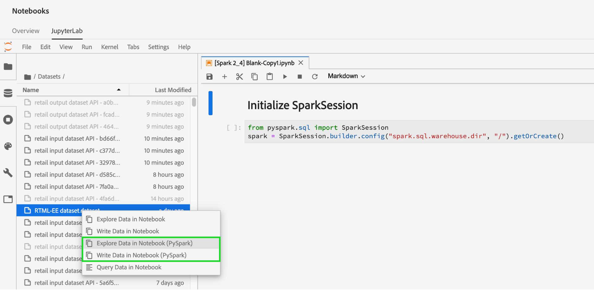

# 中的資料存取 [!DNL Jupyterlab] 筆記本

每個支援的核心都提供內建功能，可讓您從筆記本內的資料集讀取Platform資料。 Adobe Experience Platform Data Science Workspace目前的JupyterLab支援 [!DNL Python]、 R 、 PySpark和Scala。 不過，對分頁資料的支援僅限於 [!DNL Python] 和R筆記型電腦。 本指南著重於說明如何使用JupyterLab Notebooks來存取您的資料。

## 快速入門

閱讀本指南前，請先檢閱 [[!DNL JupyterLab] 使用手冊](./overview.md) 如需深入瞭解 [!DNL JupyterLab] 及其在資料科學工作區中的角色。

## 筆記型電腦資料限制 {#notebook-data-limits}

>[!IMPORTANT]
>
>對於PySpark和Scala筆記型電腦，如果您收到原因為「遠端RPC使用者端解除關聯」的錯誤。 這通常表示驅動程式或執行器的記憶體不足。 嘗試切換到 [「批次」模式](#mode) 以解決此錯誤。

下列資訊會定義可讀取的最大資料量、使用的資料型別，以及讀取資料所需的估計時間範圍。

對象 [!DNL Python] 和R，效能標竿使用配置為40GB RAM的筆記型伺服器。 對於PySpark和Scala，設定為64GB RAM、8個核心、2個DBU且最多4個工作者的資料庫叢集用於下列基準。

使用的ExperienceEvent結構描述資料大小不一，從1,000列(1K)到10億(1B)列不等。 請注意，對於PySpark和 [!DNL Spark] 量度時，XDM資料使用的日期跨度為10天。

已使用預先處理臨時結構描述資料 [!DNL Query Service] 建立表格為選取(CTAS)。 此資料的大小也有所不同，從1,000列(1K)到最多10億(1B)列。

### 批次模式與互動模式的使用時機 {#mode}

使用PySpark和Scala筆記型電腦讀取資料集時，您可以選擇使用互動模式或批次模式來讀取資料集。 互動式有助於快速獲得結果，而批次模式適用於大型資料集。

- 若是PySpark和Scala筆記型電腦，讀取超過500萬筆資料列時，應使用批次處理模式。 如需每種模式效率的詳細資訊，請參閱 [PySpark](#pyspark-data-limits) 或 [Scala](#scala-data-limits) 資料限制表格如下。

### [!DNL Python] 筆記型電腦資料限制

**XDM ExperienceEvent結構描述：** 您應該可以在22分鐘內讀取最多200萬列（磁碟上約6.1 GB的資料）的XDM資料。 新增其他列可能會導致錯誤。

| 列數 | 1K | 10K | 100K | 1M | 2M |
| ----------------------- | ------ | ------ | ----- | ----- | ----- |
| 磁碟大小(MB) | 18.73 | 187.5 | 308 | 3000 | 6050 |
| SDK （以秒為單位） | 20.3 | 86.8 | 63 | 659 | 1315 |

**臨時結構描述：** 您應該能夠在14分鐘內讀取最多500萬列非XDM （臨機）資料（磁碟上約5.6 GB的資料）。 新增其他列可能會導致錯誤。

| 列數 | 1K | 10K | 100K | 1M | 2M | 3M | 5M |
| ----------------------- | ------- | ------- | ----- | ----- | ----- | ----- | ------ |
| 磁碟大小（以MB為單位） | 1.21 | 11.72 | 115 | 1120 | 2250 | 3380 | 5630 |
| SDK （以秒為單位） | 7.27 | 9.04 | 27.3 | 180 | 346 | 487 | 819 |

### R筆記型電腦資料限制

**XDM ExperienceEvent結構描述：** 您在13分鐘內最多可讀取100萬列XDM資料（磁碟上的3GB資料）。

| 列數 | 1K | 10K | 100K | 1M |
| ----------------------- | ------ | ------ | ----- | ----- |
| 磁碟大小(MB) | 18.73 | 187.5 | 308 | 3000 |
| R核心（以秒為單位） | 14.03 | 69.6 | 86.8 | 775 |

**臨時結構描述：** 您最多應能在10分鐘內讀取300萬列臨機操作資料（磁碟上有293MB的資料）。

| 列數 | 1K | 10K | 100K | 1M | 2M | 3M |
| ----------------------- | ------- | ------- | ----- | ----- | ----- | ----- |
| 磁碟大小（以MB為單位） | 0.082 | 0.612 | 9.0 | 91 | 188 | 293 |
| R SDK （以秒為單位） | 7.7 | 4.58 | 35.9 | 233 | 470.5 | 603 |

### PySpark ([!DNL Python] kernel) notebook資料限制： {#pyspark-data-limits}

**XDM ExperienceEvent結構描述：** 在互動模式中，您應該能夠在大約20分鐘內讀取最多500萬列（磁碟上約13.42GB的資料）的XDM資料。 互動模式僅支援最多500萬列。 如果您想要讀取較大的資料集，建議您切換到批次模式。 在批次模式中，您應該可以在大約14小時內讀取最多5億列（磁碟上約1.31TB的資料）的XDM資料。

| 列數 | 1K | 10K | 100K | 1M | 2M | 3M | 5M | 10M | 50M | 100M | 500M |
|-------------------------|--------|--------|-------|-------|-------|-------|---------|---------|----------|--------|--------|
| 磁碟大小 | 2.93MB | 4.38MB | 29.02 | 2.69 GB   | 5.39 GB   | 8.09 GB   | 13.42 GB   | 26.82 GB   | 134.24 GB   | 268.39 GB   | 1.31TB |
| SDK （互動模式） | 33s | 32.4s | 55.1s | 253.5s | 489.2s | 729.6s | 1206.8s | - | - | - | - |
| SDK （批次模式） | 815.8s | 492.8s | 379.1s | 637.4s | 624.5s | 869.2s | 1104.1s | 1786s | 5387.2s | 10624.6s | 50547s |

**臨時結構描述：** 在互動模式中，您應該可以在3分鐘內讀取最多500萬列非XDM資料（磁碟上約5.36GB的資料）。 在批次模式中，您應該可以在大約18分鐘內讀取最多10億列（磁碟上約1.05TB的資料）非XDM資料。

| 列數 | 1K | 10K | 100K | 1M | 2M | 3M | 5M | 10M | 50M | 100M | 500M | 1B |
|--------------|--------|---------|---------|-------|-------|-------|--------|--------|---------|--------|---------|-------|
| 磁碟大小 | 1.12MB | 11.24MB | 109.48MB | 2.69 GB   | 2.14 GB   | 3.21 GB   | 5.36 GB   | 10.71 GB   | 53.58 GB   | 107.52 GB   | 535.88 GB   | 1.05TB |
| SDK互動模式（以秒為單位） | 28.2s | 18.6s | 20.8s | 20.9s | 23.8s | 21.7s | 24.7s | - | - | - | - | - |
| SDK批次模式（以秒為單位） | 428.8s | 578.8s | 641.4s | 538.5s | 630.9s | 467.3s | 411s | 675s | 702s | 719.2s | 1022.1s | 1122.3s |

### [!DNL Spark] （Scala核心）筆記型電腦資料限制： {#scala-data-limits}

**XDM ExperienceEvent結構描述：** 在互動模式中，您應該可以在大約18分鐘內讀取最多500萬列（磁碟上約13.42GB的資料）的XDM資料。 互動模式僅支援最多500萬列。 如果您想要讀取較大的資料集，建議您切換到批次模式。 在批次模式中，您應該可以在大約14小時內讀取最多5億列（磁碟上約1.31TB的資料）的XDM資料。

| 列數 | 1K | 10K | 100K | 1M | 2M | 3M | 5M | 10M | 50M | 100M | 500M |
|---------------|--------|--------|-------|-------|-------|-------|---------|---------|----------|--------|--------|
| 磁碟大小 | 2.93MB | 4.38MB | 29.02 | 2.69 GB   | 5.39 GB   | 8.09 GB   | 13.42 GB   | 26.82 GB   | 134.24 GB   | 268.39 GB   | 1.31TB |
| SDK互動模式（以秒為單位） | 37.9s | 22.7s | 45.6s | 231.7s | 444.7s | 660.6s | 1100s | - | - | - | - |
| SDK批次模式（以秒為單位） | 374.4s | 398.5s | 527s | 487.9s | 588.9s | 829s | 939.1s | 1441s | 5473.2s | 10118.8 | 49207.6 |

**臨時結構描述：** 在互動模式中，您應該可以在3分鐘內讀取最多500萬列非XDM資料（磁碟上約5.36GB的資料）。 在批次模式中，您應該可以在大約16分鐘內讀取最多10億列（磁碟上約1.05TB的資料）非XDM資料。

| 列數 | 1K | 10K | 100K | 1M | 2M | 3M | 5M | 10M | 50M | 100M | 500M | 1B |
|--------------|--------|---------|---------|-------|-------|-------|---------|---------|---------|--------|---------|-------|
| 磁碟大小 | 1.12MB | 11.24MB | 109.48MB | 2.69 GB   | 2.14 GB   | 3.21 GB   | 5.36 GB   | 10.71 GB   | 53.58 GB   | 107.52 GB   | 535.88 GB   | 1.05TB |
| SDK互動模式（以秒為單位） | 35.7s | 31s | 19.5s | 25.3s | 23s | 33.2s | 25.5s | - | - | - | - | - |
| SDK批次模式（以秒為單位） | 448.8s | 459.7s | 519s | 475.8s | 599.9s | 347.6s | 407.8s | 397s | 518.8s | 487.9s | 760.2s | 975.4s |

## Python筆記本 {#python-notebook}

[!DNL Python] Notebooks可讓您在存取資料集時分頁資料。 底下示範使用分頁或不使用分頁讀取資料的範常式式碼。 如需可用入門Python筆記型電腦的詳細資訊，請造訪 [[!DNL JupyterLab] 啟動器](./overview.md#launcher) 章節。

以下Python檔案會概述下列概念：

- [從資料集讀取](#python-read-dataset)
- [寫入資料集](#write-python)
- [查詢資料](#query-data-python)
- [篩選ExperienceEvent資料](#python-filter)

### 從Python中的資料集讀取 {#python-read-dataset}

**沒有分頁：**

執行以下程式碼將會讀取整個資料集。 如果執行成功，則資料將儲存為變數參考的Pandas資料流 `df`.

```python
# Python

from platform_sdk.dataset_reader import DatasetReader
dataset_reader = DatasetReader(get_platform_sdk_client_context(), dataset_id="{DATASET_ID}")
df = dataset_reader.read()
df.head()
```

**使用分頁：**

執行以下程式碼將會從指定的資料集中讀取資料。 分頁是透過函式限制和位移資料來達成 `limit()` 和 `offset()` （分別）。 限制資料是指要讀取的資料點數上限，而位移是指在讀取資料之前要略過的資料點數。 如果成功執行讀取作業，資料將會儲存為變數參考的Pandas資料流 `df`.

```python
# Python

from platform_sdk.dataset_reader import DatasetReader

dataset_reader = DatasetReader(get_platform_sdk_client_context(), dataset_id="{DATASET_ID}")
df = dataset_reader.limit(100).offset(10).read()
```

### 寫入Python中的資料集 {#write-python}

若要寫入JupyterLab筆記本中的資料集，請在JupyterLab的左側導覽中選取「資料」圖示標籤（以下反白顯示）。 此 **[!UICONTROL 資料集]** 和 **[!UICONTROL 結構描述]** 目錄出現。 選取 **[!UICONTROL 資料集]** 並按一下滑鼠右鍵，然後選取 **[!UICONTROL 在筆記型電腦中寫入資料]** 從下拉式選單中選取您要使用的選項。 筆記本底部會出現一個可執行程式碼專案。


- 使用 **[!UICONTROL 在筆記型電腦中寫入資料]** 以使用您選取的資料集產生寫入儲存格。
- 使用 **[!UICONTROL 探索筆記本中的資料]** 以使用您選取的資料集產生讀取儲存格。
- 使用 **[!UICONTROL 在筆記本中查詢資料]** 以使用您選取的資料集產生基本查詢儲存格。

或者，您可以複製並貼上下列程式碼儲存格。 取代兩者 `{DATASET_ID}` 和 `{PANDA_DATAFRAME}`.

```python
from platform_sdk.models import Dataset
from platform_sdk.dataset_writer import DatasetWriter

dataset = Dataset(get_platform_sdk_client_context()).get_by_id(dataset_id="{DATASET_ID}")
dataset_writer = DatasetWriter(get_platform_sdk_client_context(), dataset)
write_tracker = dataset_writer.write({PANDA_DATAFRAME}, file_format='json')
```

### 查詢資料，使用 [!DNL Query Service] 在 [!DNL Python] {#query-data-python}

[!DNL JupyterLab] 於 [!DNL Platform] 可讓您使用SQL於 [!DNL Python] 筆記型電腦，可透過存取資料 [Adobe Experience Platform查詢服務](https://www.adobe.com/go/query-service-home-en). 透過存取資料 [!DNL Query Service] 由於其卓越的執行時間，可用於處理大型資料集。 請注意，查詢資料時使用 [!DNL Query Service] 具有十分鐘的處理時間限制。

使用前 [!DNL Query Service] 在 [!DNL JupyterLab]，請務必實際瞭解 [[!DNL Query Service] SQL語法](https://www.adobe.com/go/query-service-sql-syntax-en).

查詢資料，使用 [!DNL Query Service] 需要您提供目標資料集的名稱。 您可以使用「 」尋找所需的資料集，以產生必要的程式碼儲存格。 **[!UICONTROL 資料總管]**. 以滑鼠右鍵按一下資料集清單，然後按一下 **[!UICONTROL 在筆記本中查詢資料]** 以在您的記事本中產生兩個程式碼儲存格。 這兩個儲存格在下文將更詳細地概述。


為了利用 [!DNL Query Service] 在 [!DNL JupyterLab]，您必須先建立工作環境之間的連線， [!DNL Python] 筆記型電腦和 [!DNL Query Service]. 這可以透過執行第一個產生的儲存格來完成。

```python
qs_connect()
```

在第二個產生的儲存格中，第一行必須在SQL查詢之前定義。 依預設，產生的儲存格會定義選用變數(`df0`)會將查詢結果儲存為Pandas資料流。 <br>此 `-c QS_CONNECTION` 引數是必要的，會告訴核心執行SQL查詢 [!DNL Query Service]. 請參閱 [附錄](#optional-sql-flags-for-query-service) 以取得其他引數的清單。

```python
%%read_sql df0 -c QS_CONNECTION
SELECT *
FROM name_of_the_dataset
LIMIT 10
/* Querying table "name_of_the_dataset" (datasetId: {DATASET_ID})*/
```

您可以使用字串格式語法，將變數包裝在大括弧(`{}`)，如下列範例所示：

```python
table_name = 'name_of_the_dataset'
table_columns = ','.join(['col_1','col_2','col_3'])
```

```python
%%read_sql demo -c QS_CONNECTION
SELECT {table_columns}
FROM {table_name}
```

### 篩選 [!DNL ExperienceEvent] 資料 {#python-filter}

為了存取和篩選 [!DNL ExperienceEvent] 中的資料集 [!DNL Python] notebook，您必須提供資料集的ID (`{DATASET_ID}`)，並使用邏輯運運算元定義特定時間範圍的篩選規則。 定義時間範圍時，會忽略任何指定的分頁，並考量整個資料集。

篩選運運算元清單說明如下：

- `eq()`: Equal to
- `gt()`: Greater than
- `ge()`: 大於或等於
- `lt()`: 少於
- `le()`: Less than or equal to
- `And()`：邏輯AND運運算元
- `Or()`：邏輯或運運算元

下列儲存格會篩選 [!DNL ExperienceEvent] 資料集至獨家存在於2019年1月1日至2019年12月31日之間的資料。

```python
# Python

from platform_sdk.dataset_reader import DatasetReader

dataset_reader = DatasetReader(get_platform_sdk_client_context(), dataset_id="{DATASET_ID}")
df = dataset_reader.\
    where(dataset_reader["timestamp"].gt("2019-01-01 00:00:00").\
    And(dataset_reader["timestamp"].lt("2019-12-31 23:59:59"))\
).read()
```

## R notebooks {#r-notebooks}

R Notebooks可讓您在存取資料集時分頁資料。 底下示範使用分頁或不使用分頁讀取資料的範常式式碼。 如需可用入門或筆記型電腦的詳細資訊，請瀏覽 [[!DNL JupyterLab] 啟動器](./overview.md#launcher) 章節。

以下R檔案會概述下列概念：

- [從資料集讀取](#r-read-dataset)
- [寫入資料集](#write-r)
- [篩選ExperienceEvent資料](#r-filter)

### 從R中的資料集讀取 {#r-read-dataset}

**沒有分頁：**

執行以下程式碼將會讀取整個資料集。 如果執行成功，則資料將儲存為變數參考的Pandas資料流 `df0`.

```R
# R

library(reticulate)
use_python("/usr/local/bin/ipython")
psdk <- import("platform_sdk")
datetime <- import("datetime", convert = FALSE)
py_run_file("~/.ipython/profile_default/startup/platform_sdk_context.py")
DatasetReader <- psdk$dataset_reader$DatasetReader
dataset_reader <- DatasetReader(py$get_platform_sdk_client_context(), dataset_id="{DATASET_ID}")
df0 <- dataset_reader$read()
head(df0)
```

**使用分頁：**

執行以下程式碼將會從指定的資料集中讀取資料。 分頁是透過函式限制和位移資料來達成 `limit()` 和 `offset()` （分別）。 限制資料是指要讀取的資料點數上限，而位移是指在讀取資料之前要略過的資料點數。 如果成功執行讀取作業，資料將會儲存為變數參考的Pandas資料流 `df0`.

```R
# R

library(reticulate)
use_python("/usr/local/bin/ipython")
psdk <- import("platform_sdk")
datetime <- import("datetime", convert = FALSE)
py_run_file("~/.ipython/profile_default/startup/platform_sdk_context.py")

DatasetReader <- psdk$dataset_reader$DatasetReader
dataset_reader <- DatasetReader(py$get_platform_sdk_client_context(), dataset_id="{DATASET_ID}") 
df0 <- dataset_reader$limit(100L)$offset(10L)$read()
```

### 寫入R中的資料集 {#write-r}

若要寫入JupyterLab筆記本中的資料集，請在JupyterLab的左側導覽中選取「資料」圖示標籤（以下反白顯示）。 此 **[!UICONTROL 資料集]** 和 **[!UICONTROL 結構描述]** 目錄出現。 選取 **[!UICONTROL 資料集]** 並按一下滑鼠右鍵，然後選取 **[!UICONTROL 在筆記型電腦中寫入資料]** 從下拉式選單中選取您要使用的選項。 筆記本底部會出現一個可執行程式碼專案。


- 使用 **[!UICONTROL 在筆記型電腦中寫入資料]** 以使用您選取的資料集產生寫入儲存格。
- 使用 **[!UICONTROL 探索筆記本中的資料]** 以使用您選取的資料集產生讀取儲存格。

或者，您也可以複製並貼上下列程式碼儲存格：

```R
psdk <- import("platform_sdk")
dataset <- psdk$models$Dataset(py$get_platform_sdk_client_context())$get_by_id(dataset_id="{DATASET_ID}")
dataset_writer <- psdk$dataset_writer$DatasetWriter(py$get_platform_sdk_client_context(), dataset)
write_tracker <- dataset_writer$write(df, file_format='json')
```

### 篩選 [!DNL ExperienceEvent] 資料 {#r-filter}

為了存取和篩選 [!DNL ExperienceEvent] 在R筆記本中的資料集，您必須提供資料集的ID (`{DATASET_ID}`)，並使用邏輯運運算元定義特定時間範圍的篩選規則。 定義時間範圍時，會忽略任何指定的分頁，並考量整個資料集。

篩選運運算元清單說明如下：

- `eq()`: Equal to
- `gt()`: Greater than
- `ge()`: 大於或等於
- `lt()`: 少於
- `le()`: Less than or equal to
- `And()`：邏輯AND運運算元
- `Or()`：邏輯或運運算元

下列儲存格會篩選 [!DNL ExperienceEvent] 資料集至獨家存在於2019年1月1日至2019年12月31日之間的資料。

```R
# R

library(reticulate)
use_python("/usr/local/bin/ipython")
psdk <- import("platform_sdk")
datetime <- import("datetime", convert = FALSE)
py_run_file("~/.ipython/profile_default/startup/platform_sdk_context.py")

client_context <- py$PLATFORM_SDK_CLIENT_CONTEXT
DatasetReader <- psdk$dataset_reader$DatasetReader
dataset_reader <- DatasetReader(py$get_platform_sdk_client_context(), dataset_id="{DATASET_ID}") 

df0 <- dataset_reader$
    where(dataset_reader["timestamp"]$gt("2019-01-01 00:00:00")$
    And(dataset_reader["timestamp"]$lt("2019-12-31 23:59:59"))
)$read()
```

## PySpark 3筆記本 {#pyspark-notebook}

以下PySpark檔案概述下列概念：

- [初始化sparkSession](#spark-initialize)
- [讀取和寫入資料](#magic)
- [建立本機資料流](#pyspark-create-dataframe)
- [篩選ExperienceEvent資料](#pyspark-filter-experienceevent)

### 正在初始化sparkSession {#spark-initialize}

全部 [!DNL Spark] 2.4 notebooks要求您使用下列樣板程式碼來初始化工作階段。

```scala
from pyspark.sql import SparkSession
spark = SparkSession.builder.getOrCreate()
```

### 使用%dataset來讀取和寫入PySpark 3筆記本 {#magic}

透過以下主題介紹 [!DNL Spark] 2.4， `%dataset` 提供自訂魔術以用於PySpark 3 ([!DNL Spark] 2.4)筆記本。 如需IPython核心中可用之魔法命令的詳細資訊，請造訪 [Ipython魔術檔案](https://ipython.readthedocs.io/en/stable/interactive/magics.html).


**使用狀況**

```scala
%dataset {action} --datasetId {id} --dataFrame {df} --mode batch
```

**說明**

自訂 [!DNL Data Science Workspace] 用於從讀取或寫入資料集的magic命令 [!DNL PySpark] 筆記本([!DNL Python] 3核心)。

| 名稱 | 說明 | 必填 |
| --- | --- | --- |
| `{action}` | 要在資料集上執行的動作型別。 有兩個動作可使用「讀取」或「寫入」。 | 是 |
| `--datasetId {id}` | 用於提供要讀取或寫入的資料集ID。 | 是 |
| `--dataFrame {df}` | 熊貓資料流。 <ul><li> 當動作為「讀取」時，{df}是變數，資料集讀取操作的結果在此可用（例如資料流）。 </li><li> 當動作為「寫入」時，此資料流{df}會寫入資料集。 </li></ul> | 是 |
| `--mode` | 變更資料讀取方式的其他引數。 允許的引數為「batch」和「interactive」。 依預設，模式會設為「batch」。<br> 建議您「互動」模式，在較小的資料集上提高查詢效能。 | 是 |

>[!TIP]
>
>檢閱以下專案中的PySpark表格： [筆記型電腦資料限制](#notebook-data-limits) 區段以確定 `mode` 應設為 `interactive` 或 `batch`.

**範例**

- **閱讀範例**： `%dataset read --datasetId 5e68141134492718af974841 --dataFrame pd0 --mode batch`
- **撰寫範例**： `%dataset write --datasetId 5e68141134492718af974842 --dataFrame pd0 --mode batch`

>[!IMPORTANT]
>
> 快取資料使用 `df.cache()` 在寫入資料之前，可以大幅提升筆記型電腦的效能。 如果您收到下列任何錯誤，此設定會有所幫助：
> 
> - 工作已中止，因為中繼失敗……只能壓縮每個磁碟分割中具有相同元素數量的RDD。
> - 遠端RPC使用者端已解除關聯和其他記憶體錯誤。
> - 讀取和寫入資料集時效能不佳。
> 
> 請參閱 [疑難排解指南](../troubleshooting-guide.md) 以取得詳細資訊。

您可以使用下列方法，在JupyterLab buy中自動產生上述範例：

在JupyterLab的左側導覽區中選取「資料」圖示標籤（在下方醒目提示）。 此 **[!UICONTROL 資料集]** 和 **[!UICONTROL 結構描述]** 目錄出現。 選取 **[!UICONTROL 資料集]** 並按一下滑鼠右鍵，然後選取 **[!UICONTROL 在筆記型電腦中寫入資料]** 從下拉式選單中選取您要使用的選項。 筆記本底部會出現一個可執行程式碼專案。

- 使用 **[!UICONTROL 探索筆記本中的資料]** 以產生讀取儲存格。
- 使用 **[!UICONTROL 在筆記型電腦中寫入資料]** 產生寫入儲存格。



### 建立本機資料流 {#pyspark-create-dataframe}

若要使用PySpark 3建立本機資料流，請使用SQL查詢。 例如：

```scala
date_aggregation.createOrReplaceTempView("temp_df")

df = spark.sql('''
  SELECT *
  FROM sparkdf
''')

local_df
```

```scala
df = spark.sql('''
  SELECT *
  FROM sparkdf
  LIMIT limit
''')
```

```scala
sample_df = df.sample(fraction)
```

>[!TIP]
>
>您也可以指定選用的種子範例，例如withReplacement、double fraction或long seed。

### 篩選 [!DNL ExperienceEvent] 資料 {#pyspark-filter-experienceevent}

存取和篩選 [!DNL ExperienceEvent] PySpark筆記本中的資料集需要您提供資料集身分識別(`{DATASET_ID}`)、您組織的IMS身分以及定義特定時間範圍的篩選規則。 篩選時間範圍是使用函式來定義 `spark.sql()`，其中函式引數是SQL查詢字串。

下列儲存格會篩選 [!DNL ExperienceEvent] 資料集至獨家存在於2019年1月1日至2019年12月31日之間的資料。

```python
# PySpark 3 (Spark 2.4)

from pyspark.sql import SparkSession
spark = SparkSession.builder.getOrCreate()

%dataset read --datasetId {DATASET_ID} --dataFrame df --mode batch

df.createOrReplaceTempView("event")
timepd = spark.sql("""
    SELECT *
    FROM event
    WHERE timestamp > CAST('2019-01-01 00:00:00.0' AS TIMESTAMP)
    AND timestamp < CAST('2019-12-31 23:59:59.9' AS TIMESTAMP)
""")
timepd.show()
```

## Scala筆記本 {#scala-notebook}

以下檔案包含下列概念的範例：

- [初始化sparkSession](#scala-initialize)
- [讀取資料集](#read-scala-dataset)
- [寫入資料集](#scala-write-dataset)
- [建立本機資料流](#scala-create-dataframe)
- [篩選ExperienceEvent資料](#scala-experienceevent)

### 正在初始化SparkSession {#scala-initialize}

所有Scala Notebooks都需要您使用下列樣板程式碼來初始化工作階段：

```scala
import org.apache.spark.sql.{ SparkSession }
val spark = SparkSession
  .builder()
  .master("local")
  .getOrCreate()
```

### 讀取資料集 {#read-scala-dataset}

在Scala中，您可以匯入 `clientContext` 若要取得和傳回Platform值，就不需要定義變數，例如 `var userToken`. 在下面的Scala範例中， `clientContext` 用於取得及傳回讀取資料集所需的所有必要值。

>[!IMPORTANT]
>
> 快取資料使用 `df.cache()` 在寫入資料之前，可以大幅提升筆記型電腦的效能。 如果您收到下列任何錯誤，此設定會有所幫助：
> 
> - 工作已中止，因為中繼失敗……只能壓縮每個磁碟分割中具有相同元素數量的RDD。
> - 遠端RPC使用者端已解除關聯和其他記憶體錯誤。
> - 讀取和寫入資料集時效能不佳。
> 
> 請參閱 [疑難排解指南](../troubleshooting-guide.md) 以取得詳細資訊。

```scala
import org.apache.spark.sql.{Dataset, SparkSession}
import com.adobe.platform.token.ClientContext
val spark = SparkSession.builder().master("local").config("spark.sql.warehouse.dir", "/").getOrCreate()

val clientContext = ClientContext.getClientContext()
val df1 = spark.read.format("com.adobe.platform.query")
  .option("user-token", clientContext.getUserToken())
  .option("ims-org", clientContext.getOrgId())
  .option("api-key", clientContext.getApiKey())
  .option("service-token", clientContext.getServiceToken())
  .option("sandbox-name", clientContext.getSandboxName())
  .option("mode", "batch")
  .option("dataset-id", "5e68141134492718af974844")
  .load()

df1.printSchema()
df1.show(10)
```

| 元素 | 說明 |
| ------- | ----------- |
| df1 | 一個變數，代表用來讀取和寫入資料的Pandas資料流。 |
| user-token | 您使用自動擷取的使用者權杖 `clientContext.getUserToken()`. |
| service-token | 您的服務權杖已使用自動擷取 `clientContext.getServiceToken()`. |
| ims-org | 您的組織ID會使用自動擷取 `clientContext.getOrgId()`. |
| api-key | 您使用自動擷取的API金鑰 `clientContext.getApiKey()`. |

>[!TIP]
>
>檢閱內的Scala表格 [筆記型電腦資料限制](#notebook-data-limits) 區段以確定 `mode` 應設為 `interactive` 或 `batch`.

您可以使用下列方法，在JupyterLab buy中自動產生上述範例：

在JupyterLab的左側導覽區中選取「資料」圖示標籤（在下方醒目提示）。 此 **[!UICONTROL 資料集]** 和 **[!UICONTROL 結構描述]** 目錄出現。 選取 **[!UICONTROL 資料集]** 並按一下滑鼠右鍵，然後選取 **[!UICONTROL 探索筆記本中的資料]** 從下拉式選單中選取您要使用的選項。 筆記本底部會出現一個可執行程式碼專案。
和
- 使用 **[!UICONTROL 探索筆記本中的資料]** 以產生讀取儲存格。
- 使用 **[!UICONTROL 在筆記型電腦中寫入資料]** 產生寫入儲存格。


### 寫入資料集 {#scala-write-dataset}

在Scala中，您可以匯入 `clientContext` 若要取得和傳回Platform值，就不需要定義變數，例如 `var userToken`. 在下面的Scala範例中， `clientContext` 用於定義並傳回寫入資料集所需的所有必要值。

>[!IMPORTANT]
>
> 快取資料使用 `df.cache()` 在寫入資料之前，可以大幅提升筆記型電腦的效能。 如果您收到下列任何錯誤，此設定會有所幫助：
> 
> - 工作已中止，因為中繼失敗……只能壓縮每個磁碟分割中具有相同元素數量的RDD。
> - 遠端RPC使用者端已解除關聯和其他記憶體錯誤。
> - 讀取和寫入資料集時效能不佳。
> 
> 請參閱 [疑難排解指南](../troubleshooting-guide.md) 以取得詳細資訊。

```scala
import org.apache.spark.sql.{Dataset, SparkSession}
import com.adobe.platform.token.ClientContext
val spark = SparkSession.builder().master("local").config("spark.sql.warehouse.dir", "/").getOrCreate()

val clientContext = ClientContext.getClientContext()
df1.write.format("com.adobe.platform.query")
  .option("user-token", clientContext.getUserToken())
  .option("service-token", clientContext.getServiceToken())
  .option("ims-org", clientContext.getOrgId())
  .option("api-key", clientContext.getApiKey())
  .option("sandbox-name", clientContext.getSandboxName())
  .option("mode", "batch")
  .option("dataset-id", "5e68141134492718af974844")
  .save()
```

| 元素 | 說明 |
| ------- | ----------- |
| df1 | 一個變數，代表用來讀取和寫入資料的Pandas資料流。 |
| user-token | 您使用自動擷取的使用者權杖 `clientContext.getUserToken()`. |
| service-token | 您的服務權杖已使用自動擷取 `clientContext.getServiceToken()`. |
| ims-org | 您的組織ID會使用自動擷取 `clientContext.getOrgId()`. |
| api-key | 您使用自動擷取的API金鑰 `clientContext.getApiKey()`. |

>[!TIP]
>
>檢閱內的Scala表格 [筆記型電腦資料限制](#notebook-data-limits) 區段以確定 `mode` 應設為 `interactive` 或 `batch`.

### 建立本機資料流 {#scala-create-dataframe}

若要使用Scala建立本機資料流，需要SQL查詢。 例如：

```scala
sparkdf.createOrReplaceTempView("sparkdf")

val localdf = spark.sql("SELECT * FROM sparkdf LIMIT 1)
```

### 篩選 [!DNL ExperienceEvent] 資料 {#scala-experienceevent}

存取和篩選 [!DNL ExperienceEvent] Scala筆記本中的資料集需要您提供資料集身分識別(`{DATASET_ID}`)、您組織的IMS身分以及定義特定時間範圍的篩選規則。 篩選時間範圍是使用函式來定義 `spark.sql()`，其中函式引數是SQL查詢字串。

下列儲存格會篩選 [!DNL ExperienceEvent] 資料集至獨家存在於2019年1月1日至2019年12月31日之間的資料。

```scala
// Spark (Spark 2.4)

// Turn off extra logging
import org.apache.log4j.{Level, Logger}
Logger.getLogger("org").setLevel(Level.OFF)
Logger.getLogger("com").setLevel(Level.OFF)

import org.apache.spark.sql.{Dataset, SparkSession}
val spark = org.apache.spark.sql.SparkSession.builder().appName("Notebook")
  .master("local")
  .getOrCreate()

// Stage Exploratory
val dataSetId: String = "{DATASET_ID}"
val orgId: String = sys.env("IMS_ORG_ID")
val clientId: String = sys.env("PYDASDK_IMS_CLIENT_ID")
val userToken: String = sys.env("PYDASDK_IMS_USER_TOKEN")
val serviceToken: String = sys.env("PYDASDK_IMS_SERVICE_TOKEN")
val mode: String = "batch"

var df = spark.read.format("com.adobe.platform.query")
  .option("user-token", userToken)
  .option("ims-org", orgId)
  .option("api-key", clientId)
  .option("mode", mode)
  .option("dataset-id", dataSetId)
  .option("service-token", serviceToken)
  .load()
df.createOrReplaceTempView("event")
val timedf = spark.sql("""
    SELECT * 
    FROM event 
    WHERE timestamp > CAST('2019-01-01 00:00:00.0' AS TIMESTAMP)
    AND timestamp < CAST('2019-12-31 23:59:59.9' AS TIMESTAMP)
""")
timedf.show()
```

## 後續步驟

本檔案說明使用JupyterLab Notebooks存取資料集的一般准則。 如需查詢資料集的更深入範例，請造訪 [JupyterLab Notebooks中的查詢服務](./query-service.md) 說明檔案。 如需如何探索和視覺化資料集的詳細資訊，請瀏覽以下檔案： [使用筆記型電腦分析資料](./analyze-your-data.md).

## 的可選SQL標幟 [!DNL Query Service] {#optional-sql-flags-for-query-service}

此表格概述可用於下列專案的可選SQL旗標： [!DNL Query Service].

| **標幟** | **說明** |
| --- | --- |
| `-h`、`--help` | 顯示說明訊息並退出。 |
| `-n`、`--notify` | 通知查詢結果的切換選項。 |
| `-a`、`--async` | 使用此旗標可非同步執行查詢，並可在查詢執行時釋放核心。 將查詢結果指派給變數時請務必小心，因為如果查詢未完成，變數可能會有未定義的情形。 |
| `-d`、`--display` | 使用此旗標可防止顯示結果。 |
