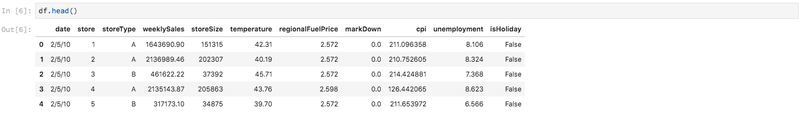

# 使用筆記型電腦分析資料

本教學課程著重於如何使用Data Science Workspace內建的Jupyter Notebooks，來存取、探索和視覺化您的資料。 在本教學課程結束時，您應了解Jupyter Notebooks提供的一些功能，以便更好地了解您的資料。

介紹下列概念：

- **[!DNL JupyterLab]:** [[!DNL JupyterLab]](https://blog.jupyter.org/jupyterlab-is-ready-for-users-5a6f039b8906) 是Project Jupyter的新一代基於web的介面，並緊密整合至 [!DNL Adobe Experience Platform].
- **批次：** 資料集由批次組成。 批次是一段時間內收集並以單一單位一起處理的一組資料。 將資料新增至資料集時，會建立新批次資料。
- **資料存取SDK（已淘汰）:** 資料存取SDK現已過時。 請使用 [[!DNL Platform SDK]](../authoring/platform-sdk.md) 指南。

## 在Data Science Workspace中探索筆記型電腦

在本節中，會探索先前擷取至零售銷售結構的資料。

Data Science Workspace可讓使用者建立 [!DNL Jupyter Notebooks] 通過 [!DNL JupyterLab] 平台，讓使用者可在此建立和編輯機器學習工作流程。 [!DNL JupyterLab] 是伺服器 — 客戶端協作工具，允許用戶通過Web瀏覽器編輯筆記本文檔。 這些筆記本可以包含可執行的代碼和RTF元素。 為方便分析，我們將使用Markdown進行說明和執行檔 [!DNL Python] 執行資料探索和分析的程式碼。

### 選擇您的工作區

啟動時 [!DNL JupyterLab]，我們面向Jupyter Notebooks提供網頁介面。 根據我們選擇的筆記本類型，將啟動相應的內核。

在比較要使用的環境時，我們必須考慮每項服務的限制。 例如，如果我們使用 [熊貓](https://pandas.pydata.org/) 程式庫 [!DNL Python]，作為一般使用者，RAM限制為2 GB。 即使是電源用戶，我們也只能使用20 GB的RAM。 如果處理較大的計算，則使用 [!DNL Spark] 它提供與所有筆記型電腦實例共用的1.5 TB。

預設情況下，Tensorflow配方在GPU群集中工作，Python在CPU群集中運行。

### 建立新筆記本

在 [!DNL Adobe Experience Platform] UI, select [!UICONTROL 資料科學] ，前往「資料科學工作區」。 在此頁面中，選取 [!DNL JupyterLab] 開啟 [!DNL JupyterLab] 啟動器。 您應該會看到類似的頁面。


在教學課程中，我們將使用 [!DNL Python] 3，顯示如何存取和探索資料。 在「啟動器」頁中，提供了示例筆記本。 我們將使用零售銷售方式 [!DNL Python] 3.


「零售銷售」方式是獨立範例，使用相同的「零售銷售」資料集，以顯示如何在Jupyter Notebook中探索及視覺化資料。 此外，筆記本還進一步進行培訓和驗證。 有關此特定筆記本的更多資訊，請參見 [逐步](../walkthrough.md).

### 存取資料

>[!NOTE]
>
>此 `data_access_sdk_python` 已過時，不建議再使用。 請參閱 [將資料存取SDK轉換為Platform SDK](../authoring/platform-sdk.md) 轉換程式碼的教學課程。 本教學課程仍適用下列步驟。

我們將從內部訪問資料 [!DNL Adobe Experience Platform] 和資料。 我們將使用 `data_access_sdk_python` 程式庫，以存取資料集和XDM結構描述等內部資料。 對於外部資料，我們會用熊貓 [!DNL Python] 程式庫。

#### 外部資料

開啟零售銷售筆記本後，查找「載入資料」標題。 以下 [!DNL Python] 使用熊貓的代碼 `DataFrame` 資料結構和 [read_csv()](https://pandas.pydata.org/pandas-docs/stable/generated/pandas.read_csv.html#pandas.read_csv) 函式來讀取托管於 [!DNL Github] 放入DataFrame:


Pancits的DataFrame資料結構是二維標籤資料結構。 若要快速查看資料的維度，可使用 `df.shape`. 這會傳回代表DataFrame維度的元組：


最後，我們可以一窺資料的外觀。 我們可以 `df.head(n)` 檢視第一個 `n` DataFrame的行：


#### [!DNL Experience Platform] 資料

現在，我們將重新訪問 [!DNL Experience Platform] 資料。

##### 依資料集ID

在本節中，我們使用的是「零售銷售」資料集，與「零售銷售」樣本筆記本中使用的資料集相同。

在Jupyter筆記本中，您可以從 **資料** 標籤  左邊。 選取索引標籤時，會提供兩個資料夾。 選取 **[!UICONTROL 資料集]** 檔案夾。


現在，在「資料集」目錄中，您可以查看所有擷取的資料集。 請注意，如果您的目錄中已大量填入資料集，則載入所有項目可能需要一分鐘。

由於資料集相同，因此我們想要取代使用外部資料之前區段的載入資料。 選取下方的程式碼區塊 **載入資料** 然後按 **&#39;d&#39;** 鍵盤上鍵兩次。 請確定焦點在區塊上，而非文字上。 你可以按 **&#39;esc&#39;** 在按下前避開文字焦點 **&#39;d&#39;** 兩次。

現在，我們可以以滑鼠右鍵按一下 `Retail-Training-<your-alias>` 資料集，然後在下拉式清單中選取「在筆記型電腦中探索資料」選項。 可執行的代碼項將出現在您的筆記本中。

>[!TIP]
>
>請參閱 [[!DNL Platform SDK]](../authoring/platform-sdk.md) 程式碼轉換指南。

```PYTHON
from data_access_sdk_python.reader import DataSetReader
from datetime import date
reader = DataSetReader()
df = reader.load(data_set_id="xxxxxxxx", ims_org="xxxxxxxx@AdobeOrg")
df.head()
```

如果您正在處理除 [!DNL Python]，請參閱 [本頁](https://github.com/adobe/acp-data-services-dsw-reference/wiki/Accessing-Data-on-the-Platform) 若要存取 [!DNL Adobe Experience Platform].

選擇執行檔，然後按工具欄中的播放按鈕將運行執行檔代碼。 的輸出 `head()` 會是表格，資料集的索引鍵會設為欄，且資料集中的前n列為欄。 `head()` 接受整數引數以指定要輸出的行數。 預設為5。



如果重新啟動內核並再次運行所有單元格，應該會得到與以前相同的輸出。


### 探索您的資料

現在，我們可以存取您的資料了，讓我們利用統計資料和視覺效果來關注資料本身。 我們使用的資料集是零售資料集，提供指定一天45個不同商店的其他資訊。 給定的某些特徵 `date` 和 `store` 包括下列項目：
- `storeType`
- `weeklySales`
- `storeSize`
- `temperature`
- `regionalFuelPrice`
- `markDown`
- `cpi`
- `unemployment`
- `isHoliday`

#### 統計摘要

我們可以利用 [!DNL Python's] 熊貓資料庫獲取每個屬性的資料類型。 以下呼叫的輸出會提供每個欄的項目數和資料類型的相關資訊：

```PYTHON
df.info()
```


此資訊很實用，因為知道每欄的資料類型有助於我們了解如何處理資料。

現在來看看統計摘要。 只會顯示數值資料類型，因此 `date`, `storeType`，和 `isHoliday` 不會輸出：

```PYTHON
df.describe()
```


透過此，我們可以看到每個特徵有6435個例項。 給出了平均、標準差(std)、最小、最大和四分位數等統計資訊。 這可提供資料偏差的資訊。 在下一節中，我們將探討視覺效果，這些視覺效果與這些資訊搭配使用，讓我們能更妥善地了解我們的資料。

查看 `store`，我們可以看到資料代表有45個不重複儲存區。 還有 `storeTypes` 區別了商店。 我們可以看到 `storeTypes` 執行下列操作：


這表示22家商店 `storeType` `A`,17為 `storeType` `B`，和6 `storeType` `C`.

#### 資料視覺效果

現在我們知道資料框架值了，我們想以視覺效果來補充，讓項目更清楚、更容易識別模式。 圖表在將結果傳達給對象時也很實用。 部分 [!DNL Python] 可用於視覺效果的程式庫包括：
- [馬特普洛特利布](https://matplotlib.org/)
- [熊貓](https://pandas.pydata.org/)
- [bearn](https://seaborn.pydata.org/)
- [圖](https://ggplot2.tidyverse.org/)

在本節中，我們將快速說明使用每個程式庫的幾項優點。

[馬特普洛特利布](https://matplotlib.org/) 是最古老的 [!DNL Python] 視覺效果套件。 他們的目標是讓「容易、難事成為可能」。 這往往是正確的，因為該軟體包功能極強，但也具有複雜性。 在不花費大量時間和精力的情況下，要取得合理的外觀圖表並非總是件容易的事。

[熊貓](https://pandas.pydata.org/) 主要用於其DataFrame對象，該對象允許通過整合索引進行資料操作。 然而，熊貓還包括一個內置的繪圖功能，該功能基於matplotlib。

[bearn](https://seaborn.pydata.org/) 是位於matplotlib之上的套件組建。 其主要目標是讓預設圖表更具視覺吸引力，並簡化複雜圖表的建立。

[圖](https://ggplot2.tidyverse.org/) 是也建置在matplotlib上的套件。 然而，主要區別在於該工具是ggplot2的埠，與seaborn類似，其目標是改進matplotlib。 熟悉R的gplot2的使用者應考慮此程式庫。


##### 單變數圖

單變數圖表是個別變數的圖。 通用的單變數圖形是方框圖和須狀圖，用來視覺化您的資料。

使用我們以前的零售資料集，我們可以為45家門店及其每週銷售額中的每家製作盒子和須條圖。 繪圖是使用 `seaborn.boxplot` 函式。


用盒和須狀圖來顯示資料的分佈。 繪圖的外線顯示上下四分位數，而框跨越四分位數範圍。 方塊中的線標示中位數。 任何資料點若超過上四分位數或下四分位數的1.5倍，則會標示為圓。 這些點被視為離群點。

##### 多變數圖

多變數圖表可用來查看變數之間的互動。 透過視覺化，資料科學家可以查看變數之間是否有任何關聯或模式。 常用的多變數圖表是關聯矩陣。 利用相關矩陣，用相關係數量化多個變數之間的依賴性。

使用相同的零售資料集，即可產生關聯矩陣。


注意中間1的對角線。 這表示在比較變數本身時，其具有完全正相關性。 強正相關性的幅度將接近1，而弱相關性將接近0。 負相關顯示，負系數顯示逆趨勢。


## 後續步驟

本教學課程探討如何在Data Science Workspace中建立新的Jupyter筆記型電腦，以及如何從外部以及從外部存取資料 [!DNL Adobe Experience Platform]. 具體來說，我們會執行下列步驟：
- 建立新的跳轉筆記本
- 存取資料集和結構
- 探索資料集

現在，您可以繼續 [下一節](../models-recipes/package-source-files-recipe.md) 封裝方式並匯入Data Science Workspace。
