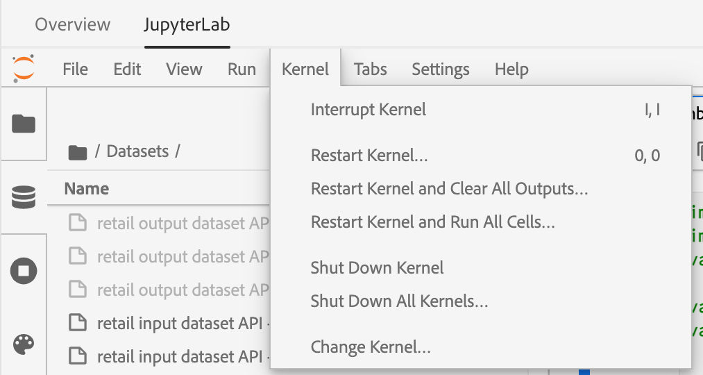

# 使用筆記型電腦分析資料

本教學課程著重於如何使用內建於Data Science Workspace的Jupyter Notebooks，存取、探索及視覺化您的資料。 在本教學課程結束時，您應該已瞭解Jupyter Notebooks提供的部分功能，以便更清楚瞭解您的資料。

以下概念已匯入：

- **[!DNL JupyterLab]：** [[!DNL JupyterLab]](https://blog.jupyter.org/jupyterlab-is-ready-for-users-5a6f039b8906) 是Project Jupyter的下一代網頁型介面，並緊密整合至 [!DNL Adobe Experience Platform].
- **批次：** 資料集是由批次組成。 批次是一段時間內收集的一組資料，並作為一個單元一起處理。 將資料新增至資料集時，會建立新批次。
- **資料存取SDK （已棄用）：** 資料存取SDK現已棄用。 請使用 [[!DNL Platform SDK]](../authoring/platform-sdk.md) 指南。

## 探索資料科學工作區中的筆記本

在本節中，會探索先前擷取到零售銷售結構描述中的資料。

資料科學工作區可讓使用者建立 [!DNL Jupyter Notebooks] 透過 [!DNL JupyterLab] 他們可以在其中建立和編輯機器學習工作流程的平台。 [!DNL JupyterLab] 是伺服器使用者端共同作業工具，可讓使用者透過網頁瀏覽器編輯筆記本檔案。 這些筆記型電腦可包含可執行程式碼和RTF元素。 出於我們的目的，我們將使用Markdown作為分析說明和可執行的工具 [!DNL Python] 執行資料探索和分析的程式碼。

### 選擇您的工作區

啟動時 [!DNL JupyterLab]，我們會看到Jupyter Notebooks的網頁型介面。 根據我們挑選的筆記型電腦型別，將會啟動對應的核心。

在比較要使用的環境時，我們必須考量每個服務的限制。 例如，如果我們使用 [熊貓](https://pandas.pydata.org/) 資料庫，搭配 [!DNL Python]，一般使用者的RAM限製為2 GB。 即使身為進階使用者，RAM容量限製為20 GB。 如果處理較大的計算，則使用 [!DNL Spark] 提供1.5 TB的容量，可與所有筆記型電腦執行個體共用。

依預設，Tensorflow配方會在GPU叢集中運作，而Python會在CPU叢集中執行。

### 建立新的筆記本

在 [!DNL Adobe Experience Platform] UI，選取 [!UICONTROL 資料科學] ，前往資料科學工作區。 從此頁面，選取 [!DNL JupyterLab] 以開啟 [!DNL JupyterLab] 啟動器。 您應該會看到類似此的頁面。


在教學課程中，我們將使用 [!DNL Python] 3 （在Jupyter Notebook中）來顯示如何存取及探索資料。 在「啟動器」頁面中，提供範例筆記本。 我們將使用「零售業」配方 [!DNL Python] 3.


零售方式是獨立的範例，使用相同的零售資料集來顯示如何在Jupyter Notebook中探索和視覺化資料。 此外，筆記型電腦還進一步深入訓練與驗證。 有關此特定記事本的詳細資訊，請參閱以下內容 [逐步解說](../walkthrough.md).

### 存取資料

>[!NOTE]
>
>此 `data_access_sdk_python` 已過時，不再建議使用。 請參閱 [將資料存取SDK轉換為Platform SDK](../authoring/platform-sdk.md) 轉換程式碼的教學課程。 此教學課程仍適用下列相同步驟。

我們將透過內部存取資料 [!DNL Adobe Experience Platform] 和外部資料。 我們將使用 `data_access_sdk_python` 資料庫以存取內部資料，例如資料集和XDM結構描述。 對於外部資料，我們將使用大熊貓 [!DNL Python] 資料庫。

#### 外部資料

開啟零售銷售筆記本後，找到「載入資料」標頭。 下列專案 [!DNL Python] 程式碼使用熊貓 `DataFrame` 資料結構和 [read_csv()](https://pandas.pydata.org/pandas-docs/stable/generated/pandas.read_csv.html#pandas.read_csv) 用於讀取託管於的CSV的函式 [!DNL Github] 放入DataFrame：


Pandas的DataFrame資料結構是2維標籤資料結構。 若要快速檢視資料的維度，我們可以使用 `df.shape`. 這會傳回代表DataFrame維度的Tuple：


最後，我們可以檢視資料的外觀。 我們可以使用 `df.head(n)` 若要檢視第一個 `n` DataFrame的列：


#### [!DNL Experience Platform] 資料

現在，我們將繼續存取 [!DNL Experience Platform] 資料。

##### 依資料集ID

針對本節，我們使用「零售業」資料集，此資料集與「零售業」範例筆記本中使用的資料集相同。

在Jupyter Notebook中，您可以從 **資料** 標籤  左側。 選取索引標籤後，會提供兩個資料夾。 選取 **[!UICONTROL 資料集]** 資料夾。


現在在資料集目錄中，您可以看到所有擷取的資料集。 請注意，如果您的目錄大量填入資料集，載入所有專案可能需要幾分鐘的時間。

由於資料集相同，因此我們想取代上一個使用外部資料的區段的載入資料。 選取下的程式碼區塊 **載入資料** 並按下 **&#39;d&#39;** 鍵盤按鍵兩次。 請確定焦點在區塊上，而不是文字中。 您可以按下 **&#39;esc&#39;** 在按下前逸出文字焦點 **&#39;d&#39;** 兩次。

現在，我們可以用滑鼠右鍵按一下 `Retail-Training-<your-alias>` 資料集，並在下拉式清單中選取「在筆記本中探索資料」選項。 您的記事本中將會出現一個可執行程式碼專案。

>[!TIP]
>
>請參閱 [[!DNL Platform SDK]](../authoring/platform-sdk.md) 轉換程式碼的指南。

```PYTHON
from data_access_sdk_python.reader import DataSetReader
from datetime import date
reader = DataSetReader()
df = reader.load(data_set_id="xxxxxxxx", ims_org="xxxxxxxx@AdobeOrg")
df.head()
```

如果您使用以外的其他核心 [!DNL Python]，請參閱 [此頁面](https://github.com/adobe/acp-data-services-dsw-reference/wiki/Accessing-Data-on-the-Platform) 以存取上的資料 [!DNL Adobe Experience Platform].

選取可執行檔儲存格，然後按一下工具列中的播放按鈕，即可執行可執行檔程式碼。 的輸出 `head()` 會是表格，以資料集的索引鍵為欄，且是資料集中的前n列。 `head()` 接受整數引數，以指定要輸出多少行。 預設值為5。


如果您重新啟動核心並再次執行所有儲存格，應該會取得與之前相同的輸出。




### 探索您的資料

現在我們可以存取您的資料了，接下來讓我們使用統計和視覺效果來關注資料本身。 我們使用的資料集是零售資料集，提供指定日期45個不同商店的其他資訊。 特定的一些特性 `date` 和 `store` 包含下列專案：
- `storeType`
- `weeklySales`
- `storeSize`
- `temperature`
- `regionalFuelPrice`
- `markDown`
- `cpi`
- `unemployment`
- `isHoliday`

#### 統計摘要

我們可以善用 [!DNL Python's] 熊貓資料庫，以取得每個屬性的資料型別。 下列呼叫的輸出會提供每個欄的專案數和資料型別的相關資訊：

```PYTHON
df.info()
```


此資訊很有用，因為知道每欄的資料型別能讓我們知道如何處理資料。

現在來看看統計摘要。 只會顯示數值資料型別，因此 `date`， `storeType`、和 `isHoliday` 將不會輸出：

```PYTHON
df.describe()
```


透過此圖示，我們可以看到每個特性有6435個例項。 此外，也會提供平均值、標準差(std)、最小值、最大值以及四分位數等統計資訊。 這可提供資料偏差的相關資訊。 在下一節中，我們將介紹視覺效果，它可與此資訊搭配使用，讓我們對資料有良好的瞭解。

檢視以下專案的最小值和最大值： `store`，則可看到資料代表的獨特儲存區有45個。 此外還有 `storeTypes` 區分商店的獨特功能。 我們可以看到 `storeTypes` 方法是執行下列動作：


這表示22家店屬於 `storeType` `A`，17個 `storeType` `B`和6為 `storeType` `C`.

#### 資料視覺效果

現在我們知道資料框架值了，我們想透過視覺效果來補充這些值，讓事情變得更清晰、更易於識別模式。 將結果傳達給對象時，圖表也很有用。 部分 [!DNL Python] 適用於視覺效果的資料庫包括：
- [Matplotlib](https://matplotlib.org/)
- [熊貓](https://pandas.pydata.org/)
- [Seaborn](https://seaborn.pydata.org/)
- [格子圖](https://ggplot2.tidyverse.org/)

在本節中，我們將快速說明使用每個程式庫的一些優點。

[Matplotlib](https://matplotlib.org/) 是最舊的 [!DNL Python] 視覺效果套件。 他們的目標是讓「簡單的事情變得容易，而困難的事情變得可能」。 由於套件功能非常強大，但同時也伴隨著複雜性，因此這點通常是對的。 要取得看起來合理的圖表，而不需要花費大量的時間和精力，並不總是很容易。

[熊貓](https://pandas.pydata.org/) 主要用於其DataFrame物件，允許透過整合索引進行資料操作。 不過，熊貓也包含以matplotlib為基礎的內建繪圖功能。

[Seaborn](https://seaborn.pydata.org/) 是在matplotlib上建立的套件。 其主要目標是讓預設圖表更具視覺吸引力，並簡化建立複雜圖表的工作。

[格子圖](https://ggplot2.tidyverse.org/) 是同樣以matplotlib建置的套件。 不過，主要差異在於此工具是R的ggplot2連線埠。與seaborn類似，目標是改善matplotlib。 熟悉R的ggplot2的使用者應考慮此資料庫。


##### 單變數圖表

單變數圖表是個別變數的圖表。 常見的單變數圖表是方塊和鬍鬚圖，可用來視覺化您的資料。

使用先前提供的零售資料集，我們可以為45家商店及其每週銷售額分別產生盒子和鬍鬚圖。 繪圖是使用 `seaborn.boxplot` 函式。


方塊和須狀圖可用來顯示資料的分佈。 繪圖的外線顯示上四分位元和下四分位元，而方塊橫跨四分位元之間的範圍。 方塊中的線條會標籤中位數。 任何超過四分位數上方或下方1.5倍的資料點都會標示為圓形。 這些點會被視為離群值。

##### 多變數圖表

多變數繪圖可用來檢視變數之間的互動。 透過視覺效果，資料科學家可以看到變數之間是否有任何關聯或模式。 常用的多變數圖表是關聯矩陣。 透過相關矩陣，多個變數之間的相依性會以相關係數量化。

使用相同的零售業資料集，我們就能產生關聯矩陣。


請注意中心對角線1的向下。 這表示在比較變數與其本身時，變數具有完全的正相關性。 強正相關具有更接近1的量級，而弱相關將更接近0。 負相關以負係數顯示，顯示反向趨勢。


## 後續步驟

本教學課程說明如何在資料科學工作區中建立新的Jupyter Notebook，以及如何從外部存取資料 [!DNL Adobe Experience Platform]. 具體來說，我們已進行下列步驟：
- 建立新的Jupyter Notebook
- 存取資料集和結構描述
- 探索資料集

現在您已準備好繼續使用 [下一節](../models-recipes/package-source-files-recipe.md) 封裝配方並匯入資料科學工作區。
