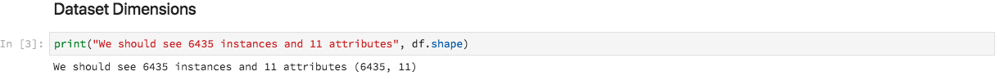

# 使用筆記型電腦分析資料

本教學課程著重於如何使用內建於Data Science Workspace的Jupyter Notebooks，存取、探索及視覺化您的資料。 在本教學課程結束時，您應該已經瞭解Jupyter Notebooks提供的部分功能，以便更清楚瞭解您的資料。

我們匯入了以下概念：

- **[!DNL JupyterLab]：** [[!DNL JupyterLab]](https://blog.jupyter.org/jupyterlab-is-ready-for-users-5a6f039b8906)是Project Jupyter的新世代Web介面，已緊密整合至[!DNL Adobe Experience Platform]。
- **批次：**&#x200B;資料集是由批次組成。 批次是指一段時間內收集的一組資料，並將作為一個單元一起處理。 將資料新增到資料集時，會建立新的批次。
- **資料存取SDK （已棄用）：**&#x200B;資料存取SDK現已棄用。 請使用[[!DNL Platform SDK]](../authoring/platform-sdk.md)指南。

## 在資料科學Workspace中探索筆記本

本節會探索先前內嵌至零售銷售綱要的資料。

資料科學Workspace可讓使用者透過[!DNL JupyterLab]平台建立[!DNL Jupyter Notebooks]，以便建立和編輯機器學習工作流程。 [!DNL JupyterLab]是伺服器使用者端共同作業工具，可讓使用者透過網頁瀏覽器編輯筆記本檔案。 這些筆記本可以包含可執行程式碼和RTF元素。 為了我們的目的，我們將使用Markdown進行分析描述，以及可執行的[!DNL Python]程式碼來執行資料探索和分析。

### 選擇您的工作區

啟動[!DNL JupyterLab]時，會顯示Jupyter Notebooks的網頁式介面。 根據我們選取的筆記型電腦型別，將會啟動對應的核心。

在比較要使用的環境時，我們必須考量每個服務的限制。 例如，如果我們使用[熊貓](https://pandas.pydata.org/)資料庫搭配[!DNL Python]，作為一般使用者，RAM限製為2 GB。 即使身為進階使用者，RAM容量限製為20 GB。 如果處理較大的計算，則最好使用[!DNL Spark]，它提供1.5 TB與所有筆記本執行個體共用。

依預設，Tensorflow配方會在GPU叢集中運作，而Python會在CPU叢集中執行。

### 建立新的筆記本

在[!DNL Adobe Experience Platform] UI中，選取頂端功能表中的[!UICONTROL Data Science]，帶您前往Data Science Workspace。 從此頁面，選取[!DNL JupyterLab]以開啟[!DNL JupyterLab]啟動器。 您應該會看到類似此的頁面。


在教學課程中，我們將使用Jupyter Notebook中的[!DNL Python] 3來示範如何存取及探索資料。 在啟動器頁面中，提供範例筆記本。 我們將使用[!DNL Python] 3的零售配方。


零售銷售方式是獨立的範例，此範例使用相同的零售銷售資料集來顯示如何在Jupyter Notebook中探索和視覺化資料。 此外，筆記型電腦在訓練與驗證方面更深入。 如需此特定筆記本的詳細資訊，請參閱此[逐步說明](../walkthrough.md)。

### 存取資料

>[!NOTE]
>
>`data_access_sdk_python`已過時，不再建議使用。 若要轉換您的程式碼，請參閱[將資料存取SDK轉換為Platform SDK](../authoring/platform-sdk.md)教學課程。 本教學課程仍適用下列相同步驟。

我們將從[!DNL Adobe Experience Platform]內部存取資料，並從外部存取資料。 我們將使用`data_access_sdk_python`資料庫來存取內部資料，例如資料集和XDM結構描述。 對於外部資料，我們將使用熊貓[!DNL Python]資料庫。

#### 外部資料

開啟零售銷售筆記本後，尋找「載入資料」標頭。 下列[!DNL Python]程式碼使用熊貓`DataFrame`資料結構和[read_csv()](https://pandas.pydata.org/pandas-docs/stable/generated/pandas.read_csv.html#pandas.read_csv)函式，將[!DNL Github]上託管的CSV讀取至DataFrame中：


熊貓的DataFrame資料結構是2維標籤資料結構。 若要快速檢視資料的維度，我們可以使用`df.shape`。 這會傳回代表DataFrame維度的Tuple：



最後，我們可以檢視資料的外觀。 我們可以使用`df.head(n)`來檢視DataFrame的前`n`列：


#### [!DNL Experience Platform]資料

現在，我們將再次存取[!DNL Experience Platform]資料。

##### 依資料集ID

針對本節，我們使用「零售業」資料集，此資料集與「零售業」範例筆記本中使用的資料集相同。

在Jupyter Notebook中，您可以從左側的&#x200B;**資料**&#x200B;標籤存取您的資料。 選取索引標籤後，會提供兩個資料夾。 選取&#x200B;**[!UICONTROL 資料集]**&#x200B;資料夾。


現在在資料集目錄中，您可以看到所有擷取的資料集。 請注意，如果您的目錄大量填入資料集，載入所有專案可能需要幾分鐘的時間。

由於資料集相同，我們想取代使用外部資料的上一個區段的載入資料。 在&#x200B;**載入資料**&#x200B;下選取程式碼區塊，然後按兩次鍵盤上的&#x200B;**&#39;d&#39;**&#x200B;鍵。 請確定焦點在區塊上，而不是文字中。 您可以按下&#x200B;**&#39;esc&#39;**&#x200B;來逸出文字焦點，然後再按兩次&#x200B;**&#39;d&#39;**。

現在，我們可以在`Retail-Training-<your-alias>`資料集上按一下滑鼠右鍵，然後在下拉式清單中選取「在筆記本中探索資料」選項。 您的記事本中將會顯示可執行程式碼專案。

>[!TIP]
>
>請參閱[[!DNL Platform SDK]](../authoring/platform-sdk.md)指南以轉換您的程式碼。

```PYTHON
from data_access_sdk_python.reader import DataSetReader
from datetime import date
reader = DataSetReader()
df = reader.load(data_set_id="xxxxxxxx", ims_org="xxxxxxxx@AdobeOrg")
df.head()
```

如果您正在處理[!DNL Python]以外的其他核心，請參閱[此頁面](https://github.com/adobe/acp-data-services-dsw-reference/wiki/Accessing-Data-on-the-Platform)以存取[!DNL Adobe Experience Platform]上的資料。

選取可執行儲存格，然後按工具列中的播放按鈕，即可執行可執行程式碼。 `head()`的輸出會是資料表，以資料集的索引鍵作為欄，以及資料集中的前n列。 `head()`接受整數引數，以指定要輸出的行數。 預設值為5。


如果您重新啟動核心並再次執行所有儲存格，您應該會取得與之前相同的輸出。


### 探索您的資料

現在我們可以存取您的資料了，接下來讓我們使用統計和視覺效果來關注資料本身。 我們使用的資料集是零售資料集，提供指定日期45個不同商店的其他資訊。 指定`date`和`store`的某些特性包括：
- `storeType`
- `weeklySales`
- `storeSize`
- `temperature`
- `regionalFuelPrice`
- `markDown`
- `cpi`
- `unemployment`
- `isHoliday`

#### 統計摘要

我們可以利用[!DNL Python's]熊貓資料庫來取得每個屬性的資料型別。 以下呼叫的輸出會提供每個欄的專案數和資料型別的相關資訊：

```PYTHON
df.info()
```


此資訊很有用，因為知道每欄的資料型別能讓我們知道如何處理資料。

現在來看看統計摘要。 只會顯示數值資料型別，所以不會輸出`date`、`storeType`和`isHoliday`：

```PYTHON
df.describe()
```


透過這項分析，我們可以看到每個特性有6435個例項。 此外，也會提供平均值、標準差(std)、最小值、最大值以及四分位數等統計資訊。 這可提供資料偏差的相關資訊。 在下一節中，我們將介紹視覺效果，視覺效果會搭配此資訊使用，讓我們對資料有良好的瞭解。

檢視`store`的最小值和最大值，我們可以看到資料代表有45個唯一存放區。 還有`storeTypes`可區分商店的性質。 我們可以執行下列動作來檢視`storeTypes`的分佈：


這表示22個存放區屬於`storeType` `A`，17個為`storeType` `B`，6個為`storeType` `C`。

#### 資料視覺效果

現在我們知道資料框架值了，我們想透過視覺效果來補充這些值，讓事情變得更清晰、更易於識別模式。 將結果傳送給對象時，圖表也很有用。 有些[!DNL Python]資料庫適合用於視覺化，包括：
- [Matplotlib](https://matplotlib.org/)
- [熊貓](https://pandas.pydata.org/)
- [海港](https://seaborn.pydata.org/)
- [ggplot](https://ggplot2.tidyverse.org/)

在本節中，我們將快速說明使用每個程式庫的一些優點。

[Matplotlib](https://matplotlib.org/)是最舊的[!DNL Python]視覺化封裝。 他們的目標是讓「簡單的事情變得容易，而困難的事情變得可能」。 由於套裝軟體功能極為強大，但同時也伴隨著複雜性，因此上述假設通常成立。 要取得看起來合理的圖表，而不需要花費大量的時間和精力，並不總是那麼容易。

[熊貓](https://pandas.pydata.org/)主要用於其DataFrame物件，允許透過整合索引進行資料操作。 不過，熊貓也包含以matplotlib為基礎的內建繪圖功能。

[seaborn](https://seaborn.pydata.org/)是位於matplotlib之上的封裝組建。 其主要目標是讓預設圖表更吸引目光，並簡化建立複雜圖表的流程。

[ggplot](https://ggplot2.tidyverse.org/)也是在matplotlib上建置的套件。 不過，主要差異在於此工具是R的ggplot2連線埠。與seaborn類似，目標是改善matplotlib。 熟悉R的ggplot2的使用者應考慮此資料庫。


##### 單變數圖表

單變數圖表是個別變數的圖表。 常見的單變數圖表是用來視覺化您的資料，例如方塊和鬍鬚圖。

使用之前的零售資料集，我們可以為45家商店及其每週銷售額分別產生盒子和鬍鬚圖。 使用`seaborn.boxplot`函式產生繪圖。


方塊和須狀圖可用來顯示資料的分佈。 繪圖的外線顯示上四分位元和下四分位元，而方塊橫跨四分位元範圍。 方塊中的行會標籤中位數。 任何超過四分位數上下1.5倍的資料點都會標示為圓形。 這些點會被視為離群值。

##### 多變數圖表

多變數繪圖是用來檢視變數之間的互動。 藉由視覺效果，資料科學家就能檢視變數之間是否有任何關聯或模式。 常用的多變數圖表是關聯矩陣。 使用關聯矩陣時，多個變數之間的相依性會以關聯係數量化。

使用相同的零售資料集，我們便可產生關聯矩陣。


請注意中心對角線1的向下。 這表示將變數與其本身進行比較時，變數具有完全的正相關性。 強正相關具有更接近1的量級，而弱相關將更接近0。 負相關以負係數顯示，顯示反向趨勢。


## 後續步驟

本教學課程說明如何在資料科學Workspace中建立新的Jupyter Notebook，以及如何從外部和從[!DNL Adobe Experience Platform]存取資料。 具體來說，我們已進行下列步驟：
- 建立新的Jupyter Notebook
- 存取資料集和結構描述
- 探索資料集

現在您已準備好繼續進行[下一節](../models-recipes/package-source-files-recipe.md)，以封裝配方並匯入資料科學Workspace。
