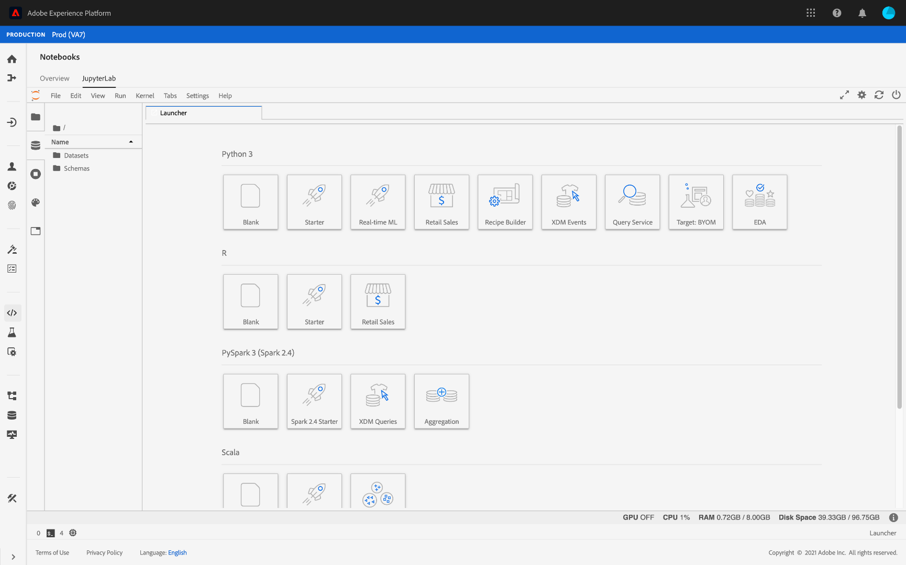

# 使用筆記型電腦分析資料

本教學課程著重於如何使用Jupyter Notebooks（在Data Science Workspace中建立）來存取、探索和視覺化您的資料。 在本教學課程結束時，您應瞭解Jupyter Notebooks提供的一些功能，以便更好地瞭解您的資料。

以下概念介紹：

- **[!DNL JupyterLab]:** [[!DNL JupyterLab]](https://blog.jupyter.org/jupyterlab-is-ready-for-users-5a6f039b8906) 是Project Jupyter的新一代Web介面，並緊密整合在其中 [!DNL Adobe Experience Platform]。
- **批處理：** 資料集由批處理組成。批是一組在一段時間內收集並作為單個單位一起處理的資料。 新增資料至資料集時，會建立新的批次。
- **資料存取SDK（已過時）:** 資料存取SDK現已過時。請使用[[!DNL Platform SDK]](../authoring/platform-sdk.md)指南。

## 在Data Science Workspace中探索筆記型電腦

在本節中，將探索先前納入零售銷售模式的資料。

Data Science Workspace可讓使用者透過[!DNL JupyterLab]平台建立[!DNL Jupyter Notebooks]，以建立和編輯機器學習工作流程。 [!DNL JupyterLab] 是伺服器——用戶端共同作業工具，可讓使用者透過網頁瀏覽器編輯筆記型電腦檔案。這些筆記型電腦可同時包含可執行代碼和富格文本元素。 為了我們的目的，我們將使用Markdown進行分析說明，並可執行[!DNL Python]程式碼來執行資料探索和分析。

### 選擇您的工作區

在啟動[!DNL JupyterLab]時，我們將為Jupyter Notebooks提供基於Web的介面。 根據我們選擇的筆記本類型，將啟動相應的內核。

在比較要使用的環境時，我們必須考慮每項服務的限制。 例如，如果我們使用[apacties](https://pandas.pydata.org/)資料庫與[!DNL Python]，作為一般使用者，RAM限制為2 GB。 即使身為強大使用者，我們也只能使用20 GB的記憶體。 如果處理較大的計算，則使用[!DNL Spark]來提供與所有筆記本實例共用的1.5 TB是有意義的。

依預設，Tensorflow方式可在GPU叢集中運作，而Python則可在CPU叢集中執行。

### 建立新筆記本

在[!DNL Adobe Experience Platform] UI中，按一下頂端功能表中的「資料科學」標籤，將您帶往「資料科學工作區」。 在此頁中，按一下[!DNL JupyterLab]頁籤，該頁籤將開啟[!DNL JupyterLab]啟動程式。 您應該會看到類似此的頁面。



在本教程中，我們將使用Jupyter Notebook中的[!DNL Python] 3來演示如何訪問和瀏覽資料。 在「啟動器」頁中，提供了示例筆記本。 我們將使用[!DNL Python] 3的零售銷售配方。


「零售銷售」方式是使用相同「零售銷售」資料集的獨立範例，以顯示如何在Jupyter Notebook中探索和視覺化資料。 此外，本筆記本還通過培訓和驗證深入探討。 有關此特定筆記本的詳細資訊，請參閱[逐步介紹](../walkthrough.md)。

### 存取資料

>[!NOTE]
>
>`data_access_sdk_python`已過時，不再建議使用。 請參閱將資料存取SDK轉換為平台SDK](../authoring/platform-sdk.md)教學課程，以轉換您的程式碼。 [本教學課程仍適用下列相同步驟。

我們將從[!DNL Adobe Experience Platform]內部存取資料，從外部存取資料。 我們將使用`data_access_sdk_python`程式庫來存取內部資料，例如資料集和XDM架構。 對於外部資料，我們將使用熊貓[!DNL Python]圖書館。

#### 外部資料

當零售銷售筆記型電腦開啟時，尋找「載入資料」標題。 以下[!DNL Python]代碼使用`DataFrame`資料結構和[read_csv()](https://pandas.pydata.org/pandas-docs/stable/generated/pandas.read_csv.html#pandas.read_csv)函式將[!DNL Github]上托管的CSV讀入DataFrame:


熊貓的DataFrame資料結構是一種二維標籤資料結構。 若要快速查看資料的維度，我們可使用`df.shape`。 這會傳回表示DataFrame維度的元組：


最後，我們可以一窺我們的資料外觀。 我們可以使用`df.head(n)`來查看DataFrame的前`n`行：


#### [!DNL Experience Platform] 資料

現在，我們將重點介紹訪問[!DNL Experience Platform]資料。

##### 依資料集ID

在本節中，我們使用零售銷售資料集，該資料集與零售銷售示例筆記本中使用的資料集相同。

在Jupyter Notebook中，可以從左側的&#x200B;**Data**&#x200B;標籤訪問資料。 在選擇頁籤時，將提供兩個資料夾。 選擇&#x200B;**[!UICONTROL Datasets]**&#x200B;資料夾。


現在，在Datasets目錄中，您可以看到所有收錄的資料集。 請注意，如果目錄中填入了大量資料集，則可能需要一分鐘來載入所有條目。

由於資料集相同，因此我們想要取代使用外部資料的上一區段的載入資料。 在&#x200B;**Load Data**&#x200B;下選擇代碼塊，然後在鍵盤上按兩次&#x200B;**&#39;d&#39;**&#x200B;鍵。 請確定焦點在區塊上，而非在文字中。 您可以按兩下&#x200B;**&#39;esc&#39;**&#x200B;以逸出文字焦點，然後再按兩下&#x200B;**&#39;d&#39;**。

現在，我們可以在`Retail-Training-<your-alias>`資料集上按一下滑鼠右鍵，然後在下拉式清單中選取「探索筆記型電腦中的資料」選項。 可執行的代碼條目將出現在您的筆記本中。

>[!TIP]
>
>請參閱[[!DNL Platform SDK]](../authoring/platform-sdk.md)指南以轉換程式碼。

```PYTHON
from data_access_sdk_python.reader import DataSetReader
from datetime import date
reader = DataSetReader()
df = reader.load(data_set_id="xxxxxxxx", ims_org="xxxxxxxx@AdobeOrg")
df.head()
```

如果您正在使用[!DNL Python]以外的其他內核，請參閱[本頁](https://github.com/adobe/acp-data-services-dsw-reference/wiki/Accessing-Data-on-the-Platform)以訪問[!DNL Adobe Experience Platform]上的資料。

選擇可執行單元格，然後按工具欄中的播放按鈕將運行可執行代碼。 `head()`的輸出將是表，其資料集的索引鍵為欄，而資料集中的前n列為欄。 `head()` 接受整數引數，以指定要輸出的行數。預設為5。


如果重新啟動內核並再次運行所有單元格，則應獲得與以前相同的輸出。


### 探索您的資料

既然我們可以存取您的資料，讓我們利用統計資料和視覺化功能來關注資料本身。 我們使用的資料集是零售資料集，它提供了關於給定日期45個不同商店的各種資訊。 給定`date`和`store`的某些特性包括：
- `storeType`
- `weeklySales`
- `storeSize`
- `temperature`
- `regionalFuelPrice`
- `markDown`
- `cpi`
- `unemployment`
- `isHoliday`

#### 統計摘要

我們可以利用[!DNL Python's]熊貓庫來獲取每個屬性的資料類型。 下列呼叫的輸出將提供每個欄的項目數和資料類型的相關資訊：

```PYTHON
df.info()
```


由於瞭解每欄的資料類型可讓我們瞭解如何處理資料，因此這項資訊十分實用。

現在讓我們來看一下統計摘要。 只會顯示數值資料類型，因此`date`、`storeType`和`isHoliday`將不會輸出：

```PYTHON
df.describe()
```


這樣，我們可以看到每個特徵有6435個實例。 同時，給出了平均、標準差(std)、最小、最大和四分位數等統計資訊。 這會提供資料的偏差資訊。 在下一節，我們將檢視視覺化，並搭配這些資訊，讓我們更瞭解我們的資料。

查看`store`的最小值和最大值，我們可以看到有45個唯一儲存資料。 還有`storeTypes`可區分商店的不同。 通過執行下列操作，我們可以看到`storeTypes`的分佈：


這表示22個商店`storeType` `A`,17個商店`storeType` `B`,6個商店`storeType` `C`。

#### 資料視覺化

既然我們知道我們的資料框值，我們想要以視覺化來補充，讓事物更清晰，更容易辨識模式。 在將結果傳達給觀眾時，圖表也很有用。 有些[!DNL Python]程式庫對視覺化非常有用，包括：
- [馬特普洛特利卜](https://matplotlib.org/)
- [熊貓](https://pandas.pydata.org/)
- [西伯恩](https://seaborn.pydata.org/)
- [gplot](https://ggplot2.tidyverse.org/)

在本節中，我們將快速介紹使用每個程式庫的一些優點。

[Matplotlibis是](https://matplotlib.org/) 最古老的 [!DNL Python] 視覺化套件。他們的目標是讓「輕鬆、艱難的事情成為可能」。 這通常是正確的，因為該套產品功能極強，但同時也具有複雜性。 在不花費大量時間和精力的情況下，要獲得合理的外觀圖並不總是容易的。

[Pandasis](https://pandas.pydata.org/) 主要用於其DataFrame物件，可讓資料處理與整合索引。不過，熊貓也包括了一個基於matplotlib的內置繪圖功能。

[西](https://seaborn.pydata.org/) 博尼斯在matplotlib上構建軟體包。其主要目標是讓預設圖形更具視覺吸引力，並簡化複雜圖形的建立。

[](https://ggplot2.tidyverse.org/) ggplotis a package so bult on to of matplotlib.但主要區別在於，該工具是R的ggplot2埠。與西博恩類似，其目標是改進matplotlib。 熟悉gplot2 for R的使用者應考慮此程式庫。


##### 一元圖

單變數圖是個別變數的圖形。 常用的單變數圖形是方框和須條圖，用來視覺化您的資料。

使用我們過去的零售資料集，我們可以為45家商店及其每週銷售量產生包裝盒和須條圖。 該出圖是使用`seaborn.boxplot`函式生成的。


用方框和晶須圖顯示資料的分佈。 圖的外線顯示上四分位數和下四分位數，而框則跨越四分位數範圍。 框中的行標示中間值。 任何高於上四分位數或下四分位數1.5倍的資料點都會標示為圓。 這些點被認為是離群的。

##### 多變數圖表

多變數圖表可用來查看變數之間的互動。 透過視覺化，資料科學家可以查看變數之間是否有任何關聯或模式。 常用的多變數圖形是關聯矩陣。 利用相關矩陣，利用相關係數量化多變數間的相關性。

使用相同的零售資料集，可以生成關聯矩陣。


注意中心下方1的對角線。 這顯示在比較變數本身時，其具有完全正相關性。 強正相關度將接近1，弱關聯度接近0。 負相關顯示，負系數顯示逆趨勢。


## 後續步驟

本教學課程介紹如何在Data Science Workspace中建立新的Jupyter Notebook，以及如何從外部以及從[!DNL Adobe Experience Platform]訪問資料。 具體來說，我們逐一檢視下列步驟：
- 建立新的Jupyter筆記本
- 存取資料集和結構
- 探索資料集

現在，您已準備好前往[下一節](../models-recipes/package-source-files-recipe.md)封裝配方並匯入至Data Science Workspace。