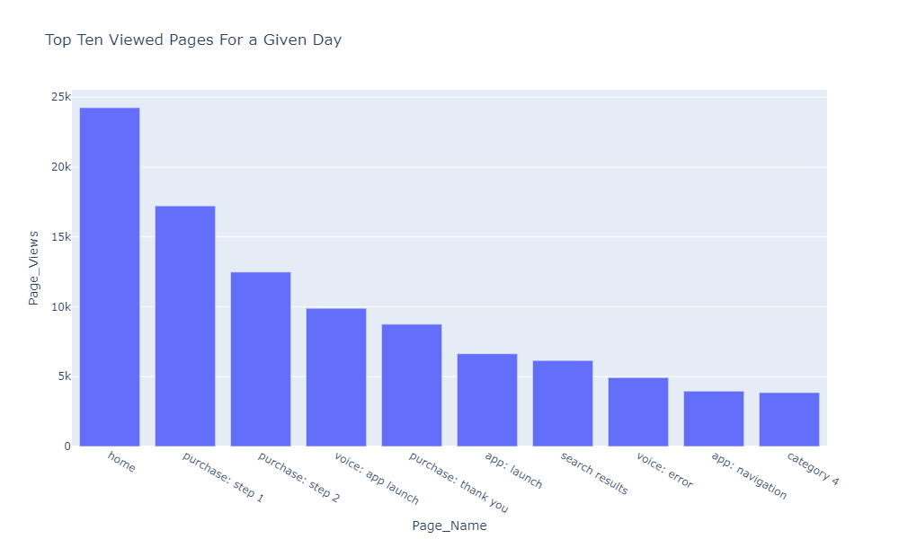

# 使用探索資料分析(EDA)筆記本探索預測模型的Web型資料

探索性資料分析(EDA)筆記本的設計目的，是協助您探索資料中的模式、檢查資料健全度，以及彙總預測模型的相關資料。

EDA筆記型電腦範例已針對網頁型資料進行最佳化，並包含兩個部分。 第一部分從使用查詢服務來檢視趨勢和資料快照開始。 接下來，以探索性資料分析為目標，在設定檔和訪客層級彙總資料。

第二部分首先使用Python程式庫對彙總資料執行描述性分析。 此筆記本會展示各種視覺效果，例如長條圖、散佈圖、方塊圖和關聯矩陣，以得出可操作的深入分析，用於判斷哪些功能最可能有助於預測目標。

## 快速入門

閱讀本指南前，請先檢閱 [[!DNL JupyterLab] 使用手冊](./overview.md) 如需深入瞭解 [!DNL JupyterLab] 及其在資料科學工作區中的角色。 此外，如果您使用自己的資料，請檢視以下檔案： [中的資料存取 [!DNL Jupyterlab] 筆記本](./access-notebook-data.md). 本指南包含有關筆記本資料限制的重要資訊。

此筆記本使用Analytics Analysis Workspace中的Adobe Analytics Experience Events資料形式的中值資料集。 若要使用EDA筆記本，您必須使用下列值來定義資料表格 `target_table` 和 `target_table_id`. 可以使用任何中值資料集。

若要尋找這些值，請遵循以下說明的步驟： [寫入python中的資料集](./access-notebook-data.md#write-python) JupyterLab資料存取指南的部分提供。 資料集名稱(`target_table`)位於資料集目錄中。 以滑鼠右鍵按一下資料集，在記事本中探索或寫入資料後，資料集ID (`target_table_id`)會顯示在可執行檔程式碼專案內。

## 資料探索

本節包含用於檢視趨勢（例如「依使用者活動排名的前十個城市」或「檢視次數排名前十的產品」）的設定步驟和查詢範例。

### 程式庫的設定

JupyterLab支援多個程式庫。 下列程式碼可貼上並在程式碼儲存格中執行，以收集並安裝此範例使用的所有必要套件。 您可以在此範例之外使用其他或替代套件進行自己的資料分析。 如需支援的套件清單，請複製並貼上 `!pip list --format=columns` 在新儲存格中。

```python
!pip install colorama
import chart_studio.plotly as py
import plotly.graph_objs as go
from plotly.offline import iplot
from scipy import stats
import numpy as np
import warnings
warnings.filterwarnings('ignore')
from scipy.stats import pearsonr
import matplotlib.pyplot as plt
from scipy.stats import pearsonr
import pandas as pd
import math
import re
import seaborn as sns
from datetime import datetime
import colorama
from colorama import Fore, Style
pd.set_option('display.max_columns', None)
pd.set_option('display.max_rows', None)
pd.set_option('display.width', 1000)
pd.set_option('display.expand_frame_repr', False)
pd.set_option('display.max_colwidth', -1)
```

### 連線至Adobe Experience Platform [!DNL Query Service]

[!DNL JupyterLab] on Platform可讓您將SQL用於 [!DNL Python] 筆記型電腦，可透過存取資料 [查詢服務](https://www.adobe.com/go/query-service-home-en). 透過存取資料 [!DNL Query Service] 由於其卓越的執行時間，可用於處理大型資料集。 請注意，查詢資料時使用 [!DNL Query Service] 具有十分鐘的處理時間限制。

使用前 [!DNL Query Service] 在 [!DNL JupyterLab]，請務必實際瞭解 [[!DNL Query Service] SQL語法](https://www.adobe.com/go/query-service-sql-syntax-en).

若要在JupyterLab中利用查詢服務，您必須先建立正在運作的Python筆記本與查詢服務之間的連線。 這可以透過執行以下儲存格來達成。

```python
qs_connect()
```

### 定義要探索的中值資料集

為了開始查詢和探索資料，必須提供中值資料集表格。 複製並取代 `table_name` 和 `table_id` 具有您自己的資料表格值的值。

```python
target_table = "table_name"
target_table_id = "table_id"
```

完成後，此儲存格看起來應該類似於以下範例：

```python
target_table = "cross_industry_demo_midvalues"
target_table_id = "5f7c40ef488de5194ba0157a"
```

### 探索資料集以取得可用日期

使用下方提供的儲存格，您可以檢視表格中涵蓋的日期範圍。 探索天數、第一個日期和最後一個日期的目的是協助選取日期範圍以供進一步分析。

```python
%%read_sql -c QS_CONNECTION
SELECT distinct Year(timestamp) as Year, Month(timestamp) as Month, count(distinct DAY(timestamp)) as Count_days, min(DAY(timestamp)) as First_date, max(DAY(timestamp)) as Last_date, count(timestamp) as Count_hits
from {target_table}
group by Month(timestamp), Year(timestamp)
order by Year, Month;
```

執行儲存格會產生下列輸出：


### 設定資料集探索日期

在決定資料集探索的可用日期後，需要更新以下引數。 在此儲存格中設定的日期僅用於查詢形式的資料探索。 日期會再次更新至適合的範圍，以供本指南稍後章節的探索性資料分析使用。

```python
target_year = "2020" ## The target year
target_month = "02" ## The target month
target_day = "(01,02,03)" ## The target days
```

### 資料集探索

設定好所有引數後，即可開始 [!DNL Query Service]，並擁有日期範圍，您就可以開始讀取資料列了。 您應限制讀取的列數。

```python
from platform_sdk.dataset_reader import DatasetReader
from datetime import date
dataset_reader = DatasetReader(PLATFORM_SDK_CLIENT_CONTEXT, dataset_id=target_table_id)
# If you do not see any data or would like to expand the default date range, change the following query
Table = dataset_reader.limit(5).read()
```

若要檢視資料集中可用的欄數，請使用下列儲存格：

```python
print("\nNumber of columns:",len(Table.columns))
```

若要檢視資料集的列，請使用下列儲存格。 在此範例中，列數限製為五。

```python
Table.head(5)
```


瞭解資料集中包含哪些資料後，進一步劃分資料集就變得很有價值。 在此範例中，會列出每個欄的欄名稱和資料型別，而輸出會用於檢查資料型別是否正確。

```python
ColumnNames_Types = pd.DataFrame(Table.dtypes)
ColumnNames_Types = ColumnNames_Types.reset_index()
ColumnNames_Types.columns = ["Column_Name", "Data_Type"]
ColumnNames_Types
```


### 資料集趨勢探索

下節包含四個查詢範例，用於探索資料中的趨勢和模式。 以下提供的範例並非詳盡無遺，但涵蓋一些較常檢視的功能。

**指定日的每小時活動計數**

此查詢會分析一天中的動作和點按次數。 輸出會以表格的形式呈現，其中包含一天中每個小時的活動計數量度。

```sql
%%read_sql query_2_df -c QS_CONNECTION

SELECT Substring(timestamp, 12, 2)                        AS Hour, 
       Count(enduserids._experience.aaid.id) AS Count 
FROM   {target_table}
WHERE  Year(timestamp) = {target_year} 
       AND Month(timestamp) = {target_month}  
       AND Day(timestamp) in {target_day}
GROUP  BY Hour
ORDER  BY Hour;
```


確認查詢正常運作後，資料可以呈現在單變數繪圖長條圖中，以清楚顯示。

```python
trace = go.Bar(
    x = query_2_df['Hour'],
    y = query_2_df['Count'],
    name = "Activity Count"
)

layout = go.Layout(
    title = 'Activity Count by Hour of Day',
    width = 1200,
    height = 600,
    xaxis = dict(title = 'Hour of Day'),
    yaxis = dict(title = 'Count')
)

fig = go.Figure(data = [trace], layout = layout)
iplot(fig)
```


**指定日期前10個檢視頁面**

此查詢會分析在指定日期中檢視次數最多的頁面。 輸出會以表格形式呈現，表格包含頁面名稱和頁面檢視計數的量度。

```sql
%%read_sql query_4_df -c QS_CONNECTION

SELECT web.webpagedetails.name                 AS Page_Name, 
       Sum(web.webpagedetails.pageviews.value) AS Page_Views 
FROM   {target_table}
WHERE  Year(timestamp) = {target_year}
       AND Month(timestamp) = {target_month}
       AND Day(timestamp) in {target_day}
GROUP  BY web.webpagedetails.name 
ORDER  BY page_views DESC 
LIMIT  10;
```

確認查詢正常運作後，資料可以呈現在單變數繪圖長條圖中，以清楚顯示。

```python
trace = go.Bar(
    x = query_4_df['Page_Name'],
    y = query_4_df['Page_Views'],
    name = "Page Views"
)

layout = go.Layout(
    title = 'Top Ten Viewed Pages For a Given Day',
    width = 1000,
    height = 600,
    xaxis = dict(title = 'Page_Name'),
    yaxis = dict(title = 'Page_Views')
)

fig = go.Figure(data = [trace], layout = layout)
iplot(fig)
```



**依使用者活動分組的前10個城市**

此查詢會分析資料源自哪些城市。

```sql
%%read_sql query_6_df -c QS_CONNECTION

SELECT concat(placeContext.geo.stateProvince, ' - ', placeContext.geo.city) AS state_city, 
       Count(timestamp)                                                     AS Count
FROM   {target_table}
WHERE  Year(timestamp) = {target_year}
       AND Month(timestamp) = {target_month}
       AND Day(timestamp) in {target_day}
GROUP  BY state_city
ORDER  BY Count DESC
LIMIT  10;
```

確認查詢正常運作後，資料可以呈現在單變數繪圖長條圖中，以清楚顯示。

```python
trace = go.Bar(
    x = query_6_df['state_city'],
    y = query_6_df['Count'],
    name = "Activity by City"
)

layout = go.Layout(
    title = 'Top Ten Cities by User Activity',
    width = 1200,
    height = 600,
    xaxis = dict(title = 'City'),
    yaxis = dict(title = 'Count')
)

fig = go.Figure(data = [trace], layout = layout)
iplot(fig)
```


**檢視次數前十的產品**

此查詢提供檢視次數前十名的產品清單。 在以下範例中， `Explode()` 函式用於傳回 `productlistitems` 物件放入自己的列。 這可讓您執行巢狀查詢，以彙總不同SKU的產品檢視。

```sql
%%read_sql query_7_df -c QS_CONNECTION

SELECT Product_List_Items.sku AS Product_SKU,
       Sum(Product_Views) AS Total_Product_Views
FROM  (SELECT Explode(productlistitems) AS Product_List_Items, 
              commerce.productviews.value   AS Product_Views 
       FROM   {target_table}
       WHERE  Year(timestamp) = {target_year}
              AND Month(timestamp) = {target_month}
              AND Day(timestamp) in {target_day}
              AND commerce.productviews.value IS NOT NULL) 
GROUP BY Product_SKU 
ORDER BY Total_Product_Views DESC
LIMIT  10;
```

確認查詢正常運作後，資料可以呈現在單變數繪圖長條圖中，以清楚顯示。

```python
trace = go.Bar(
    x = "SKU-" + query_7_df['Product_SKU'],
    y = query_7_df['Total_Product_Views'],
    name = "Product View"
)

layout = go.Layout(
    title = 'Top Ten Viewed Products',
    width = 1200,
    height = 600,
    xaxis = dict(title = 'SKU'),
    yaxis = dict(title = 'Product View Count')
)

fig = go.Figure(data = [trace], layout = layout)
iplot(fig)
```


探索資料的趨勢和模式後，您應該清楚知道要建置哪些功能來預測目標。 略過表格可以快速反白顯示每個資料屬性的形式、明顯的錯誤表示和值中的大型離群值，並開始建議屬性之間要探索的候選關係。

## 探索性資料分析

探索性資料分析可用來改善您對資料的瞭解，並針對可用作模型基礎的緊迫問題建立直覺。

完成資料探索步驟後，您將會在事件層級探索資料，以及事件、城市或使用者ID層級的一些彙總，以檢視一天的趨勢。 雖然此資料很重要，但並未提供全貌。 您仍然不瞭解促使您購買網站的原因。

若要瞭解這一點，您需要在設定檔/訪客層級彙總資料、定義購買目標，並套用統計概念，例如關聯、方塊圖和散佈圖。 在您定義的預測視窗中，這些方法可用來比較買方與非買方的活動模式。

本節將建立並探討下列功能：

- `COUNT_UNIQUE_PRODUCTS_PURCHASED`：購買的不重複產品數量。
- `COUNT_CHECK_OUTS`：結帳次數。
- `COUNT_PURCHASES`：購買次數。
- `COUNT_INSTANCE_PRODUCTADDS`：產品新增執行個體的數量。
- `NUMBER_VISITS`：造訪次數。
- `COUNT_PAID_SEARCHES`：付費搜尋的次數。
- `DAYS_SINCE_VISIT`：自上次造訪以來的天數。
- `TOTAL_ORDER_REVENUE`：訂單收入總計。
- `DAYS_SINCE_PURCHASE`：自上次購買以來的天數。
- `AVG_GAP_BETWEEN_ORDERS_DAYS`：購買之間的平均差距（以天為單位）。
- `STATE_CITY`：包含州和市。

在繼續資料彙總之前，您需要定義用於探索性資料分析的預測變數引數。 換言之，您想要從資料科學模型中獲得什麼？ 常見引數包括目標、預測時段和分析時段。

如果您使用EDA筆記本，您必須先取代下列值才能繼續。

```python
goal = "commerce.`order`.purchaseID" #### prediction variable
goal_column_type = "numerical" #### choose either "categorical" or "numerical"
prediction_window_day_start = "2020-01-01" #### YYYY-MM-DD
prediction_window_day_end = "2020-01-31" #### YYYY-MM-DD
analysis_period_day_start = "2020-02-01" #### YYYY-MM-DD
analysis_period_day_end = "2020-02-28" #### YYYY-MM-DD

### If the goal is a categorical goal then select threshold for the defining category and creating bins. 0 is no order placed, and 1 is at least one order placed:
threshold = 1
```

### 用於功能和目標建立的資料彙總

若要開始探索性分析，您需要在設定檔層級建立目標，然後彙總您的資料集。 在此範例中，提供了兩個查詢。 第一個查詢包含目標的建立。 第二個查詢需要更新，以包含第一個查詢中變數以外的任何變數。 您可能需要更新 `limit` 以取得您的查詢。 執行以下查詢後，現在可探索彙總的資料。

```sql
%%read_sql target_df -d -c QS_CONNECTION

SELECT DISTINCT endUserIDs._experience.aaid.id                  AS ID,
       Count({goal})                                            AS TARGET
FROM   {target_table}
WHERE DATE(TIMESTAMP) BETWEEN '{prediction_window_day_start}' AND '{prediction_window_day_end}'
GROUP BY endUserIDs._experience.aaid.id;
```

```sql
%%read_sql agg_data -d -c QS_CONNECTION

SELECT z.*, z1.state_city as STATE_CITY
from
((SELECT y.*,a2.AVG_GAP_BETWEEN_ORDERS_DAYS as AVG_GAP_BETWEEN_ORDERS_DAYS
from
(select a1.*, f.DAYS_SINCE_PURCHASE as DAYS_SINCE_PURCHASE
from
(SELECT DISTINCT a.ID  AS ID,
COUNT(DISTINCT Product_Items.SKU) as COUNT_UNIQUE_PRODUCTS_PURCHASED,
COUNT(a.check_out) as COUNT_CHECK_OUTS,
COUNT(a.purchases) as COUNT_PURCHASES, 
COUNT(a.product_list_adds) as COUNT_INSTANCE_PRODUCTADDS,
sum(CASE WHEN a.search_paid = 'TRUE' THEN 1 ELSE 0 END) as COUNT_PAID_SEARCHES,
DATEDIFF('{analysis_period_day_end}', MAX(a.date_a)) as DAYS_SINCE_VISIT,
ROUND(SUM(Product_Items.priceTotal * Product_Items.quantity), 2) AS TOTAL_ORDER_REVENUE
from 
(SELECT endUserIDs._experience.aaid.id as ID,
commerce.`checkouts`.value as check_out,
commerce.`order`.purchaseID as purchases, 
commerce.`productListAdds`.value as product_list_adds,
search.isPaid as search_paid,
DATE(TIMESTAMP) as date_a,
Explode(productlistitems) AS Product_Items
from {target_table}
Where DATE(TIMESTAMP) BETWEEN '{analysis_period_day_start}' AND '{analysis_period_day_end}') as a
group by a.ID) as a1
left join 
(SELECT DISTINCT endUserIDs._experience.aaid.id as ID,
DATEDIFF('{analysis_period_day_end}', max(DATE(TIMESTAMP))) as DAYS_SINCE_PURCHASE
from {target_table}
where DATE(TIMESTAMP) BETWEEN '{analysis_period_day_start}' AND '{analysis_period_day_end}'
and commerce.`order`.purchaseid is not null
GROUP BY endUserIDs._experience.aaid.id) as f
on f.ID = a1.ID
where a1.COUNT_PURCHASES>0) as y
left join
(select ab.ID, avg(DATEDIFF(ab.ORDER_DATES, ab.PriorDate)) as AVG_GAP_BETWEEN_ORDERS_DAYS
from
(SELECT distinct endUserIDs._experience.aaid.id as ID, TO_DATE(DATE(TIMESTAMP)) as ORDER_DATES, 
TO_DATE(LAG(DATE(TIMESTAMP),1) OVER (PARTITION BY endUserIDs._experience.aaid.id ORDER BY DATE(TIMESTAMP))) as PriorDate
FROM {target_table}
where DATE(TIMESTAMP) BETWEEN '{analysis_period_day_start}' AND '{analysis_period_day_end}'
AND commerce.`order`.purchaseid is not null) AS ab
where ab.PriorDate is not null
GROUP BY ab.ID) as a2
on a2.ID = y.ID) z    
left join
(select t.ID, t.state_city from
(
SELECT DISTINCT endUserIDs._experience.aaid.id as ID,
concat(placeContext.geo.stateProvince, ' - ', placeContext.geo.city) as state_city, 
ROW_NUMBER() OVER(PARTITION BY endUserIDs._experience.aaid.id ORDER BY DATE(TIMESTAMP) DESC) AS ROWNUMBER
FROM   {target_table}
WHERE  DATE(TIMESTAMP) BETWEEN '{analysis_period_day_start}' AND '{analysis_period_day_end}') as t
where t.ROWNUMBER = 1) z1
on z.ID = z1.ID)
limit 500000;
```

### 將彙總資料集中的功能與目標合併

下列儲存格可用來合併上一個範例中概述之彙總資料集的功能與您的預測目標。

```python
Data = pd.merge(agg_data,target_df, on='ID',how='left')
Data['TARGET'].fillna(0, inplace=True)
```

以下三個儲存格範例用於確認合併成功。

`Data.shape` 傳回欄數後跟列數，例如： (11913， 12)。

```python
Data.shape
```

`Data.head(5)` 傳回包含5列資料的表格。 傳回的表格包含對應至設定檔ID的所有12欄彙總資料。

```python
Data.head(5)
```


此儲存格會列印不重複設定檔的數量。

```python
print("Count of unique profiles:", (len(Data)))
```

### 偵測遺漏值和離群值

完成資料彙總並將其與目標合併後，您需要檢視有時稱為資料健康情況檢查的資料。

此程式涉及識別遺漏值和離群值。 確定問題後，下一個任務就是提出處理這些問題的特定策略。

>[!NOTE]
>
>在此步驟中，您可能會發現值損毀，這可能表示資料記錄程式中發生錯誤。

```python
Missing = pd.DataFrame(round(Data.isnull().sum()*100/len(Data),2))
Missing.columns =['Percentage_missing_values'] 
Missing['Features'] = Missing.index
```

下列儲存格可用來視覺化遺失的值。

```python
trace = go.Bar(
    x = Missing['Features'],
    y = Missing['Percentage_missing_values'],
    name = "Percentage_missing_values")

layout = go.Layout(
    title = 'Missing values',
    width = 1200,
    height = 600,
    xaxis = dict(title = 'Features'),
    yaxis = dict(title = 'Percentage of missing values')
)

fig = go.Figure(data = [trace], layout = layout)
iplot(fig)
```


偵測到遺漏值後，識別離群值至關重要。 引數統計資料（例如平均值、標準差和相關性）對離群值非常敏感。 此外，線性回歸等常見統計程式的假設也以這些統計資料為基礎。 這表示離群值可能真的會擾亂分析。

為了識別離群值，此範例使用四分位數之間的範圍。 四分位數間範圍(IQR)是介於第一個和第三個四分位數（第25個和第75個百分位數）之間的範圍。 此範例會收集所有低於25%以上的IQR 1.5倍，或高於75%以上的IQR 1.5倍的資料點。 屬於其中任一類別的值會在下列儲存格中定義為離群值。

>[!TIP]
>
>修正離群值需要您瞭解您從事的業務和產業。 有時候，您無法僅因為觀察為離群值而捨棄它。 離群值可能是合法的觀察結果，通常是最有趣的觀察結果。 若要進一步瞭解捨棄離群值，請造訪 [選擇性資料清理步驟](#optional-data-clean).

```python
TARGET = Data.TARGET

Data_numerical = Data.select_dtypes(include=['float64', 'int64'])
Data_numerical.drop(['TARGET'],axis = 1,inplace = True)
Data_numerical1 = Data_numerical

for i in range(0,len(Data_numerical1.columns)):
    Q1 = Data_numerical1.iloc[:,i].quantile(0.25)
    Q3 = Data_numerical1.iloc[:,i].quantile(0.75)
    IQR = Q3 - Q1
    Data_numerical1.iloc[:,i] = np.where(Data_numerical1.iloc[:,i]<(Q1 - 1.5 * IQR),np.nan, np.where(Data_numerical1.iloc[:,i]>(Q3 + 1.5 * IQR),
                                                                                                    np.nan,Data_numerical1.iloc[:,i]))
    
Outlier = pd.DataFrame(round(Data_numerical1.isnull().sum()*100/len(Data),2))
Outlier.columns =['Percentage_outliers'] 
Outlier['Features'] = Outlier.index   
```

和往常一樣，將結果視覺化是很重要的。

```python
trace = go.Bar(
    x = Outlier['Features'],
    y = Outlier['Percentage_outliers'],
    name = "Percentage_outlier")

layout = go.Layout(
    title = 'Outliers',
    width = 1200,
    height = 600,
    xaxis = dict(title = 'Features'),
    yaxis = dict(title = 'Percentage of outliers')
)

fig = go.Figure(data = [trace], layout = layout)
iplot(fig)
```


### 單變數分析

一旦您的資料針對遺漏值和離群值進行了修正，您就可以開始分析。 有三種分析型別：單變數、雙變數和多變數分析。 單變數分析會使用單一變數關係，取得資料、摘要並尋找資料中的模式。 雙變數分析一次會檢視多個變數，而多變數分析一次會檢視三個或更多變數。

下列範例會產生一個表格，以視覺化特徵的分佈。

```python
Data_numerical = Data.select_dtypes(include=['float64', 'int64'])
distribution = pd.DataFrame([Data_numerical.count(),Data_numerical.mean(),Data_numerical.quantile(0), Data_numerical.quantile(0.01),
                             Data_numerical.quantile(0.05),Data_numerical.quantile(0.25), Data_numerical.quantile(0.5),
                        Data_numerical.quantile(0.75),  Data_numerical.quantile(0.95),Data_numerical.quantile(0.99), Data_numerical.max()])
distribution = distribution.T
distribution.columns = ['Count', 'Mean', 'Min', '1st_perc','5th_perc','25th_perc', '50th_perc','75th_perc','95th_perc','99th_perc','Max']
distribution
```


功能分佈完畢後，即可使用陣列建立視覺化資料圖表。 下列儲存格可用數值資料將上表視覺化。

```python
A = sns.palplot(sns.color_palette("Blues"))
```

```python
for column in Data_numerical.columns[0:]:
    plt.figure(figsize=(5, 4))
    plt.ticklabel_format(style='plain', axis='y')
    sns.distplot(Data_numerical[column], color = A, kde=False, bins=6, hist_kws={'alpha': 0.4});
```


### 類別資料

分組類別資料是用來瞭解彙總資料的每個欄中所包含的值及其分佈。 此範例使用前10個類別來協助繪製分配。 請務必注意，欄中可能包含數千個唯一值。 您不想呈現雜亂的情節，使內容難以辨認。 依據您的業務目標，分組資料會產生更有意義的結果。

```python
Data_categorical = Data.select_dtypes(include='object')
Data_categorical.drop(['ID'], axis = 1, inplace = True, errors = 'ignore')
```

```python
for column in Data_categorical.columns[0:]:
    if (len(Data_categorical[column].value_counts())>10):
        plt.figure(figsize=(12, 8))
        sns.countplot(x=column, data = Data_categorical, order = Data_categorical[column].value_counts().iloc[:10].index, palette="Set2");
    else:
        plt.figure(figsize=(12, 8))
        sns.countplot(x=column, data = Data_categorical, palette="Set2");
```


### 移除只有單一相異值的欄

只有值1的欄不會將任何資訊新增至分析，並且可以移除。

```python
for col in Data.columns:
    if len(Data[col].unique()) == 1:
        if col == 'TARGET':
            print(Fore.RED + '\033[1m' + 'WARNING: TARGET HAS A SINGLE UNIQUE VALUE, ANY BIVARIATE ANALYSIS (NEXT STEP IN THIS NOTEBOOK) OR PREDICTION WILL BE MEANINGLESS' + Fore.RESET + '\x1b[21m')
        elif col == 'ID':
            print(Fore.RED + '\033[1m' + 'WARNING: THERE IS ONLY ONE PROFILE IN THE DATA, ANY BIVARIATE ANALYSIS (NEXT STEP IN THIS NOTEBOOK) OR PREDICTION WILL BE MEANINGLESS' + Fore.RESET + '\x1b[21m')
        else:
            print('Dropped column:',col)
            Data.drop(col,inplace=True,axis=1)
```

移除單值欄之後，請使用檢查剩餘的欄是否有任何錯誤。 `Data.columns` 命令來修改儲存格。

### 更正缺少的值

下節包含一些更正遺失值的範例方法。 雖然在上述資料中，只有一欄遺漏值，但下列範例儲存格會更正所有資料型別的值。 這些類別包括：

- 數值資料型別：輸入0或最大值（如適用）
- 類別資料型別：輸入模型值

```python
#### Select only numerical data
Data_numerical = Data.select_dtypes(include=['float64', 'int64'])

#### For columns that contain days we impute max days of history for null values, for rest all we impute 0

# Imputing days with max days of history
Days_cols = [col for col in Data_numerical.columns if 'DAYS_' in col]
d1 = datetime.strptime(analysis_period_day_start, "%Y-%m-%d")
d2 = datetime.strptime(analysis_period_day_end, "%Y-%m-%d")
A = abs((d2 - d1).days)

for column in Days_cols:
    Data[column].fillna(A, inplace=True)

# Imputing 0
Data_numerical = Data.select_dtypes(include=['float64', 'int64'])
Missing_numerical = Data_numerical.columns[Data_numerical.isnull().any()].tolist()

for column in Missing_numerical:
    Data[column].fillna(0, inplace=True)
```

```python
#### Correct for missing values in categorical columns (Replace with mode)
Data_categorical = Data.select_dtypes(include='object')
Missing_cat = Data_categorical.columns[Data_categorical.isnull().any()].tolist() 
for column in Missing_cat:
    Data[column].fillna(Data[column].mode()[0], inplace=True)
```

完成後，乾淨的資料即可供雙變數分析使用。

### 雙變數分析

雙變數分析用於協助瞭解兩組值（例如您的功能和目標變數）之間的關係。 由於不同的繪圖適用於分類和數值資料型別，因此應分別針對每種資料型別執行此分析。 建議使用下列圖表進行雙變數分析：

- **關聯**：相關係數是測量兩個功能之間關係的強度。 關聯具有介於–1和1之間的值，其中： 1表示強正關聯性，-1表示強負關聯性，而0則表示完全沒有關聯性。
- **配對繪圖**：配對繪圖是視覺化每個變數之間關係的簡單方法。 它會產生資料中每個變數之間的關係矩陣。
- **熱度圖**：熱度圖是資料集中所有變數的相關係數。
- **方塊圖**：方塊圖是根據五個數字摘要(最小值、第一個四分位數(Q1)、中位數、第三個四分位數(Q3)和最大值)的標準化資料分佈顯示方式。
- **計數圖**：計數圖就像某些分類功能的長條圖或橫條圖。 它根據特定類別型別顯示專案的發生次數。

為了瞭解「目標」變數與預測值/功能之間的關係，會根據資料型別使用圖表。 對於數值功能，如果「目標」變數是分類的，您應該使用方塊圖，如果「目標」變數是數值的，則應使用配對圖和熱度圖。

對於分類功能，如果「目標」變數是分類的，您應該使用計數圖，如果「目標」變數是數值的，則應使用方塊圖。 使用這些方法有助於瞭解關係。 這些關係可以是功能或預測值和目標的形式。

**數值預測值**

```python
if len(Data) == 1:
    print(Fore.RED + '\033[1m' + 'THERE IS ONLY ONE PROFILE IN THE DATA, BIVARIATE ANALYSIS IS NOT APPLICABLE, PLEASE INCLUDE AT LEAST ONE MORE PROFILE TO DO BIVARIATE ANALYSIS')
elif len(Data['TARGET'].unique()) == 1:
    print(Fore.RED + '\033[1m' + 'TARGET HAS A SINGLE UNIQUE VALUE, BIVARIATE ANALYSIS IS NOT APPLICABLE, PLEASE INCLUDE PROFILES WITH ATLEAST ONE DIFFERENT VALUE OF TARGET TO DO BIVARIATE ANALYSIS')
else:
    if (goal_column_type == "categorical"):
        TARGET_categorical = pd.DataFrame(np.where(TARGET>=threshold,"1","0"))
        TARGET_categorical.rename(columns={TARGET_categorical.columns[0]: "TARGET_categorical" }, inplace = True)
        Data_numerical = Data.select_dtypes(include=['float64', 'int64'])
        Data_numerical.drop(['TARGET'],inplace=True,axis=1)
        Data_numerical = pd.concat([Data_numerical, TARGET_categorical.astype(int)], axis = 1)
        ncols_for_charts = len(Data_numerical.columns)-1
        nrows_for_charts = math.ceil(ncols_for_charts/4)
        fig, axes = plt.subplots(nrows=nrows_for_charts, ncols=4, figsize=(18, 15))
        for idx, feat in enumerate(Data_numerical.columns[:-1]):
            ax = axes[int(idx // 4), idx % 4]
            sns.boxplot(x='TARGET_categorical', y=feat, data=Data_numerical, ax=ax)
            ax.set_xlabel('')
            ax.set_ylabel(feat)
            fig.tight_layout();
    else:
        Data_numerical = Data.select_dtypes(include=['float64', 'int64'])
        TARGET = pd.DataFrame(Data_numerical.TARGET)
        Data_numerical = Data.select_dtypes(include=['float64', 'int64'])
        Data_numerical.drop(['TARGET'],inplace=True,axis=1)
        Data_numerical = pd.concat([Data_numerical, TARGET.astype(int)], axis = 1)
        for i in Data_numerical.columns[:-1]:
            sns.pairplot(x_vars=i, y_vars=['TARGET'], data=Data_numerical, height = 4)
        f, ax = plt.subplots(figsize = (10,8))
        corr = Data_numerical.corr()
```

執行儲存格會產生下列輸出：


**類別預測值**

下列範例可用來繪製和檢視每個分類變數前10個類別的頻率圖。

```python
if len(Data) == 1:
    print(Fore.RED + '\033[1m' + 'THERE IS ONLY ONE PROFILE IN THE DATA, BIVARIATE ANALYSIS IS NOT APPLICABLE, PLEASE INCLUDE AT LEAST ONE MORE PROFILE TO DO BIVARIATE ANALYSIS')
elif len(Data['TARGET'].unique()) == 1:
    print(Fore.RED + '\033[1m' + 'TARGET HAS A SINGLE UNIQUE VALUE, BIVARIATE ANALYSIS IS NOT APPLICABLE, PLEASE INCLUDE PROFILES WITH ATLEAST ONE DIFFERENT VALUE OF TARGET TO DO BIVARIATE ANALYSIS')
else:
    if (goal_column_type == "categorical"):
        TARGET_categorical = pd.DataFrame(np.where(TARGET>=threshold,"1","0"))
        TARGET_categorical.rename(columns={TARGET_categorical.columns[0]: "TARGET_categorical" }, inplace = True)
        Data_categorical = Data.select_dtypes(include='object')
        Data_categorical.drop(["ID"], axis =1, inplace = True)
        Cat_columns = Data_categorical
        Data_categorical = pd.concat([TARGET_categorical,Data_categorical], axis =1)
        for column in Cat_columns.columns:
            A = Data_categorical[column].value_counts().iloc[:10].index
            Data_categorical1 = Data_categorical[Data_categorical[column].isin(A)]
            plt.figure(figsize=(12, 8))
            sns.countplot(x="TARGET_categorical",hue=column, data = Data_categorical1, palette = 'Blues')
            plt.xlabel("GOAL")
            plt.ylabel("COUNT")
            plt.show();
    else:
        Data_categorical = Data.select_dtypes(include='object')
        Data_categorical.drop(["ID"], axis =1, inplace = True)
        Target = Data.TARGET
        Data_categorical = pd.concat([Data_categorical,Target], axis =1)
        for column in Data_categorical.columns[:-1]:
            A = Data_categorical[column].value_counts().iloc[:10].index
            Data_categorical1 = Data_categorical[Data_categorical[column].isin(A)]
            sns.catplot(x=column, y="TARGET", kind = "boxen", data =Data_categorical1, height=5, aspect=13/5);
```

執行儲存格會產生下列輸出：


### 重要數值功能

使用關聯分析，您可以建立前10個重要數值特徵的清單。 這些功能都可用來預測「目標」功能。 當您開始建立模型時，此清單可作為的功能清單使用。

```python
if len(Data) == 1:
    print(Fore.RED + '\033[1m' + 'THERE IS ONLY ONE PROFILE IN THE DATA, BIVARIATE ANALYSIS IS NOT APPLICABLE, PLEASE INCLUDE AT LEAST ONE MORE PROFILE TO FIND IMPORTANT VARIABLES')
elif len(Data['TARGET'].unique()) == 1:
    print(Fore.RED + '\033[1m' + 'TARGET HAS A SINGLE UNIQUE VALUE, BIVARIATE ANALYSIS IS NOT APPLICABLE, PLEASE INCLUDE PROFILES WITH ATLEAST ONE DIFFERENT VALUE OF TARGET TO FIND IMPORTANT VARIABLES')
else:
    Data_numerical = Data.select_dtypes(include=['float64', 'int64'])
    Correlation = pd.DataFrame(Data_numerical.drop("TARGET", axis=1).apply(lambda x: x.corr(Data_numerical.TARGET)))
    Correlation['Corr_abs'] = abs(Correlation)
    Correlation = Correlation.sort_values(by = 'Corr_abs', ascending = False)
    Imp_features = pd.DataFrame(Correlation.index[0:10])
    Imp_features.rename(columns={0:'Important Feature'}, inplace=True)
    print(Imp_features)
```


### 範例分析

雖然您正在分析資料，但發掘深入分析是很常見的事。 以下範例是對映目標事件的造訪間隔和貨幣值的分析。

```python
# Proxy for monetary value is TOTAL_ORDER_REVENUE and proxy for frequency is NUMBER_VISITS
if len(Data) == 1:
    print(Fore.RED + '\033[1m' + 'THERE IS ONLY ONE PROFILE IN THE DATA, INSIGHTS ANALYSIS IS NOT APPLICABLE, PLEASE INCLUDE AT LEAST ONE MORE PROFILE TO FIND IMPORTANT VARIABLES')
elif len(Data['TARGET'].unique()) == 1:
    print(Fore.RED + '\033[1m' + 'TARGET HAS A SINGLE UNIQUE VALUE, INSIGHTS ANALYSIS IS NOT APPLICABLE, PLEASE INCLUDE PROFILES WITH ATLEAST ONE DIFFERENT VALUE OF TARGET TO FIND IMPORTANT VARIABLES')
else:
    sns.lmplot("DAYS_SINCE_VISIT", "TOTAL_ORDER_REVENUE", Data, hue="TARGET", fit_reg=False);
```


## 選擇性資料清理步驟 {#optional-data-clean}

修正離群值需要您瞭解您從事的業務和產業。 有時候，您無法僅因為觀察為離群值而捨棄它。 離群值可能是合法的觀察結果，通常是最有趣的觀察結果。

如需離群值以及是否要捨棄離群值的詳細資訊，請從 [分析因數](https://www.theanalysisfactor.com/outliers-to-drop-or-not-to-drop/).

下列範例儲存格大寫值和樓層資料點為使用的離群值 [四分位數範圍](https://www.thoughtco.com/what-is-the-interquartile-range-rule-3126244).

```python
TARGET = Data.TARGET

Data_numerical = Data.select_dtypes(include=['float64', 'int64'])
Data_numerical.drop(['TARGET'],axis = 1,inplace = True)

for i in range(0,len(Data_numerical.columns)):
    Q1 = Data_numerical.iloc[:,i].quantile(0.25)
    Q3 = Data_numerical.iloc[:,i].quantile(0.75)
    IQR = Q3 - Q1
    Data_numerical.iloc[:,i] = np.where(Data_numerical.iloc[:,i]<(Q1 - 1.5 * IQR), (Q1 - 1.5 * IQR), np.where(Data_numerical.iloc[:,i]>(Q3 + 1.5 * IQR),
                                                                                                     (Q3 + 1.5 * IQR),Data_numerical.iloc[:,i]))
Data_categorical = Data.select_dtypes(include='object')
Data = pd.concat([Data_categorical, Data_numerical, TARGET], axis = 1)
```

## 後續步驟

完成探索性資料分析後，您就可以開始建立模型了。 或者，您也可以使用衍生的資料和深入分析，使用Power BI等工具建立控制面板。

Adobe Experience Platform將模型建立程式分成兩個不同的階段：配方（模型例項）和模型。 若要開始配方建立程式，請瀏覽以下檔案： [在JupyerLab Notebooks中建立配方](./create-a-model.md). 本檔案包含建立、訓練和評分的資訊和範例，配方位於 [!DNL JupyterLab] Notebooks。
