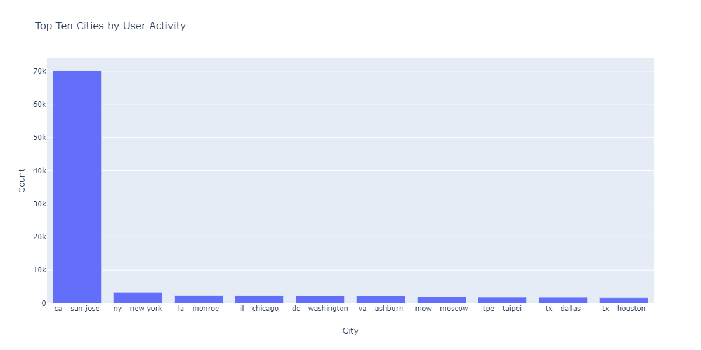

# 使用探索資料分析(EDA)筆記本探索基於Web的預測模型資料

探索性資料分析(EDA)筆記本旨在幫助您發現資料中的模式、檢查資料健全性並為預測模型匯總相關資料。

以EDA筆記本為例，結合基於Web的資料，對EDA筆記本實例進行了優化。 第一部分首先使用查詢服務查看趨勢和資料快照。 接下來，在為探索性資料分析制定目標時，在配置檔案和訪問者級別聚合資料。

第二部分首先使用Python庫對聚合資料執行描述性分析。 此筆記本顯示直方圖、散點圖、方框圖和相關矩陣等可視化效果，以獲得可操作的洞察力，用於確定哪些功能最有可能有助於預測目標。

## 快速入門

閱讀本指南前，請閱讀 [[!DNL JupyterLab] 使用手冊](./overview.md) 高級介紹 [!DNL JupyterLab] 以及它在Data Science Workspace中的角色。 此外，如果您使用自己的資料，請查看文檔， [資料存取 [!DNL Jupyterlab] 筆記本](./access-notebook-data.md)。 本指南包含有關筆記本資料限制的重要資訊。

此筆記本使用分析Analysis Workspace中的Adobe Analytics體驗事件資料形式的中值資料集。 要使用EDA筆記本，需要使用以下值定義資料表 `target_table` 和 `target_table_id`。 可以使用任何中間值資料集。

要查找這些值，請執行中概述的步驟 [用python寫入資料集](./access-notebook-data.md#write-python) JupyterLab資料存取指南的一節。 資料集名稱(`target_table`)位於資料集目錄中。 按一下右鍵該資料集以瀏覽或寫入筆記本中的資料後，資料集ID(`target_table_id`)。

## 資料發現

本節包含用於查看趨勢的配置步驟和示例查詢，如「按用戶活動列出的前十個城市」或「前十個查看的產品」。

### 庫的配置

JupyterLab支援多個庫。 可以在代碼單元格中貼上並運行以下代碼，以收集和安裝本示例中使用的所有必需軟體包。 您可以在本示例之外使用其他或替代的包進行自己的資料分析。 對於支援的包的清單，請複製和貼上 `!pip list --format=columns` 的子菜單。

```python
!pip install colorama
import chart_studio.plotly as py
import plotly.graph_objs as go
from plotly.offline import iplot
from scipy import stats
import numpy as np
import warnings
warnings.filterwarnings('ignore')
from scipy.stats import pearsonr
import matplotlib.pyplot as plt
from scipy.stats import pearsonr
import pandas as pd
import math
import re
import seaborn as sns
from datetime import datetime
import colorama
from colorama import Fore, Style
pd.set_option('display.max_columns', None)
pd.set_option('display.max_rows', None)
pd.set_option('display.width', 1000)
pd.set_option('display.expand_frame_repr', False)
pd.set_option('display.max_colwidth', -1)
```

### 連接到Adobe Experience Platform [!DNL Query Service]

[!DNL JupyterLab] 在平台上允許您在 [!DNL Python] 筆記本訪問資料 [查詢服務](https://www.adobe.com/go/query-service-home-en)。 通過 [!DNL Query Service] 由於其運行時間長，對於處理大資料集非常有用。 請注意，使用 [!DNL Query Service] 處理時間限制為10分鐘。

使用前 [!DNL Query Service] 在 [!DNL JupyterLab]，確保您對 [[!DNL Query Service] SQL語法](https://www.adobe.com/go/query-service-sql-syntax-en)。

為了在JupyterLab中利用查詢服務，必須首先在工作的Python筆記本和查詢服務之間建立連接。 這可以通過執行以下單元來實現。

```python
qs_connect()
```

### 定義用於勘探的中值資料集

要開始查詢和探索資料，必須提供中值資料集表。 複製和替換 `table_name` 和 `table_id` 值和您自己的資料表值。

```python
target_table = "table_name"
target_table_id = "table_id"
```

完成後，此單元格應與以下示例類似：

```python
target_table = "cross_industry_demo_midvalues"
target_table_id = "5f7c40ef488de5194ba0157a"
```

### 瀏覽資料集以查找可用日期

使用下面提供的單元格，您可以查看表中涵蓋的日期範圍。 探索天數、第一日期和最後日期的目的是協助選擇日期範圍以進行進一步分析。

```python
%%read_sql -c QS_CONNECTION
SELECT distinct Year(timestamp) as Year, Month(timestamp) as Month, count(distinct DAY(timestamp)) as Count_days, min(DAY(timestamp)) as First_date, max(DAY(timestamp)) as Last_date, count(timestamp) as Count_hits
from {target_table}
group by Month(timestamp), Year(timestamp)
order by Year, Month;
```

運行單元格會生成以下輸出：


### 配置資料集發現的日期

確定資料集發現的可用日期後，需要更新以下參數。 此單元格中配置的日期僅用於查詢形式的資料發現。 這些日期將再次更新到本指南稍後用於探索性資料分析的適當範圍。

```python
target_year = "2020" ## The target year
target_month = "02" ## The target month
target_day = "(01,02,03)" ## The target days
```

### 資料集發現

配置所有參數後，開始 [!DNL Query Service]，並且有一個日期範圍，您已準備好開始讀取資料行。 您應限制讀取的行數。

```python
from platform_sdk.dataset_reader import DatasetReader
from datetime import date
dataset_reader = DatasetReader(PLATFORM_SDK_CLIENT_CONTEXT, dataset_id=target_table_id)
# If you do not see any data or would like to expand the default date range, change the following query
Table = dataset_reader.limit(5).read()
```

要查看資料集中可用的列數，請使用以下單元格：

```python
print("\nNumber of columns:",len(Table.columns))
```

要查看資料集的行，請使用以下單元格。 在本示例中，行數限制為5。

```python
Table.head(5)
```


一旦您瞭解了資料集中包含哪些資料，進一步細分資料集就很有價值。 在此示例中，列出每個列的列名和資料類型，同時使用輸出來檢查資料類型是否正確。

```python
ColumnNames_Types = pd.DataFrame(Table.dtypes)
ColumnNames_Types = ColumnNames_Types.reset_index()
ColumnNames_Types.columns = ["Column_Name", "Data_Type"]
ColumnNames_Types
```


### 資料集趨勢探索

以下部分包含四個用於瀏覽資料趨勢和模式的示例查詢。 下面提供的示例並非詳盡無遺，但包括一些更常見的功能。

**給定日的每小時活動計數**

此查詢分析一天中的操作和按一下次數。 輸出以包含一天中每小時活動計數的度量的表格形式表示。

```sql
%%read_sql query_2_df -c QS_CONNECTION

SELECT Substring(timestamp, 12, 2)                        AS Hour, 
       Count(enduserids._experience.aaid.id) AS Count 
FROM   {target_table}
WHERE  Year(timestamp) = {target_year} 
       AND Month(timestamp) = {target_month}  
       AND Day(timestamp) in {target_day}
GROUP  BY Hour
ORDER  BY Hour;
```


在確認查詢工作後，資料可以以單變數圖直方圖的形式呈現，以便視覺清晰。

```python
trace = go.Bar(
    x = query_2_df['Hour'],
    y = query_2_df['Count'],
    name = "Activity Count"
)

layout = go.Layout(
    title = 'Activity Count by Hour of Day',
    width = 1200,
    height = 600,
    xaxis = dict(title = 'Hour of Day'),
    yaxis = dict(title = 'Count')
)

fig = go.Figure(data = [trace], layout = layout)
iplot(fig)
```


**指定日期前10個查看頁面**

此查詢將分析在給定日期內查看最多的頁面。 輸出以包含頁名和頁視圖計數度量的表的形式表示。

```sql
%%read_sql query_4_df -c QS_CONNECTION

SELECT web.webpagedetails.name                 AS Page_Name, 
       Sum(web.webpagedetails.pageviews.value) AS Page_Views 
FROM   {target_table}
WHERE  Year(timestamp) = {target_year}
       AND Month(timestamp) = {target_month}
       AND Day(timestamp) in {target_day}
GROUP  BY web.webpagedetails.name 
ORDER  BY page_views DESC 
LIMIT  10;
```

在確認查詢工作後，資料可以以單變數圖直方圖的形式呈現，以便視覺清晰。

```python
trace = go.Bar(
    x = query_4_df['Page_Name'],
    y = query_4_df['Page_Views'],
    name = "Page Views"
)

layout = go.Layout(
    title = 'Top Ten Viewed Pages For a Given Day',
    width = 1000,
    height = 600,
    xaxis = dict(title = 'Page_Name'),
    yaxis = dict(title = 'Page_Views')
)

fig = go.Figure(data = [trace], layout = layout)
iplot(fig)
```


**按用戶活動分組的前十個城市**

此查詢將分析資料的來源城市。

```sql
%%read_sql query_6_df -c QS_CONNECTION

SELECT concat(placeContext.geo.stateProvince, ' - ', placeContext.geo.city) AS state_city, 
       Count(timestamp)                                                     AS Count
FROM   {target_table}
WHERE  Year(timestamp) = {target_year}
       AND Month(timestamp) = {target_month}
       AND Day(timestamp) in {target_day}
GROUP  BY state_city
ORDER  BY Count DESC
LIMIT  10;
```

在確認查詢工作後，資料可以以單變數圖直方圖的形式呈現，以便視覺清晰。

```python
trace = go.Bar(
    x = query_6_df['state_city'],
    y = query_6_df['Count'],
    name = "Activity by City"
)

layout = go.Layout(
    title = 'Top Ten Cities by User Activity',
    width = 1200,
    height = 600,
    xaxis = dict(title = 'City'),
    yaxis = dict(title = 'Count')
)

fig = go.Figure(data = [trace], layout = layout)
iplot(fig)
```



**前10個查看的產品**

此查詢提供前十個查看的產品的清單。 在下面的示例中， `Explode()` 函式用於返回 `productlistitems` 對象到其自己的行。 這允許您執行嵌套查詢以聚合不同SKU的產品視圖。

```sql
%%read_sql query_7_df -c QS_CONNECTION

SELECT Product_List_Items.sku AS Product_SKU,
       Sum(Product_Views) AS Total_Product_Views
FROM  (SELECT Explode(productlistitems) AS Product_List_Items, 
              commerce.productviews.value   AS Product_Views 
       FROM   {target_table}
       WHERE  Year(timestamp) = {target_year}
              AND Month(timestamp) = {target_month}
              AND Day(timestamp) in {target_day}
              AND commerce.productviews.value IS NOT NULL) 
GROUP BY Product_SKU 
ORDER BY Total_Product_Views DESC
LIMIT  10;
```

在確認查詢工作後，資料可以以單變數圖直方圖的形式呈現，以便視覺清晰。

```python
trace = go.Bar(
    x = "SKU-" + query_7_df['Product_SKU'],
    y = query_7_df['Total_Product_Views'],
    name = "Product View"
)

layout = go.Layout(
    title = 'Top Ten Viewed Products',
    width = 1200,
    height = 600,
    xaxis = dict(title = 'SKU'),
    yaxis = dict(title = 'Product View Count')
)

fig = go.Figure(data = [trace], layout = layout)
iplot(fig)
```


在探索了資料的趨勢和模式之後，您應該對要構建哪些功能以預測目標有一個很好的認識。 通過瀏覽表可以快速突出顯示每個資料屬性的形式、明顯的錯誤表示和值中的大量異常值，並開始建議候選關係，以便在屬性之間進行探索。

## 探索性資料分析

探索性資料分析用於改進您對資料的理解，並為可用作建模基礎的緊迫問題建立直覺。

完成資料發現步驟後，您將在事件級資料上探索事件、城市或用戶ID級別上的一些聚合，以查看一天的趨勢。 雖然這些資料很重要，但並沒有給出完整的圖景。 你仍然不明白是什麼驅動著你的網站進行購買。

要瞭解這一點，您需要在配置檔案/訪問者層聚合資料，定義採購目標，並應用相關性、框圖和散點圖等統計概念。 這些方法用於在您定義的預測窗口中比較採購員與非採購員的活動模式。

本節將建立和探索以下功能：

- `COUNT_UNIQUE_PRODUCTS_PURCHASED`:購買的唯一產品數。
- `COUNT_CHECK_OUTS`:簽出數。
- `COUNT_PURCHASES`:購買數。
- `COUNT_INSTANCE_PRODUCTADDS`:產品添加實例的數量。
- `NUMBER_VISITS`:訪問次數。
- `COUNT_PAID_SEARCHES`:付費搜索的數量。
- `DAYS_SINCE_VISIT`:上次訪問後的天數。
- `TOTAL_ORDER_REVENUE`:訂單總收入。
- `DAYS_SINCE_PURCHASE`:自上次採購以來的天數。
- `AVG_GAP_BETWEEN_ORDERS_DAYS`:採購之間的平均天數差距。
- `STATE_CITY`:包含州和市。

在繼續資料聚合之前，需要為探索資料分析中使用的預測變數定義參數。 換句話說，你想從資料科學模型中得到什麼？ 公共參數包括目標、預測週期和分析週期。

如果使用EDA筆記本，則在繼續操作之前必須替換下面的值。

```python
goal = "commerce.`order`.purchaseID" #### prediction variable
goal_column_type = "numerical" #### choose either "categorical" or "numerical"
prediction_window_day_start = "2020-01-01" #### YYYY-MM-DD
prediction_window_day_end = "2020-01-31" #### YYYY-MM-DD
analysis_period_day_start = "2020-02-01" #### YYYY-MM-DD
analysis_period_day_end = "2020-02-28" #### YYYY-MM-DD

### If the goal is a categorical goal then select threshold for the defining category and creating bins. 0 is no order placed, and 1 is at least one order placed:
threshold = 1
```

### 用於功能和目標建立的資料聚合

要開始探索性分析，您需要在配置檔案級別建立一個目標，然後聚合您的資料集。 在本示例中，提供了兩個查詢。 第一個查詢包含目標的建立。 需要更新第二查詢以包括除第一查詢中的變數之外的任何變數。 您可能要更新 `limit` 的子菜單。 執行以下查詢後，聚合資料現在可用於勘探。

```sql
%%read_sql target_df -d -c QS_CONNECTION

SELECT DISTINCT endUserIDs._experience.aaid.id                  AS ID,
       Count({goal})                                            AS TARGET
FROM   {target_table}
WHERE DATE(TIMESTAMP) BETWEEN '{prediction_window_day_start}' AND '{prediction_window_day_end}'
GROUP BY endUserIDs._experience.aaid.id;
```

```sql
%%read_sql agg_data -d -c QS_CONNECTION

SELECT z.*, z1.state_city as STATE_CITY
from
((SELECT y.*,a2.AVG_GAP_BETWEEN_ORDERS_DAYS as AVG_GAP_BETWEEN_ORDERS_DAYS
from
(select a1.*, f.DAYS_SINCE_PURCHASE as DAYS_SINCE_PURCHASE
from
(SELECT DISTINCT a.ID  AS ID,
COUNT(DISTINCT Product_Items.SKU) as COUNT_UNIQUE_PRODUCTS_PURCHASED,
COUNT(a.check_out) as COUNT_CHECK_OUTS,
COUNT(a.purchases) as COUNT_PURCHASES, 
COUNT(a.product_list_adds) as COUNT_INSTANCE_PRODUCTADDS,
sum(CASE WHEN a.search_paid = 'TRUE' THEN 1 ELSE 0 END) as COUNT_PAID_SEARCHES,
DATEDIFF('{analysis_period_day_end}', MAX(a.date_a)) as DAYS_SINCE_VISIT,
ROUND(SUM(Product_Items.priceTotal * Product_Items.quantity), 2) AS TOTAL_ORDER_REVENUE
from 
(SELECT endUserIDs._experience.aaid.id as ID,
commerce.`checkouts`.value as check_out,
commerce.`order`.purchaseID as purchases, 
commerce.`productListAdds`.value as product_list_adds,
search.isPaid as search_paid,
DATE(TIMESTAMP) as date_a,
Explode(productlistitems) AS Product_Items
from {target_table}
Where DATE(TIMESTAMP) BETWEEN '{analysis_period_day_start}' AND '{analysis_period_day_end}') as a
group by a.ID) as a1
left join 
(SELECT DISTINCT endUserIDs._experience.aaid.id as ID,
DATEDIFF('{analysis_period_day_end}', max(DATE(TIMESTAMP))) as DAYS_SINCE_PURCHASE
from {target_table}
where DATE(TIMESTAMP) BETWEEN '{analysis_period_day_start}' AND '{analysis_period_day_end}'
and commerce.`order`.purchaseid is not null
GROUP BY endUserIDs._experience.aaid.id) as f
on f.ID = a1.ID
where a1.COUNT_PURCHASES>0) as y
left join
(select ab.ID, avg(DATEDIFF(ab.ORDER_DATES, ab.PriorDate)) as AVG_GAP_BETWEEN_ORDERS_DAYS
from
(SELECT distinct endUserIDs._experience.aaid.id as ID, TO_DATE(DATE(TIMESTAMP)) as ORDER_DATES, 
TO_DATE(LAG(DATE(TIMESTAMP),1) OVER (PARTITION BY endUserIDs._experience.aaid.id ORDER BY DATE(TIMESTAMP))) as PriorDate
FROM {target_table}
where DATE(TIMESTAMP) BETWEEN '{analysis_period_day_start}' AND '{analysis_period_day_end}'
AND commerce.`order`.purchaseid is not null) AS ab
where ab.PriorDate is not null
GROUP BY ab.ID) as a2
on a2.ID = y.ID) z    
left join
(select t.ID, t.state_city from
(
SELECT DISTINCT endUserIDs._experience.aaid.id as ID,
concat(placeContext.geo.stateProvince, ' - ', placeContext.geo.city) as state_city, 
ROW_NUMBER() OVER(PARTITION BY endUserIDs._experience.aaid.id ORDER BY DATE(TIMESTAMP) DESC) AS ROWNUMBER
FROM   {target_table}
WHERE  DATE(TIMESTAMP) BETWEEN '{analysis_period_day_start}' AND '{analysis_period_day_end}') as t
where t.ROWNUMBER = 1) z1
on z.ID = z1.ID)
limit 500000;
```

### 將聚合資料集中的特徵與目標合併

以下單元格用於將上一個示例中概述的聚合資料集中的特徵與預測目標合併。

```python
Data = pd.merge(agg_data,target_df, on='ID',how='left')
Data['TARGET'].fillna(0, inplace=True)
```

接下來的三個示例單元格用於確保合併成功。

`Data.shape` 返回列數，後跟行數，例如：(1913、12)。

```python
Data.shape
```

`Data.head(5)` 返回包含5行資料的表。 返回的表包含映射到配置檔案ID的聚合資料的所有12列。

```python
Data.head(5)
```


此單元格打印唯一配置檔案的數量。

```python
print("Count of unique profiles:", (len(Data)))
```

### 檢測缺失值和異常值

完成資料聚合併將其與目標合併後，您需要查看有時稱為資料運行狀況檢查的資料。

此過程涉及識別缺失值和異常值。 在發現問題時，下一個任務是提出具體的處理策略。

>[!NOTE]
>
>在此步驟中，您可能會發現值中的損壞，這些值可能表示資料記錄過程中出現故障。

```python
Missing = pd.DataFrame(round(Data.isnull().sum()*100/len(Data),2))
Missing.columns =['Percentage_missing_values'] 
Missing['Features'] = Missing.index
```

以下單元格用於可視化缺少的值。

```python
trace = go.Bar(
    x = Missing['Features'],
    y = Missing['Percentage_missing_values'],
    name = "Percentage_missing_values")

layout = go.Layout(
    title = 'Missing values',
    width = 1200,
    height = 600,
    xaxis = dict(title = 'Features'),
    yaxis = dict(title = 'Percentage of missing values')
)

fig = go.Figure(data = [trace], layout = layout)
iplot(fig)
```


在檢測到缺失值後，識別離群值是至關重要的。 平均值、標準差和相關性等參數統計對離群點非常敏感。 此外，一般統計過程的假設也基於這些統計。 這意味著異常值真的會弄亂分析。

為了識別異常值，本示例使用四分之一範圍。 四分位區間(IQR)是第一和第三四分位（第25和第75百分位）之間的範圍。 此示例收集所有資料點，這些資料點的IQR低於第25百分點的1.5倍，或IQR高於第75百分點的1.5倍。 位於以上任一單元格下的值定義為以下單元格中的異常值。

>[!TIP]
>
>糾正異常值需要你瞭解你所從事的業務和行業。 有時，你不能僅僅因為觀察是個異常點就放棄它。 異常值可能是合法的觀察結果，而且通常是最有趣的觀察結果。 要瞭解有關刪除異常值的更多資訊，請訪問 [可選資料清除步驟](#optional-data-clean)。

```python
TARGET = Data.TARGET

Data_numerical = Data.select_dtypes(include=['float64', 'int64'])
Data_numerical.drop(['TARGET'],axis = 1,inplace = True)
Data_numerical1 = Data_numerical

for i in range(0,len(Data_numerical1.columns)):
    Q1 = Data_numerical1.iloc[:,i].quantile(0.25)
    Q3 = Data_numerical1.iloc[:,i].quantile(0.75)
    IQR = Q3 - Q1
    Data_numerical1.iloc[:,i] = np.where(Data_numerical1.iloc[:,i]<(Q1 - 1.5 * IQR),np.nan, np.where(Data_numerical1.iloc[:,i]>(Q3 + 1.5 * IQR),
                                                                                                    np.nan,Data_numerical1.iloc[:,i]))
    
Outlier = pd.DataFrame(round(Data_numerical1.isnull().sum()*100/len(Data),2))
Outlier.columns =['Percentage_outliers'] 
Outlier['Features'] = Outlier.index   
```

一如既往地，將結果可視化非常重要。

```python
trace = go.Bar(
    x = Outlier['Features'],
    y = Outlier['Percentage_outliers'],
    name = "Percentage_outlier")

layout = go.Layout(
    title = 'Outliers',
    width = 1200,
    height = 600,
    xaxis = dict(title = 'Features'),
    yaxis = dict(title = 'Percentage of outliers')
)

fig = go.Figure(data = [trace], layout = layout)
iplot(fig)
```


### 單變數分析

一旦您的資料因丟失值和異常值而得到更正，您就可以開始分析。 分析有三種類型：單變數、雙變數和多元分析。 單變數分析使用單變數關係獲取資料、匯總資料並查找資料中的模式。 雙變數分析一次看多個變數，多元分析一次看三個或更多變數。

下面的示例生成一個表以可視化特徵的分佈。

```python
Data_numerical = Data.select_dtypes(include=['float64', 'int64'])
distribution = pd.DataFrame([Data_numerical.count(),Data_numerical.mean(),Data_numerical.quantile(0), Data_numerical.quantile(0.01),
                             Data_numerical.quantile(0.05),Data_numerical.quantile(0.25), Data_numerical.quantile(0.5),
                        Data_numerical.quantile(0.75),  Data_numerical.quantile(0.95),Data_numerical.quantile(0.99), Data_numerical.max()])
distribution = distribution.T
distribution.columns = ['Count', 'Mean', 'Min', '1st_perc','5th_perc','25th_perc', '50th_perc','75th_perc','95th_perc','99th_perc','Max']
distribution
```


一旦分佈了這些功能，就可以使用陣列建立可視化的資料圖表。 以下單元格用於使用數字資料可視化上表。

```python
A = sns.palplot(sns.color_palette("Blues"))
```

```python
for column in Data_numerical.columns[0:]:
    plt.figure(figsize=(5, 4))
    plt.ticklabel_format(style='plain', axis='y')
    sns.distplot(Data_numerical[column], color = A, kde=False, bins=6, hist_kws={'alpha': 0.4});
```


### 分類資料

分組分類資料用於理解聚合資料的每一列中包含的值及其分佈。 此示例使用前10個類別來幫助繪製分佈。 必須指出，列中可能包含數千個唯一值。 您不希望渲染混亂的圖案，使其變得模糊。 考慮到您的業務目標，分組資料將產生更有意義的結果。

```python
Data_categorical = Data.select_dtypes(include='object')
Data_categorical.drop(['ID'], axis = 1, inplace = True, errors = 'ignore')
```

```python
for column in Data_categorical.columns[0:]:
    if (len(Data_categorical[column].value_counts())>10):
        plt.figure(figsize=(12, 8))
        sns.countplot(x=column, data = Data_categorical, order = Data_categorical[column].value_counts().iloc[:10].index, palette="Set2");
    else:
        plt.figure(figsize=(12, 8))
        sns.countplot(x=column, data = Data_categorical, palette="Set2");
```


### 刪除僅具有單個不同值的列

只具有值的列不會向分析添加任何資訊，並且可以刪除。

```python
for col in Data.columns:
    if len(Data[col].unique()) == 1:
        if col == 'TARGET':
            print(Fore.RED + '\033[1m' + 'WARNING: TARGET HAS A SINGLE UNIQUE VALUE, ANY BIVARIATE ANALYSIS (NEXT STEP IN THIS NOTEBOOK) OR PREDICTION WILL BE MEANINGLESS' + Fore.RESET + '\x1b[21m')
        elif col == 'ID':
            print(Fore.RED + '\033[1m' + 'WARNING: THERE IS ONLY ONE PROFILE IN THE DATA, ANY BIVARIATE ANALYSIS (NEXT STEP IN THIS NOTEBOOK) OR PREDICTION WILL BE MEANINGLESS' + Fore.RESET + '\x1b[21m')
        else:
            print('Dropped column:',col)
            Data.drop(col,inplace=True,axis=1)
```

刪除單值列後，使用 `Data.columns` 的子菜單。

### 對於缺少的值正確

以下部分包含一些用於更正丟失值的示例方法。 儘管在上述資料中只有一個列缺少值，但所有資料類型的值下面的示例單元格都正確。 這些類別包括：

- 數字資料類型：輸入0或最大值（如果適用）
- 類別資料類型：輸入模態值

```python
#### Select only numerical data
Data_numerical = Data.select_dtypes(include=['float64', 'int64'])

#### For columns that contain days we impute max days of history for null values, for rest all we impute 0

# Imputing days with max days of history
Days_cols = [col for col in Data_numerical.columns if 'DAYS_' in col]
d1 = datetime.strptime(analysis_period_day_start, "%Y-%m-%d")
d2 = datetime.strptime(analysis_period_day_end, "%Y-%m-%d")
A = abs((d2 - d1).days)

for column in Days_cols:
    Data[column].fillna(A, inplace=True)

# Imputing 0
Data_numerical = Data.select_dtypes(include=['float64', 'int64'])
Missing_numerical = Data_numerical.columns[Data_numerical.isnull().any()].tolist()

for column in Missing_numerical:
    Data[column].fillna(0, inplace=True)
```

```python
#### Correct for missing values in categorical columns (Replace with mode)
Data_categorical = Data.select_dtypes(include='object')
Missing_cat = Data_categorical.columns[Data_categorical.isnull().any()].tolist() 
for column in Missing_cat:
    Data[column].fillna(Data[column].mode()[0], inplace=True)
```

一旦完成，清理資料就可以用於二元分析。

### 二元分析

二元分析用於幫助理解兩組值之間的關係，如特徵和目標變數。 由於不同的圖符合分類和數字資料類型，因此應針對每種資料類型分別進行此分析。 建議使用以下圖表進行二元分析：

- **相關**:相關係數是兩個特徵之間關係強度的度量。 相關值介於–1和1之間，其中：1表示強正關係，-1表示強負關係，而0表示根本沒有關係。
- **配對圖**:配對圖是顯示每個變數之間關係的簡單方法。 它產生資料中每個變數之間關係的矩陣。
- **熱圖**:Heatmap是資料集中所有變數的相關係數。
- **框圖**:方框圖是根據五個數字摘要(最小、第一個四分點(Q1)、中值、第三個四分點(Q3)和最大值)來顯示資料分佈的標準化方法。
- **計數圖**:計數圖類似於直方圖或條形圖來表示某些分類特徵。 它顯示基於特定類型的項目的出現次數。

為了瞭解「goal」變數與預測器/特徵之間的關係，使用基於資料類型的圖表。 對於數值特徵，如果「goal」變數是類別的，則應使用框圖；如果「goal」變數是數值的，則應使用配對圖和熱圖。

對於分類特徵，如果「goal」變數是分類，則應使用計數圖；如果「goal」變數是數字，則應使用框圖。 使用這些方法有助於理解關係。 這些關係可以是特徵或預測器和目標的形式。

**數值預測器**

```python
if len(Data) == 1:
    print(Fore.RED + '\033[1m' + 'THERE IS ONLY ONE PROFILE IN THE DATA, BIVARIATE ANALYSIS IS NOT APPLICABLE, PLEASE INCLUDE AT LEAST ONE MORE PROFILE TO DO BIVARIATE ANALYSIS')
elif len(Data['TARGET'].unique()) == 1:
    print(Fore.RED + '\033[1m' + 'TARGET HAS A SINGLE UNIQUE VALUE, BIVARIATE ANALYSIS IS NOT APPLICABLE, PLEASE INCLUDE PROFILES WITH ATLEAST ONE DIFFERENT VALUE OF TARGET TO DO BIVARIATE ANALYSIS')
else:
    if (goal_column_type == "categorical"):
        TARGET_categorical = pd.DataFrame(np.where(TARGET>=threshold,"1","0"))
        TARGET_categorical.rename(columns={TARGET_categorical.columns[0]: "TARGET_categorical" }, inplace = True)
        Data_numerical = Data.select_dtypes(include=['float64', 'int64'])
        Data_numerical.drop(['TARGET'],inplace=True,axis=1)
        Data_numerical = pd.concat([Data_numerical, TARGET_categorical.astype(int)], axis = 1)
        ncols_for_charts = len(Data_numerical.columns)-1
        nrows_for_charts = math.ceil(ncols_for_charts/4)
        fig, axes = plt.subplots(nrows=nrows_for_charts, ncols=4, figsize=(18, 15))
        for idx, feat in enumerate(Data_numerical.columns[:-1]):
            ax = axes[int(idx // 4), idx % 4]
            sns.boxplot(x='TARGET_categorical', y=feat, data=Data_numerical, ax=ax)
            ax.set_xlabel('')
            ax.set_ylabel(feat)
            fig.tight_layout();
    else:
        Data_numerical = Data.select_dtypes(include=['float64', 'int64'])
        TARGET = pd.DataFrame(Data_numerical.TARGET)
        Data_numerical = Data.select_dtypes(include=['float64', 'int64'])
        Data_numerical.drop(['TARGET'],inplace=True,axis=1)
        Data_numerical = pd.concat([Data_numerical, TARGET.astype(int)], axis = 1)
        for i in Data_numerical.columns[:-1]:
            sns.pairplot(x_vars=i, y_vars=['TARGET'], data=Data_numerical, height = 4)
        f, ax = plt.subplots(figsize = (10,8))
        corr = Data_numerical.corr()
```

運行單元格會生成以下輸出：


**分類預測符**

以下示例用於繪製和查看每個類別變數的前10個類別的頻率圖。

```python
if len(Data) == 1:
    print(Fore.RED + '\033[1m' + 'THERE IS ONLY ONE PROFILE IN THE DATA, BIVARIATE ANALYSIS IS NOT APPLICABLE, PLEASE INCLUDE AT LEAST ONE MORE PROFILE TO DO BIVARIATE ANALYSIS')
elif len(Data['TARGET'].unique()) == 1:
    print(Fore.RED + '\033[1m' + 'TARGET HAS A SINGLE UNIQUE VALUE, BIVARIATE ANALYSIS IS NOT APPLICABLE, PLEASE INCLUDE PROFILES WITH ATLEAST ONE DIFFERENT VALUE OF TARGET TO DO BIVARIATE ANALYSIS')
else:
    if (goal_column_type == "categorical"):
        TARGET_categorical = pd.DataFrame(np.where(TARGET>=threshold,"1","0"))
        TARGET_categorical.rename(columns={TARGET_categorical.columns[0]: "TARGET_categorical" }, inplace = True)
        Data_categorical = Data.select_dtypes(include='object')
        Data_categorical.drop(["ID"], axis =1, inplace = True)
        Cat_columns = Data_categorical
        Data_categorical = pd.concat([TARGET_categorical,Data_categorical], axis =1)
        for column in Cat_columns.columns:
            A = Data_categorical[column].value_counts().iloc[:10].index
            Data_categorical1 = Data_categorical[Data_categorical[column].isin(A)]
            plt.figure(figsize=(12, 8))
            sns.countplot(x="TARGET_categorical",hue=column, data = Data_categorical1, palette = 'Blues')
            plt.xlabel("GOAL")
            plt.ylabel("COUNT")
            plt.show();
    else:
        Data_categorical = Data.select_dtypes(include='object')
        Data_categorical.drop(["ID"], axis =1, inplace = True)
        Target = Data.TARGET
        Data_categorical = pd.concat([Data_categorical,Target], axis =1)
        for column in Data_categorical.columns[:-1]:
            A = Data_categorical[column].value_counts().iloc[:10].index
            Data_categorical1 = Data_categorical[Data_categorical[column].isin(A)]
            sns.catplot(x=column, y="TARGET", kind = "boxen", data =Data_categorical1, height=5, aspect=13/5);
```

運行單元格會生成以下輸出：


### 重要的數值特徵

使用相關分析，可建立前十個重要數值特徵的清單。 這些特徵都可用於預測「目標」特徵。 此清單可用作開始構建模型時的特徵清單。

```python
if len(Data) == 1:
    print(Fore.RED + '\033[1m' + 'THERE IS ONLY ONE PROFILE IN THE DATA, BIVARIATE ANALYSIS IS NOT APPLICABLE, PLEASE INCLUDE AT LEAST ONE MORE PROFILE TO FIND IMPORTANT VARIABLES')
elif len(Data['TARGET'].unique()) == 1:
    print(Fore.RED + '\033[1m' + 'TARGET HAS A SINGLE UNIQUE VALUE, BIVARIATE ANALYSIS IS NOT APPLICABLE, PLEASE INCLUDE PROFILES WITH ATLEAST ONE DIFFERENT VALUE OF TARGET TO FIND IMPORTANT VARIABLES')
else:
    Data_numerical = Data.select_dtypes(include=['float64', 'int64'])
    Correlation = pd.DataFrame(Data_numerical.drop("TARGET", axis=1).apply(lambda x: x.corr(Data_numerical.TARGET)))
    Correlation['Corr_abs'] = abs(Correlation)
    Correlation = Correlation.sort_values(by = 'Corr_abs', ascending = False)
    Imp_features = pd.DataFrame(Correlation.index[0:10])
    Imp_features.rename(columns={0:'Important Feature'}, inplace=True)
    print(Imp_features)
```


### 示例透視

在您分析資料的過程中，發現洞察力並不罕見。 下面的示例是映射目標事件的頻率和貨幣值的洞察。

```python
# Proxy for monetary value is TOTAL_ORDER_REVENUE and proxy for frequency is NUMBER_VISITS
if len(Data) == 1:
    print(Fore.RED + '\033[1m' + 'THERE IS ONLY ONE PROFILE IN THE DATA, INSIGHTS ANALYSIS IS NOT APPLICABLE, PLEASE INCLUDE AT LEAST ONE MORE PROFILE TO FIND IMPORTANT VARIABLES')
elif len(Data['TARGET'].unique()) == 1:
    print(Fore.RED + '\033[1m' + 'TARGET HAS A SINGLE UNIQUE VALUE, INSIGHTS ANALYSIS IS NOT APPLICABLE, PLEASE INCLUDE PROFILES WITH ATLEAST ONE DIFFERENT VALUE OF TARGET TO FIND IMPORTANT VARIABLES')
else:
    sns.lmplot("DAYS_SINCE_VISIT", "TOTAL_ORDER_REVENUE", Data, hue="TARGET", fit_reg=False);
```


## 可選的資料清理步驟 {#optional-data-clean}

糾正異常值需要你瞭解你所從事的業務和行業。 有時，你不能僅僅因為觀察是個異常點就放棄它。 異常值可能是合法的觀察結果，而且通常是最有趣的觀察結果。

有關異常值以及是否刪除它們的詳細資訊，請從 [分析因子](https://www.theanalysisfactor.com/outliers-to-drop-or-not-to-drop/)。

下面的示例單元格大寫和底層資料點是異常值，使用 [1/4範圍](https://www.thoughtco.com/what-is-the-interquartile-range-rule-3126244)。

```python
TARGET = Data.TARGET

Data_numerical = Data.select_dtypes(include=['float64', 'int64'])
Data_numerical.drop(['TARGET'],axis = 1,inplace = True)

for i in range(0,len(Data_numerical.columns)):
    Q1 = Data_numerical.iloc[:,i].quantile(0.25)
    Q3 = Data_numerical.iloc[:,i].quantile(0.75)
    IQR = Q3 - Q1
    Data_numerical.iloc[:,i] = np.where(Data_numerical.iloc[:,i]<(Q1 - 1.5 * IQR), (Q1 - 1.5 * IQR), np.where(Data_numerical.iloc[:,i]>(Q3 + 1.5 * IQR),
                                                                                                     (Q3 + 1.5 * IQR),Data_numerical.iloc[:,i]))
Data_categorical = Data.select_dtypes(include='object')
Data = pd.concat([Data_categorical, Data_numerical, TARGET], axis = 1)
```

## 後續步驟

完成探索性資料分析後，您已準備好開始建立模型。 或者，可以使用導出的資料和洞察力建立具有工具(如Power BI)的儀表板。

Adobe Experience Platform將模型建立過程分為兩個不同的階段，即配方（模型實例）和模型。 要開始處方建立流程，請訪問文檔 [在JupyerLab筆記本中建立配方](./create-a-model.md)。 此文檔包含用於建立、培訓和評分的資訊和示例，其中包含處方 [!DNL JupyterLab] 筆記本。
