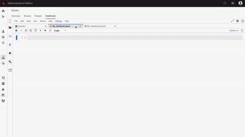

# [!DNL JupyterLab] UI 概觀

>[!NOTE]
>
>Data Science Workspace已無法購買。
>
>本檔案旨在供先前有權使用Data Science Workspace的現有客戶使用。

[!DNL JupyterLab]是[Project Jupyter](https://jupyter.org/)的網頁式使用者介面，且已緊密整合至Adobe Experience Platform。 它提供互動式開發環境，讓資料科學家能夠使用Jupyter Notebooks、程式碼和資料。

本檔案提供[!DNL JupyterLab]及其功能的概觀，以及執行一般動作的指示。

## [!DNL Experience Platform]上的[!DNL JupyterLab]

Experience Platform的JupyterLab整合伴隨著架構變更、設計考量、自訂的筆記型電腦擴充功能、預先安裝的程式庫，以及Adobe主題的介面。

下列清單概述Experience Platform上JupyterLab的專屬部分功能：

| 功能 | 說明 |
| --- | --- |
| **核心** | 核心提供筆記型電腦和其他[!DNL JupyterLab]前端以不同程式語言執行和內部檢查程式碼的能力。 [!DNL Experience Platform]提供額外的核心以支援[!DNL Python]、R、PySpark和[!DNL Spark]中的開發。 如需詳細資訊，請參閱[核心](#kernels)區段。 |
| **資料存取** | 直接從[!DNL JupyterLab]存取現有的資料集，並完全支援讀取和寫入功能。 |
| **[!DNL Experience Platform]服務整合** | 內建整合可讓您直接從[!DNL JupyterLab]內使用其他[!DNL Experience Platform]服務。 在[與其他Experience Platform服務](#service-integration)的整合的區段中，提供支援整合的完整清單。 |
| **驗證** | 除了<a href="https://jupyter-notebook.readthedocs.io/en/stable/security.html" target="_blank">JupyterLab的內建安全性模型</a>之外，您應用程式與Experience Platform之間的所有互動(包括Experience Platform服務對服務通訊)都會透過<a href="https://www.adobe.io/authentication/auth-methods.html" target="_blank">[!DNL Adobe Identity Management System] (IMS)</a>加密及驗證。 |
| **開發程式庫** | 在[!DNL Experience Platform]中，[!DNL JupyterLab]提供[!DNL Python]、R和PySpark的預先安裝程式庫。 如需支援的資料庫完整清單，請參閱[附錄](#supported-libraries)。 |
| **程式庫控制器** | 當預先安裝的程式庫無法滿足您的需求時，可以為Python和R安裝其他程式庫，並暫時儲存在隔離的容器中，以保持[!DNL Experience Platform]的完整性並保持您的資料安全。 如需詳細資訊，請參閱[核心](#kernels)區段。 |

>[!NOTE]
>
>其他程式庫僅適用於已安裝這些程式庫的工作階段。 啟動新工作階段時，您必須重新安裝任何其他所需的程式庫。

## 與其他[!DNL Experience Platform]服務整合 {#service-integration}

標準化和互通性是[!DNL Experience Platform]背後的重要概念。 將[!DNL Experience Platform]上的[!DNL JupyterLab]整合為內嵌IDE，可讓您與其他[!DNL Experience Platform]服務互動，讓您充分利用[!DNL Experience Platform]的潛力。 下列[!DNL Experience Platform]服務可在[!DNL JupyterLab]中使用：

* **[!DNL Catalog Service]：**&#x200B;存取及探索具有讀寫功能的資料集。
* **[!DNL Query Service]：**&#x200B;使用SQL存取及探索資料集，在處理大量資料時可提供較低的資料存取間接費用。
* **[!DNL Sensei ML Framework]：**&#x200B;模型開發，能夠訓練及評分資料，以及按一下即可建立配方。
* **[!DNL Experience Data Model (XDM)]：**&#x200B;標準化和互用性是Adobe Experience Platform背後的重要概念。 [體驗資料模型(XDM)](https://www.adobe.com/go/xdm-home-en)由Adobe驅動，致力於標準化客戶體驗資料並定義用於客戶體驗管理的結構描述。

>[!NOTE]
>
>[!DNL JupyterLab]上的某些[!DNL Experience Platform]服務整合僅限特定核心。 如需詳細資訊，請參閱[核心](#kernels)的章節。

## 主要功能與常見操作

有關[!DNL JupyterLab]主要功能的資訊，以及執行一般作業的指示在以下各節中提供：

* [存取JupyterLab](#access-jupyterlab)
* [JupyterLab介面](#jupyterlab-interface)
* [為儲存格編碼](#code-cells)
* [核心](#kernels)
* [核心階段作業](#kernel-sessions)
* [啟動器](#launcher)

### 存取[!DNL JupyterLab] {#access-jupyterlab}

在[Adobe Experience Platform](https://platform.adobe.com)中，從左側導覽欄選取&#x200B;**[!UICONTROL 筆記本]**。 留出時間讓[!DNL JupyterLab]完全初始化。

### [!DNL JupyterLab]介面 {#jupyterlab-interface}

[!DNL JupyterLab]介麵包含功能表列、可摺疊的左側邊欄，以及包含檔案和活動索引標籤的主要工作區。

**功能表列**

介面頂端的功能表列有頂層功能表，這些功能表會以鍵盤快速鍵顯示[!DNL JupyterLab]中可用的動作：

* **檔案：**&#x200B;與檔案和目錄相關的動作
* **編輯：**&#x200B;與編輯檔案和其他活動相關的動作
* **檢視：**&#x200B;變更[!DNL JupyterLab]外觀的動作
* **執行：**&#x200B;在不同活動（例如筆記本和程式碼主控台）中執行程式碼的動作
* **核心：**&#x200B;管理核心的動作
* **標籤：**&#x200B;開啟的檔案和活動清單
* **設定：**&#x200B;一般設定和進階設定編輯器
* **說明：** [!DNL JupyterLab]與核心說明連結的清單

**左側欄**

左側邊欄包含可點按的標籤，可讓您存取以下功能：

* **檔案瀏覽器：**&#x200B;已儲存的筆記本檔案和目錄清單
* **資料總管：**&#x200B;瀏覽、存取及探索資料集和結構描述
* **正在執行核心與終端機：**&#x200B;具有終止功能的作用中核心與終端機工作階段清單
* **命令：**&#x200B;有用的命令清單
* **儲存格檢視窗：**&#x200B;儲存格編輯器，可讓您存取用來設定筆記本以供簡報使用的工具和中繼資料
* **標籤：**&#x200B;開啟的標籤清單

選取標籤以公開其功能，或在展開的標籤上選取以摺疊左側邊欄，如下所示：

**主要工作區**

[!DNL JupyterLab]中的主要工作區域可讓您將檔案和其他活動排列成可調整大小或可再分割的標籤面板。 將標籤拖曳至標籤面板中央以移轉標籤。 將標籤拖曳至面板的左側、右側、頂端或底部來分割面板：

### [!DNL Python]/R中的GPU和記憶體伺服器組態

在[!DNL JupyterLab]中，選取右上角的齒輪圖示以開啟&#x200B;*Notebook伺服器組態*。 您可以開啟GPU，並使用滑桿分配所需的記憶體容量。 您可以配置的記憶體數量取決於貴組織已布建的記憶體數量。 選取&#x200B;**[!UICONTROL 更新設定]**&#x200B;以儲存。

>[!NOTE]
>
>每個組織僅會布建一個GPU供筆記型電腦使用。 如果GPU正在使用中，您需要等待目前保留GPU的使用者釋出它。 登出或讓GPU處於閒置狀態四個小時以上，即可完成這項作業。

### 終止並重新啟動[!DNL JupyterLab]

在[!DNL JupyterLab]中，您可以終止工作階段以防止使用其他資源。 從選取&#x200B;**電源圖示** 開始，然後從似乎要終止工作階段的彈出視窗中選取&#x200B;**[!UICONTROL 關機]**。 筆記本工作階段會在12小時沒有活動後自動終止。

若要重新啟動[!DNL JupyterLab]，請選取電源圖示左邊的&#x200B;**重新啟動圖示** ，然後從顯示的彈出視窗中選取&#x200B;**[!UICONTROL 重新啟動]**。

### 為儲存格編碼 {#code-cells}

程式碼儲存格是Notebooks的主要內容。 它們包含筆記本相關核心語言的原始程式碼，以及執行程式碼儲存格後的輸出。 每個程式碼儲存格的右側會顯示執行計數，代表其執行順序。

常見的儲存格動作說明如下：

* **新增儲存格：**&#x200B;按一下筆記本功能表中的加號符號(**+**)以新增空白儲存格。 新儲存格會放置在目前互動的儲存格下方，如果沒有特定儲存格處於焦點，則位於筆記本的結尾。

* **移動儲存格：**&#x200B;將游標放在您要移動的儲存格右側，然後按一下並將儲存格拖曳到新的位置。 此外，將儲存格從一個筆記本移到另一個筆記本會複製儲存格及其內容。

* **執行儲存格：**&#x200B;按一下您要執行的儲存格內文，然後按一下筆記本功能表中的&#x200B;**播放**&#x200B;圖示(**▶**)。 當核心處理執行時，儲存格的執行計數器會顯示星號(**\***)，並在完成時以整數取代。

* **刪除儲存格：**&#x200B;按一下您要刪除的儲存格內文，然後按一下&#x200B;**剪刀**&#x200B;圖示。

### 核心 {#kernels}

筆記型電腦核心是處理筆記型電腦儲存格的語言專屬運算引擎。 除了[!DNL Python]，[!DNL JupyterLab]還提供R、PySpark和[!DNL Spark] (Scala)的額外語言支援。 當您開啟筆記本檔案時，會啟動相關的核心。 執行筆記型電腦儲存格時，核心會執行運算並產生耗用大量CPU和記憶體資源的結果。 請注意，在關閉核心之前，不會釋放配置的記憶體。

某些特色和功能僅限特定核心，如下表所述：

| 核心 | 程式庫安裝支援 | [!DNL Experience Platform]整合 |
| :----: | :--------------------------: | :-------------------- |
| **[!DNL Python]** | 是 | <ul><li>[!DNL Sensei ML Framework]</li><li>[!DNL Catalog Service]</li><li>[!DNL Query Service]</li></ul> |
| **R** | 是 | <ul><li>[!DNL Sensei ML Framework]</li><li>[!DNL Catalog Service]</li></ul> |
| **Scala** | 無 | <ul><li>[!DNL Sensei ML Framework]</li><li>[!DNL Catalog Service]</li></ul> |

### 核心階段作業 {#kernel-sessions}

[!DNL JupyterLab]上的每個使用中筆記本或活動都使用核心工作階段。 從左側邊欄展開&#x200B;**執行中的終端機和核心**&#x200B;標籤，即可找到所有使用中的工作階段。 觀察筆記型電腦介面的右上角，即可識別筆記型電腦核心的型別和狀態。 在下圖中，筆記本的關聯核心為&#x200B;**[!DNL Python]3**，其目前狀態由右邊的灰色圓圈表示。 空心圓表示閒置核心，實心圓表示忙碌核心。

如果核心關機或長時間停用，則&#x200B;**無核心！顯示有實心圓圈的**。 按一下核心狀態並選取適當的核心型別，以啟動核心，如下所示：

### 啟動器 {#launcher}

[//]: # (Talk about the different Notebooks, introduce that certain starter notebooks are limited to particular kernels)

自訂的&#x200B;*啟動器*&#x200B;提供您實用的筆記本範本，供您使用受支援的核心，協助您開始工作，包括：

| 範本 | 說明 |
| --- | --- |
| 空白 | 空的筆記本檔案。 |
| 入門者 | 預先填入的筆記型電腦，示範使用範例資料進行資料探索。 |
| 零售銷售 | 使用範例資料預先填入的筆記本，其中包含[零售銷售方式](../pre-built-recipes/retail-sales.md)。 |
| 配方產生器 | 用來在[!DNL JupyterLab]中建立配方的筆記本範本。 其中預先填入程式碼和註解，以示範和說明配方建立流程。 如需詳細逐步解說，請參閱[筆記本到配方教學課程](https://www.adobe.com/go/data-science-create-recipe-notebook-tutorial-en)。 |
| [!DNL Query Service] | 預先填入的筆記本，以示範直接在[!DNL JupyterLab]中使用[!DNL Query Service]，並提供大規模分析資料的範例工作流程。 |
| XDM事件 | 預先填寫的筆記型電腦，示範有關後值體驗事件資料的資料探索，重點放在資料結構中的共同功能。 |
| XDM查詢 | 預先填寫的筆記本，示範有關體驗事件資料的範例企業查詢。 |
| 彙總 | 預先填入的筆記型電腦，展示將大量資料彙總成可管理之較小區塊的範例工作流程。 |
| 叢集 | 預先填寫的筆記型電腦，展示使用叢集演演算法的端對端機器學習模型化程式。 |

有些筆記本範本僅限於某些核心。 每個核心的範本可用性如下表所示：

<table>
    <tr>
        <td></td>
        <th><strong>空白</strong></th>
        <th><strong>入門者</strong></th>
        <th><strong>零售銷售</strong></th>
        <th><strong>配方產生器</strong></th>
        <th><strong>[!DNL Query Service]</strong></th>
        <th><strong>XDM事件</strong></th>
        <th><strong>XDM查詢</strong></th>
        <th><strong>彙總</strong></th>
        <th><strong>叢集</strong></th>
    </tr>
    <tr>
        <th><strong>[!DNL Python]</strong></th>
        <td >是</td>
        <td >是</td>
        <td >是</td>
        <td >是</td>
        <td >是</td>
        <td >是</td>
        <td >no</td>
        <td >no</td>
        <td >no</td>
    </tr>
    <tr>
        <th ><strong>R</strong></th>
        <td >是</td>
        <td >是</td>
        <td >是</td>
        <td >no</td>
        <td >no</td>
        <td >no</td>
        <td >no</td>
        <td >no</td>
        <td >no</td>
    </tr>
      <tr>
        <th  ><strong>PySpark 3 ([!DNL Spark] 2.4)</strong></th>
        <td >no</td>
        <td >是</td>
        <td >no</td>
        <td >no</td>
        <td >no</td>
        <td >no</td>
        <td >是</td>
        <td >是</td>
        <td >no</td>
    </tr>
    <tr>
        <th ><strong>Scala</strong></th>
        <td >是</td>
        <td >是</td>
        <td >no</td>
        <td >no</td>
        <td >no</td>
        <td >no</td>
        <td >no</td>
        <td >no</td>
        <td >是</td>
    </tr>
</table>

若要開啟新的&#x200B;*啟動器*，請按一下&#x200B;**檔案>新增啟動器**。 或者，從左側邊欄展開&#x200B;**檔案瀏覽器**，然後按一下加號符號(**+**)：

## 後續步驟

若要進一步瞭解每個支援的筆記型電腦及其使用方式，請造訪[Jupyterlab notebooks資料存取](./access-notebook-data.md)開發人員指南。 本指南著重於如何使用JupyterLab Notebooks存取您的資料，包括讀取、寫入和查詢資料。 資料存取指南也包含每個支援筆記型電腦可讀取的最大資料量資訊。

## 支援的程式庫 {#supported-libraries}

如需Python、R和PySpark中支援的套件清單，請將`!conda list`複製並貼到新的儲存格中，然後執行儲存格。 支援的套件清單會依字母順序填入。

此外，以下相依性已使用但未列出：
* CUDA 11.2
* CUDNN 8.1

