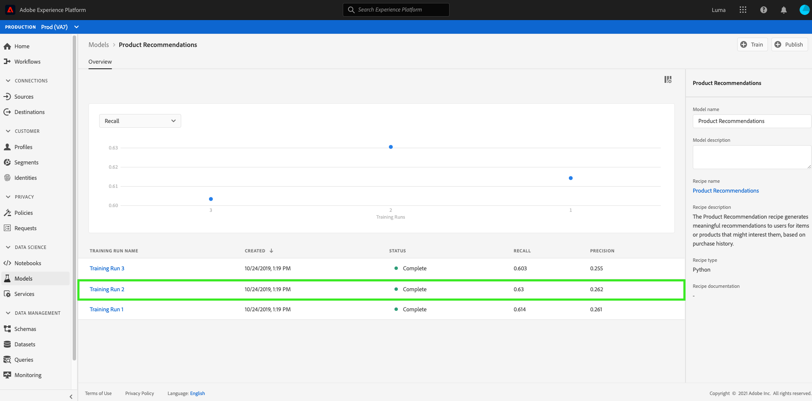
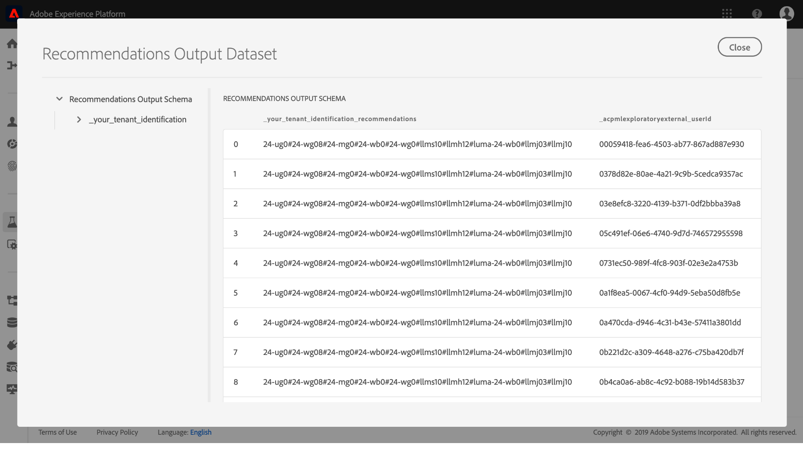

# 建立和發佈機器學習模型

假裝您擁有線上零售網站。 當您的客戶在零售網站購物時，您想要向他們提供個人化產品建議，以公開您企業提供的各種其他產品。 在您網站的存在期間，您不斷收集客戶資料，並想以某種方式利用這些資料產生個人化產品建議。

[!DNL Adobe Experience Platform] [!DNL Data Science Workspace] 提供使用預先建立的產品Recommendations配方來達成 [目標的方式](../pre-built-recipes/product-recommendations.md)。請依照本教學課程，瞭解如何存取和瞭解您的零售資料、建立和最佳化機器學習模型，以及在[!DNL Data Science Workspace]中產生見解。

本教學課程反映[!DNL Data Science Workspace]的工作流程，並涵蓋建立機器學習模型的下列步驟：

1. [準備資料](#prepare-your-data)
2. [製作您的模型](#author-your-model)
3. [培訓並評估您的模型](#train-and-evaluate-your-model)
4. [實施您的模型](#operationalize-your-model)

## 快速入門

開始本教學課程之前，您必須具備下列必要條件：

- 存取[!DNL Adobe Experience Platform]。 如果您沒有[!DNL Experience Platform]中IMS組織的存取權，請在繼續之前先與系統管理員聯絡。

- 啟用資產。 請連絡您的帳戶代表，為您布建下列項目。
   - Recommendations配方
   - Recommendations輸入資料集
   - Recommendations輸入模式
   - Recommendations輸出資料集
   - Recommendations輸出模式
   - Golden Data Set postValues
   - 金色資料集架構

- 從[Adobepublic [!DNL Git] 儲存庫](https://github.com/adobe/experience-platform-dsw-reference/tree/master/Summit/2019/resources/Notebooks-Thurs)下載三個必需的[!DNL Jupyter Notebook]檔案，這些檔案將用於演示[!DNL Data Science Workspace]中的[!DNL JupyterLab]工作流。

對本教學課程中使用的下列主要概念有正確認識：
- [[!DNL Experience Data Model]](../../xdm/home.md):由Adobe牽頭的標準化工作，為客戶體驗管理定 [!DNL Profile] 義標準架構（如和ExperienceEvent）。
- 資料集：實際資料的儲存和管理結構。 [XDM架構](../../xdm/schema/field-dictionary.md)的物理實例化實例。
- 批：資料集由批處理組成。 批是一組在一段時間內收集並作為單個單位一起處理的資料。
- [!DNL JupyterLab]: [[!DNL JupyterLab]](https://blog.jupyter.org/jupyterlab-is-ready-for-users-5a6f039b8906) 是專案的開放原始碼Web介面， [!DNL Jupyter] 並緊密整合在 [!DNL Experience Platform]中。

## 準備您的資料{#prepare-your-data}

若要建立機器學習模型，向客戶提供個人化產品建議，您必須分析您網站上先前客戶購買的產品。 本節探討如何將此資料透過[!DNL Adobe Analytics]傳入至[!DNL Platform]，以及如何將該資料轉換為機器學習模型要使用的功能資料集。

### 探索資料並瞭解結構

登入[Adobe Experience Platform](https://platform.adobe.com/)並選取&#x200B;**[!UICONTROL Datasets]**&#x200B;以列出所有現有資料集，並選取您要探索的資料集。 在此例中，[!DNL Analytics]資料集&#x200B;**Golden Data Set postValues**。

資料集活動頁面隨即開啟，列出與資料集相關的資訊。 您可以選取右上角的&#x200B;**[!UICONTROL Preview Dataset]**&#x200B;來檢查範例記錄。 您也可以檢視所選資料集的架構。 在右側欄中選擇架構連結。 出現一個快顯視窗，選擇&#x200B;**[!UICONTROL schema name]**&#x200B;下方的連結會在新標籤中開啟架構。

其他資料集已預先填入批次，以供預覽之用。 您可以重複上述步驟來檢視這些資料集。

| 資料集名稱 | 結構 | 說明 |
| ----- | ----- | ----- |
| Golden Data Set postValues | Golden Data Set架構 | [!DNL Analytics] 您網站的來源資料 |
| Recommendations輸入資料集 | Recommendations輸入模式 | 使用特徵管線將[!DNL Analytics]資料轉換為訓練資料集。 此資料用來訓練產品Recommendations機器學習模型。 `itemid` 並對 `userid` 應該客戶購買的產品。 |
| Recommendations輸出資料集 | Recommendations輸出模式 | 儲存計分結果的資料集，會包含每個客戶的建議產品清單。 |

## 製作您的型號{#author-your-model}

[!DNL Data Science Workspace]生命週期的第二個元件涉及編寫配方和模型。 「產品Recommendations配方」旨在利用過去的購買資料和機器學習，大規模地產生產品建議。

配方是模型的基礎，因為配方包含機器學習演算法和邏輯，可解決特定問題。 更重要的是，配方可讓您在組織內普及機器學習，讓其他使用者存取不同使用案例的模型，而不需撰寫任何程式碼。

### 探索產品Recommendations配方

在Experience Platform中，從左側導覽欄導覽至&#x200B;**[!UICONTROL Models]**，然後在頂端導覽中選取&#x200B;**[!UICONTROL Recipes]**，以檢視組織的可用方式清單。

接著，選取提供的&#x200B;**[!UICONTROL Recommendations Recipe]**&#x200B;名稱，找出並開啟它。 此時將顯示「配方概述」頁。

然後，在右側邊欄中，選擇&#x200B;**[!UICONTROL Recommendations Input Schema]**&#x200B;以查看為配方供電的模式。 模式欄位&quot;[!UICONTROL itemId]&quot;和&quot;[!UICONTROL userId]&quot;對應於該客戶在特定時間([!UICONTROL timestamp])購買的產品([!UICONTROL interactionType])。 請依照相同的步驟，檢閱&#x200B;**[!UICONTROL Recommendations Output Schema]**&#x200B;的欄位。

您現在已檢閱了「產品Recommendations方式」所需的輸入和輸出結構。 請繼續下一節，瞭解如何建立、訓練和評估產品Recommendations模型。

## 培訓並評估型號{#train-and-evaluate-your-model}

現在您的資料已備妥，配方已準備就緒，您可以建立、訓練和評估機器學習模型。

### 建立模型

「模型」是「方式」的例項，可讓您以規模來訓練和評分資料。

在Experience Platform中，從左側導覽欄導覽至&#x200B;**[!UICONTROL Models]**，然後在頂端導覽中選取&#x200B;**[!UICONTROL Recipes]**。 這會顯示組織的可用方式清單。選擇產品建議方式。

從配方頁面中，選擇&#x200B;**[!UICONTROL Create Model]**。

建立模型工作流從選擇配方開始。 選擇&#x200B;**[!UICONTROL Recommendations Recipe]**，然後選擇右上角的&#x200B;**[!UICONTROL Next]**。

接下來，提供模型名稱。 列出模型的可用配置，其中包含模型預設培訓和計分行為的設定。 查看配置並選擇&#x200B;**[!UICONTROL Finish]**。

系統會將您的模型概觀頁面重新導向，並重新產生訓練執行。 在建立模型時，預設情況下會生成培訓運行。

您可以選擇等待培訓執行完成，或在下節中繼續建立新的培訓執行。

### 使用自訂超參數訓練模型

在&#x200B;**模型概述**&#x200B;頁面上，選取右上角的&#x200B;**[!UICONTROL Train]**&#x200B;以建立新的訓練執行。 選擇建立模型時使用的相同輸入資料集，然後選擇&#x200B;**[!UICONTROL Next]**。

此時將顯示&#x200B;**[!UICONTROL Configuration]**&#x200B;頁。 您可以在這裡設定訓練執行`num_recommendations`值，也稱為超參數。 訓練和優化的模型將根據訓練結果利用效能最佳的超參數。

無法學習超參數，因此必須在訓練執行之前先指派超參數。 調整超參數可能會改變訓練模型的精度。 由於模型的優化是一個迭代過程，因此在獲得滿意的評估之前可能需要多次培訓運行。

>[!TIP]
>
>將`num_recommendations`設為10。

模型評估圖表上會顯示其他資料點。 執行完成後，最多可能需要幾分鐘的時間才會顯示此項目。

### 評估模型

每次訓練執行完成時，您都可以檢視產生的評估量度，以判斷模型執行的成效。

要查看每個已完成培訓運行的評估度量（「精確度」和「召回率」），請選擇培訓運行。

您可以探索每個評估度量所提供的資訊。 這些量度越高，模型的執行效果越好。

您可以在右側導軌上查看用於每個培訓執行的資料集、結構和組態參數。 返回「模型」頁面，並透過觀察其評估度量來識別執行成效最佳的培訓。

## 實施您的型號{#operationalize-your-model}

Data Science工作流程的最後一步是將您的模型實際運作，以便從資料儲存區獲得分數和使用見解。

### 分數並產生見解

在產品建議模型概述頁面上，選取效能最佳的訓練執行名稱，並具有最高召回率和精確度值。

然後，在訓練執行詳細資訊頁面的右上方，選取&#x200B;**[!UICONTROL Score]**。

接著，選取&#x200B;**[!UICONTROL Recommendations Input Dataset]**&#x200B;作為計分輸入資料集，此資料集與您建立模型並執行其訓練執行時使用的資料集相同。 然後，選擇&#x200B;**[!UICONTROL Next]**。

輸入資料集後，請選取&#x200B;**[!UICONTROL Recommendations Output Dataset]**&#x200B;作為計分輸出資料集。 計分結果會以批次形式儲存在此資料集中。

最後，檢閱計分設定。 這些參數包含您先前選取的輸入和輸出資料集以及適當的結構描述。 選擇&#x200B;**[!UICONTROL Finish]**&#x200B;開始計分運行。 執行可能需要數分鐘才能完成。

### 檢視獲得的深入資訊

計分執行成功完成後，您就可以預覽結果並檢視產生的見解。

在計分執行頁面上，選取已完成的計分執行，然後選取右側導軌上的&#x200B;**[!UICONTROL Preview Scoring Results Dataset]**。

在預覽表格中，每一列都包含特定客戶的產品建議，分別標示為[!UICONTROL recommendations]和[!UICONTROL userId]。 由於範例螢幕擷取畫面中的[!UICONTROL num_recommendations]超參數設為10，因此每列建議最多可包含10個產品識別碼，並以數字元號(#)分隔。

## 下一步 {#next-steps}

本教學課程將您介紹[!DNL Data Science Workspace]的工作流程，以示範如何透過機器學習將原始資料轉換為有用的資訊。 若要進一步瞭解如何使用[!DNL Data Science Workspace]，請繼續至[上的下一份指南，以建立零售銷售模式和資料集](./create-retails-sales-dataset.md)。
