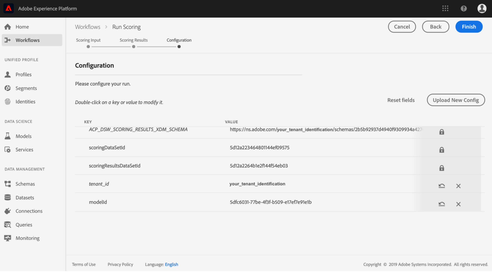

# 建立和發佈機器學習模型逐步說明

假裝您擁有線上零售網站。 當您的客戶在零售網站購物時，您想要向他們提供個人化產品建議，以公開您企業提供的各種其他產品。 在您網站的存在期間，您不斷收集客戶資料，並想以某種方式利用這些資料產生個人化產品建議。

[!DNL Adobe Experience Platform] [!DNL Data Science Workspace] 提供使用預先建立的產品建議方式達成 [目標的方式](../pre-built-recipes/product-recommendations.md)。 請依照本教學課程，瞭解如何存取和瞭解您的零售資料、建立和最佳化機器學習模型，以及產生深入見解 [!DNL Data Science Workspace]。

本教學課程反映的是 [!DNL Data Science Workspace]機器學習模型的工作流程，並涵蓋下列建立機器學習模型的步驟：

1. [準備資料](#prepare-your-data)
2. [製作您的模型](#author-your-model)
3. [培訓並評估您的模型](#train-and-evaluate-your-model)
4. [實施您的模型](#operationalize-your-model)

## 快速入門

開始本教學課程之前，您必須具備下列必要條件：

* 存取權 [!DNL Adobe Experience Platform]。 如果您無權存取中的IMS組織，請先與您的系 [!DNL Experience Platform]統管理員聯絡，然後再繼續。

* 啟用資產。 請連絡您的帳戶代表，為您布建下列項目。
   * 建議方式
   * Recommendations輸入資料集
   * Recommendations輸入結構
   * Recommendations輸出資料集
   * Recommendations輸出結構
   * Golden Data Set postValues
   * 金色資料集架構

* 從 [!DNL Jupyter Notebook] Adobe公用儲存 <a href="https://github.com/adobe/experience-platform-dsw-reference/tree/master/Summit/2019/resources/Notebooks-Thurs" target="_blank">庫下載三個必要的檔 [!DNL Git] 案</a>，這些檔案將用來示範 [!DNL JupyterLab] 中的工作流程 [!DNL Data Science Workspace]。

* 對本教學課程中使用的下列主要概念有正確認識：
   * [[!DNL體驗資料模型]](../../xdm/home.md):由Adobe領導的標準化工作，為客戶體驗管理定義標 [!DNL Profile] 準架構，例如和ExperienceEvent。
   * 資料集：實際資料的儲存和管理結構。 XDM架構的物理實例 [化實例](../../xdm/schema/field-dictionary.md)。
   * 批：資料集由批處理組成。 批是一組在一段時間內收集並作為單個單位一起處理的資料。
   * [!DNL JupyterLab]: [[!DNL JupyterLab]](https://blog.jupyter.org/jupyterlab-is-ready-for-users-5a6f039b8906) 是Project的開放原始碼Web介面， [!DNL Jupyter] 並與之緊密整合 [!DNL Experience Platform]。

## 準備資料 {#prepare-your-data}

若要建立機器學習模型，向客戶提供個人化產品建議，您必須分析您網站上先前客戶購買的產品。 本節探討如何將此資料吸收 [!DNL Platform] 到 [!DNL Adobe Analytics]其中，以及如何將該資料轉換成機器學習模型要使用的功能資料集。

### 探索資料並瞭解結構

1. 登入 [Adobe Experience Platform](https://platform.adobe.com/) ，然後按一下「 **[!UICONTROL Datasets]** 」以列出所有現有的資料集，並選取您要探索的資料集。 在此例中，資料 [!DNL Analytics] 集 **Golden Data Set postValues**。
   
2. 選取 **[!UICONTROL 右上角的「預覽資料集]** 」以檢查範例記錄，然後按一下「 **[!UICONTROL 關閉」]**。
   
3. 在右側欄的「架構」下選取連結，以檢視資料集的架構，然後返回資料集詳細資料頁面。」
   

其他資料集已預先填入批次，以供預覽之用。 您可以重複上述步驟來檢視這些資料集。

| 資料集名稱 | 結構 | 說明 |
| ----- | ----- | ----- |
| Golden Data Set postValues | Golden Data Set架構 | [!DNL Analytics] 您網站的來源資料 |
| Recommendations輸入資料集 | Recommendations輸入結構 | 使用 [!DNL Analytics] 特徵管線將資料轉換成訓練資料集。 此資料用於訓練Product Recommendations機器學習模型。 `itemid` 並對 `userid` 應該客戶購買的產品。 |
| Recommendations輸出資料集 | Recommendations輸出結構 | 儲存計分結果的資料集，會包含每個客戶的建議產品清單。 |

## 製作您的模型 {#author-your-model}

生命週期的第二個元 [!DNL Data Science Workspace] 素包括製作方式和模型。 「產品建議方式」旨在利用過去的購買資料和機器學習，大規模產生產品建議。

配方是模型的基礎，因為配方包含機器學習演算法和邏輯，可解決特定問題。 更重要的是，配方可讓您在組織內普及機器學習，讓其他使用者存取不同使用案例的模型，而不需撰寫任何程式碼。

### 探索產品建議方式

1. 在中 [!DNL Adobe Experience Platform]，從左側導覽 **[!UICONTROL 欄導覽至「模型」，然後按一下頂端的]** 「方式 **** 」，以檢視組織的可用「方式」清單。
   
2. 按一下提供的 **[!UICONTROL Recommendations方式]** ，尋找並開啟其名稱。
   
3. 在右側邊欄中，按一下「 **[!UICONTROL Recommendations輸入結構」]** ，以檢視支援方式的結構。 結構欄位 **[!UICONTROL itemId]****[!UICONTROL 和userId]** 對應於該客戶在特定時間(timestampInteraction)購買的產品(**[!UICONTROL Type]******)。 請依照相同的步驟，檢閱 **[!UICONTROL Recommendations輸出結構的欄位]**。
   

您現在已檢視「產品建議方式」所需的輸入和輸出結構。 您現在可以繼續下一節，瞭解如何建立、訓練和評估產品建議模型。

## 培訓並評估您的模型 {#train-and-evaluate-your-model}

現在您的資料已備妥，配方已可供使用，您可以建立、訓練和評估機器學習模型。

### 建立模型

「模型」是「方式」的例項，可讓您以規模來訓練和評分資料。

1. 在中 [!DNL Adobe Experience Platform]，從左側導覽欄導覽至 **[!UICONTROL Models]** ，然後按一下頁面頂端的Recipes **** ，以顯示您組織的所有可用Recipes清單。
   
2. 按一下「方式」的名 **** 稱，並輸入「方式」的概述頁面，以尋找並開啟提供的「建議方式」。 從中 **** 心（如果沒有現有模型）或從「方式概述」頁面的右上角按一下「建立模型」。
   
3. 會顯示可用的訓練輸入資料集清單，選取「 **[!UICONTROL Recommendations輸入資料集」]** ，然後按一 **[!UICONTROL 下「Next]**」。
   
4. 提供模型的名稱，例如「產品建議模型」。 列出模型的可用配置，包含模型的預設培訓和計分行為的設定。 由於這些配置是您組織專屬的，因此不需要進行任何更改。 查看配置，然後按一下 **[!UICONTROL 完成]**。
   
5. 模型現在已建立，而模型的「概 *述* 」(Overview)頁面會顯示在新產生的訓練執行中。 在建立模型時，預設情況下會生成培訓運行。
   

您可以選擇等待培訓執行完成，或在下節中繼續建立新的培訓執行。

### 使用自訂超參數訓練模型

1. 在「模 *型概述* 」頁面上，按一 **[!UICONTROL 下右上角的「]** Train」（培訓）以建立新的培訓執行。 選取建立模型時使用的相同輸入資料集，然後按一下「下 **[!UICONTROL 一步]**」。
   
2. 此時將 *顯示* 「配置」頁。 您可以在這裡設定訓練執行的 **[!UICONTROL num_recommendations值]** ，也稱為Hyperparameter。 訓練和優化的模型將根據訓練運行的結果利用效能最佳的超參數。

   無法學習超參數，因此必須在訓練執行之前先指派超參數。 調整超參數可能會改變訓練模型的精度。 由於模型最佳化是一個反覆的程式，因此在達到滿意的評估之前可能需要執行多次培訓。

   >[!TIP]
   >
   >將 **[!UICONTROL num_recommendations]** 設為10。

   
3. 新培訓執行完成後，模型評估圖表上會出現額外的資料點，這可能需要數分鐘。
   

### 評估模型

每次訓練執行完成時，您都可以檢視產生的評估量度，以判斷模型執行的成效。

1. 按一下培訓執行，檢視每個已完成培訓執行的評估量度（精確度和召回率）。
2. 探索每個評估量度的資訊。 這些量度越高，模型的執行效果越好。
   
3. 您可以在右側導軌上查看用於每個培訓執行的資料集、結構和組態參數。
4. 返回「模型」頁面，並透過觀察其評估度量來識別執行成效最佳的培訓。

## 實施您的模型 {#operationalize-your-model}

Data Science工作流程的最後一步是將您的模型實際運作，以便從資料儲存區獲得分數和使用見解。

### 分數並產生見解

1. 在產品建議「模 *型概述* 」頁面上，按一下效能最佳的培訓執行名稱，其中包含最高召回率和精確度值。
2. 在訓練執行詳細資訊頁面的右上方，按一下「分 **[!UICONTROL 數」]**。
3. 選取「 **[!UICONTROL Recommendations輸入資料集]** 」作為計分輸入資料集，此資料集與您建立模型並執行其訓練執行時使用的資料集相同。 然後，按一下「 **[!UICONTROL Next(下一步]**)」。
   
4. 選取「 **[!UICONTROL Recommendations輸出資料集]** 」作為計分輸出資料集。 計分結果會以批次形式儲存在此資料集中。
   
5. 檢閱計分設定。 這些參數包含先前選取的輸入和輸出資料集以及適當的結構描述。 按一 **[!UICONTROL 下「完成]** 」以開始計分執行。 執行可能需要數分鐘才能完成。
   

### 檢視獲得的深入資訊

計分執行成功完成後，您就可以預覽結果並檢視產生的見解。

1. 在計分執行頁面上，按一下已完成的計分執行，然後按一下右 **[!UICONTROL 邊欄上的「預覽計分結果資料集]** 」。
   
2. 在預覽表格中，每一列都包含特定客戶的產品建議，分別標示為 **[!UICONTROL Recommendations]****[!UICONTROL 和userId]** 。 由於范 **[!UICONTROL 例螢幕擷取畫面中的]** num_recommendations Hyperparameter已設為10，因此每列建議最多可包含10個產品識別碼，由數字元號(#)分隔。
   

## 下一步 {#next-steps}

做得好，您已成功產生產品建議！

本教學課程將您介紹的工作流程， [!DNL Data Science Workspace]示範如何透過機器學習將原始未處理的資料轉換為有用的資訊。 若要進一步瞭解如何使 [!DNL Data Science Workspace]用，請繼續下一個建立零售 [銷售模式和資料集的指南](./create-retails-sales-dataset.md)。