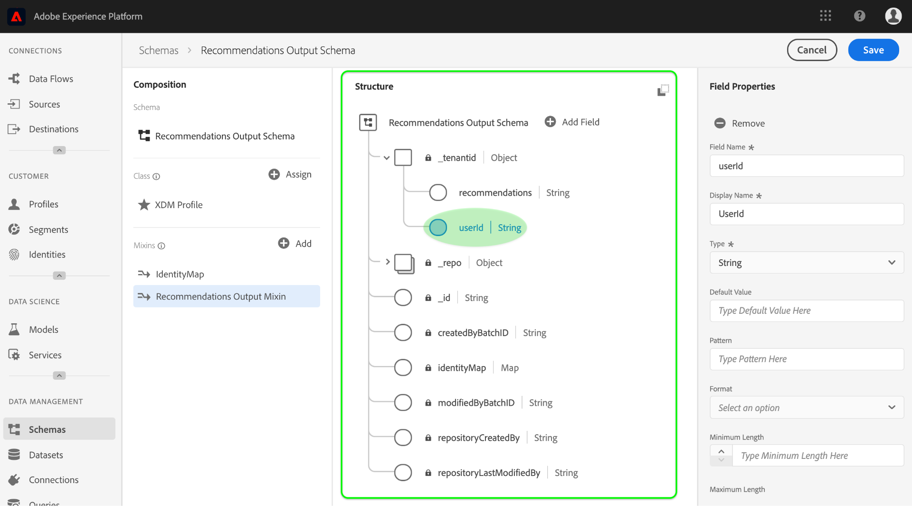
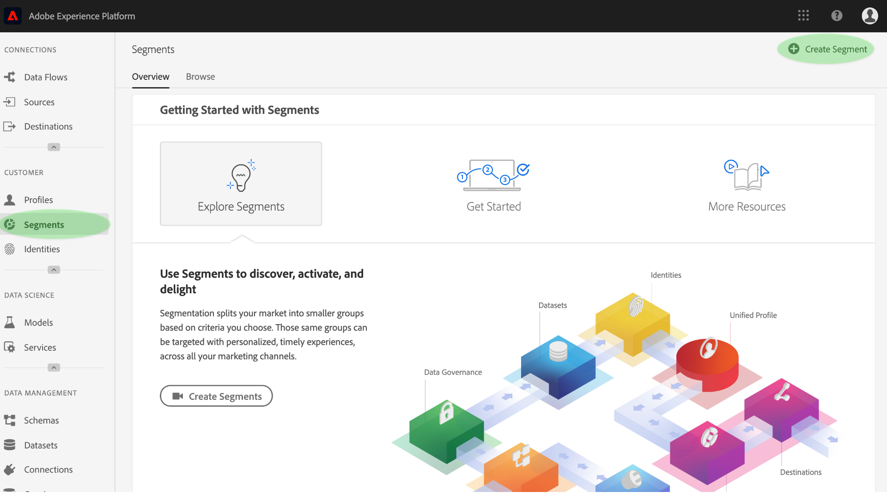

# 運用機器 [!DNL Real-time Customer Profile] 學習見解豐富內容

[!DNL Adobe Experience Platform] [!DNL Data Science Workspace] 提供工具和資源來建立、評估和運用機器學習模型，以產生資料預測和洞見。 當機器學習見解被收錄到啟用的資 [!DNL Profile]料集時，同樣的資料也被收錄為記錄，然後 [!DNL Profile] ，記錄可使用被劃分為相關元素的子集 [!DNL Experience Platform Segmentation Service]。

本檔案提供逐步教學課程，以豐富機 [!DNL Real-time Customer Profile] 器學習的見解，其步驟分為以下幾節：

1. [建立輸出模式和資料集](#create-an-output-schema-and-dataset)
2. [配置輸出模式和資料集](#configure-an-output-schema-and-dataset)
3. [使用區段產生器建立區段](#create-segments-using-the-segment-builder)

## 快速入門

本教學課程需要對吸收資料和建立區段 [!DNL Adobe Experience Platform] 所涉及的各 [!DNL Profile] 個方面有深入瞭解。 在開始本教學課程之前，請先閱讀下列服務的檔案：

* [[!DNL即時客戶基本資料]](../../rtcdp/overview.md):根據來自多個來源的匯整資料，提供統一、即時的消費者個人檔案。
* [[!DNL Identity Service]](../../identity-service/home.md):可借 [!DNL Real-time Customer Profile] 由橋接來自不同資料來源的身分識別，並將其收錄至平台。
* [[!DNL體驗資料模型(XDM)]](../../xdm/home.md):平台組織客戶體驗資料的標準化架構。

除了上述文檔，強烈建議您還查看以下方案指南和方案編輯器：

* [架構構成基礎](../../xdm/schema/composition.md):介紹XDM架構、構建塊、原則和最佳做法，以合成要用於的架構 [!DNL Experience Platform]。
* [架構編輯器教程](../../xdm/tutorials/create-schema-ui.md):提供使用中的方案編輯器建立方案的詳細說明 [!DNL Experience Platform]。

## 建立輸出模式和資料集 {#create-an-output-schema-and-dataset}

要充分運用計分見 [!DNL Real-time Customer Profile] 解，第一步是瞭解您的資料所定義的真實世界物件（例如個人）。 瞭解資料後，您就可以描述和設計對資料有意義的結構，就像設計關係式資料庫。

構成模式的開始方法是分配類。 類定義模式將包含的資料的行為方面（記錄或時間序列）。 本節提供使用架構生成器建立架構的基本說明。 有關更深入的教程，請參閱有關使用「架構編 [輯器」建立架構的教程](../../xdm/tutorials/create-schema-ui.md)。

1. 在Adobe Experience Platform上，按一下「 **[!UICONTROL 架構]** 」標籤以存取架構瀏覽器。 按一下 **[!UICONTROL 建立架構]** ，訪問 *架構編輯器*，您可以在其中交互構建和建立架構。
   

2. 在「合成 *」窗口* ，按一下「 **[!UICONTROL 分配]** 」以瀏覽可用類。
   * 若要指派現有類別，請按一下並反白標示所要的類別，然後按一下「指 **[!UICONTROL 派類別」]**。
      

   * 若要建立自訂類別，請按一 **[!UICONTROL 下瀏覽器視窗中央頂端附近的「建立新類別]** 」。 提供類名、說明，並選擇類的行為。 完成後 **[!UICONTROL ，按一下]** 「指派類別」。
      

   此時，架構的結構應包含一些類欄位，並且您已準備好指定混音。 混音是描述特定概念的一或多個欄位的組。

3. 在「合 *成* 」視窗中，按一 **[!UICONTROL 下]** Mixins子區段中的「新增 ** 」。
   * 若要指定現有的混音，請按一下並反白標示所要的混音，然後按一下「 **[!UICONTROL 新增混音」]**。 與類不同，只要適合，多個混合可以指派給單一模式。
      

   * 若要建立新混音，請按一 **[!UICONTROL 下瀏覽器視窗中央頂端附近的「建立新混音]** 」。 提供混音的名稱和說明，然後在完成後按 **[!UICONTROL 一下「指定混音]** 」。
      

   * 若要新增mixin欄位，請在「合成」視窗中按一下混 *合名* 稱。 接著，您將可以按一下「結構」視窗中的「新增欄位」, **[!UICONTROL 以選擇新增混音欄位]***的選項* 。 請確定相應地提供混合屬性。
      

4. 構建方案後，按一下「結構」( *Structure* )窗口中方案的頂級欄位，在右側屬性窗口中顯示方案的屬性。 提供名稱和說明，然後按一下「 **[!UICONTROL 保存]** 」建立架構。
   

5. 使用您新建立的架構建立輸出資料集，方法是按一下左側導覽欄中的 **[!UICONTROL Datasets]** ，然後按一下 **[!UICONTROL Create dataset]**。 在下一個畫面中，選擇「從 **[!UICONTROL 架構建立資料集」]**。
   

6. 使用架構瀏覽器，查找並選擇新建立的架構，然後按一下「下 **[!UICONTROL 一步]**」。
   

7. 提供名稱和選用說明，然後按一下「完 **[!UICONTROL 成]** 」以建立資料集。
   

現在您已建立輸出結構描述資料集，您可以繼續前往下一節，以設定並啟用它們以進行描述檔擴充。

## 配置輸出模式和資料集 {#configure-an-output-schema-and-dataset}

在為啟用資料集之 [!DNL Profile]前，您需要將資料集的模式配置為具有主標識欄位，然後為啟用模式 [!DNL Profile]。 如果要建立並啟用新架構，可參考有關使用架構編輯器 [建立架構的教程](../../xdm/tutorials/create-schema-ui.md)。 否則，請依照下列指示啟用現有的架構和資料集。

1. 在Adobe Experience Platform上，使用架構瀏覽器來尋找您要啟用的輸出架構， [!DNL Profile] 然後按一下其名稱以檢視其構圖。
   

2. 展開架構結構，並尋找適當的欄位以設定為主要識別碼。 按一下所要的欄位以顯示其屬性。
   

3. 啟用欄位的 **[!UICONTROL Identity]** 屬性、 **[!UICONTROL Primary Identity]** 屬性，然後選取適當的Identity Namespace，將欄位設為 **[!UICONTROL 主要識別]**。 進行 **[!UICONTROL 變更後]** ，按一下「套用」。
   

4. 按一下架構結構的頂層對象，通過切換配置檔案開關來顯示架構屬性並啟用配置 **[!UICONTROL 檔案]** 。 按一 **[!UICONTROL 下「儲存]** 」以完成變更，使用此架構建立的資料集現在可以啟用描述檔。
   

5. 使用資料集瀏覽器來尋找您要啟用的資料集， [!DNL Profile] 然後按一下其名稱以存取其詳細資訊。
   

6. 切換右側信 [!DNL Profile] 息列中的 **[!UICONTROL Profile]** switch，為啟用資料集。
   

當資料被收錄至啟用 [!DNL Profile]的資料集時，相同的資料也會被收錄為 [!DNL Profile] 記錄。 現在已準備好架構和資料集，請使用適當的模型執行計分執行，以產生資料集中的部分資料，並繼續本教學課程，使用「區段產生器」建立洞察力區段。

## 使用區段產生器建立區段 {#create-segments-using-the-segment-builder}

現在您已產生並吸收見解至已啟用資 [!DNL Profile]料集，您可以使用「區段產生器」識別相關元素的子集，以管理該資料。 請依照下列步驟建立您自己的區段。

1. 在Adobe Experience Platform上，按一下「區 **[!UICONTROL 段]** 」標籤， **[!UICONTROL 接著「建立區段]** 」以存取「區段產生器」。
   

2. 在「區段產生器」中，左側導軌可讓您存取區段的核心建置區塊：屬性、事件和現有區段。 每個構造塊都顯示在其各自的頁籤中。 選取您啟用的架構 [!DNL Profile]所延伸的類別，然後瀏覽並尋找區段的建立區塊。
   

3. 將建立區塊拖放至規則產生器畫布上，提供比較陳述式以完成這些區塊。
   

4. 在建立區段時，您可以透過觀察區段屬性面板來預覽估 *計的區段* 結果。
   

5. 選擇適當的 **[!UICONTROL 合併原則]**、提供名稱和選用說明，然後按一下「 **[!UICONTROL 儲存]** 」以完成新區段。
   

## 下一步 {#next-steps}

本檔案會逐步引導您執行為架構和資料集啟用所需的步驟 [!DNL Profile]，並簡要展示使用區段產生器建立洞察力區段的工作流程。 若要進一步瞭解區段和區段產生器，請參閱區段服 [務總覽](../../segmentation/home.md)。