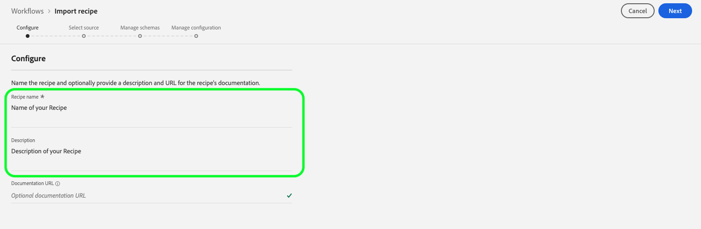

# 在資料科學Workspace UI中匯入封裝的配方

本教學課程深入分析如何使用提供的零售範例來設定和匯入封裝的配方。 在本教學課程結束時，您已準備好在Adobe Experience Platform [!DNL Data Science Workspace]中建立、訓練及評估模型。

## 先決條件

本教學課程需要以Docker影像URL形式封裝的配方。 如需詳細資訊，請參閱教學課程，瞭解如何[將來源檔案](./package-source-files-recipe.md)封裝成配方。

## UI工作流程

將封裝配方匯入至[!DNL Data Science Workspace]需要特定的配方組態，編譯成單一JavaScript物件標籤法(JSON)檔案，此配方組態編譯稱為組態檔。 具有特定組態的封裝配方稱為配方例項。 一個配方可用來在[!DNL Data Science Workspace]中建立許多配方執行個體。

匯入套裝程式配方的工作流程包含下列步驟：
- [設定配方](#configure)
- [匯入以Docker為基礎的配方 — Python](#python)
- [匯入以Docker為基礎的配方 — R](#r)
- [匯入以Docker為基礎的配方 — PySpark](#pyspark)
- [匯入以Docker為基礎的配方 — Scala](#scala)

### 設定配方 {#configure}

[!DNL Data Science Workspace]中的每個配方執行個體都隨附一組設定，這些設定會量身打造配方執行個體以符合特定使用案例。 組態檔會定義使用此配方執行個體建立之模型的預設訓練和評分行為。

>[!NOTE]
>
>組態檔會因配方和大小寫而異。

底下是設定檔範例，顯示零售方式預設的培訓和評分行為。

```json
[
    {
        "name": "train",
        "parameters": [
            {
                "key": "learning_rate",
                "value": "0.1"  
            },
            {
                "key": "n_estimators",
                "value": "100"
            },
            {
                "key": "max_depth",
                "value": "3"
            },
            {
                "key": "ACP_DSW_INPUT_FEATURES",
                "value": "date,store,storeType,storeSize,temperature,regionalFuelPrice,markdown,cpi,unemployment,isHoliday"
            },
            {
                "key": "ACP_DSW_TARGET_FEATURES",
                "value": "weeklySales"
            },
            {
                "key": "ACP_DSW_FEATURE_UPDATE_SUPPORT",
                "value": false
            },
            {
                "key": "tenantId",
                "value": "_{TENANT_ID}"
            },
            {
                "key": "ACP_DSW_TRAINING_XDM_SCHEMA",
                "value": "{SEE BELOW FOR DETAILS}"
            },
            {
                "key": "evaluation.labelColumn",
                "value": "weeklySalesAhead"
            },
            {
                "key": "evaluation.metrics",
                "value": "MAPE,MAE,RMSE,MASE"
            }
        ]
    },
    {
        "name": "score",
        "parameters": [
            {
                "key": "tenantId",
                "value": "_{TENANT_ID}"
            },
            {
                "key":"ACP_DSW_SCORING_RESULTS_XDM_SCHEMA",
                "value":"{SEE BELOW FOR DETAILS}"
            }
        ]
    }
]
```

| 參數索引鍵 | 類型 | 說明 |
| ----- | ----- | ----- |
| `learning_rate` | 數字 | 用於漸層乘法的純量。 |
| `n_estimators` | 數字 | 隨機樹系分類器的樹係數目。 |
| `max_depth` | 數字 | 隨機森林分類器中樹狀結構的最大深度。 |
| `ACP_DSW_INPUT_FEATURES` | 字串 | 以逗號分隔的輸入結構描述屬性清單。 |
| `ACP_DSW_TARGET_FEATURES` | 字串 | 逗號分隔的輸出結構描述屬性清單。 |
| `ACP_DSW_FEATURE_UPDATE_SUPPORT` | 布林值 | 決定是否可修改輸入和輸出功能 |
| `tenantId` | 字串 | 此ID可確保您建立的資源能正確建立名稱空間，並包含在您的組織內。 [請依照這裡的步驟](../../xdm/api/getting-started.md#know-your-tenant_id)尋找您的租使用者ID。 |
| `ACP_DSW_TRAINING_XDM_SCHEMA` | 字串 | 用於訓練模型的輸入結構描述。 在UI中匯入時，請將此項留空；使用API匯入時，請以培訓SchemaID取代。 |
| `evaluation.labelColumn` | 字串 | 評估視覺效果的欄標籤。 |
| `evaluation.metrics` | 字串 | 用於評估模型的評估量度清單（以逗號分隔）。 |
| `ACP_DSW_SCORING_RESULTS_XDM_SCHEMA` | 字串 | 用於評分模型的輸出結構描述。 在UI中匯入時，請將此項留空；使用API匯入時，請以評分SchemaID取代。 |

就本教學課程而言，您可以在「[!DNL Data Science Workspace]參考」中保留零售方式預設的設定檔。

### 匯入以Docker為基礎的配方 — [!DNL Python] {#python}

首先，瀏覽並選取位於[!DNL Platform] UI左上方的&#x200B;**[!UICONTROL 工作流程]**。 接著，選取「**匯入配方**」並選取「**[!UICONTROL 啟動]**」。


**匯入配方**&#x200B;工作流程的&#x200B;**設定**&#x200B;頁面隨即顯示。 輸入配方的名稱和說明，然後在右上角選取&#x200B;**[!UICONTROL 下一步]**。



>[!NOTE]
>
> 在[將來源檔案封裝到配方](./package-source-files-recipe.md)教學課程中，在使用Python來源檔案建置零售銷售配方結束時提供了Docker URL。

一旦您進入&#x200B;**選取來源**&#x200B;頁面，請在&#x200B;**[!UICONTROL Source URL]**&#x200B;欄位中貼上對應使用[!DNL Python]來源檔案建置之封裝配方的Docker URL。 接著，拖放匯入提供的組態檔，或使用檔案系統&#x200B;**瀏覽器**。 提供的組態檔可在`experience-platform-dsw-reference/recipes/python/retail/retail.config.json`找到。 在&#x200B;**執行階段**&#x200B;下拉式清單中選取&#x200B;**[!UICONTROL Python]**，並在&#x200B;**型別**&#x200B;下拉式清單中選取&#x200B;**[!UICONTROL 分類]**。 填寫完畢後，選取右上角的&#x200B;**[!UICONTROL 下一步]**&#x200B;以繼續進行&#x200B;**管理結構描述**。

>[!NOTE]
>
> 型別支援&#x200B;**[!UICONTROL 分類]**&#x200B;和&#x200B;**[!UICONTROL 回歸]**。 如果您的模型不屬於其中一種型別，請選取&#x200B;**[!UICONTROL 自訂]**。


接著，在&#x200B;**管理結構描述**&#x200B;區段下選取零售銷售輸入和輸出結構描述，這些結構描述是使用[建立零售銷售結構描述和資料集](../models-recipes/create-retails-sales-dataset.md)教學課程中提供的啟動程式指令碼建立的。


在&#x200B;**功能管理**&#x200B;區段下，在結構描述檢視器中選取租使用者識別以展開零售銷售輸入結構描述。 在右側&#x200B;**[!UICONTROL 欄位屬性]**&#x200B;視窗中選取&#x200B;**[!UICONTROL 輸入功能]**&#x200B;或&#x200B;**[!UICONTROL 目標功能]**，以反白顯示所要的功能，來選取輸入和輸出功能。 在此教學課程中，請將&#x200B;**[!UICONTROL weeklySales]**&#x200B;設定為&#x200B;**[!UICONTROL 目標功能]**，並將其他專案設定為&#x200B;**[!UICONTROL 輸入功能]**。 選取&#x200B;**[!UICONTROL 下一步]**&#x200B;以檢閱您新設定的配方。

視需要檢閱配方、新增、修改或移除設定。 選取&#x200B;**[!UICONTROL 完成]**&#x200B;以建立配方。


繼續進行[後續步驟](#next-steps)，瞭解如何使用新建立的零售方式在[!DNL Data Science Workspace]中建立模型。

### 匯入以Docker為基礎的配方 — R {#r}

首先，瀏覽並選取位於[!DNL Platform] UI左上方的&#x200B;**[!UICONTROL 工作流程]**。 接著，選取「**匯入配方**」並選取「**[!UICONTROL 啟動]**」。


**匯入配方**&#x200B;工作流程的&#x200B;**設定**&#x200B;頁面隨即顯示。 輸入配方的名稱和說明，然後在右上角選取&#x200B;**[!UICONTROL 下一步]**。


>[!NOTE]
>
> 在[將來源檔案封裝到配方](./package-source-files-recipe.md)教學課程中，在使用R來源檔案建置零售銷售配方結束時，提供了Docker URL。

進入&#x200B;**選取來源**&#x200B;頁面後，在&#x200B;**[!UICONTROL Source URL]**&#x200B;欄位中貼上與R來源檔案建置之封裝配方相對應的Docker URL。 接著，拖放匯入提供的組態檔，或使用檔案系統&#x200B;**瀏覽器**。 提供的組態檔可在`experience-platform-dsw-reference/recipes/R/Retail\ -\ GradientBoosting/retail.config.json`找到。 在&#x200B;**執行階段**&#x200B;下拉式清單中選取&#x200B;**[!UICONTROL R]**，並在&#x200B;**型別**&#x200B;下拉式清單中選取&#x200B;**[!UICONTROL 分類]**。 填寫完畢後，選取右上角的&#x200B;**[!UICONTROL 下一步]**&#x200B;以繼續進行&#x200B;**管理結構描述**。

>[!NOTE]
>
> *型別*&#x200B;支援&#x200B;**[!UICONTROL 分類]**&#x200B;和&#x200B;**[!UICONTROL 回歸]**。 如果您的模型不屬於其中一種型別，請選取&#x200B;**[!UICONTROL 自訂]**。


接著，在&#x200B;**管理結構描述**&#x200B;區段下選取零售銷售輸入和輸出結構描述，這些結構描述是使用[建立零售銷售結構描述和資料集](../models-recipes/create-retails-sales-dataset.md)教學課程中提供的啟動程式指令碼建立的。


在&#x200B;*功能管理*&#x200B;區段下，在結構描述檢視器中選取租使用者識別以展開零售銷售輸入結構描述。 在右側&#x200B;**[!UICONTROL 欄位屬性]**&#x200B;視窗中選取&#x200B;**[!UICONTROL 輸入功能]**&#x200B;或&#x200B;**[!UICONTROL 目標功能]**，以反白顯示所要的功能，來選取輸入和輸出功能。 在此教學課程中，請將&#x200B;**[!UICONTROL weeklySales]**&#x200B;設定為&#x200B;**[!UICONTROL 目標功能]**，並將其他專案設定為&#x200B;**[!UICONTROL 輸入功能]**。 選取&#x200B;**[!UICONTROL 下一步]**&#x200B;以檢閱您新設定的配方。

視需要檢閱配方、新增、修改或移除設定。 選取&#x200B;**完成**&#x200B;以建立配方。


繼續進行[後續步驟](#next-steps)，瞭解如何使用新建立的零售方式在[!DNL Data Science Workspace]中建立模型。

### 匯入以Docker為基礎的配方 — PySpark {#pyspark}

首先，瀏覽並選取位於[!DNL Platform] UI左上方的&#x200B;**[!UICONTROL 工作流程]**。 接著，選取「**匯入配方**」並選取「**[!UICONTROL 啟動]**」。


**匯入配方**&#x200B;工作流程的&#x200B;**設定**&#x200B;頁面隨即顯示。 輸入配方的名稱和說明，然後在右上角選取&#x200B;**[!UICONTROL 下一步]**&#x200B;以繼續。


>[!NOTE]
>
> 在[將來源檔案封裝成Recipe](./package-source-files-recipe.md)教學課程中，在使用PySpark來源檔案建置零售業務配方結束時，提供了Docker URL。

一旦您進入&#x200B;**選取來源**&#x200B;頁面，請在&#x200B;**[!UICONTROL Source URL]**&#x200B;欄位中貼上對應使用PySpark來源檔案建置之封裝配方的Docker URL。 接著，拖放匯入提供的組態檔，或使用檔案系統&#x200B;**瀏覽器**。 提供的組態檔可在`experience-platform-dsw-reference/recipes/pyspark/retail/pipeline.json`找到。 在&#x200B;**執行階段**&#x200B;下拉式清單中選取&#x200B;**[!UICONTROL PySpark]**。 選取PySpark執行階段後，預設成品會自動填入&#x200B;**[!UICONTROL Docker]**。 接著，在&#x200B;**型別**&#x200B;下拉式清單中選取&#x200B;**[!UICONTROL 分類]**。 填寫完畢後，選取右上角的&#x200B;**[!UICONTROL 下一步]**&#x200B;以繼續進行&#x200B;**管理結構描述**。

>[!NOTE]
>
> *型別*&#x200B;支援&#x200B;**[!UICONTROL 分類]**&#x200B;和&#x200B;**[!UICONTROL 回歸]**。 如果您的模型不屬於其中一種型別，請選取&#x200B;**[!UICONTROL 自訂]**。


接下來，使用&#x200B;**管理結構描述**&#x200B;選取器選取零售銷售輸入和輸出結構描述，結構描述是使用[建立零售銷售結構描述和資料集](../models-recipes/create-retails-sales-dataset.md)教學課程中提供的啟動程式指令碼建立的。


在&#x200B;**功能管理**&#x200B;區段下，在結構描述檢視器中選取租使用者識別以展開零售銷售輸入結構描述。 在右側&#x200B;**[!UICONTROL 欄位屬性]**&#x200B;視窗中選取&#x200B;**[!UICONTROL 輸入功能]**&#x200B;或&#x200B;**[!UICONTROL 目標功能]**，以反白顯示所要的功能，來選取輸入和輸出功能。 在此教學課程中，請將&#x200B;**[!UICONTROL weeklySales]**&#x200B;設定為&#x200B;**[!UICONTROL 目標功能]**，並將其他專案設定為&#x200B;**[!UICONTROL 輸入功能]**。 選取&#x200B;**[!UICONTROL 下一步]**&#x200B;以檢閱您新設定的配方。


視需要檢閱配方、新增、修改或移除設定。 選取&#x200B;**[!UICONTROL 完成]**&#x200B;以建立配方。


繼續進行[後續步驟](#next-steps)，瞭解如何使用新建立的零售方式在[!DNL Data Science Workspace]中建立模型。

### 匯入以Docker為基礎的配方 — Scala {#scala}

首先，瀏覽並選取位於[!DNL Platform] UI左上方的&#x200B;**[!UICONTROL 工作流程]**。 接著，選取「**匯入配方**」並選取「**[!UICONTROL 啟動]**」。


**匯入配方**&#x200B;工作流程的&#x200B;**設定**&#x200B;頁面隨即顯示。 輸入配方的名稱和說明，然後在右上角選取&#x200B;**[!UICONTROL 下一步]**&#x200B;以繼續。


>[!NOTE]
>
> 在[將來源檔案封裝成Recipe](./package-source-files-recipe.md)教學課程中，在使用Scala ([!DNL Spark])來源檔案建置零售業配方結束時，提供了Docker URL。

進入&#x200B;**選取來源**&#x200B;頁面後，在Source URL欄位中貼上與Scala來源檔案建置的封裝配方相對應的Docker URL。 接著，以拖放方式匯入提供的組態檔案，或使用檔案系統「瀏覽器」。 提供的組態檔可在`experience-platform-dsw-reference/recipes/scala/retail/pipelineservice.json`找到。 在&#x200B;**執行階段**&#x200B;下拉式清單中選取&#x200B;**[!UICONTROL Spark]**。 選取[!DNL Spark]執行階段後，預設成品會自動填入&#x200B;**[!UICONTROL Docker]**。 接著，從&#x200B;**型別**&#x200B;下拉式清單中選取&#x200B;**[!UICONTROL 回歸]**。 填寫完畢後，選取右上角的&#x200B;**[!UICONTROL 下一步]**&#x200B;以繼續進行&#x200B;**管理結構描述**。

>[!NOTE]
>
> 型別支援&#x200B;**[!UICONTROL 分類]**&#x200B;和&#x200B;**[!UICONTROL 回歸]**。 如果您的模型不屬於其中一種型別，請選取&#x200B;**[!UICONTROL 自訂]**。


接下來，使用&#x200B;**管理結構描述**&#x200B;選取器選取零售銷售輸入和輸出結構描述，結構描述是使用[建立零售銷售結構描述和資料集](../models-recipes/create-retails-sales-dataset.md)教學課程中提供的啟動程式指令碼建立的。


在&#x200B;**功能管理**&#x200B;區段下，在結構描述檢視器中選取租使用者識別以展開零售銷售輸入結構描述。 在右側&#x200B;**[!UICONTROL 欄位屬性]**&#x200B;視窗中選取&#x200B;**[!UICONTROL 輸入功能]**&#x200B;或&#x200B;**[!UICONTROL 目標功能]**，以反白顯示所要的功能，來選取輸入和輸出功能。 在本教學課程中，請將「[!UICONTROL weeklySales]」設為&#x200B;**[!UICONTROL 目標功能]**，並將其他專案設為&#x200B;**[!UICONTROL 輸入功能]**。 選取&#x200B;**[!UICONTROL 下一步]**&#x200B;以檢閱您新設定的配方。


視需要檢閱配方、新增、修改或移除設定。 選取&#x200B;**[!UICONTROL 完成]**&#x200B;以建立配方。


繼續進行[後續步驟](#next-steps)，瞭解如何使用新建立的零售方式在[!DNL Data Science Workspace]中建立模型。

## 後續步驟 {#next-steps}

此教學課程提供設定配方並將配方匯入[!DNL Data Science Workspace]的深入分析。 您現在可以使用新建立的配方來建立、訓練及評估模型。

- [在UI中訓練及評估模型](./train-evaluate-model-ui.md)
- [使用API訓練和評估模型](./train-evaluate-model-api.md)
