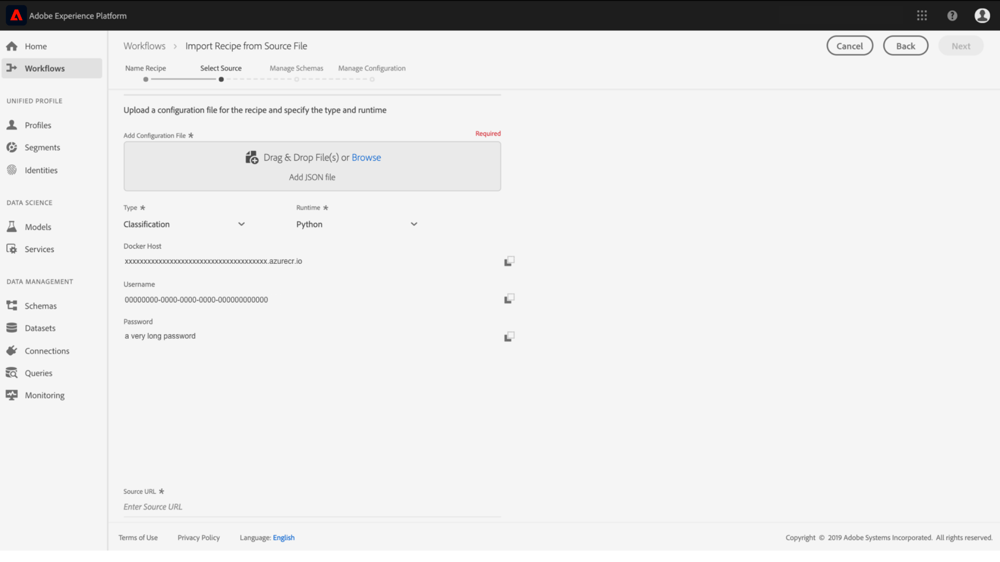

# 將來源檔案封裝至配方

本教學課程提供如何將提供的零售銷售範例來源檔案封裝成封存檔案的指示，此檔案可依循UI或API中的方式匯入工作流程，用來在Adobe Experience Platform Data Science Workspace中建立方式。

要瞭解的概念：

- **方式**:配方是Adobe的模型規格術語，是代表特定機器學習、人工智慧演算法或整合演算法、處理邏輯和設定的頂層容器，以建立並執行已訓練的模型，進而協助解決特定商業問題。
- **來源檔案**:專案中包含方式邏輯的個別檔案。

## 必要條件

- [Docker](https://docs.docker.com/install/#supported-platforms)
- [Python 3和pip](https://docs.conda.io/en/latest/miniconda.html)
- [斯卡拉](https://www.scala-sbt.org/download.html?_ga=2.42231906.690987621.1558478883-2004067584.1558478883)
- [馬文](https://maven.apache.org/install.html)

## 方式建立

方式建立從封裝來源檔案開始，以建立封存檔案。 來源檔案定義機器學習邏輯和演算法，用於解決手邊的特定問題，並以Python、R、PySpark或Scala Spark編寫。 根據源檔案的寫入語言，構建的存檔檔案將是Docker映像或二進位檔案。 建立後，封裝的封存檔案會匯入Data Science Workspace，以在UI中 [或使用](./import-packaged-recipe-ui.md)[API建立方式](./import-packaged-recipe-api.md)。

### 基於Docker的模型編寫

Docker映像允許開發人員將應用程式與其所需的所有部件（如庫和其他依賴項）打包，然後以一個包的形式發佈。

內建的Docker影像將會在方式建立工作流程中，使用提供給您的憑證，推送至Azure容器註冊表。

>[!NOTE] 只有以 **Python**、 **R**&#x200B;和Tensorflow編寫的源文 **** 件需要Azure容器註冊表憑證。

若要取得您的Azure容器註冊表認證，請登入 <a href="https://platform.adobe.com" target="_blank">Adobe Experience Platform</a>。 在左邊導覽欄，導覽至「工 **作流程」**。 選擇 **從源檔案導入配方**，然後 **** 啟動新的導入過程。 請參閱下方的螢幕擷取畫面以供參考。


提供適當的 **配方名稱**，例如「零售銷售配方」，並選擇性地提供說明或檔案URL。 完成後，按一下「 **Next（下一步）**」。


選取適當的 **執行階段**，然後選擇「類 **型****分類」**。 將會產生您的Azure容器註冊表憑證。



請注意Docker主 **機**、 **Username**&#x200B;和 **Password的值**。 這些將在稍後用於建立和推播您的Docker影像。

推送後，您和其他使用者可以透過URL存取影像。 「來 **源檔** 」欄位會將此URL視為輸入。

### 以二進位為基礎的模型製作

對於以Scala或PySpark編寫的源檔案，將生成二進位檔案。 建立二進位檔案就像執行所提供的建立指令碼一樣簡單。
>[!NOTE] 只有在ScalaSpark或PySpark中寫入的來源檔案，才會在執行建立指令碼時產生二進位檔案。

### 封裝來源檔案

首先，取得Experience Platform Data Science Workspace參考儲存庫 <a href="https://github.com/adobe/experience-platform-dsw-reference" target="_blank">中的范常式式碼基底</a> 。 根據示例源檔案所用的寫程式語言，建立它們各自的存檔檔案的過程各不相同。

- [建立Python Docker影像](#build-python-docker-image)
- [構建R Docker映像](#build-r-docker-image)
- [建立PySpark二進位檔](#build-pyspark-binaries)
- [建立Scala二進位檔](#build-scala-binaries)

#### 建立Python Docker影像

如果您尚未這樣做，請使用以下命令將github資料庫克隆到您的本地系統上：

```shell
git clone https://github.com/adobe/experience-platform-dsw-reference.git
```

Navigate to the directory `experience-platform-dsw-reference/recipes/python/retail`. 在此，您將找到用 `login.sh` 於 `build.sh` 登錄Docker和生成Python Docker映像的指令碼。 如果您的 [Docker憑據已就緒](#docker-based-model-authoring) ，請按順序輸入以下命令：

```BASH
# for logging in to Docker
./login.sh
 
# for building Docker image
./build.sh
```

請注意，在執行登錄指令碼時，您需要提供Docker主機、用戶名和密碼。 建立時，您必須提供Docker主機和版本標籤以用於建立。

建置指令碼完成後，控制台輸出中會給您一個Docker源檔案URL。 對於此特定範例，其外觀會類似：

```BASH
# URL format: 
{DOCKER_HOST}/ml-retailsales-python:{VERSION_TAG}
```

複製此URL，並移至下 [一步](#next-steps)。

#### 構建R Docker映像

如果您尚未這樣做，請使用以下命令將github資料庫克隆到您的本地系統上：

```BASH
git clone https://github.com/adobe/experience-platform-dsw-reference.git
```

導航到克隆的資 `experience-platform-dsw-reference/recipes/R/Retail - GradientBoosting` 料庫內的目錄。 在這裡，您將找到用 `login.sh` 於 `build.sh` 登錄Docker和構建R Docker映像的檔案。 如果您的 [Docker憑據已就緒](#docker-based-model-authoring) ，請按順序輸入以下命令：

```BASH
# for logging in to Docker
./login.sh
 
# for build Docker image
./build.sh
```

請注意，在執行登錄指令碼時，您需要提供Docker主機、用戶名和密碼。 建立時，您必須提供Docker主機和版本標籤以用於建立。

建置指令碼完成後，控制台輸出中會給您一個Docker源檔案URL。 對於此特定範例，其外觀會類似：

```BASH
# URL format: 
{DOCKER_HOST}/ml-retail-r:{VERSION_TAG}
```

複製此URL，並移至下 [一步](#next-steps)。

#### 建立PySpark二進位檔

如果您尚未這樣做，請使用以下命令將github資料庫克隆到您的本地系統上：

```BASH
git clone https://github.com/adobe/experience-platform-dsw-reference.git
```

導覽至您本機系統上的已複製儲存庫，然後執行下列命令，以建立匯入PySpark方式 `.egg` 所需的檔案：

```BASH
cd recipes/pyspark
./build.sh
```

檔案 `.egg` 會在資料夾中產 `dist` 生。

您現在可以繼續下 [一步](#next-steps)。

#### 建立Scala二進位檔

如果尚未執行此操作，請運行以下命令將Github儲存庫克隆到本地系統：

```BASH
git clone https://github.com/adobe/experience-platform-dsw-reference.git
```

要構建用於 `.jar` 導入Scala配方的對象，請導航到克隆的儲存庫，然後執行以下步驟：

```BASH
cd recipes/scala/
./build.sh
```

在目錄 `.jar` 中可找到已生成的具有相關性的 `/target` 對象。

您現在可以繼續下 [一步](#next-steps)。

## 後續步驟

本教學課程將來源檔案封裝成「方式」，這是將「方式」匯入「資料科學工作區」的先決條件步驟。 您現在應該在Azure容器註冊表中擁有Docker影像，以及對應的影像URL或二進位檔案儲存在檔案系統的本機。 您現在已準備好開始教學課程：將封 **裝的方式匯入資料科學工作區**。 請選取下列其中一個教學課程連結以開始使用。

- [在UI中匯入封裝的方式](./import-packaged-recipe-ui.md)
- [使用API匯入封裝的方式](./import-packaged-recipe-api.md)