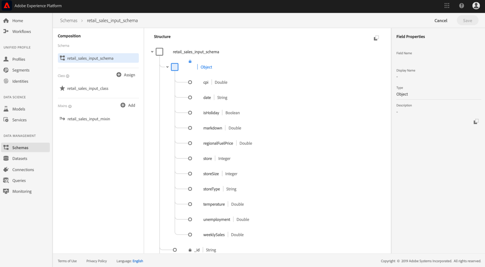

# 預覽結構描述和資料集

從「建立零售銷售模式」和資料集教學課 [程成功完成引導指令碼](./create-retails-sales-dataset.md) 。 您可在Experience Platform上檢視輸出結構描述和資料集。 要查看方案和資料集，請執行以下步驟：

1. 按一下左 **[!UICONTROL Schemas]** 側導航列中的連結，並查找由引導指令碼建立的輸入模式。 架構的名稱將與上一步驟中定義的 `config.yaml` 名稱相對應。 按一下查看架構詳細資訊及其組成。

   

2. 按一 **[!UICONTROL Datasets]** 下左側導覽欄中的連結，並開啟透過按一下清單名稱所建立的輸入資料集。 資料集的名稱會與上一步驟中所定 `config.yaml` 義的名稱對應。

   

3. 按一 **[!UICONTROL Preview Dataset]** 下位於右上方的資料集子集的預覽。

   

## 後續步驟

您現在已使用提供的引導指令碼，成功將零售銷售範例資料吸收到Experience Platform。

要繼續使用收錄的資料：
- [使用Jupyter筆記型電腦分析資料](../jupyterlab/analyze-your-data.md)
   - 使用Data Science Workspace中的Jupyter筆記型電腦存取、探索、視覺化和瞭解您的資料。
- [將來源檔案封裝至配方](./package-source-files-recipe.md)
   - 請依照本教學課程學習如何將來源檔案封裝在可匯入的方式檔案中，將您自己的模型帶入資料科學工作區。