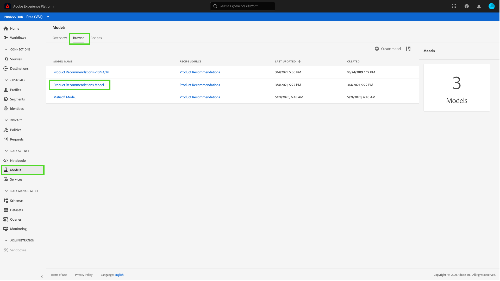

# 在Data Science Workspace UI中發佈模型作為服務

Adobe Experience Platform Data Science Workspace可讓您發佈經過訓練和評估的Model as a Service，讓IMS組織內的使用者對資料評分，而不需建立自己的模型。

## 快速入門

若要完成本教學課程，您必須擁有 [!DNL Experience Platform]. 如果您無權存取 [!DNL Experience Platform]，請在繼續操作之前與系統管理員聯繫。

本教學課程需要現有模型並成功執行訓練。 如果您沒有可發佈的模型，請遵循 [在UI中訓練和評估模型](./train-evaluate-model-ui.md) 教學課程，再繼續。

如果您偏好使用Sensei機器學習API來發佈模型，請參閱 [API教學課程](./publish-model-service-api.md).

## 發佈模型 {#publish-a-model}

在Adobe Experience Platform中，選取 **[!UICONTROL 模型]** 位於左側導覽欄，然後選取 **[!UICONTROL 瀏覽]** 頁簽，列出所有現有模型。 選擇要作為服務發佈的模型的名稱。

選擇 **[!UICONTROL 發佈]** 在「模型」概觀頁面的右上角附近，開始建立「服務」程式。

輸入所需的服務名稱並選擇提供服務說明，請選擇 **[!UICONTROL 下一個]** 完成時。

列出了針對模型的所有成功培訓運行。 新服務將繼承所選培訓運行中的培訓和評分配置。

選擇 **[!UICONTROL 完成]** 建立服務並重新導向至 **[!UICONTROL 服務庫]** 顯示所有可用服務，包括新建立的服務。

## 使用服務進行分數 {#access-a-service}

在Adobe Experience Platform中，選取 **[!UICONTROL 服務]** 標籤來存取 **[!UICONTROL 服務庫]**. 查找要使用的服務並選擇 **[!UICONTROL 開啟]**.

在服務概述頁面中，選取 **[!UICONTROL 分數]**.

為計分運行選擇適當的輸入資料集，然後選擇 **[!UICONTROL 下一個]**. 系統會要求您對計分資料集執行相同步驟。 選取輸入和輸出資料集後，即可更新設定。

建立服務時，它會繼承預設計分配置。 您可以按兩下值，以檢閱這些設定並視需要調整。 對配置滿意後，選擇 **[!UICONTROL 完成]** 開始計分。

在服務的 **概述** 頁面，顯示新計分作業的詳細資訊及其進度。 作業完成後， **[!UICONTROL 最近]** 標題 **[!UICONTROL 分數]** 容器已更新。

## 後續步驟 {#next-steps}

依照本教學課程，您已成功發佈模型作為無障礙服務，並透過 [!UICONTROL 服務庫]. 繼續下一個教學課程，了解如何 [在服務上安排自動培訓和計分](./schedule-models-ui.md).
