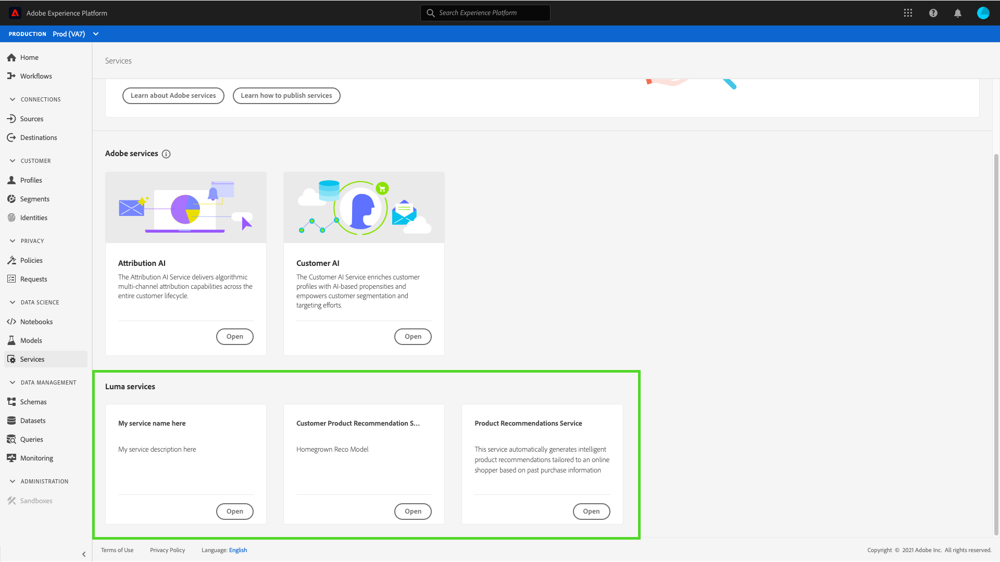

# 在資料科學工作區UI中將模型發佈為服務 {#publish-a-model-as-a-service}

>[!CONTEXTUALHELP]
>id="platform_intelligentservices_publishmodel"
>title="將模型發佈為服務"
>abstract=""

Adobe Experience Platform Data Science Workspace可讓您發佈經過訓練和評估的模型即服務，讓組織內的使用者無需建立自己的模型，就能對資料評分。

## 快速入門

若要完成本教學課程，您必須擁有 [!DNL Experience Platform]. 如果您無法存取中的組織 [!DNL Experience Platform]，請在繼續之前與您的系統管理員交談。

本教學課程需要現有模型並成功完成訓練回合。 如果您沒有可發佈的模型，請遵循 [在UI中訓練及評估模型](./train-evaluate-model-ui.md) 教學課程，然後再繼續。

如果您偏好使用Sensei Machine Learning API發佈模型，請參閱 [api教學課程](./publish-model-service-api.md).

## 發佈模型 {#publish-a-model}

在Adobe Experience Platform中，選取 **[!UICONTROL 模型]** 位於左側導覽欄，然後選取 **[!UICONTROL 瀏覽]** 標籤以列出所有現有模型。 選取您要作為服務發佈的模型名稱。

選取 **[!UICONTROL 發佈]** 在「模型概覽」頁面的右上角附近，開始服務建立程式。

輸入所需的服務名稱，並選擇性地提供服務說明，然後選取 **[!UICONTROL 下一個]** 完成後。

列出模型的所有成功訓練回合。 新服務將會從選取的訓練回合繼承訓練和評分設定。

選取 **[!UICONTROL 完成]** 以建立服務並重新導向至 **[!UICONTROL 服務庫]** 顯示所有可用的服務，包括新建立的服務。

## 使用服務計分 {#access-a-service}

在Adobe Experience Platform中，選取 **[!UICONTROL 服務]** 索引標籤以存取 **[!UICONTROL 服務庫]**. 尋找您要使用的服務，然後選取 **[!UICONTROL 開啟]**.

在服務概觀頁面中，選取 **[!UICONTROL 分數]**.

為評分回合選取適當的輸入資料集，然後選取「 」 **[!UICONTROL 下一個]**. 系統會要求您對評分資料集執行相同步驟。 選取輸入和輸出資料集後，即可更新設定。

建立服務時，會繼承預設評分設定。 您可以檢閱這些設定，並視需要按兩下值以調整它們。 對組態滿意後，選取 **[!UICONTROL 完成]** 以開始評分回合。

在服務的 **概觀** 頁面，會顯示新評分工作及其進度的詳細資訊。 工作完成後， **[!UICONTROL 最近]** 中的標題 **[!UICONTROL 得分]** 容器已更新。

## 後續步驟 {#next-steps}

依照本教學課程，您已成功將模型發佈為可存取的服務，並透過使用新服務對資料進行評分。 [!UICONTROL 服務庫]. 繼續下一段教學課程，瞭解如何 [排程服務的自動訓練和評分回合](./schedule-models-ui.md).
