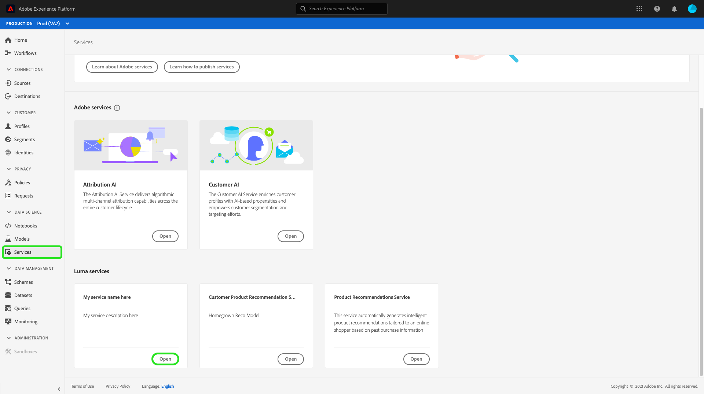
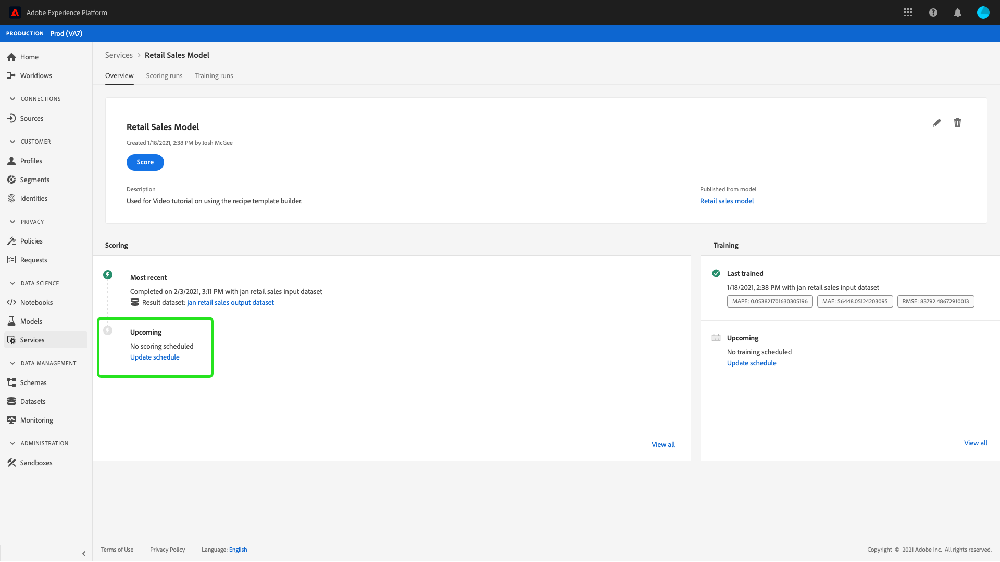

# 在Data Science Workspace UI中排程模型

Adobe Experience Platform [!DNL Data Science Workspace] 可讓您在機器學習服務上設定排程的分數和訓練執行。 自動化培訓和計分流程有助於通過跟上資料中的模式，在時間內維護和提高服務的效率。

本教學課程會逐步說明在現有服務上設定訓練和計分排程的步驟，方法是 [!UICONTROL 服務庫]. 它分為下列主要部分：

- [配置計分](#configure-scheduled-scoring)
- [配置計畫培訓](#configure-scheduled-training)

## 快速入門

若要完成本教學課程，您必須擁有 [!DNL Experience Platform]. 如果您無權存取 [!DNL Experience Platform]，請在繼續操作之前與系統管理員聯繫。

本教學課程需要現有服務。 如果您沒有可使用的無障礙服務，您可以依照 [將模型發佈為服務](./publish-model-service-ui.md).

## 配置計分 {#configure-scheduled-scoring}

模型計分可配置為按計畫自動化進程。 建立服務後，您可以依照下列步驟來設定和套用計分排程：

在Adobe Experience Platform中，選取 **[!UICONTROL 服務]** 標籤來存取 **[!DNL Service Gallery]**. 查找要計畫計分運行的服務並選擇 **[!UICONTROL 開啟]** 檢視 **[!UICONTROL 概述]** 頁面。

概覽頁面會顯示服務的分數資訊。 選取 **[!UICONTROL 更新計畫]** 連結以設定計分排程。

為計分排程設定頻率、開始日期、結束日期、輸入資料集和輸出資料集。 對配置滿意後，選擇 **[!UICONTROL 建立]** 更新服務的計分時間表。

更新的計分排程會顯示在服務的 **[!UICONTROL 概述]** 頁面。

## 配置計畫培訓 {#configure-scheduled-training}

在服務上配置計畫培訓運行可確保機器學習模型更新為最新的資料模式。 每當計畫的培訓運行完成時，將使用生成的培訓模型來為服務提供動力，直到下次計畫的培訓運行。

建立服務後，您可以依照下列步驟來設定和套用訓練排程：

在Adobe Experience Platform中，選取 **[!UICONTROL 服務]** 標籤來存取 **[!UICONTROL 服務庫]**. 查找要安排培訓運行的服務並選擇 **[!UICONTROL 開啟]** 檢視 **[!UICONTROL 概述]** 頁面。

概覽頁面會顯示服務的訓練資訊。 選取 **[!UICONTROL 更新計畫]** 連結以設定訓練排程。

設定用於訓練排程的頻率、開始日期、結束日期和輸入資料集。 對配置滿意後，選擇 **[!UICONTROL 建立]** 更新服務的培訓計畫。

更新的培訓時間表顯示在服務的 **[!UICONTROL 概述]** 頁面。

## 後續步驟

依照本教學課程，您已成功排程服務上的自動化訓練和分數執行，並完成 [!DNL Data Science Workspace] 教學課程UI工作流程。 如果您尚未這麼做，請考慮 [重新啟動教學課程](./create-retails-sales-dataset.md) 並遵循API工作流程來建立、訓練、分數及發佈模型。
