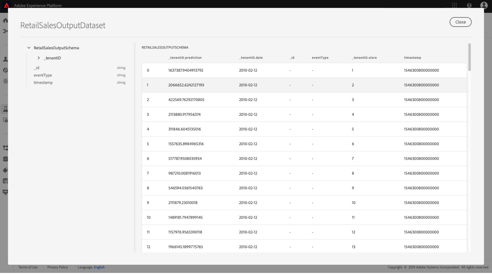

# 在Data Science Workspace UI中對模型評分

在Adobe Experience Platform得分 [!DNL Data Science Workspace] 可通過將輸入資料輸入到現有的訓練模型中來實現。 然後會儲存計分結果，並以新批次形式在指定的輸出資料集中檢視。

本教學課程示範對中的模型進行分數所需的步驟 [!DNL Data Science Workspace] 使用者介面。

## 快速入門

若要完成本教學課程，您必須擁有 [!DNL Experience Platform]. 如果您無權存取 [!DNL Experience Platform]，請在繼續操作之前與系統管理員聯繫。

本教學課程需要經過訓練的模型。 如果您沒有經過培訓的模型，請遵循 [在UI中訓練和評估模型](./train-evaluate-model-ui.md) 教學課程，再繼續。

## 建立新的計分執行

系統會使用從先前完成和評估的訓練執行中最佳化的設定來建立分數執行。 模型的一組最佳配置通常通過查看培訓運行評估度量來確定。

找到最佳培訓運行，以使用其配置進行計分。 然後，通過選擇附加到其名稱的超連結來開啟所需的培訓運行。

從訓練開始 **[!UICONTROL 評估]** 索引標籤，選取 **[!UICONTROL 分數]** 位於畫面右上角。 開始新的計分工作流程。

選取輸入計分資料集，然後選取 **[!UICONTROL 下一個]**.

選擇輸出計分資料集，這是儲存計分結果的專用輸出資料集。 確認您的選取項目並選取 **[!UICONTROL 下一個]**.

工作流程的最後一步會提示您配置計分運行。 這些設定由模型用於計分執行。
請注意，您無法刪除在建立模型期間設定的繼承參數。 您可以按兩下值，或在將游標暫留在項目上時選取還原圖示，以編輯或還原未繼承的參數。

檢查並確認計分設定，並選取 **[!UICONTROL 完成]**  建立並執行計分運行。 系統會將您導向 **[!UICONTROL 計分執行]** 頁簽，新的分數會以 **[!UICONTROL 待定]** 狀態隨即顯示。

可以顯示以下狀態之一的計分運行：
- 待定
- 完成
- 已失敗
- 執行中

狀態會自動更新。 如果狀態為，請繼續進行下一步 **[!UICONTROL 完成]** 或 **[!UICONTROL 失敗]**.

## 查看計分結果

要查看分數結果，請從選擇培訓運行開始。

系統會將您重新導向至培訓執行 **[!UICONTROL 評估]** 頁面。 在培訓運行評估頁的頂部附近，選擇 **[!UICONTROL 計分執行]** 頁簽，查看現有計分運行的清單。

接下來，選擇計分運行以查看運行詳細資訊。

如果選定的計分運行的狀態為「Complete」或「Failed」，則 **[!UICONTROL 檢視活動記錄檔]** 連結可供使用。 如果計分執行失敗，執行記錄可提供有用的資訊以判斷失敗的原因。 若要下載執行記錄檔，請選取 **[!UICONTROL 檢視活動記錄檔]**.

此 **[!UICONTROL 查看活動日誌]** 彈出視窗隨即出現。 選取URL以自動下載相關記錄檔。

您也可以選擇透過選取  **[!UICONTROL 預覽計分結果資料集]**.

提供輸出資料集的預覽。

對於整組計分結果，請選擇 **[!UICONTROL 計分結果資料集]** 在右側欄中找到的連結。

## 後續步驟

本教學課程會逐步引導您完成步驟，使用中經過訓練的模型對資料評分 [!DNL Data Science Workspace]. 請依照 [在UI中發佈Model as a Service](./publish-model-service-ui.md) 可讓組織內的使用者透過輕鬆存取機器學習服務來對資料評分。
