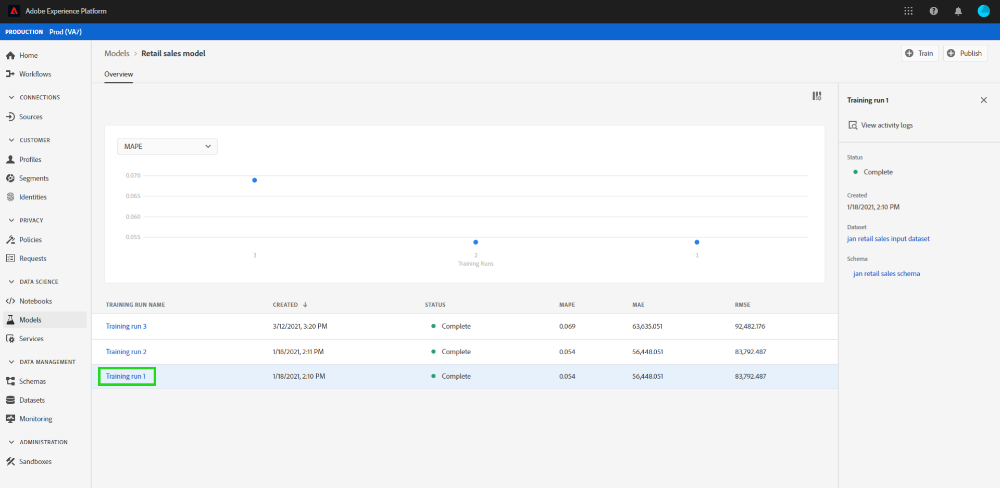

# 在資料科學Workspace UI中為模型評分

>[!NOTE]
>
>Data Science Workspace已無法購買。
>
>本檔案旨在供先前有權使用Data Science Workspace的現有客戶使用。

將輸入資料饋送至現有的已訓練模型，即可在Adobe Experience Platform [!DNL Data Science Workspace]中取得評分。 評分結果會儲存於指定的輸出資料集，並可作為新批次檢視。

本教學課程示範在[!DNL Data Science Workspace]使用者介面中為模型評分所需的步驟。

## 快速入門

要完成此教學課程，您必須有權訪問 [!DNL Experience Platform]。 如果您無權存取 中的 [!DNL Experience Platform]組織，請在繼續操作前與系統管理員聯繫。

此教學課程需要經過訓練的模型。 如果沒有經過訓練的模型，請追隨訓練並在 [UI](./train-evaluate-model-ui.md) 教學課程中評估模型，然後再繼續。

## 建立新的計分運行

評分回合是使用來自先前完成並評估的訓練回合的最佳化設定來建立。 模型的最佳設定集，通常由檢閱訓練回合評估量度來決定。

找到最佳培訓運行以使用其配置進行評分。 然後，通過選擇附加到其名稱的超連結來打開所需的培訓運行。

從「培訓運行 **[!UICONTROL 評估]** 」標籤中，選擇 **[!UICONTROL 螢幕右上角的“分數]** ”。 新的計分工作流程開始。

選擇輸入評分資料集，然後選擇下一個&#x200B;**&#x200B;**。

選擇輸出評分資料集，這是存儲評分結果的專用輸出資料集。 確認您的選取範圍並選取&#x200B;**[!UICONTROL 下一步]**。

工作流程的最後一步會提示您設定評分回合。 模型會將這些設定用於評分回合。
請注意，您無法移除在建立模型期間所設定的繼承引數。 您可以編輯或回覆非繼承的引數，方法是按兩下值或選取回覆圖示，同時將滑鼠游標停留在專案上。

查看並確認評分配置，然後選擇 **[!UICONTROL 完成]**  以創建和執行評分運行。 您被導向到&#x200B;**[!UICONTROL 評分回合]**&#x200B;索引標籤，並顯示狀態為&#x200B;**[!UICONTROL 擱置中]**&#x200B;的新評分回合。

評分回合可以以下列其中一種狀態顯示：
- 待處理
- 完成
- 失敗
- 執行中

狀態自動更新。 如果狀態為 **[!UICONTROL 「完整應用程式]** 」或 **[!UICONTROL 「失敗」]**，請繼續執行下一步。

## 檢視評分結果

若要檢視評分結果，請從選取訓練回合開始。

您將被重定向到培訓運行 **[!UICONTROL 評估]** 頁面。 在培訓運行評估頁面頂部附近，選擇 **[!UICONTROL “評分運行]** ”標籤以視圖現有評分運行的清單。

下一個，選擇一個評分運行以視圖運行詳細信息。

如果所選評分運行的狀態為“完整應用程式”或“失敗”， **[!UICONTROL 則“檢視活動日誌]** ”連結將可用。 如果評分運行失敗，執行日誌可以提供有用的信息來確定失敗的原因。 若要下載執行記錄，請選取&#x200B;**[!UICONTROL 檢視活動記錄]**。

**[!UICONTROL 檢視活動記錄]**&#x200B;彈出視窗會出現。 選取URL以自動下載關聯的記錄檔。

您也可選擇選取&#x200B;**[!UICONTROL 預覽評分結果資料集]**，以檢視您的評分結果。

提供輸出資料集的預覽。

有關完整的評分結果集，請選擇 **[!UICONTROL 右列中的「評分結果數據集]** 」連結。

## 後續步驟

本教學課程將逐步引導您完成在[!DNL Data Science Workspace]中使用經過訓練的模型來評分資料的步驟。 請依照有關[在UI](./publish-model-service-ui.md)中發佈模型即服務的教學課程，讓您組織內的使用者透過提供對機器學習服務的輕鬆存取來評分資料。
