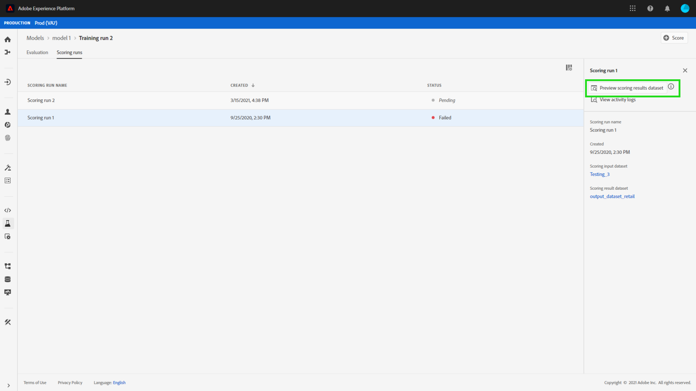

# 在Data Science Workspace UI中對模型進行評分

得分在Adobe Experience Platform [!DNL Data Science Workspace] 可通過將輸入資料輸入到現有的訓練模型中來實現。 然後，將評分結果作為新批儲存在指定的輸出資料集中並可查看。

本教程演示了在中為模型評分所需的步驟 [!DNL Data Science Workspace] 用戶介面。

## 快速入門

要完成本教程，您必須具有訪問 [!DNL Experience Platform]。 如果您沒有訪問 [!DNL Experience Platform]，請在繼續之前與系統管理員聯繫。

本教程需要經過培訓的模型。 如果沒有經過培訓的模型，請 [在UI中訓練和評估模型](./train-evaluate-model-ui.md) 教程，然後繼續。

## 建立新計分運行

使用從先前完成和評估的培訓運行中的優化配置建立評分運行。 模型的一組最佳配置通常通過查看培訓運行評估度量來確定。

找到最佳培訓運行，以便使用其配置進行評分。 然後，通過選擇附加到其名稱的超連結來開啟所需的培訓運行。

從訓練跑 **[!UICONTROL 評估]** 頁籤 **[!UICONTROL 得分]** 位於螢幕右上角。 開始新的評分工作流。

選擇輸入計分資料集並選擇 **[!UICONTROL 下一個]**。

選擇輸出計分資料集，這是儲存計分結果的專用輸出資料集。 確認您的選擇並選擇 **[!UICONTROL 下一個]**。

工作流中的最後一步會提示您配置計分運行。 這些配置由模型用於計分運行。
請注意，不能刪除在建立模型期間設定的繼承參數。 可以通過按兩下值或在懸停在條目上時選擇還原表徵圖來編輯或還原未繼承的參數。

複查並確認評分配置並選擇 **[!UICONTROL 完成]**  建立並執行計分運行。 您被引導到 **[!UICONTROL 計分運行]** 頁籤和新評分運行 **[!UICONTROL 待定]** 顯示狀態。

可以使用以下狀態之一顯示評分運行：
- 待定
- 完成
- 已失敗
- 正在運行

狀態將自動更新。 如果狀態為，則繼續執行下一步 **[!UICONTROL 完成]** 或 **[!UICONTROL 失敗]**。

## 查看評分結果

要查看計分結果，請從選擇培訓運行開始。

您被重定向到培訓運行 **[!UICONTROL 評估]** 的子菜單。 在培訓運行評估頁的頂部附近，選擇 **[!UICONTROL 計分運行]** 頁籤，查看現有計分運行的清單。

接下來，選擇計分運行以查看運行詳細資訊。

如果所選計分運行的狀態為「完成」或「失敗」，則 **[!UICONTROL 查看活動日誌]** 連結可用。 如果計分運行失敗，執行日誌可提供有用資訊以確定失敗的原因。 要下載執行日誌，請選擇 **[!UICONTROL 查看活動日誌]**。

的 **[!UICONTROL 查看活動日誌]** 出現「popover（跨距）」。 選擇URL以自動下載關聯的日誌。

您還可以選擇通過選擇  **[!UICONTROL 預覽評分結果資料集]**。

提供了輸出資料集的預覽。

對於整組計分結果，選擇 **[!UICONTROL 計分結果資料集]** 在右列中找到連結。

## 後續步驟

本教程將指導您完成使用中的培訓模型對資料進行評分的步驟 [!DNL Data Science Workspace]。 按照本教程 [在UI中發佈模型作為服務](./publish-model-service-ui.md) 通過提供對機器學習服務的輕鬆訪問，允許組織內的用戶對資料進行評分。
