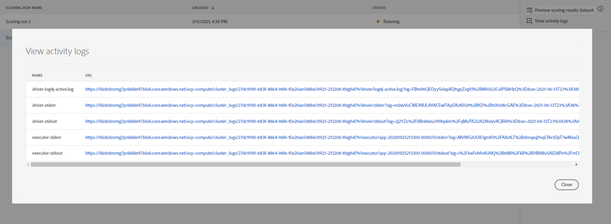

# 在資料科學工作區UI中為模型評分

將輸入資料輸入到現有的訓練模型中，可以在Adobe Experience Platform獲得[!DNL Data Science Workspace]評分。 然後，將計分結果儲存並作為新批在指定的輸出資料集中查看。

本教學課程示範在[!DNL Data Science Workspace]使用者介面中為模型評分所需的步驟。

## 快速入門

要完成本教學課程，您必須具有[!DNL Experience Platform]的存取權。 如果您沒有[!DNL Experience Platform]中IMS組織的存取權，請在繼續之前先與系統管理員聯絡。

本教學課程需要經過訓練的模型。 如果您沒有經過訓練的模型，請依照[訓練，並在UI](./train-evaluate-model-ui.md)教學課程中評估模型，然後再繼續。

## 建立新的計分執行

使用從先前完成和評估的培訓運行中優化的配置建立計分運行。 模型的一組最佳組態通常是透過檢閱訓練執行評估度量來決定。

尋找最佳的訓練執行，以使用其設定進行計分。 然後，選取附加至其名稱的超連結，以開啟所要的訓練執行。

從訓練執行&#x200B;**[!UICONTROL Evaluation]**&#x200B;標籤中，選擇位於螢幕右上角的&#x200B;**[!UICONTROL Score]**。 開始新的計分工作流程。

選擇輸入計分資料集並選擇&#x200B;**[!UICONTROL Next]**。

選擇輸出計分資料集，這是儲存計分結果的專用輸出資料集。 確認您的選擇並選擇&#x200B;**[!UICONTROL Next]**。

工作流程的最後一個步驟會提示您設定計分執行。 這些配置由模型用於計分運行。
請注意，不能刪除在建立模型期間設定的繼承參數。 您可以編輯或還原未繼承的參數，方法是按兩下該值，或在將滑鼠懸停在條目上時選擇還原表徵圖。

檢查並確認計分配置，然後選擇&#x200B;**[!UICONTROL Finish]**&#x200B;以建立並執行計分運行。 您會被導向至&#x200B;**[!UICONTROL Scoring Runs]**&#x200B;標籤，並顯示狀態為&#x200B;**[!UICONTROL Pending]**&#x200B;的新計分執行。

可以顯示具有以下狀態之一的計分運行：
- 待定
- 完成
- 已失敗
- 正在運行

狀態會自動更新。 如果狀態為&#x200B;**[!UICONTROL Complete]**&#x200B;或&#x200B;**[!UICONTROL Failed]**，請繼續下一步。

## 檢視計分結果

若要檢視計分結果，請從選取培訓執行開始。

您會被重新導向至訓練執行&#x200B;**[!UICONTROL Evaluation]**&#x200B;頁面。 在訓練執行評估頁面的頂端，選取&#x200B;**[!UICONTROL Scoring Runs]**&#x200B;標籤，以檢視現有計分執行的清單。

接著，選取計分執行以檢視執行詳細資訊。

如果所選計分運行的狀態為「完成」或「失敗」，則&#x200B;**[!UICONTROL View Activity Logs]**&#x200B;連結將可用。 如果計分運行失敗，執行日誌可提供用於確定失敗原因的有用資訊。 要下載執行日誌，請選擇&#x200B;**[!UICONTROL View Activity Logs]**。

出現&#x200B;**[!UICONTROL View activity logs]**&#x200B;快顯視窗。 選取URL以自動下載相關的記錄檔。

您也可以選擇&#x200B;**[!UICONTROL Preview scoring results dataset]**&#x200B;來檢視計分結果。

提供了輸出資料集的預覽。

要獲得完整的計分結果集，請選擇右列中的&#x200B;**[!UICONTROL Scoring Results Dataset]**&#x200B;連結。

## 後續步驟

本教學課程將逐步引導您使用[!DNL Data Science Workspace]中經過訓練的模型來分數資料。 依照[在UI](./publish-model-service-ui.md)中發佈模型為服務的教學課程，讓組織內的使用者可輕鬆存取機器學習服務，以便對資料評分。
