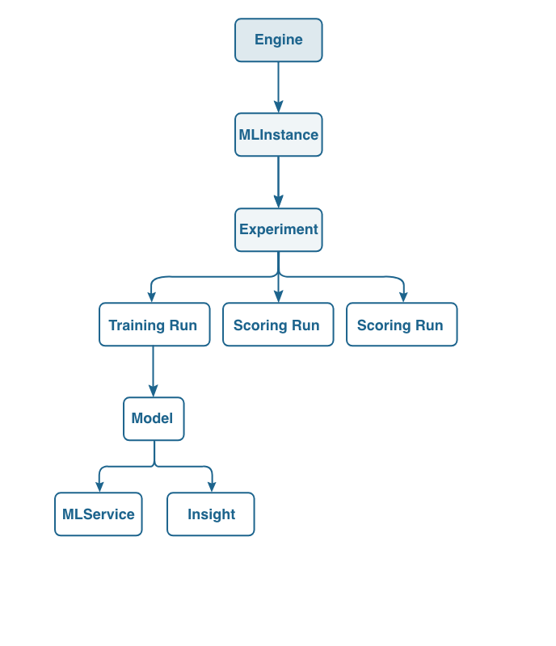

# 使用[!DNL Sensei Machine Learning] API訓練及評估模型


本教學課程將說明如何使用API呼叫建立、訓練和評估模型。 如需API檔案的詳細清單，請參閱[此檔案](https://www.adobe.io/apis/experienceplatform/home/api-reference.html#!acpdr/swagger-specs/sensei-ml-api.yaml)。

## 先決條件

依照[使用API](./import-packaged-recipe-api.md)匯入封裝的配方以建立引擎，使用API訓練和評估模型需要此引擎。

請依照[Experience PlatformAPI驗證教學課程](https://www.adobe.com/go/platform-api-authentication-en)中的說明開始進行API呼叫。

在教學課程中，您現在應該具備下列值：

- `{ACCESS_TOKEN}`：驗證後提供您的特定持有人權杖值。
- `{ORG_ID}`：您在唯一Adobe Experience Platform整合中找到的組織認證。
- `{API_KEY}`：您在唯一Adobe Experience Platform整合中找到的特定API金鑰值。

- 智慧型服務的Docker影像連結

## API工作流程

我們將使用API來建立用於訓練的Experiment Run。 在本教學課程中，我們將專注於引擎、例項和實驗端點。 下表概述三者之間的關係，並介紹「執行」和「模型」的概念。



>[!NOTE]
>
>術語「引擎」、「MLInstance」、「MLService」、「Experiment」和「Model」在UI中稱為不同術語。 如果您來自UI，下表會比較兩者的差異。

| UI詞語 | API詞語 |
| --- | --- |
| 配方 | 引擎 |
| 模型 | MLInstance |
| 訓練回合 | 實驗 |
| 服務 | MLService |

### 建立MLInstance

您可以使用以下請求來建立MLInstance。 您將使用從[使用API](./import-packaged-recipe-ui.md)匯入封裝配方來建立引擎時傳回的`{ENGINE_ID}`。

**要求**

```SHELL
curl -X POST \
  https://platform.adobe.io/data/sensei/mlInstances \
  -H 'Authorization: Bearer {ACCESS_TOKEN}' \
  -H 'Content-Type: application/vnd.adobe.platform.sensei+json;profile=mlInstance.v1.json' \
  -H 'x-api-key: {API_KEY}' \
  -H 'x-gw-ims-org-id: {ORG_ID}' \
  -d `{JSON_PAYLOAD}`
```

`{ACCESS_TOKEN}`：驗證後提供您的特定持有人權杖值。\
`{ORG_ID}`：您在唯一Adobe Experience Platform整合中找到的組織認證。\
`{API_KEY}`：您在唯一Adobe Experience Platform整合中找到的特定API金鑰值。\
`{JSON_PAYLOAD}`：我們的MLInstance的設定。 我們教學課程中使用的範例顯示於此處：

```JSON
{
    "name": "Retail - Instance",
    "description": "Instance for ML Instance",
    "engineId": "{ENGINE_ID}",
    "createdBy": {
        "displayName": "John Doe",
        "userId": "johnd"
    },
    "tags": {
        "purpose": "tutorial"
    },
    "tasks": [
        {
            "name": "train",
            "parameters": [
                {
                    "key": "numFeatures",
                    "value": "10"
                },
                {
                    "key": "maxIter",
                    "value": "2"
                },
                {
                    "key": "regParam",
                    "value": "0.15"
                },
                {
                    "key": "trainingDataLocation",
                    "value": "sample_training_data.csv"
                }
            ]
        },
        {
            "name": "score",
            "parameters": [
                {
                    "key": "scoringDataLocation",
                    "value": "sample_scoring_data.csv"
                },
                {
                    "key": "scoringResultsLocation",
                    "value": "scoring_results.net"
                }
            ]
        }
    ]
}
```

>[!NOTE]
>
>在`{JSON_PAYLOAD}`中，我們定義在`tasks`陣列中用於訓練和評分的引數。 `{ENGINE_ID}`是您要使用之引擎的識別碼，`tag`欄位是用於識別執行個體的選用引數。

回應包含`{INSTANCE_ID}`，代表已建立的MLInstance。 可以建立具有不同設定的多個模型MLInstances。

**回應**

```JSON
{
    "id": "{INSTANCE_ID}",
    "name": "Retail - Instance",
    "description": "Instance for ML Instance",
    "engineId": "{ENGINE_ID}",
    "created": "2018-21-21T11:11:11.111Z",
    "createdBy": {
        "displayName": "John Doe",
        "userId": "johnd"
    },
    "updated": "2018-21-01T11:11:11.111Z",
    "deleted": false,
    "tags": {
        "purpose": "tutorial"
    },
    "tasks": [
        {
            "name": "train",
            "parameters": [...]
        },
        {
            "name": "score",
            "parameters": [...]
        }
    ]
}
```

`{ENGINE_ID}`：此ID代表MLInstance建立所在的引擎。\
`{INSTANCE_ID}`：代表MLInstance的ID。

### 建立實驗

資料科學家會使用實驗在訓練時達成高績效模型。 多項實驗包括變更資料集、功能、學習引數和硬體。 以下是建立「實驗」的範例。

**要求**

```SHELL
curl -X POST \
  https://platform.adobe.io/data/sensei/experiments \
  -H 'Authorization: Bearer {ACCESS_TOKEN}' \
  -H 'Content-Type: application/vnd.adobe.platform.sensei+json;profile=experiment.v1.json' \
  -H 'x-gw-ims-org-id: {ORG_ID}' \
  -H 'x-api-key: {API_KEY' \
  -d `{JSON PAYLOAD}`
```

`{ORG_ID}`：您在唯一Adobe Experience Platform整合中找到的組織認證。\
`{ACCESS_TOKEN}`：驗證後提供您的特定持有人權杖值。\
`{API_KEY}`：您在唯一Adobe Experience Platform整合中找到的特定API金鑰值。\
`{JSON_PAYLOAD}`：已建立的實驗物件。 我們教學課程中使用的範例顯示於此處：

```JSON
{
    "name": "Experiment for Retail ",
    "mlInstanceId": "{INSTANCE_ID}",
    "tags": {
        "test": "guide"
    }
}
```

`{INSTANCE_ID}`：代表MLInstance的ID。

來自實驗建立的回應看起來像這樣。

**回應**

```JSON
{
    "id": "{EXPERIMENT_ID}",
    "name": "Experiment for Retail",
    "mlInstanceId": "{INSTANCE_ID}",
    "created": "2018-01-01T11:11:11.111Z",
    "updated": "2018-01-01T11:11:11.111Z",
    "deleted": false,
    "tags": {
        "test": "guide"
    }
}
```

`{EXPERIMENT_ID}`：代表您剛建立之實驗的ID。
`{INSTANCE_ID}`：代表MLInstance的ID。

### 建立排程的實驗以進行訓練

使用已排程的實驗，因此我們不需要透過API呼叫建立每個單一實驗執行。 相反地，我們在實驗建立期間會提供所有必要的引數，而且會定期建立每次執行。

若要指出已排程實驗的建立，我們必須在要求內文中新增`template`區段。 在`template`中，包含排程執行的所有必要引數，例如`tasks` （表示哪個動作）和`schedule` （表示排程執行的時間）。

**要求**

```Shell
curl -X POST \
  https://platform.adobe.io/data/sensei/experiments \
  -H 'Authorization: Bearer {ACCESS_TOKEN}' \
  -H 'Content-Type: application/vnd.adobe.platform.sensei+json;profile=experiment.v1.json' \
  -H 'x-gw-ims-org-id: {ORG_ID}' \
  -H 'x-api-key: {API_KEY}' \
  -d '{JSON_PAYLOAD}`
```

`{ORG_ID}`：您在唯一Adobe Experience Platform整合中找到的組織認證。\
`{ACCESS_TOKEN}`：驗證後提供您的特定持有人權杖值。\
`{API_KEY}`：您在唯一Adobe Experience Platform整合中找到的特定API金鑰值。\
`{JSON_PAYLOAD}`：要發佈的資料集。 我們教學課程中使用的範例顯示於此處：

```JSON
{
    "name": "Experiment for Retail",
    "mlInstanceId": "{INSTANCE_ID}",
    "template": {
        "tasks": [{
            "name": "train",
            "parameters": [
                   {
                        "value": "1000",
                        "key": "numFeatures"
                    }
            ],
            "specification": {
                "type": "SparkTaskSpec",
                "executorCores": 5,
                "numExecutors": 5
            }
        }],
        "schedule": {
            "cron": "*/20 * * * *",
            "startTime": "2018-11-11",
            "endTime": "2019-11-11"
        }
    }
}
```

當我們建立實驗時，內文`{JSON_PAYLOAD}`應包含`mlInstanceId`或`mlInstanceQuery`引數。 在此範例中，排定的實驗將叫用每20分鐘執行一次，在`cron`引數中設定，從`startTime`開始直到`endTime`。

**回應**

```JSON
{
    "id": "{EXPERIMENT_ID}",
    "name": "Experiment for Retail",
    "mlInstanceId": "{INSTANCE_ID}",
    "created": "2018-11-11T11:11:11.111Z",
    "updated": "2018-11-11T11:11:11.111Z",
    "deleted": false,
    "workflowId": "endid123_0379bc0b_8f7e_4706_bcd9_1a2s3d4f5g_abcdf",
    "template": {
        "tasks": [
            {
                "name": "train",
                "parameters": [...],
                "specification": {
                    "type": "SparkTaskSpec",
                    "executorCores": 5,
                    "numExecutors": 5
                }
            }
        ],
        "schedule": {
            "cron": "*/20 * * * *",
            "startTime": "2018-07-04",
            "endTime": "2018-07-06"
        }
    }
}
```

`{EXPERIMENT_ID}`：代表實驗的ID。\
`{INSTANCE_ID}`：代表MLInstance的ID。


### 建立實驗回合以進行訓練

建立實驗實體後，可以使用以下呼叫建立和執行訓練回合。 您需要`{EXPERIMENT_ID}`，並陳述您要在要求內文中觸發的`mode`。

**要求**

```Shell
curl -X POST \
  https://platform.adobe.io/data/sensei/experiments/{EXPERIMENT_ID}/runs \
  -H 'Authorization: Bearer {ACCESS_TOKEN}' \
  -H 'Content-Type: application/vnd.adobe.platform.sensei+json;profile=experimentRun.v1.json' \
  -H 'x-gw-ims-org-id: {ORG_ID}' \
  -H 'x-api-key: {API_KEY}' \
  -d '{JSON_PAYLOAD}'
```

`{EXPERIMENT_ID}`：對應到您要鎖定之實驗的ID。 這可在建立實驗時的回應中找到。\
`{ORG_ID}`：您在唯一Adobe Experience Platform整合中找到的組織認證。\
`{ACCESS_TOKEN}`：驗證後提供您的特定持有人權杖值。\
`{API_KEY}`：您在唯一Adobe Experience Platform整合中找到的特定API金鑰值。\
`{JSON_PAYLOAD}`：若要建立訓練回合，您必須在內文中包含下列內容：

```JSON
{
    "mode":"Train"
}
```

您也可以包含`tasks`陣列以覆寫設定引數：

```JSON
{
   "mode":"Train",
   "tasks": [
        {
           "name": "train",
           "parameters": [
                {
                   "key": "numFeatures",
                   "value": "2"
                }
            ]
        }
    ]
}
```

您將會收到下列回應，讓您知道`tasks`下的`{EXPERIMENT_RUN_ID}`和組態。

**回應**

```JSON
{
    "id": "{EXPERIMENT_RUN_ID}",
    "mode": "train",
    "experimentId": "{EXPERIMENT_ID}",
    "created": "2018-01-01T11:11:11.903Z",
    "updated": "2018-01-01T11:11:11.903Z",
    "deleted": false,
    "tasks": [
        {
            "name": "Train",
            "parameters": [...]
        }
    ]
}
```

`{EXPERIMENT_RUN_ID}`：代表實驗回合的識別碼。\
`{EXPERIMENT_ID}`：代表實驗執行所在實驗的ID。

### 擷取實驗執行狀態

可使用`{EXPERIMENT_RUN_ID}`查詢實驗回合的狀態。

**要求**

```shell
curl -X GET \
  https://platform.adobe.io/data/sensei/experiments/{EXPERIMENT_ID}/runs/{EXPERIMENT_RUN_ID}/status \
  -H 'Authorization: Bearer {ACCESS_TOKEN}' \
  -H 'x-gw-ims-org-id: {ORG_ID}' \
  -H 'x-api-key: {API_KEY}'
```

`{EXPERIMENT_ID}`：代表實驗的ID。\
`{EXPERIMENT_RUN_ID}`：代表實驗回合的識別碼。\
`{ACCESS_TOKEN}`：驗證後提供您的特定持有人權杖值。\
`{ORG_ID}`：您在唯一Adobe Experience Platform整合中找到的組織認證。\
`{API_KEY}`：您在唯一Adobe Experience Platform整合中找到的特定API金鑰值。

**回應**

GET呼叫將在`state`引數中提供狀態，如下所示：

```JSON
{
    "id": "{EXPERIMENT_ID}",
    "name": "RunStatus for experimentRunId {EXPERIMENT_RUN_ID}",
    "experimentRunId": "{EXPERIMENT_RUN_ID}",
    "deleted": false,
    "status": {
        "tasks": [
            {
                "id": "{MODEL_ID}",
                "state": "DONE",
                "tasklogs": [
                    {
                        "name": "execution",
                        "url": "https://mlbaprod1sapwd7jzid.file.core.windows.net/..."
                    },
                    {
                        "name": "stderr",
                        "url": "https://mlbaprod1sapwd7jzid.file.core.windows.net/..."
                    },
                    {
                        "name": "stdout",
                        "url": "https://mlbaprod1sapwd7jzid.file.core.windows.net/..."
                    }
                ]
            }
        ]
    }
}
```

`{EXPERIMENT_RUN_ID}`：代表實驗回合的識別碼。\
`{EXPERIMENT_ID}`：代表實驗執行所在實驗的ID。

除了`DONE`狀態之外，其他狀態包括：
- `PENDING`
- `RUNNING`
- `FAILED`

若要取得詳細資訊，可在`tasklogs`引數下找到詳細記錄。

### 擷取訓練後的模型

為了在訓練期間取得上述建立的訓練模型，我們提出下列要求：

**要求**

```Shell
curl -X GET \
  'https://platform.adobe.io/data/sensei/models/?property=experimentRunId=={EXPERIMENT_RUN_ID}' \
  -H 'Authorization: Bearer {ACCESS_TOKEN}' \
  -H 'x-gw-ims-org-id: {ORG_ID}'
```

`{EXPERIMENT_RUN_ID}`：對應到您要鎖定之實驗回合的識別碼。 這可在建立實驗回合時的回應中找到。\
`{ACCESS_TOKEN}`：驗證後提供您的特定持有人權杖值。\
`{ORG_ID}`：您在唯一Adobe Experience Platform整合中找到的組織認證。

回應代表已建立的已訓練模型。

**回應**

```JSON
{
    "children": [
        {
            "id": "{MODEL_ID}",
            "name": "Tutorial trained Model",
            "experimentId": "{EXPERIMENT_ID}",
            "experimentRunId": "{EXPERIMENT_RUN_ID}",
            "description": "trained model for ID",
            "modelArtifactUri": "wasb://test-models@mlpreprodstorage.blob.core.windows.net/{MODEL_ID}",
            "created": "2018-01-01T11:11:11.011Z",
            "updated": "2018-01-01T11:11:11.011Z",
            "deleted": false
        }
    ],
    "_page": {
        "property": "ExperimentRunId=={EXPERIMENT_RUN_ID},deleted!=true",
        "count": 1
    }
}
```

`{MODEL_ID}`：與模型對應的識別碼。\
`{EXPERIMENT_ID}`：對應至實驗回合所在實驗的ID。\
`{EXPERIMENT_RUN_ID}`：對應到實驗回合的識別碼。

### 停止並刪除排程的實驗

如果您想要在排程的Experiment `endTime`之前停止執行，這可透過查詢`{EXPERIMENT_ID}`的DELETE要求來完成

**要求**

```Shell
curl -X DELETE \
  'https://platform.adobe.io/data/sensei/experiments/{EXPERIMENT_ID}' \
  -H 'Authorization: Bearer {ACCESS_TOKEN}' \
  -H 'x-gw-ims-org-id: {ORG_ID}'
```

`{EXPERIMENT_ID}`：與實驗對應的識別碼。\
`{ACCESS_TOKEN}`：驗證後提供您的特定持有人權杖值。\
`{ORG_ID}`：您在唯一Adobe Experience Platform整合中找到的組織認證。

>[!NOTE]
>
>API呼叫將停用建立新的實驗執行。 但是，這不會停止執行已執行的實驗執行。

以下是「回應」，通知實驗已成功刪除。

**回應**

```JSON
{
    "title": "Success",
    "status": 200,
    "detail": "Experiment successfully deleted"
}
```

## 後續步驟

本教學課程說明如何使用API來建立引擎、實驗、排程的實驗執行和訓練的模型。 在[下一個練習](./score-model-api.md)中，您將使用表現最佳的訓練模型來評分新的資料集，以做出預測。
