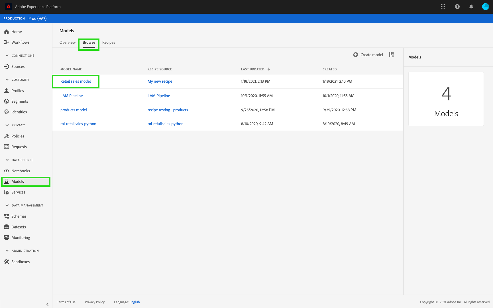
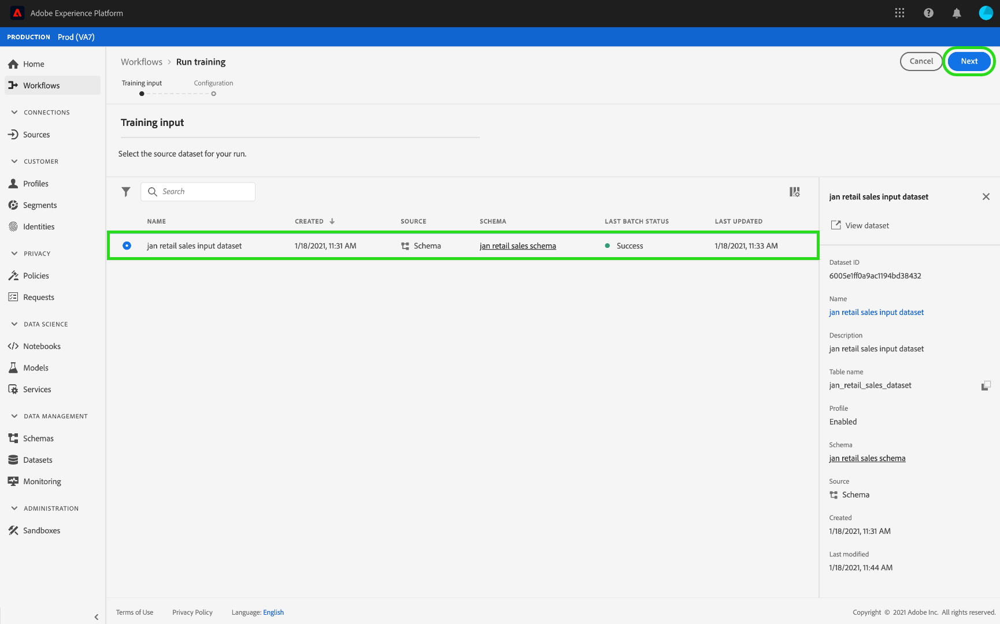
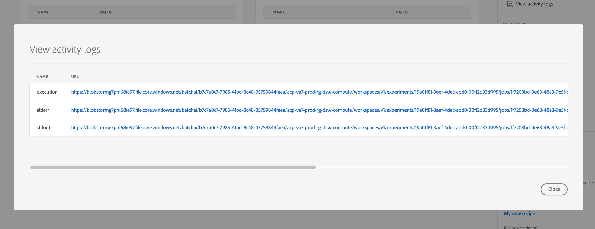

# 在Data Science Workspace UI中訓練和評估模型

在Adobe Experience Platform Data Science Workspace中，機器學習模型是透過結合適合模型目的的現有方式而建立。 然後，對模型進行訓練和評估，通過微調其相關的超參數來優化其運行效率和效能。 方式可重複使用，這表示您可以使用單一方式，針對特定用途建立並量身打造多個模型。

本教學課程會逐步說明建立、訓練和評估模型的步驟。

## 快速入門

若要完成本教學課程，您必須擁有 [!DNL Experience Platform]. 如果您無權存取 [!DNL Experience Platform]，請在繼續操作之前與系統管理員聯繫。

本教學課程需有現有的方式。 如果您沒有配方，請遵循 [在UI中匯入封裝配方](./import-packaged-recipe-ui.md) 教學課程，再繼續。

## 建立一個模式

在Experience Platform中，選取 **[!UICONTROL 模型]** 頁簽，然後選擇「瀏覽」頁簽以查看現有模型。 選擇 **[!UICONTROL 建立模型]** 靠近頁面的右上角，以開始建立模型。

瀏覽現有配方清單，查找並選擇要用於建立模型的配方，然後選擇 **[!UICONTROL 下一個]**.

選取適當的輸入資料集，然後選取 **[!UICONTROL 下一個]**. 這將設定模型的預設輸入培訓資料集。

為模型提供名稱並查看預設的模型配置。 建立方式期間已套用預設設定，請連按兩下設定值，以檢閱及修改設定值。

要提供一組新配置，請選擇 **[!UICONTROL 上傳新設定]** 並將包含模型設定的JSON檔案拖曳至瀏覽器視窗中。 選擇 **[!UICONTROL 完成]** 來建立模型。

>[!NOTE]
>
>設定是獨特且專屬於其預定方式，這表示「零售銷售方式」的設定將無法用於「產品Recommendations方式」。 請參閱 [參考](#reference) 區段，以取得「零售銷售方式」設定清單。

## 建立培訓運行

在Experience Platform中，選取 **[!UICONTROL 模型]** 頁簽，然後選擇「瀏覽」頁簽以查看現有模型。 查找並選取附加到要訓練的模型名稱的超連結。

列出所有現有培訓運行及其當前培訓狀態。 對於使用 [!DNL Data Science Workspace] 使用者介面，系統會使用預設設定和輸入訓練資料集自動產生並執行訓練執行。

通過選擇 **[!UICONTROL 火車]** 在「模型概述」頁面的右上角附近。

為培訓運行選擇培訓輸入資料集，然後選擇 **[!UICONTROL 下一個]**.

顯示了在建立模型期間提供的預設配置，通過按兩下值來相應地更改和修改這些配置。 選擇 **[!UICONTROL 完成]** 建立並執行培訓運行。

>[!NOTE]
>
>設定是獨特且專屬於其預定方式，這表示「零售銷售方式」的設定將無法用於「產品Recommendations方式」。 請參閱 [參考](#reference) 區段，以取得「零售銷售方式」設定清單。

## 評估模型

在Experience Platform中，選取 **[!UICONTROL 模型]** 頁簽，然後選擇「瀏覽」頁簽以查看現有模型。 查找並選取附加到要評估的模型名稱的超連結。

列出所有現有培訓運行及其當前培訓狀態。 在完成多個培訓運行後，可以在模型評估圖中比較不同培訓運行的評估度量。 使用圖表上方的下拉式清單選取評估量度。

平均絕對百分比誤差(MAPE)量度以誤差的百分比表示準確度。 這可用來識別效能最佳的實驗。 MAPE越低越好。

「精準度」量度描述相關例項與總計的百分比 *擷取* 例項。 精準度可視為隨機選取結果正確的機率。

選擇特定的培訓運行可開啟評估頁，從而提供運行的詳細資訊。 甚至在執行完成之前，也可以執行此操作。 在評估頁面上，您可以看到其他評估量度、設定參數，以及訓練執行特有的視覺效果。

您也可以下載活動記錄檔，以查看執行的詳細資訊。 記錄檔對失敗的執行特別有用，可查看發生錯誤的內容。

無法訓練超參數，必須通過測試不同的超參陣列合來優化模型。 重複此模型培訓和評估過程，直到到達優化的模型。

## 後續步驟

本教學課程會逐步引導您建立、訓練和評估模型，於 [!DNL Data Science Workspace]. 一旦到達最佳化模型，您就可以使用經過訓練的模型，依照 [在UI中對模型計分](./score-model-ui.md) 教學課程。

## 參考 {#reference}

### 零售銷售方式配置

超參數決定模型的訓練行為，修改超參數將影響模型的精度和精度：

| 超參數 | 說明 | 建議範圍 |
| --- | --- | --- |
| learning_rate | 學習率通過learning_rate縮小每個樹的貢獻。 learning_rate和n_metorator之間有取捨。 | 0.1 |
| n_metiators | 要執行的升級階段數。 漸層提升對過擬合相當穩健，因此大量資料通常能產生更佳的效能。 | 100 |
| max_depth | 個別回歸估計器的最大深度。 最大深度限制樹中的節點數。 調整此參數以獲得最佳效能；最佳值取決於輸入變數的互動。 | 3 |

其他參數確定模型的技術屬性：

| 參數鍵 | 類型 | 說明 |
| ----- | ----- | ----- |
| `ACP_DSW_INPUT_FEATURES` | 字串 | 逗號分隔的輸入架構屬性清單。 |
| `ACP_DSW_TARGET_FEATURES` | 字串 | 逗號分隔的輸出架構屬性清單。 |
| `ACP_DSW_FEATURE_UPDATE_SUPPORT` | 布林值 | 確定輸入和輸出特徵是否可修改 |
| `tenantId` | 字串 | 此ID可確保您建立的資源與IMS組織中的命名方式正確無誤。 [請依照此處的步驟操作](../../xdm/api/getting-started.md#know-your-tenant_id) 找到您的租用戶ID。 |
| `ACP_DSW_TRAINING_XDM_SCHEMA` | 字串 | 用於訓練模型的輸入結構。 |
| `evaluation.labelColumn` | 字串 | 評估視覺效果的欄標籤。 |
| `evaluation.metrics` | 字串 | 用於評估模型的評估度量清單（以逗號分隔）。 |
| `ACP_DSW_SCORING_RESULTS_XDM_SCHEMA` | 字串 | 用於對模型進行計分的輸出架構。 |
