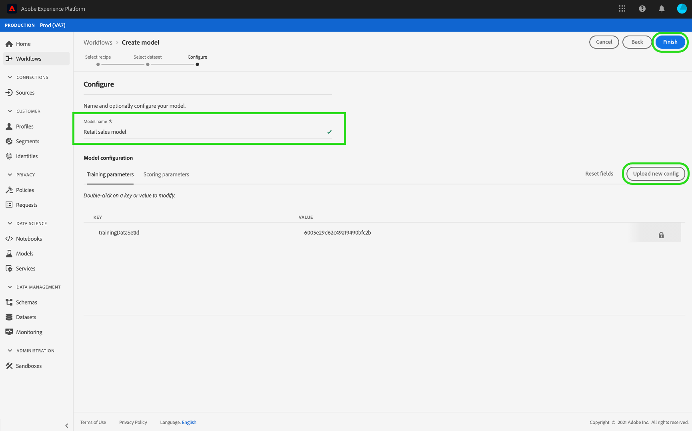

# 在數據科學工作環境 UI中訓練和評估模型

>[!NOTE]
>
>Data Science Workspace已無法購買。
>
>本檔案旨在供先前有權使用Data Science Workspace的現有客戶使用。

在Adobe Experience Platform資料科學Workspace中，機器學習模型是透過結合適合模型意圖的現有方法建立的。 然後訓練並評估模型，藉由微調其相關的Hyperparameters來最佳化其作業效率和效能。 配方可重複使用，這表示您可以透過單一配方建立多個模型，並針對特定用途量身打造。

本教學課程將逐步說明建立、訓練及評估模型的步驟。

## 快速入門

要完成此教學課程，您必須有權訪問 [!DNL Experience Platform]。 如果您沒有[!DNL Experience Platform]中組織的存取權，請在繼續之前與您的系統管理員交談。

該教學課程需要現存方式。 如果沒有配方，請在繼續之前，在UI[&#128279;](./import-packaged-recipe-ui.md)教學課程中追隨匯入打包的方式。

## 建立模型

在“Experience Platform”中，選擇 **[!UICONTROL 位於左側導覽中的“模型]** ”標籤，然後選擇瀏覽標籤以視圖現有模型。 選取頁面右上角附近的&#x200B;**[!UICONTROL 建立模型]**，開始建立模型的程式。

瀏覽現有配方清單，尋找並選取要用來建立模型的配方，然後選取&#x200B;**[!UICONTROL 下一步]**。

選取適當的輸入資料集，然後選取&#x200B;**[!UICONTROL 下一步]**。 這會設定模型的預設輸入訓練資料集。

提供模型的名稱並檢閱預設模型組態。 在配方建立、檢閱及修改組態值期間，透過按兩下值來套用預設組態。

若要提供一組新的組態，請選取&#x200B;**[!UICONTROL 上傳新的組態]**，並將包含模型組態的JSON檔案拖曳到瀏覽器視窗中。 選取&#x200B;**[!UICONTROL 完成]**&#x200B;以建立模型。

>[!NOTE]
>
>配置是唯一的，特定於其預期配方，這意味著零售銷售配方的配置不適用於產品Recommendations配方。 請參閱參考[&#128279;](#reference)部份，了解零售銷售方式配置清單。

## 建立執行培訓

在“Experience Platform”中，選擇 **[!UICONTROL 位於左側導覽中的“模型]** ”標籤，然後選擇瀏覽標籤以視圖現有模型。 查找並選擇附加到要訓練的模型名稱的超連結。

將列出所有現有培訓運行及其當前培訓狀態。 對於使用[!DNL Data Science Workspace]使用者介面建立的模型，會使用預設設定和輸入訓練資料集自動產生並執行訓練回合。

選取模型概觀頁面右上角附近的&#x200B;**[!UICONTROL 訓練]**，以建立新的訓練回合。

選取訓練回合的訓練輸入資料集，然後選取&#x200B;**[!UICONTROL 下一步]**。

模型建立期間提供的預設組態會顯示，按兩下值可相應變更和修改這些組態。 選取&#x200B;**[!UICONTROL 完成]**&#x200B;以建立並執行訓練回合。

>[!NOTE]
>
>設定是唯一的且特定於其預期方式，這表示零售銷售方式的設定不適用於產品Recommendations方式。 請參閱[reference](#reference)區段，以取得零售銷售配方設定清單。

## 評估模型

在Experience Platform中，選取位於左側導覽的&#x200B;**[!UICONTROL 模型]**&#x200B;索引標籤，然後選取瀏覽索引標籤以檢視您現有的模型。 查找並選擇要評估的模型名稱附帶的超連結。

將列出所有現有培訓運行及其當前培訓狀態。 通過多個已完成的培訓運行，可以在模型評估圖表中跨不同培訓運行比較評估指標。 使用圖表上方的下拉式清單選擇評估量度。

平均絕對百分比錯誤 （MAPE） 量度以誤差的百分比表示準確度。 這可用來識別表現最佳的實驗。 MAPE越低越好。

「精確度」量度說明相關執行個體與擷取的&#x200B;*個*&#x200B;執行個體總數的百分比。 精確度可視為隨機選取結果正確的可能性。

選取特定訓練回合會開啟評估頁面，提供該回合的詳細資料。 這可以在運行完成之前平均完成。 在評估頁面上，您可以查看特定於培訓運行的其他評估指標、配置參數和可視化效果。

還可以下載 活動日誌以查看運行的詳細信息。 日誌對於失敗的運行特別有用，以查看出了什麼問題。

無法訓練Hyperparameters，且必須透過測試不同的Hyperparameters組合來最佳化Model。 重複此模型培訓和評估過程，直到得到優化的模型。

## 後續步驟

本教學課程將引導您完成在 中創建 [!DNL Data Science Workspace]、培訓和評估模型的過程。 獲得優化的模型后，可以使用經過訓練的模型，通過遵循 [UI](./score-model-ui.md) 教學課程中的“對模型進行評分”來生成見解。

## 參考 {#reference}

### 零售銷售配方設定

超引數會決定模型的訓練行為，修改Hyperparameters將會影響模型的精確度和精確度：

| 超引數 | 說明 | 建議的範圍 |
| --- | --- | --- |
| learning_rate | 學習率會藉由learning_rate縮減每個樹狀結構的貢獻。 learning_rate和n_estimators之間需要權衡取捨。 | 0.1 |
| n_estimators | 要執行的提升階段數。 梯度提升對於過度擬合相當可靠，因此大量通常會產生更好的性能。 | 100 |
| max_depth | 個別回歸估計值的最大深度。 最大深度會限制樹狀結構中的節點數目。 調整此引數以獲得最佳效能；最佳值取決於輸入變數的互動。 | 3 |

其他引數會決定模型的技術屬性：

| 參數索引鍵 | 類型 | 說明 |
| ----- | ----- | ----- |
| `ACP_DSW_INPUT_FEATURES` | 字串 | 逗號分隔的輸入綱要屬性的清單。 |
| `ACP_DSW_TARGET_FEATURES` | 字串 | 逗號分隔的輸出結構描述屬性清單。 |
| `ACP_DSW_FEATURE_UPDATE_SUPPORT` | 布林值 | 決定是否可修改輸入和輸出功能 |
| `tenantId` | 字串 | 此ID可確保您建立的資源能正確建立名稱空間，並包含在您的組織內。 [請依照這裡的步驟](../../xdm/api/getting-started.md#know-your-tenant_id)尋找您的租使用者ID。 |
| `ACP_DSW_TRAINING_XDM_SCHEMA` | 字串 | 用於培訓模型的輸入綱要。 |
| `evaluation.labelColumn` | 字串 | 用於評估視覺效果的列標籤。 |
| `evaluation.metrics` | 字串 | 用於評估模型的評估量度清單（以逗號分隔）。 |
| `ACP_DSW_SCORING_RESULTS_XDM_SCHEMA` | 字串 | 用於評分模型的輸出結構描述。 |
