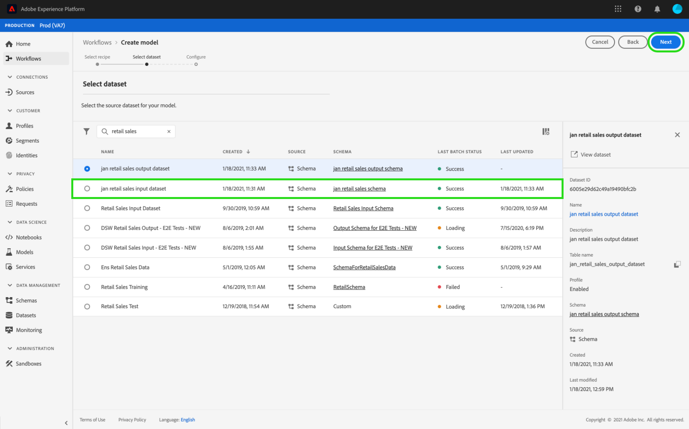

# 在資料科學工作區UI中訓練和評估模型

在Adobe Experience Platform資料科學工作區中，通過合併適合模型意圖的現有配方來建立機器學習模型。 然後對模型進行訓練和評估，以通過微調其相關的超參數來優化其操作效率和功效。 配方是可重用的，這意味著可以使用單個配方建立多個模型並針對特定目的進行定制。

本教程介紹建立、訓練和評估模型的步驟。

## 快速入門

要完成本教程，您必須具有訪問 [!DNL Experience Platform]。 如果您沒有訪問 [!DNL Experience Platform]，請在繼續之前與系統管理員聯繫。

本教程需要現有的配方。 如果您沒有食譜，請遵循 [在UI中導入打包的處方](./import-packaged-recipe-ui.md) 教程，然後繼續。

## 建立一個模式

在Experience Platform中，選擇 **[!UICONTROL 模型]** 頁籤，然後選擇「瀏覽」頁籤以查看現有的「模型」。 選擇 **[!UICONTROL 建立模型]** 靠近頁面右上角以開始「模型」建立過程。

瀏覽現有處方清單，查找並選擇用於建立模型的處方，然後選擇 **[!UICONTROL 下一個]**。

選擇適當的輸入資料集並選擇 **[!UICONTROL 下一個]**。 這將設定模型的預設輸入培訓資料集。

為「模型」提供名稱並查看預設「模型」配置。 在建立處方、複查和修改配置值期間，通過按兩下這些值應用了預設配置。

要提供一組新配置，請選擇 **[!UICONTROL 上載新配置]** 並將包含模型配置的JSON檔案拖到瀏覽器窗口中。 選擇 **[!UICONTROL 完成]** 的子菜單。

>[!NOTE]
>
>配置是唯一且特定於其預期處方的，這意味著零售銷售處方的配置將不適用於產品Recommendations處方。 查看 [參考](#reference) 的子菜單。

## 建立培訓運行

在Experience Platform中，選擇 **[!UICONTROL 模型]** 頁籤，然後選擇「瀏覽」頁籤以查看現有的「模型」。 查找並選取附加到要訓練的模型名稱的超連結。

列出所有現有培訓運行及其當前培訓狀態。 對於使用 [!DNL Data Science Workspace] 使用預設配置和輸入訓練資料集自動生成並執行訓練運行。

通過選擇 **[!UICONTROL 火車]** 靠近「模型概述」頁的右上角。

為培訓運行選擇培訓輸入資料集，然後選擇 **[!UICONTROL 下一個]**。

在「模型」建立過程中提供的預設配置將顯示，通過按兩下這些值來相應地更改和修改這些配置。 選擇 **[!UICONTROL 完成]** 建立並執行培訓運行。

>[!NOTE]
>
>配置是唯一且特定於其預期處方的，這意味著零售銷售處方的配置將不適用於產品Recommendations處方。 查看 [參考](#reference) 的子菜單。

## 評估模型

在Experience Platform中，選擇 **[!UICONTROL 模型]** 頁籤，然後選擇「瀏覽」頁籤以查看現有的「模型」。 查找並選取附加到要評估的模型名稱的超連結。

列出所有現有培訓運行及其當前培訓狀態。 通過多個已完成的培訓運行，可以在模型評估圖表中在不同培訓運行之間比較評估指標。 使用圖形上方的下拉清單選擇評估度量。

「平均絕對百分比誤差」(MAPE)度量以誤差的百分比表示精度。 這用於識別頂級效能實驗。 MAPE越低越好。

「精度」度量描述相關實例與總實例的百分比 *檢索* 實例。 精度可以看作是隨機選擇的結果正確的概率。

選擇特定培訓運行會通過開啟評估頁提供運行的詳細資訊。 這可以在運行完成之前完成。 在評估頁上，可以查看特定於培訓運行的其他評估度量、配置參數和可視化。

您還可以下載活動日誌以查看運行的詳細資訊。 日誌對於失敗的運行來查看錯誤情況尤其有用。

無法訓練超參數，必須通過測試不同的超參陣列合來優化模型。 重複此模型培訓和評估過程，直到您到達一個優化模型。

## 後續步驟

本教程將指導您在中建立、培訓和評估模型 [!DNL Data Science Workspace]。 到達優化模型後，可以使用經過訓練的模型通過遵循 [在UI中對模型進行分級](./score-model-ui.md) 教程。

## 參考 {#reference}

### 零售銷售處方配置

超參數決定模型的訓練行為，修改超參數將影響模型的精度和精度：

| 超參數 | 說明 | 推薦範圍 |
| --- | --- | --- |
| 學習率 | 學習率通過learning_rate縮小每個樹的貢獻。 學習率和n估計量之間存在取捨。 | 0.1 |
| n估計 | 要執行的提升階段數。 梯度提升對於過擬合具有相當的魯棒性，因此，大量的梯度提升通常會導致更好的效能。 | 100 |
| 最大深度 | 單個回歸估計器的最大深度。 最大深度限制樹中節點的數量。 調整此參數以獲得最佳效能；最佳值取決於輸入變數的交互作用。 | 3 |

其他參數確定模型的技術屬性：

| 參數鍵 | 類型 | 說明 |
| ----- | ----- | ----- |
| `ACP_DSW_INPUT_FEATURES` | 字串 | 逗號分隔的輸入架構屬性清單。 |
| `ACP_DSW_TARGET_FEATURES` | 字串 | 以逗號分隔的輸出架構屬性清單。 |
| `ACP_DSW_FEATURE_UPDATE_SUPPORT` | 布林值 | 確定輸入和輸出特徵是否可修改 |
| `tenantId` | 字串 | 此ID確保您建立的資源與組織中的資源同名並包含在組織中。 [請執行此處的步驟](../../xdm/api/getting-started.md#know-your-tenant_id) 找到您的租戶ID。 |
| `ACP_DSW_TRAINING_XDM_SCHEMA` | 字串 | 用於訓練模型的輸入模式。 |
| `evaluation.labelColumn` | 字串 | 用於計算可視化的列標籤。 |
| `evaluation.metrics` | 字串 | 要用於評估模型的評估度量清單，以逗號分隔。 |
| `ACP_DSW_SCORING_RESULTS_XDM_SCHEMA` | 字串 | 用於對模型進行計分的輸出架構。 |
