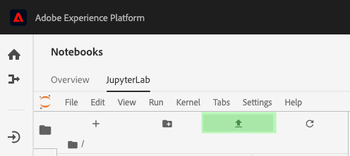

# 管理即時機器學習筆記型電腦(Alpha)

>[!IMPORTANT]
>
>尚未向所有用戶提供即時機器學習。 此功能為Alpha版，仍在測試中。 本檔案可能會有所變更。

以下指南概述建立即時機器學習應用程式所需的步驟。 使用提供的Adobe **[!UICONTROL 即時ML]** 本指南涵蓋培訓模型、建立DSL、將DSL發佈到Edge，以及對請求進行計分。 隨著您逐步實作即時機器學習模型，您應根據資料集的需求修改範本。

## 建立即時機器學習筆記型電腦

在Adobe Experience Platform UI中，選取 **[!UICONTROL 筆記本]** 從 **資料科學**. 下一步，選擇 **[!UICONTROL JupyterLab]** 並讓環境有一段時間載入。


此 [!DNL JupyterLab] 啟動器隨即出現。 向下捲動至 *即時機器學習* ，然後選取 **[!UICONTROL 即時ML]** 筆記本。 範本隨即開啟，其中包含帶有範例資料集的範例筆記型電腦儲存格。


## 導入和發現節點

首先，導入模型的所有必需包。 請確定您打算用於節點編寫的任何套件皆已匯入。

>[!NOTE]
>
>您的匯入清單可能會因您想要建立的模型而異。 隨著時間推移新增新節點，此清單將會變更。 請參閱 [節點參考指南](./node-reference.md) 以取得可用節點的完整清單。

```python
from pprint import pprint
import pandas as pd
import numpy as np
import json
import uuid
from shutil import copyfile
from pathlib import Path
from datetime import date, datetime, timedelta
from platform_sdk.dataset_reader import DatasetReader

from rtml_nodelibs.nodes.standard.preprocessing.json_to_df import JsonToDataframe
from rtml_sdk.edge.utils import EdgeUtils
from rtml_sdk.graph.utils import GraphBuilder
from rtml_nodelibs.nodes.standard.ml.onnx import ONNXNode
from rtml_nodelibs.core.nodefactory import NodeFactory as nf
from rtml_nodelibs.nodes.standard.preprocessing.pandasnode import Pandas
from rtml_nodelibs.nodes.standard.preprocessing.one_hot_encoder import OneHotEncoder
from rtml_nodelibs.nodes.standard.ml.artifact_utils import ModelUpload
from rtml_nodelibs.core.nodefactory import NodeFactory as nf
from rtml_nodelibs.core.datamsg import DataMsg
```

下列程式碼儲存格會列印可用節點清單。

```python
# Discover Nodes
pprint(nf.discover_nodes())
```


## 即時機器學習模型的訓練

使用下列選項之一，您將編寫 [!DNL Python] 讀取、預處理和分析資料的代碼。 接下來，您需要培訓自己的ML模型，將其序列化為ONNX格式，然後將其上傳到即時機器學習模型儲存。

- [在JupyterLab筆記本中培訓您自己的型號](#training-your-own-model)
- [將您自己預先培訓的ONNX型號上載到JupyterLab筆記型電腦](#pre-trained-model-upload)

### 訓練您自己的模型 {#training-your-own-model}

首先，載入您的訓練資料。

>[!NOTE]
>
>在 **即時ML** 範本， [車險CSV資料集](https://github.com/adobe/experience-platform-dsw-reference/tree/master/datasets/insurance) 從 [!DNL Github].


如果您想要在Adobe Experience Platform內使用資料集，請取消下方儲存格的註解。 接下來，您需要替換 `DATASET_ID` 值。


若要存取 [!DNL JupyterLab] 筆記本，選擇 **資料** 標籤 [!DNL JupyterLab]. 此 **[!UICONTROL 資料集]** 和 **[!UICONTROL 結構]** 目錄。 選擇 **[!UICONTROL 資料集]** ，然後按一下右鍵，然後選取 **[!UICONTROL 在筆記本中探索資料]** 選項（位於您要使用的資料集上的下拉式功能表）。 可執行的代碼項出現在筆記本底部。 這個手機里 `dataset_id`.


完成後，按一下右鍵並刪除您在筆記本底部生成的單元格。

### 培訓屬性

使用提供的模板，修改內的任何培訓屬性 `config_properties`.

```python
config_properties = {
    "train_records_limit":1000000,
    "n_estimators": "80",
    "max_depth": "5",
    "ten_id": "_experienceplatform"  
}
```

### 準備模型

使用 **[!UICONTROL 即時ML]** 模板，您需要分析、預處理、培訓和評估ML模型。 這可透過套用資料轉換和建立訓練管道來完成。

**資料轉換**

此 **[!UICONTROL 即時ML]** 範本 **資料轉換** 儲存格必須經過修改，才能與您自己的資料集搭配使用。 這通常涉及重新命名欄、資料統計，以及資料準備/功能工程。

>[!NOTE]
>
>下列範例已壓縮，以利閱讀 `[ ... ]`. 請檢視並展開 *即時ML* 完整代碼單元格的模板資料轉換部分。

```python
df1.rename(columns = {config_properties['ten_id']+'.identification.ecid': 'ecid',
                     [ ... ]}, inplace=True)
df1 = df1[['ecid', 'km', 'cartype', 'age', 'gender', 'carbrand', 'leasing', 'city', 
       'country', 'nationality', 'primaryuser', 'purchase', 'pricequote', 'timestamp']]
print("df1 shape 1", df1.shape)
#########################################
# Data Rollup
######################################### 
df1['timestamp'] = pd.to_datetime(df1.timestamp)
df1['hour'] = df1['timestamp'].dt.hour.astype(int)
df1['dayofweek'] = df1['timestamp'].dt.dayofweek

df1.loc[(df1['purchase'] == 'yes'), 'purchase'] = 1
df1.purchase.fillna(0, inplace=True)
df1['purchase'] = df1['purchase'].astype(int)

[ ... ]

print("df1 shape 2", df1.shape)

#########################################
# Data Preparation/Feature Engineering
#########################################      

df1['carbrand'] = df1['carbrand'].str.lower()
df1['country'] = df1['country'].str.lower()
df1.loc[(df1['carbrand'] == 'vw'), 'carbrand'] = 'volkswagen'

[ ... ]

df1['age'].fillna(df1['age'].median(), inplace=True)
df1['gender'].fillna('notgiven', inplace=True)

[ ... ]

df1['city'] = df1.groupby('country')['city'].transform(lambda x: x.fillna(x.mode()))
df1.dropna(subset = ['pricequote'], inplace=True)
print("df1 shape 3", df1.shape)
print(df1)

#grouping
grouping_cols = ['carbrand', 'cartype', 'city', 'country']

for col in grouping_cols:
    df_idx = pd.DataFrame(df1[col].value_counts().head(6))

    def grouping(x):
        if x in df_idx.index:
            return x
        else:
            return "Others"
    df1[col] = df1[col].apply(lambda x: grouping(x))

def age(x):
    if x < 20:
        return "u20"
    elif x > 19 and x < 29:
    [ ... ]
    else: 
        return "Others"

df1['age'] = df1['age'].astype(int)
df1['age_bucket'] = df1['age'].apply(lambda x: age(x))

df_final = df1[['hour', 'dayofweek','age_bucket', 'gender', 'city',  
   'country', 'carbrand', 'cartype', 'leasing', 'pricequote', 'purchase']]
print("df final", df_final.shape)

cat_cols = ['age_bucket', 'gender', 'city', 'dayofweek', 'country', 'carbrand', 'cartype', 'leasing']
df_final = pd.get_dummies(df_final, columns = cat_cols)
```

執行提供的儲存格以查看範例結果。 從 `carinsurancedataset.csv` 資料集會傳回您定義的修改。


**培訓管道**

接下來，您需要建立培訓管道。 除了您需要轉換並生成ONNX檔案外，這看起來將類似於任何其他培訓管道檔案。

使用上一個儲存格中定義的資料轉換，修改範本。 以下突出顯示的代碼用於在您的功能管道中生成ONNX檔案。 請檢視 *即時ML* 完整管道代碼儲存格的範本。

```python
#for generating onnx
def generate_onnx_resources(self):        
    install_dir = os.path.expanduser('~/my-workspace')
    print("Generating Onnx")
        
    from skl2onnx import convert_sklearn
    from skl2onnx.common.data_types import FloatTensorType
        
    # ONNX-ification
    initial_type = [('float_input', FloatTensorType([None, self.feature_len]))]

    print("Converting Model to Onnx")
    onx = convert_sklearn(self.model, initial_types=initial_type)
             
    with open("model.onnx", "wb") as f:
        f.write(onx.SerializeToString())
            
    print("Model onnx created")
```

完成培訓管道並通過資料轉換修改資料後，請使用以下單元格運行培訓。

```python
model = train(config_properties, df_final)
```

### 生成並上傳ONNX模型

完成成功的培訓運行後，您需要生成ONNX模型，並將培訓的模型上傳到即時機器學習模型儲存區。 運行以下單元格後，您的ONNX型號將與所有其他筆記本一起顯示在左側導軌中。

```python
import os
import skl2onnx, subprocess

model.generate_onnx_resources()
```

>[!NOTE]
>
>變更 `model_path` 字串值(`model.onnx`)來變更模型的名稱。

```python
model_path = "model.onnx"
```

>[!NOTE]
>
>以下單元格不可編輯或不可刪除，並且是Real-time Machine Learning應用程式工作所必需的。

```python
model = ModelUpload(params={'model_path': model_path})
msg_model = model.process(None, 1)
model_id = msg_model.model['model_id']
 
print("Model ID: ", model_id)
```


### 上傳您自己預先培訓的ONNX型號 {#pre-trained-model-upload}

使用 [!DNL JupyterLab] 筆記型電腦，將預先培訓的ONNX型號上載到 [!DNL Data Science Workspace] 筆記型電腦環境。



接下來，變更 `model_path` 字串值 *即時ML* 筆記型電腦，與ONNX型號匹配。 完成後，執行 *設定模型路徑* 然後運行 *將模型上傳至RTML模型存放區* 單元格。 成功時，回應中會傳回您的模型位置和模型ID。


## 域特定語言(DSL)建立

本節概述建立DSL。 您將編寫節點，其中包含任何資料預處理以及ONNX節點。 接下來，使用節點和邊建立DSL圖形。 Edge使用基於元組的格式(node_1、node_2)連接節點。 圖形不應有循環。

>[!IMPORTANT]
>
>必須使用ONNX節點。 如果沒有ONNX節點，應用程式將失敗。

### 節點製作

>[!NOTE]
>
> 您可能會根據使用的資料類型有多個節點。 以下範例僅概述 *即時ML* 範本。 請檢視 *即時ML* 範本 *節點製作* 區段。

下面的熊貓節點使用 `"import": "map"` 在參數中以字串形式導入方法名稱，然後輸入參數作為映射函式。 以下範例是使用 `{'arg': {'dataLayerNull': 'notgiven', 'no': 'no', 'yes': 'yes', 'notgiven': 'notgiven'}}`. 在對應就緒後，您可以選擇設定 `inplace` as `True` 或 `False`. 設定 `inplace` as `True` 或 `False` 根據是否要應用轉換。 依預設 `"inplace": False` 建立新列。 提供新欄名稱的支援已設定為在後續版本中新增。 最後一行 `cols` 可以是單一欄名稱或欄清單。 指定要套用轉換的欄。 在此範例中 `leasing` 已指定。 如需可用節點及其使用方式的詳細資訊，請造訪 [節點參考指南](./node-reference.md).

```python
# Renaming leasing column using Pandas Node
leasing_mapper_node = Pandas(params={'import': 'map',
                                'kwargs': {'arg': {
                                    'dataLayerNull': 'notgiven', 
                                    'no': 'no', 
                                    'yes': 'yes', 
                                    'notgiven': 'notgiven'}},
                                'inplace': True,
                                'cols': 'leasing'})
```

### 建立DSL圖形

在建立節點後，下一步是將節點鏈結在一起以建立圖形。

首先，請建立陣列，列出屬於圖形一部分的所有節點。

```python
nodes = [json_df_node, 
        to_datetime_node,
        hour_node,
        dayofweek_node,
        age_fillna_node,
        carbrand_fillna_node,
        country_fillna_node,
        cartype_primary_nationality_km_fillna_node,
        carbrand_mapper_node,
        cartype_mapper_node,
        country_mapper_node,
        gender_mapper_node,
        leasing_mapper_node,
        age_to_int_node,
        age_bins_node,
        dummies_node, 
        onnx_node]
```

接下來，將節點與邊連接。 每個元組是 [!DNL Edge] 連線。

>[!TIP]
>
> 由於節點之間呈線性依賴關係（每個節點取決於前一個節點的輸出），因此您可以使用簡單的Python清單理解來建立連結。 如果節點依賴多個輸入，請添加您自己的連接。

```python
edges = [(nodes[i], nodes[i+1]) for i in range(len(nodes)-1)]
```

連線節點後，建立圖表。 下面的儲存格是必填的，無法編輯或刪除。

```python
dsl = GraphBuilder.generate_dsl(nodes=nodes, edges=edges)
pprint(json.loads(dsl))
```

完成後， `edge` 會傳回物件，其中包含每個節點以及對應至這些節點的參數。


## 發佈至Edge（中樞）

>[!NOTE]
>
>即時機器學習會暫時部署至Adobe Experience Platform Hub並由其管理。 如需其他詳細資訊，請造訪 [即時機器學習架構](./home.md#architecture).

現在您已建立DSL圖形，可以將圖形部署到 [!DNL Edge].

>[!IMPORTANT]
>
>不發佈至 [!DNL Edge] 通常，這會使負載過載 [!DNL Edge] 節點。 不建議多次發佈相同模型。

```python
edge_utils = EdgeUtils()
(edge_location, service_id) = edge_utils.publish_to_edge(dsl=dsl)
print(f'Edge Location: {edge_location}')
print(f'Service ID: {service_id}')
```

### 更新DSL並重新發佈至Edge（可選）

如果您不需要更新DSL，可跳到 [分數](#scoring).

>[!NOTE]
>
>只有當您想要更新已發佈到Edge的現有DSL時，才需要下列單元。

您的模型可能會持續開發。 與其建立全新服務，不如使用新模型更新現有服務。 您可以定義要更新的節點，為其分配新ID，然後將新DSL重新上傳到 [!DNL Edge].

在以下範例中，節點0會以新ID更新。

```python
# Update the id of Node 0 with a random uuid.

dsl_dict = json.loads(dsl)
print(f"ID of Node 0 in current DSL: {dsl_dict['edge']['applicationDsl']['nodes'][0]['id']}")

new_node_id = str(uuid.uuid4())
print(f'Updated Node ID: {new_node_id}')

dsl_dict['edge']['applicationDsl']['nodes'][0]['id'] = new_node_id
```


更新節點ID後，您可以將更新的DSL重新發佈到Edge。

```python
# Republish the updated DSL to Edge
(edge_location_ret, service_id, updated_dsl) = edge_utils.update_deployment(dsl=json.dumps(dsl_dict), service_id=service_id)
print(f'Updated dsl: {updated_dsl}')
```

您將返回更新的DSL。


## 分數 {#scoring}

發佈至 [!DNL Edge]，則計分是由用戶端的POST要求完成。 通常，這可以從需要ML分數的客戶端應用程式中完成。 您也可以從Postman執行。 此 **[!UICONTROL 即時ML]** 範本使用EdgeUtils來示範此程式。

>[!NOTE]
>
>計分開始前需要較短的處理時間。

```python
# Wait for the app to come up
import time
time.sleep(20)
```

使用與訓練中使用的相同結構，會產生計分資料範例。 此資料可用來建立計分資料幀，然後轉換為計分字典。 請檢視 *即時ML* 完整代碼儲存格的範本。


### 對Edge端點進行分數

在 *即時ML* 對您的 [!DNL Edge] 服務。


計分完成後， [!DNL Edge] 來自的URL、裝載和計分輸出 [!DNL Edge] 的URL。

## 從 [!DNL Edge]

若要在 [!DNL Edge]，請執行下列程式碼儲存格。 無法編輯或刪除此單元格。

```python
services = edge_utils.list_deployed_services()
print(services)
```

傳回的回應是您已部署服務的陣列。

```json
[
    {
        "created": "2020-05-25T19:18:52.731Z",
        "deprecated": false,
        "id": "40eq76c0-1c6f-427a-8f8f-54y9cdf041b7",
        "type": "edge",
        "updated": "2020-05-25T19:18:52.731Z"
    }
]
```

## 從中刪除已部署的應用程式或服務ID [!DNL Edge] （可選）

>[!CAUTION]
>
>此單元格用於刪除已部署的Edge應用程式。 除非您需要刪除已部署的，否則請勿使用下列儲存格 [!DNL Edge] 應用程式。

```python
if edge_utils.delete_from_edge(service_id=service_id):
    print(f"Deleted service id {service_id} successfully")
else:
    print(f"Failed to delete service id {service_id}")
```

## 後續步驟

依照上述教學課程，您已成功訓練ONNX模型，並將其上傳至即時機器學習模型存放區。 此外，您已對即時機器學習模型進行評分並加以部署。 如果您想要進一步了解可用於模型編寫的節點，請造訪 [節點參考指南](./node-reference.md).
