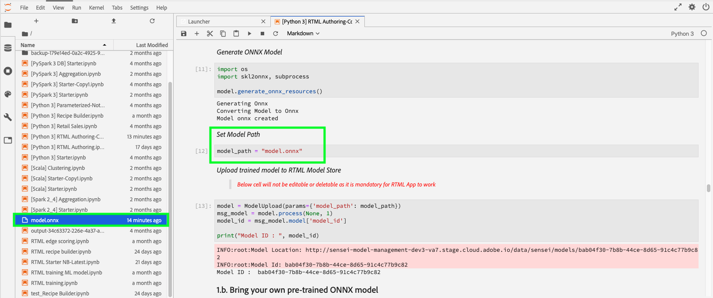

# 管理即時機器學習筆記型電腦(Alpha)

>[!IMPORTANT]
>
>目前尚未針對所有使用者提供即時機器學習。 此功能是alpha版，仍在測試中。 本檔案可能會有所變更。

以下指南概述建立即時機器學習應用程式所需的步驟。 使用&#x200B;**[!UICONTROL Real-time ML]** Python筆記型電腦範本的Adobe，本指南涵蓋培訓模型、建立DSL、將DSL發佈至Edge，以及計分要求。 當您透過實作即時機器學習模型進行時，您應根據資料集的需求修改範本。

## 建立即時機器學習筆記型電腦

在Adobe Experience PlatformUI中，從&#x200B;**Data Science**&#x200B;中選擇&#x200B;**[!UICONTROL Notebooks]**。 接著，選擇&#x200B;**[!UICONTROL JupyterLab]**&#x200B;並為環境提供一些載入時間。


出現[!DNL JupyterLab]啟動器。 向下滾動到&#x200B;*即時機器學習*&#x200B;並選擇&#x200B;**[!UICONTROL Real-time ML]**&#x200B;筆記本。 範本開啟時，包含範例筆記型儲存格和範例資料集。


## 匯入和發現節點

首先，導入模型的所有必需包。 請務必匯入您計畫用於節點編寫的任何套件。

>[!NOTE]
>
>您的匯入清單可能會因您想要建立的模型而異。 隨著新節點的不斷添加，此清單將會發生變化。 請參閱[節點參考指南](./node-reference.md)以取得可用節點的完整清單。

```python
from pprint import pprint
import pandas as pd
import numpy as np
import json
import uuid
from shutil import copyfile
from pathlib import Path
from datetime import date, datetime, timedelta
from platform_sdk.dataset_reader import DatasetReader

from rtml_nodelibs.nodes.standard.preprocessing.json_to_df import JsonToDataframe
from rtml_sdk.edge.utils import EdgeUtils
from rtml_sdk.graph.utils import GraphBuilder
from rtml_nodelibs.nodes.standard.ml.onnx import ONNXNode
from rtml_nodelibs.core.nodefactory import NodeFactory as nf
from rtml_nodelibs.nodes.standard.preprocessing.pandasnode import Pandas
from rtml_nodelibs.nodes.standard.preprocessing.one_hot_encoder import OneHotEncoder
from rtml_nodelibs.nodes.standard.ml.artifact_utils import ModelUpload
from rtml_nodelibs.core.nodefactory import NodeFactory as nf
from rtml_nodelibs.core.datamsg import DataMsg
```

下列程式碼儲存格會列印可用節點的清單。

```python
# Discover Nodes
pprint(nf.discover_nodes())
```


## 訓練即時機器學習模型

使用下列選項之一，您將編寫[!DNL Python]程式碼以讀取、預處理和分析資料。 接下來，您需要訓練自己的ML模型，將其序列化為ONNX格式，然後將其上傳至Real-time Machine Learning模型商店。

- [在JupyterLab筆記型電腦中訓練您自己的機型](#training-your-own-model)
- [將您自己預先培訓的ONNX型號上傳到JupyterLab筆記型電腦](#pre-trained-model-upload)

### 培訓您自己的型號{#training-your-own-model}

首先，載入您的訓練資料。

>[!NOTE]
>
>在&#x200B;**即時ML**&#x200B;範本中，從[!DNL Github]擷取[汽車保險CSV資料集](https://github.com/adobe/experience-platform-dsw-reference/tree/master/datasets/insurance)。


如果您想從Adobe Experience Platform使用資料集，請取消下方的儲存格註解。 接下來，您需要將`DATASET_ID`取代為適當的值。


要訪問[!DNL JupyterLab]筆記本中的資料集，請在[!DNL JupyterLab]的左側導航中選擇&#x200B;**資料**&#x200B;頁籤。 將顯示&#x200B;**[!UICONTROL Datasets]**&#x200B;和&#x200B;**[!UICONTROL Schemas]**&#x200B;目錄。 選擇&#x200B;**[!UICONTROL Datasets]**&#x200B;並按一下右鍵，然後從要使用的資料集上的下拉菜單中選擇&#x200B;**[!UICONTROL Explore Data in Notebook]**&#x200B;選項。 可執行代碼條目出現在筆記本底部。 此儲存格包含您的`dataset_id`。


完成後，按一下右鍵並刪除在筆記本底部生成的單元格。

### 訓練屬性

使用提供的模板，修改`config_properties`中的任何培訓屬性。

```python
config_properties = {
    "train_records_limit":1000000,
    "n_estimators": "80",
    "max_depth": "5",
    "ten_id": "_experienceplatform"  
}
```

### 準備您的模型

使用&#x200B;**[!UICONTROL Real-time ML]**&#x200B;範本，您需要分析、預處理、訓練和評估ML模型。 這是透過套用資料轉換和建立訓練管道來完成的。

**資料轉換**

**[!UICONTROL Real-time ML]**&#x200B;範本&#x200B;**資料轉換**&#x200B;儲存格需要修改，才能與您自己的資料集搭配使用。 這通常涉及重新命名欄、資料統計以及資料準備／功能工程。

>[!NOTE]
>
>以下範例已使用`[ ... ]`以利於可讀性。 請查看並展開完整代碼單元格的&#x200B;*即時ML*&#x200B;模板資料轉換部分。

```python
df1.rename(columns = {config_properties['ten_id']+'.identification.ecid' : 'ecid',
                     [ ... ]}, inplace=True)
df1 = df1[['ecid', 'km', 'cartype', 'age', 'gender', 'carbrand', 'leasing', 'city', 
       'country', 'nationality', 'primaryuser', 'purchase', 'pricequote', 'timestamp']]
print("df1 shape 1", df1.shape)
#########################################
# Data Rollup
######################################### 
df1['timestamp'] = pd.to_datetime(df1.timestamp)
df1['hour'] = df1['timestamp'].dt.hour.astype(int)
df1['dayofweek'] = df1['timestamp'].dt.dayofweek

df1.loc[(df1['purchase'] == 'yes'), 'purchase'] = 1
df1.purchase.fillna(0, inplace=True)
df1['purchase'] = df1['purchase'].astype(int)

[ ... ]

print("df1 shape 2", df1.shape)

#########################################
# Data Preparation/Feature Engineering
#########################################      

df1['carbrand'] = df1['carbrand'].str.lower()
df1['country'] = df1['country'].str.lower()
df1.loc[(df1['carbrand'] == 'vw'), 'carbrand'] = 'volkswagen'

[ ... ]

df1['age'].fillna(df1['age'].median(), inplace=True)
df1['gender'].fillna('notgiven', inplace=True)

[ ... ]

df1['city'] = df1.groupby('country')['city'].transform(lambda x : x.fillna(x.mode()))
df1.dropna(subset = ['pricequote'], inplace=True)
print("df1 shape 3", df1.shape)
print(df1)

#grouping
grouping_cols = ['carbrand', 'cartype', 'city', 'country']

for col in grouping_cols:
    df_idx = pd.DataFrame(df1[col].value_counts().head(6))

    def grouping(x):
        if x in df_idx.index:
            return x
        else:
            return "Others"
    df1[col] = df1[col].apply(lambda x: grouping(x))

def age(x):
    if x < 20:
        return "u20"
    elif x > 19 and x < 29:
    [ ... ]
    else: 
        return "Others"

df1['age'] = df1['age'].astype(int)
df1['age_bucket'] = df1['age'].apply(lambda x: age(x))

df_final = df1[['hour', 'dayofweek','age_bucket', 'gender', 'city',  
   'country', 'carbrand', 'cartype', 'leasing', 'pricequote', 'purchase']]
print("df final", df_final.shape)

cat_cols = ['age_bucket', 'gender', 'city', 'dayofweek', 'country', 'carbrand', 'cartype', 'leasing']
df_final = pd.get_dummies(df_final, columns = cat_cols)
```

執行提供的儲存格，查看範例結果。 從`carinsurancedataset.csv`資料集傳回的輸出表格會傳回您定義的修改。


**培訓管道**

接下來，您需要建立培訓管道。 除了需要轉換和生成ONNX檔案外，它看起來與任何其他培訓管線檔案類似。

使用上一個儲存格中定義的資料轉換，修改範本。 以下突出顯示的代碼用於在功能管線中生成ONNX檔案。 請檢視完整管線程式碼儲存格的&#x200B;*即時ML*&#x200B;範本。

```python
#for generating onnx
def generate_onnx_resources(self):        
    install_dir = os.path.expanduser('~/my-workspace')
    print("Generating Onnx")
        
    from skl2onnx import convert_sklearn
    from skl2onnx.common.data_types import FloatTensorType
        
    # ONNX-ification
    initial_type = [('float_input', FloatTensorType([None, self.feature_len]))]

    print("Converting Model to Onnx")
    onx = convert_sklearn(self.model, initial_types=initial_type)
             
    with open("model.onnx", "wb") as f:
        f.write(onx.SerializeToString())
            
    print("Model onnx created")
```

完成培訓管道並透過資料轉換修改資料後，請使用下列儲存格來執行培訓。

```python
model = train(config_properties, df_final)
```

### 生成並上傳ONNX模型

完成成功的培訓運行後，您需要生成ONNX模型，並將培訓的模型上傳到即時機器學習模型儲存。 運行以下單元格後，您的ONNX型號將與所有其它筆記本一起出現在左側導軌中。

```python
import os
import skl2onnx, subprocess

model.generate_onnx_resources()
```

>[!NOTE]
>
>更改`model_path`字串值(`model.onnx`)以更改模型的名稱。

```python
model_path = "model.onnx"
```

>[!NOTE]
>
>以下儲存格不可編輯或刪除，您的即時機器學習應用程式必須有此儲存格才能運作。

```python
model = ModelUpload(params={'model_path': model_path})
msg_model = model.process(None, 1)
model_id = msg_model.model['model_id']
 
print("Model ID : ", model_id)
```



### 上傳您自己預先培訓的ONNX型號{#pre-trained-model-upload}

使用[!DNL JupyterLab]筆記本中的上載按鈕，將預先培訓的ONNX型號上載到[!DNL Data Science Workspace]筆記本環境。


接下來，更改&#x200B;*即時ML*&#x200B;筆記本中的`model_path`字串值，以匹配ONNX型號名稱。 完成後，請執行「設定模型路徑&#x200B;*」儲存格，然後執行「將模型上傳至RTML模型商店*」儲存格。 **&#x200B;成功時，在回應中會傳回模型位置和模型ID。


## 域特定語言(DSL)建立

本節概述如何建立DSL。 您將編寫包含任何資料預處理的節點以及ONNX節點。 接著，使用節點和邊建立DSL圖形。 邊使用基於元組的格式(node_1、node_2)連接節點。 圖表不應有循環。

>[!IMPORTANT]
>
>必須使用ONNX節點。 如果沒有ONNX節點，應用程式將不成功。

### 節點製作

>[!NOTE]
>
> 您可能會根據使用的資料類型擁有多個節點。 下面的示例僅概述&#x200B;*即時ML*&#x200B;模板中的單個節點。 請查看完整代碼單元格的&#x200B;*即時ML*&#x200B;模板&#x200B;*節點編寫*&#x200B;部分。

下面的Apcoties節點使用`"import": "map"`將方法名稱作為字串輸入到參數中，然後將參數作為映射函式輸入。 以下範例使用`{'arg': {'dataLayerNull': 'notgiven', 'no': 'no', 'yes': 'yes', 'notgiven': 'notgiven'}}`執行此動作。 在對應到位後，您可以選擇將`inplace`設為`True`或`False`。 根據是否要就地應用轉換，將`inplace`設定為`True`或`False`。 預設情況下，`"inplace": False`會建立新列。 對提供新欄名稱的支援已設定為在後續版本中新增。 最後一行`cols`可以是單列名稱或列清單。 指定要應用轉換的列。 在此示例中指定`leasing`。 有關可用節點以及如何使用這些節點的詳細資訊，請訪問[節點參考指南](./node-reference.md)。

```python
# Renaming leasing column using Pandas Node
leasing_mapper_node = Pandas(params={'import': 'map',
                                'kwargs': {'arg': {
                                    'dataLayerNull': 'notgiven', 
                                    'no': 'no', 
                                    'yes': 'yes', 
                                    'notgiven': 'notgiven'}},
                                'inplace': True,
                                'cols': 'leasing'})
```

### 建立DSL圖形

在您建立節點後，下一步是將節點連結在一起，以建立圖形。

首先，通過構建陣列列出屬於圖形一部分的所有節點。

```python
nodes = [json_df_node, 
        to_datetime_node,
        hour_node,
        dayofweek_node,
        age_fillna_node,
        carbrand_fillna_node,
        country_fillna_node,
        cartype_primary_nationality_km_fillna_node,
        carbrand_mapper_node,
        cartype_mapper_node,
        country_mapper_node,
        gender_mapper_node,
        leasing_mapper_node,
        age_to_int_node,
        age_bins_node,
        dummies_node, 
        onnx_node]
```

接著，將節點與邊連接。 每個元組都是[!DNL Edge]連接。

>[!TIP]
>
> 由於節點彼此線性相依（每個節點取決於前一個節點的輸出），因此您可以使用簡單的Python清單理解來建立連結。 如果節點依賴多個輸入，請添加您自己的連接。

```python
edges = [(nodes[i], nodes[i+1]) for i in range(len(nodes)-1)]
```

連接節點後，請建立圖形。 下方的儲存格為強制儲存格，無法編輯或刪除。

```python
dsl = GraphBuilder.generate_dsl(nodes=nodes, edges=edges)
pprint(json.loads(dsl))
```

完成後，將返回一個`edge`對象，其中包含每個節點以及映射到這些節點的參數。


## 發佈至Edge(Hub)

>[!NOTE]
>
>即時機器學習暫時部署至Adobe Experience Platform中心並由其管理。 如需詳細資訊，請造訪[即時機器學習架構](./home.md#architecture)的概述章節。

現在您已建立DSL圖形，您可將圖形部署至[!DNL Edge]。

>[!IMPORTANT]
>
>不要經常發佈到[!DNL Edge]，這會使[!DNL Edge]節點過載。 不建議多次發佈相同模型。

```python
edge_utils = EdgeUtils()
(edge_location, service_id) = edge_utils.publish_to_edge(dsl=dsl)
print(f'Edge Location: {edge_location}')
print(f'Service ID: {service_id}')
```

### 更新DSL並重新發佈至Edge（可選）

如果您不需要更新DSL，可跳至[計分](#scoring)。

>[!NOTE]
>
>只有當您想要更新已發佈至Edge的現有DSL時，才需要下列儲存格。

您的模型可能會持續發展。 與其建立全新服務，您不如使用新模型更新現有服務。 您可以定義要更新的節點、為其指派新ID，然後將新DSL重新上傳到[!DNL Edge]。

在以下範例中，節點0會以新ID更新。

```python
# Update the id of Node 0 with a random uuid.

dsl_dict = json.loads(dsl)
print(f"ID of Node 0 in current DSL: {dsl_dict['edge']['applicationDsl']['nodes'][0]['id']}")

new_node_id = str(uuid.uuid4())
print(f'Updated Node ID: {new_node_id}')

dsl_dict['edge']['applicationDsl']['nodes'][0]['id'] = new_node_id
```


更新節點ID後，您可以將更新的DSL重新發佈至Edge。

```python
# Republish the updated DSL to Edge
(edge_location_ret, service_id, updated_dsl) = edge_utils.update_deployment(dsl=json.dumps(dsl_dict), service_id=service_id)
print(f'Updated dsl: {updated_dsl}')
```

您將返回更新的DSL。


## 計分{#scoring}

發佈至[!DNL Edge]後，計分由用戶端的POST要求完成。 通常，這可以從需要ML分數的用戶端應用程式完成。 您也可以從郵遞員處完成。 **[!UICONTROL Real-time ML]**&#x200B;範本使用EdgeUtils來示範此程式。

>[!NOTE]
>
>在開始計分之前，需要較短的處理時間。

```python
# Wait for the app to come up
import time
time.sleep(20)
```

使用與訓練中使用的相同模式，產生範例計分資料。 此資料可用來建立計分資料框架，然後轉換為計分字典。 請檢視完整程式碼儲存格的&#x200B;*即時ML*&#x200B;範本。


### 對Edge端點評分

在&#x200B;*即時ML*&#x200B;範本中使用下列儲存格，對您的[!DNL Edge]服務評分。


計分完成後，會傳回[!DNL Edge]的[!DNL Edge] URL、Payload和計分輸出。

## 從[!DNL Edge]列出您已部署的應用程式

若要在[!DNL Edge]中產生目前部署之應用程式的清單，請執行下列程式碼儲存格。 無法編輯或刪除此儲存格。

```python
services = edge_utils.list_deployed_services()
print(services)
```

傳回的回應是已部署服務的陣列。

```json
[
    {
        "created": "2020-05-25T19:18:52.731Z",
        "deprecated": false,
        "id": "40eq76c0-1c6f-427a-8f8f-54y9cdf041b7",
        "type": "edge",
        "updated": "2020-05-25T19:18:52.731Z"
    }
]
```

## 從[!DNL Edge]刪除已部署的應用程式或服務ID（可選）

>[!CAUTION]
>
>此儲存格用於刪除已部署的Edge應用程式。 請勿使用下列儲存格，除非您需要刪除已部署的[!DNL Edge]應用程式。

```python
if edge_utils.delete_from_edge(service_id=service_id):
    print(f"Deleted service id {service_id} successfully")
else:
    print(f"Failed to delete service id {service_id}")
```

## 後續步驟

按照上述教程，您已成功地培訓了ONNX模型並將其上傳到即時機器學習模型儲存。 此外，您已對即時機器學習模型進行計分和部署。 如果您想進一步瞭解可用於編寫模型的節點，請訪問[節點參考指南](./node-reference.md)。
