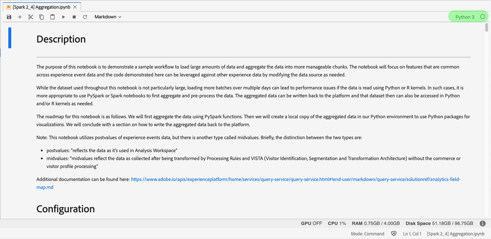
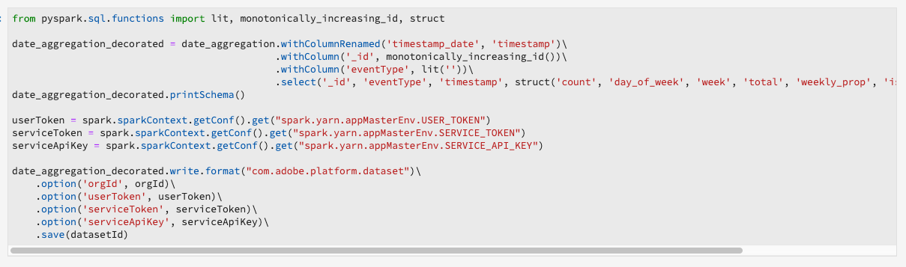
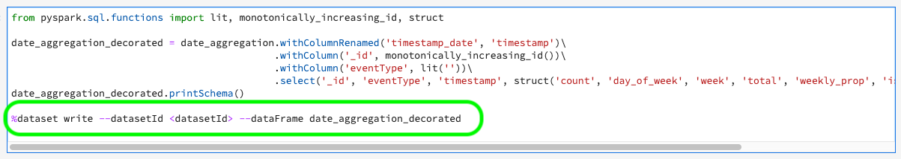

# 配方和筆記本移轉指南

>[!NOTE]
>使用 [!DNL Python]/R的筆記型電腦和配方保持不變。 遷移僅適用於PySpark/[!DNL Spark] (2.3)配方和筆記型電腦。

以下指南概述了遷移現有配方和筆記型電腦所需的步驟和資訊。

- [配方移轉指南](#recipe-migration)
- [筆記型電腦移轉指南](#notebook-migration)

## 配方移轉指南 {#recipe-migration}

最近的變 [!DNL Data Science Workspace] 更要求更 [!DNL Spark] 新現有和PySpark配方。 使用下列工作流程協助轉換配方。

- [Spark移轉指南](#spark-migration-guide)
   - [修改資料集的讀取和寫入方式](#read-write-recipe-spark)
   - [下載範例配方](#download-sample-spark)
   - [添加docker檔案](#add-dockerfile-spark)
   - [檢查相依性](#change-dependencies-spark)
   - [準備docker指令碼](#prepare-docker-spark)
   - [與Docker一起建立配方](#create-recipe-spark)
- [PySpark移轉指南](#pyspark-migration-guide)
   - [修改資料集的讀取和寫入方式](#pyspark-read-write)
   - [下載範例配方](#pyspark-download-sample)
   - [添加docker檔案](#pyspark-add-dockerfile)
   - [準備docker指令碼](#pyspark-prepare-docker)
   - [與Docker一起建立配方](#pyspark-create-recipe)

## [!DNL Spark] 遷移指南 {#spark-migration-guide}

由生成步驟生成的方式對象現在是包含。jar二進位檔案的Docker映像。 此外，使用 [!DNL Platform] SDK讀取和寫入資料集的語法已變更，並要求您修改方式代碼。

以下影片旨在進一步協助瞭解配方所需的變 [!DNL Spark] 更：

>[!VIDEO](https://video.tv.adobe.com/v/33243)

### 讀取和寫入資料集([!DNL Spark]) {#read-write-recipe-spark}

在您建立Docker影像之前，請先閱讀以下章節中提供的 [!DNL Platform] SDK中讀取和寫入資料集的範例。 如果您要轉換現有方式， [!DNL Platform] 則需要更新您的SDK程式碼。

#### 讀取資料集

本節概述讀取資料集時所需的變更，並使用Adobe [提供的helper.scala](https://github.com/adobe/experience-platform-dsw-reference/blob/master/recipes/scala/src/main/scala/com/adobe/platform/ml/helper/Helper.scala) 範例。

**舊式的資料集閱讀方式**

```scala
 var df = sparkSession.read.format("com.adobe.platform.dataset")
    .option(DataSetOptions.orgId, orgId)
    .option(DataSetOptions.serviceToken, serviceToken)
    .option(DataSetOptions.userToken, userToken)
    .option(DataSetOptions.serviceApiKey, apiKey)
    .load(dataSetId)
```

**讀取資料集的新方式**

透過方式 [!DNL Spark] 更新，需要新增和變更數個值。 首先， `DataSetOptions` 不再使用。 Replace `DataSetOptions` with `QSOption`. 此外，還需 `option` 要新的參數。 兩者 `QSOption.mode` 都 `QSOption.datasetId` 是必要的。 最後， `orgId` 需 `serviceApiKey` 要將更改為 `imsOrg` 和 `apiKey`。 請檢視下列範例，以取得讀取資料集的比較：

```scala
import com.adobe.platform.query.QSOption
var df = sparkSession.read.format("com.adobe.platform.query")
  .option(QSOption.userToken", {userToken})
  .option(QSOption.serviceToken, {serviceToken})
  .option(QSOption.imsOrg, {orgId})
  .option(QSOption.apiKey, {apiKey})
  .option(QSOption.mode, "interactive")
  .option(QSOption.datasetId, {dataSetId})
  .load()
```

>[!TIP]
> 如果查詢運行時間超過10分鐘，則交互模式超時。 如果您要接收超過幾GB的資料，建議您切換至「批次」模式。 批次模式啟動需要較長時間，但可處理較大的資料集。

#### 寫入資料集

本節概述使用Adobe提供的 [](https://github.com/adobe/experience-platform-dsw-reference/blob/master/recipes/scala/src/main/scala/com/adobe/platform/ml/ScoringDataSaver.scala) ScoringDataSaver.scala範例來編寫資料集所需的變更。

**以舊方式編寫資料集**

```scala
df.write.format("com.adobe.platform.dataset")
    .option(DataSetOptions.orgId, orgId)
    .option(DataSetOptions.serviceToken, serviceToken)
    .option(DataSetOptions.userToken, userToken)
    .option(DataSetOptions.serviceApiKey, apiKey)
    .save(scoringResultsDataSetId)
```

**編寫資料集的新方式**

透過方式 [!DNL Spark] 更新，需要新增和變更數個值。 首先， `DataSetOptions` 不再使用。 Replace `DataSetOptions` with `QSOption`. 此外，還需 `option` 要新的參數。 `QSOption.datasetId` 中，並取代載入中的 `{dataSetId}` 需 `.save()`求。 最後， `orgId` 需 `serviceApiKey` 要將更改為 `imsOrg` 和 `apiKey`。 請參閱下列範例，以取得編寫資料集的比較：

```scala
import com.adobe.platform.query.QSOption
df.write.format("com.adobe.platform.query")
  .option(QSOption.userToken", {userToken})
  .option(QSOption.serviceToken, {serviceToken})
  .option(QSOption.imsOrg, {orgId})
  .option(QSOption.apiKey, {apiKey})
  .option(QSOption.datasetId, {dataSetId})
  .save()
```

### 封裝Docker型來源檔案([!DNL Spark]) {#package-docker-spark}

首先，導覽至配方所在的目錄。

以下幾節使用新的Scala零售銷售方式，可在 [Data Science Workspace公用Github儲存庫中找到](https://github.com/adobe/experience-platform-dsw-reference)。

### 下載範例配方([!DNL Spark]) {#download-sample-spark}

範例配方包含需要複製至現有配方的檔案。 若要仿製包含所有範例配方的公用Github，請在終端機中輸入下列：

```BASH
git clone https://github.com/adobe/experience-platform-dsw-reference.git
```

Scala配方位於以下目錄中 `experience-platform-dsw-reference/recipes/scala/retail`。

### 添加Dockerfile([!DNL Spark]) {#add-dockerfile-spark}

配方檔案夾中需要有新檔案，才能使用以Docker為基礎的工作流程。 從位於的配方資料夾複製並貼上Dockerfile `experience-platform-dsw-reference/recipes/scala/Dockerfile`。 或者，您也可以將下方的程式碼複製並貼至名為的新檔案 `Dockerfile`。

>[!IMPORTANT]
> 下面顯示的示例 `ml-retail-sample-spark-*-jar-with-dependencies.jar` jar檔案應替換為配方的jar檔案的名稱。

```scala
FROM adobe/acp-dsw-ml-runtime-spark:0.0.1

COPY target/ml-retail-sample-spark-*-jar-with-dependencies.jar /application.jar
```

### 變更相依性([!DNL Spark]) {#change-dependencies-spark}

如果您使用現有配方，pom.xml檔案中需要更改相關性。 將模型編寫-sdk相依性版本變更為2.0.0。接著，將 [!DNL Spark] pom檔案中的版本更新為2.4.3，將Scala版本更新為2.11.12。

```json
<groupId>com.adobe.platform.ml</groupId>
<artifactId>authoring-sdk_2.11</artifactId>
<version>2.0.0</version>
<classifier>jar-with-dependencies</classifier>
```

### 準備Docker指令碼([!DNL Spark]) {#prepare-docker-spark}

[!DNL Spark] 方式不再使用二進位工件，而是需要建立Docker影像。 如果您尚未這麼做，請 [下載並安裝Docker](https://www.docker.com/products/docker-desktop)。

在提供的Scala範例配方中，您可找到指令碼， `login.sh` 並 `build.sh` 位於 `experience-platform-dsw-reference/recipes/scala/` 。 將這些檔案複製並貼至您現有的配方中。

您的檔案夾結構現在看起來應類似下列範例（新新增的檔案會反白顯示）:


下一步是將套件來源檔 [案納入配方教學課程](./models-recipes/package-source-files-recipe.md) 。 本教學課程包含一節，其中概述如何為Scala(Spark)配方建立Docker影像。 完成後，Azure容器註冊表中會提供您Docker影像，以及對應的影像URL。

### 建立方式([!DNL Spark]) {#create-recipe-spark}

若要建立配方，您必須先完成套件來源檔 [案教學課程](./models-recipes/package-source-files-recipe.md) ，並讓docker影像URL準備就緒。 您可以使用UI或API建立配方。

若要使用UI建立配方，請依照Scala [的匯入封裝配方(UI)教學課程](./models-recipes/import-packaged-recipe-ui.md) 。

若要使用API建立配方，請依照Scala [的匯入封裝配方(API)教學課程](./models-recipes/import-packaged-recipe-api.md) 。

## PySpark移轉指南 {#pyspark-migration-guide}

建置步驟產生的方式工件現在是包含。egg二進位檔案的Docker影像。 此外，使用 [!DNL Platform] SDK讀取和寫入資料集的語法已變更，並要求您修改方式代碼。

以下影片旨在進一步協助您瞭解PySpark配方所需的變更：

>[!VIDEO](https://video.tv.adobe.com/v/33048?learn=on&quality=12)

### 讀取和寫入資料集(PySpark) {#pyspark-read-write}

在您建立Docker影像之前，請先閱讀以下章節中提供的 [!DNL Platform] SDK中讀取和寫入資料集的範例。 如果您要轉換現有方式， [!DNL Platform] 則需要更新您的SDK程式碼。

#### 讀取資料集

本節說明使用Adobe提供的 [](https://github.com/adobe/experience-platform-dsw-reference/blob/master/recipes/pyspark/pysparkretailapp/helper.py) helper.py範例讀取資料集所需的變更。

**舊式的資料集閱讀方式**

```python
dataset_options = get_dataset_options(spark.sparkContext)
pd = spark.read.format("com.adobe.platform.dataset") 
  .option(dataset_options.serviceToken(), service_token) 
  .option(dataset_options.userToken(), user_token) 
  .option(dataset_options.orgId(), org_id) 
  .option(dataset_options.serviceApiKey(), api_key)
  .load(dataset_id)
```

**讀取資料集的新方式**

透過方式 [!DNL Spark] 更新，需要新增和變更數個值。 首先， `DataSetOptions` 不再使用。 Replace `DataSetOptions` with `qs_option`. 此外，還需 `option` 要新的參數。 兩者 `qs_option.mode` 都 `qs_option.datasetId` 是必要的。 最後， `orgId` 需 `serviceApiKey` 要將更改為 `imsOrg` 和 `apiKey`。 請檢視下列範例，以取得讀取資料集的比較：

```python
qs_option = spark_context._jvm.com.adobe.platform.query.QSOption
pd = sparkSession.read.format("com.adobe.platform.query") 
  .option(qs_option.userToken, {userToken}) 
  .option(qs_option.serviceToken, {serviceToken}) 
  .option(qs_option.imsOrg, {orgId}) 
  .option(qs_option.apiKey, {apiKey}) 
  .option(qs_option.mode, "interactive") 
  .option(qs_option.datasetId, {dataSetId}) 
  .load()
```

>[!TIP]
> 如果查詢運行時間超過10分鐘，則交互模式超時。 如果您要接收超過幾GB的資料，建議您切換至「批次」模式。 批次模式啟動需要較長時間，但可處理較大的資料集。

#### 寫入資料集

本節概述使用Adobe提供的 [](https://github.com/adobe/experience-platform-dsw-reference/blob/master/recipes/pyspark/pysparkretailapp/data_saver.py) data_saver.py範例來編寫資料集所需的變更。

**以舊方式編寫資料集**

```python
df.write.format("com.adobe.platform.dataset")
  .option(DataSetOptions.orgId, orgId)
  .option(DataSetOptions.serviceToken, serviceToken)
  .option(DataSetOptions.userToken, userToken)
  .option(DataSetOptions.serviceApiKey, apiKey)
  .save(scoringResultsDataSetId)
```

**編寫資料集的新方式**

有了PySpark配方的更新，您需要新增和變更數個值。 首先， `DataSetOptions` 不再使用。 Replace `DataSetOptions` with `qs_option`. 此外，還需 `option` 要新的參數。  `qs_option.datasetId` 中的值，並取代載入中 `{dataSetId}` 的需 `.save()` 求。 最後， `orgId` 需 `serviceApiKey` 要將更改為 `imsOrg` 和 `apiKey`。 請檢視下列範例，以取得讀取資料集的比較：

```python
qs_option = spark_context._jvm.com.adobe.platform.query.QSOption
scored_df.write.format("com.adobe.platform.query") 
  .option(qs_option.userToken, {userToken}) 
  .option(qs_option.serviceToken, {serviceToken}) 
  .option(qs_option.imsOrg, {orgId}) 
  .option(qs_option.apiKey, {apiKey}) 
  .option(qs_option.datasetId, {dataSetId}) 
  .save()
```

### 封裝以Docker為基礎的來源檔案(PySpark) {#pyspark-package-docker}

首先，導覽至配方所在的目錄。

在此範例中，會使用新的PySpark零售銷售方式，並可在 [Data Science Workspace公用Github儲存庫中找到](https://github.com/adobe/experience-platform-dsw-reference)。

### 下載範例配方(PySpark) {#pyspark-download-sample}

範例配方包含需要複製至現有配方的檔案。 要克隆包含所 [!DNL Github] 有樣例配方的公用配方，請在終端機中輸入以下內容。

```BASH
git clone https://github.com/adobe/experience-platform-dsw-reference.git
```

PySpark配方位於以下目錄 `experience-platform-dsw-reference/recipes/pyspark`。

### 新增Dockerfile(PySpark) {#pyspark-add-dockerfile}

配方檔案夾中需要有新檔案，才能使用以Docker為基礎的工作流程。 從位於的配方資料夾複製並貼上Dockerfile `experience-platform-dsw-reference/recipes/pyspark/Dockerfile`。 或者，您也可以複製並貼上下方的程式碼，並建立名為的新檔案 `Dockerfile`。

>[!IMPORTANT]
> 下列顯示的範例 `pysparkretailapp-*.egg` egg檔案應以配方的egg檔案名稱取代。

```scala
FROM adobe/acp-dsw-ml-runtime-pyspark:0.0.1
RUN mkdir /recipe

COPY . /recipe

RUN cd /recipe && \
    ${PYTHON} setup.py clean install && \
    rm -rf /recipe

RUN cp /databricks/conda/envs/${DEFAULT_DATABRICKS_ROOT_CONDA_ENV}/lib/python3.6/site-packages/pysparkretailapp-*.egg /application.egg
```

### 準備Docker指令碼(PySpark) {#pyspark-prepare-docker}

PySpark配方不再使用二進位工件，而是需要建立Docker影像。 如果您尚未這麼做，請下載並安裝 [Docker](https://www.docker.com/products/docker-desktop)。

在提供的PySpark範例配方中，您可以找到指令碼， `login.sh` 並 `build.sh` 位於 `experience-platform-dsw-reference/recipes/pyspark` 。 將這些檔案複製並貼至您現有的配方中。

您的檔案夾結構現在看起來應類似下列範例（新新增的檔案會反白顯示）:


您的配方現在已準備好使用Docker影像來建立。 下一步是將套件來源檔 [案納入配方教學課程](./models-recipes/package-source-files-recipe.md) 。 本教學課程的章節概述如何為PySpark(Spark 2.4)配方建立Docker影像。 完成後，Azure容器註冊表中會提供您Docker影像，以及對應的影像URL。

### 建立配方(PySpark) {#pyspark-create-recipe}

若要建立配方，您必須先完成套件來源檔 [案教學課程](./models-recipes/package-source-files-recipe.md) ，並讓docker影像URL準備就緒。 您可以使用UI或API建立配方。

若要使用UI建立配方，請依照PySpark的匯 [入封裝配方(UI)教學課程](./models-recipes/import-packaged-recipe-ui.md) 。

若要使用API建立配方，請依照PySpark [的匯入封裝配方(API)教學課程](./models-recipes/import-packaged-recipe-api.md) 。

## 筆記型電腦移轉指南 {#notebook-migration}

筆記型電腦 [!DNL JupyterLab] 的最新更改要求您將現有的PySpark和 [!DNL Spark] 2.3筆記型電腦更新為2.4。有了這項改變， [!DNL JupyterLab Launcher] 新的入門筆記型電腦已更新。 有關如何轉換筆記型電腦的逐步指南，請選擇以下指南之一：

- [PySpark 2.3到2.4遷移指南](#pyspark-notebook-migration)
- [Spark 2.3到Spark 2.4(Scala)移轉指南](#spark-notebook-migration)

以下視訊旨在進一步協助您瞭解所需的變更 [!DNL JupyterLab Notebooks]:

>[!VIDEO](https://video.tv.adobe.com/v/33444?quality=12&learn=on)

## PySpark 2.3到2.4筆記型電腦移轉指南 {#pyspark-notebook-migration}

隨著PySpark 2.4的推出， [!DNL JupyterLab Notebooks]新 [!DNL Python] 款PySpark 2.4筆記型電腦現在使用 [!DNL Python] 3內核，而非PySpark 3內核。 這表示PySpark 2.4不支援在PySpark 2.3上執行的現有程式碼。

>[!IMPORTANT]
>
>PySpark 2.3已過時，並設定在後續版本中移除。 所有現有的範例都會設定為以PySpark 2.4範例取代。

若要將您現有的PySpark 3([!DNL Spark] 2.3)筆記型電腦轉換為 [!DNL Spark] 2.4，請依照下列範例進行：

### 內核

PySpark 3([!DNL Spark] 2.4)筆記型電腦使用Python 3 Kernel，而非PySpark 3（Spark 2.3 —— 不建議使用）筆記型電腦中已過時的PySpark內核。

要在 [!DNL JupyterLab] UI中確認或更改內核，請選擇筆記本右上方導航欄中的內核按鈕。 如果您使用其中一個預定義的啟動程式筆記型電腦，則會預選內核。 以下示例使用PySpark 3([!DNL Spark] 2.4) *Aggregation筆記本啟動器* 。



選擇下拉菜單將開啟可用內核的清單。


對於PySpark 3([!DNL Spark] 2.4)筆記型電腦，請選擇Python 3內核，然後按一下「選擇」 **按鈕** 。


## 初始化sparkSession

所有 [!DNL Spark] 2.4筆記型電腦都需要您使用新的簡短字母組合程式碼來初始化工作階段。

<table>
  <th>筆記本</th>
  <th>PySpark 3（[!DNL Spark] 2.3 —— 已過時）</th>
  <th>PySpark 3([!DNL Spark] 2.4)</th>
  <tr>
  <th>內核</th>
  <td align="center">PySpark 3</td>
  <td align="center">Python 3</td>
  </tr>
  <tr>
  <th>程式碼</th>
  <td>
  <pre class="JSON language-JSON hljs">
  [!DNL spark]
</pre>
  </td>
  <td>
  <pre class="JSON language-JSON hljs">
從pyspark.sql匯入SparkSessionspark = SparkSession.builder.getOrCreate()
</pre>
  </td>
  </tr>
</table>

以下影像強調PySpark 2.3和PySpark 2.4的組態差異。此示例使用中 *提供的* Aggregation啟動筆記本 [!DNL JupyterLab Launcher]。

**2.3的組態範例（不建議使用）**


**2.4的組態範例**


## 使用%dataset魔術 {#magic}

隨著 [!DNL Spark] 2.4的推出， `%dataset` 為新的PySpark 3([!DNL Spark] 2.4)筆記型電腦([!DNL Python] 3內核)提供了定制功能。

**使用狀況**

`%dataset {action} --datasetId {id} --dataFrame {df}`

**說明**

用於 [!DNL Data Science Workspace] 從筆記本( [!DNL Python] 3內核)讀取或寫入資料集的自定[!DNL Python] 義魔術命令。

- **{action}**:要在資料集上執行的動作類型。 有兩個動作是「讀取」或「寫入」。
- **—datasetId {id}**:用於提供要讀取或寫入的資料集的ID。 這是必要的引數。
- **—dataFrame {df}**:熊貓資料框。 這是必要的引數。
   - 當動作為&quot;read&quot;時，{df}是資料集讀取作業結果可用的變數。
   - 當動作為&quot;write&quot;時，此資料幀{df}將寫入資料集。
- **—mode（可選）**:允許的參數為「批次」和「互動」。 依預設，模式會設為「互動」。 建議在讀取大量資料時使用「批次」模式。

**範例**

- **閱讀範例**: `%dataset read --datasetId 5e68141134492718af974841 --dataFrame pd0`
- **寫示例**: `%dataset write --datasetId 5e68141134492718af974842 --dataFrame pd0`

## 在LocalContext中載入到資料幀

隨著 [!DNL Spark] 2.4的推出， [`%dataset`](#magic) 提供自訂功能。 以下示例重點說明在PySpark([!DNL Spark] 2.3)和PySpark([!DNL Spark] 2.4)筆記型電腦中載入資料幀的主要差異：

**使用PySpark 3([!DNL Spark]2.3 —— 已過時)- PySpark 3內核**

```python
dataset_options = sc._jvm.com.adobe.platform.dataset.DataSetOptions
pd0 = spark.read.format("com.adobe.platform.dataset")
  .option(dataset_options.orgId(), "310C6D375BA5248F0A494212@AdobeOrg")
  .load("5e68141134492718af974844")
```

**使用PySpark 3([!DNL Spark]2.4)- Python 3內核**

```python
%dataset read --datasetId 5e68141134492718af974844 --dataFrame pd0
```

| 元素 | 說明 |
| ------- | ----------- |
| pd0 | 要使用或建立的熊貓資料框對象的名稱。 |
| [%dataset](#magic) | 在 [!DNL Python] 3個內核中自訂資料存取功能。 |

以下影像強調PySpark 2.3和PySpark 2.4載入資料的主要差異。此示例使用中 *提供的* Aggregation啟動筆記本 [!DNL JupyterLab Launcher]。

**在PySpark 2.3（Luma資料集）中載入資料——已過時**


**在PySpark 2.4中載入資料（Luma資料集）**

PySpark 3(Spark 2.4)是在載入中 `sc = spark.sparkContext` 定義的。


**在PySpark 2.3[!DNL Experience Cloud Platform]中載入資料——已過時**


**在PySpark 2.4[!DNL Experience Cloud Platform]中載入資料**

有了PySpark 3([!DNL Spark] 2.4)，您就 `org_id` 不 `dataset_id` 需要再定義和。 此外， `df = spark.read.format` 已取代為自訂功能，讓閱 [`%dataset`](#magic) 讀和寫入資料集更輕鬆。


| 元素 | 描述 |
| ------- | ----------- |
| [%dataset](#magic) | 在 [!DNL Python] 3個內核中自訂資料存取功能。 |

>[!TIP]
>
>-mode可設定為 `interactive` 或 `batch`。 —mode的預設值為 `interactive`。 建議在讀取大量 `batch` 資料時使用模式。

## 建立本地資料幀

PySpark 3([!DNL Spark] 2.4)不再 `%%` 支援sparkmagic。 無法再使用下列操作：

- `%%help`
- `%%info`
- `%%cleanup`
- `%%delete`
- `%%configure`
- `%%local`

下表概述轉換sparkmagic查詢所需 `%%sql` 的變更：

<table>
  <th>筆記本</th>
  <th>PySpark 3（[!DNL Spark] 2.3 —— 已過時）</th>
  <th>PySpark 3([!DNL Spark] 2.4)</th>
  <tr>
  <th>內核</th>
  <td align="center">PySpark 3</td>
  <td align="center">[!DNL Python] 3</td>
  </tr>
  <tr>
  <th>程式碼</th>
      <td>
         <pre class="JSON language-JSON hljs">%%sql -o dfselect *來自sparkdf
</pre>
         <pre class="JSON language-JSON hljs"> %%sql -o df -n限制選擇* sparkdf
</pre>
         <pre class="JSON language-JSON hljs">%%sql -o df -qselect *來自sparkdf
</pre>
         <pre class="JSON language-JSON hljs"> %%sql -o df -r分級選取*（從sparkdf）
</pre>
      </td>
      <td>
         <pre class="JSON language-JSON hljs">
df = spark.sql(" SELECT * FROM sparkdf")
</pre>
         <pre class="JSON language-JSON hljs">
df = spark.sql(" SELECT * FROM sparkdf LIMIT")
</pre>
         <pre class="JSON language-JSON hljs">
df = spark.sql(" SELECT * FROM sparkdf LIMIT")
</pre>
         <pre class="JSON language-JSON hljs">
sample_df = df.sample(fration)
</pre>
      </td>
   </tr>
</table>

>[!TIP]
>
>您也可以指定選用的種子樣本，例如布林值withReplacement、雙分數或長種子。

以下影像強調了在PySpark 2.3和PySpark 2.4中建立本機資料框架的主要差異。此示例使用中 *提供的* Aggregation啟動筆記本 [!DNL JupyterLab Launcher]。

**建立本機資料框架PySpark 2.3 —— 已過時**


**建立本機資料框架PySpark 2.4**

使用PySpark 3([!DNL Spark] 2.4)時 `%%sql` ,Sparkmagic不再受支援，而已取代為：


## 寫入資料集

隨著2. [!DNL Spark] 4的推出， [`%dataset`](#magic) 提供自訂功能，讓撰寫資料集更簡潔。 若要寫入資料集，請使用下 [!DNL Spark] 列2.4範例：

**使用PySpark 3([!DNL Spark]2.3 —— 已過時)- PySpark 3內核**

```python
userToken = spark.sparkContext.getConf().get("spark.yarn.appMasterEnv.USER_TOKEN")
serviceToken = spark.sparkContext.getConf().get("spark.yarn.appMasterEnv.SERVICE_TOKEN")
serviceApiKey = spark.sparkContext.getConf().get("spark.yarn.appMasterEnv.SERVICE_API_KEY")

dataset_options = sc._jvm.com.adobe.platform.dataset.DataSetOptions

pd0.write.format("com.adobe.platform.dataset")
  .option(dataset_options.orgId(), "310C6D375BA5248F0A494212@AdobeOrg")
  .option(dataset_options.userToken(), userToken)
  .option(dataset_options.serviceToken(), serviceToken)
  .option(dataset_options.serviceApiKey(), serviceApiKey)
  .save("5e68141134492718af974844")
```

**使用PySpark 3([!DNL Spark]2.4)-[!DNL Python]3個內核**

```python
%dataset write --datasetId 5e68141134492718af974844 --dataFrame pd0
pd0.describe()
pd0.show(10, False)
```

| 元素 | 描述 |
| ------- | ----------- |
| pd0 | 要使用或建立的熊貓資料框對象的名稱。 |
| [%dataset](#magic) | 在 [!DNL Python] 3個內核中自訂資料存取功能。 |

>[!TIP]
>
>-mode可設定為 `interactive` 或 `batch`。 —mode的預設值為 `interactive`。 建議在讀取大量 `batch` 資料時使用模式。

以下影像強調在PySpark 2.3和PySpark 2.4中將資 [!DNL Platform] 料寫回的主要差異。此示例使用中 *提供的* Aggregation啟動筆記本 [!DNL JupyterLab Launcher]。

**將資料寫回[!DNL Platform]PySpark 2.3 —— 已過時**



**將資料寫回[!DNL Platform]PySpark 2.4**

有了PySpark 3([!DNL Spark] 2.4)，自訂的 `%dataset` 魔力就不需要定義 `userToken`、 `serviceToken``serviceApiKey`和等值 `.option`。 此外， `orgId` 不再需要定義。



## [!DNL Spark] 2.3到 [!DNL Spark] 2.4(Scala)筆記本遷移指南 {#spark-notebook-migration}

隨著2. [!DNL Spark] 4到的推出 [!DNL JupyterLab Notebooks]，現 [!DNL Spark] 有([!DNL Spark] 2.3)筆記本現在使用Scala內核而非內 [!DNL Spark] 核。 這表示Scala( [!DNL Spark] 2.4)不支援在([!DNL Spark][!DNL Spark] 2.3)上執行的現有程式碼。 此外，所有新 [!DNL Spark] 筆記型電腦都應使用[!DNL Spark] Scala(2.4) [!DNL JupyterLab Launcher]。

>[!IMPORTANT]
>
>[!DNL Spark] ([!DNL Spark] 2.3)已過時，並設定為在後續版本中移除。 所有現有示例都設定為用Scala([!DNL Spark] 2.4)示例替換。

要將現有的 [!DNL Spark] ([!DNL Spark] 2.3)筆記型電腦轉換為Scala([!DNL Spark] 2.4)，請遵循以下示例：

## 內核

Scala(Spark 2.4)筆記型電腦使用Scala Kernel，而非( [!DNL Spark] 2.3 —— 不建議使用)筆記型電腦中使 [!DNL Spark] 用的已過時[!DNL Spark] 內核。

要在 [!DNL JupyterLab] UI中確認或更改內核，請選擇筆記本右上方導航欄中的內核按鈕。 此時將 *顯示「選擇內核* 」窗口。 如果您使用其中一個預定義的啟動程式筆記型電腦，則會預選內核。 以下示例使用中的Scala *Clustering* （斯卡拉群集）筆記本 [!DNL JupyterLab Launcher]。


選擇下拉菜單將開啟可用內核的清單。


對於Scala(Spark 2.4)筆記型電腦，選擇Scala內核，然後按一下「選擇」按 **鈕** 。


## 初始化SparkSession {#initialize-sparksession-scala}

所有Scala([!DNL Spark] 2.4)筆記型電腦都要求您使用以下簡短字母組合代碼初始化會話：

<table>
  <th>筆記本</th>
  <th>Spark（[!DNL Spark] 2.3 —— 已過時）</th>
  <th>Scala([!DNL Spark] 2.4)</th>
  <tr>
  <th>內核</th>
  <td align="center">[!DNL Spark]</td>
  <td align="center">斯卡拉</td>
  </tr>
  <tr>
  <th>代碼</th>
  <td align="center">
  不需要任何代碼
  </td>
  <td>
  <pre class="JSON language-JSON hljs">
導入org.apache.spark.sql。{ SparkSession }spark = SparkSession .builder()。master("local")。getOrCreate()
</pre>
  </td>
  </tr>
</table>

下面的Scala([!DNL Spark] 2.4)影像突出顯示了初始化sparkSession時與 [!DNL Spark] 2.3 [!DNL Spark] 內核和 [!DNL Spark] 2.4 Scala內核的關鍵區別。 此示例使用中 *提供的* Clustering啟動筆記本 [!DNL JupyterLab Launcher]。

**[!DNL Spark]([!DNL Spark]2.3 —— 不建議使用)**

[!DNL Spark] ([!DNL Spark] 2.3 —— 不建議使用)使 [!DNL Spark] 用內核，因此您不需要定義 [!DNL Spark]。

**Scala([!DNL Spark]2.4)**

將 [!DNL Spark] 2.4與Scala內核一起使用時，需要定義 `val spark` 並導 `SparkSesson` 入以讀取或寫入：


## 查詢資料

Scala([!DNL Spark] 2.4)不再 `%%` 支援sparkmagic。 無法再使用下列操作：

- `%%help`
- `%%info`
- `%%cleanup`
- `%%delete`
- `%%configure`
- `%%local`

下表概述轉換sparkmagic查詢所需 `%%sql` 的變更：

<table>
  <th>筆記本</th>
  <th>[!DNL Spark]（[!DNL Spark] 2.3 —— 已過時）</th>
  <th>Scala([!DNL Spark] 2.4)</th>
  <tr>
  <th>內核</th>
  <td align="center">[!DNL Spark]</td>
  <td align="center">斯卡拉</td>
  </tr>
  <tr>
  <th>代碼</th>
    <td>
       <pre class="JSON language-JSON hljs">
%%sql -o dfselect *來自sparkdf
</pre>
         <pre class="JSON language-JSON hljs">
%%sql -o df -n限制選擇* sparkdf
</pre>
         <pre class="JSON language-JSON hljs">
%%sql -o df -qselect *來自sparkdf
</pre>
         <pre class="JSON language-JSON hljs">
%%sql -o df -r分級選取*（從sparkdf）
</pre>
      </td>
      <td>
         <pre class="JSON language-JSON hljs">
val df = spark.sql(" SELECT * FROM sparkdf")
</pre>
         <pre class="JSON language-JSON hljs">
val df = spark.sql（" SELECT * FROM sparkdf限制"）
</pre>
         <pre class="JSON language-JSON hljs">
val df = spark.sql（" SELECT * FROM sparkdf限制"）
</pre>
         <pre class="JSON language-JSON hljs">
val sample_df = df.sample(fration) </pre>
      </td>
   </tr>
</table>

下面的Scala([!DNL Spark] 2.4)影像強調了使用 [!DNL Spark] 2.3內核和Spark 2.4 Scala內核進行查詢時的 [!DNL Spark] 主要差異。 此示例使用中 *提供的* Clustering啟動筆記本 [!DNL JupyterLab Launcher]。

**[!DNL Spark]([!DNL Spark]2.3 —— 不建議使用)**

( [!DNL Spark] 2.3 —— 不建議使用)筆記本使用內[!DNL Spark][!DNL Spark] 核。 內核 [!DNL Spark] 支援並使用sparkmagic `%%sql` 。


**Scala([!DNL Spark]2.4)**

Scala內核不再支援sparkmagic `%%sql` 。 必須轉換現有的Sparkmagic程式碼。


## 讀取資料集 {#notebook-read-dataset-spark}

在 [!DNL Spark] 2.3中，您需要為用來讀取資料或 `option` 在程式碼儲存格中使用原始值的值定義變數。 在Scala中，您可以 `sys.env("PYDASDK_IMS_USER_TOKEN")` 用來宣告和傳回值，如此就不需要定義變數，例如 `var userToken`。 在下方的Scala(Spark 2.4)範例中， `sys.env` 用來定義並傳回讀取資料集所需的所有值。

**使[!DNL Spark]用([!DNL Spark]2.3 —— 不建議使用)-內核[!DNL Spark]**

```scala
import com.adobe.platform.dataset.DataSetOptions
var df1 = spark.read.format("com.adobe.platform.dataset")
  .option(DataSetOptions.orgId, "310C6D375BA5248F0A494212@AdobeOrg")
  .option(DataSetOptions.batchId, "dbe154d3-197a-4e6c-80f8-9b7025eea2b9")
  .load("5e68141134492718af974844")
```

**使用Scala([!DNL Spark]2.4)- Scala內核**

```scala
import org.apache.spark.sql.{Dataset, SparkSession}
val spark = SparkSession.builder().master("local").getOrCreate()
val df1 = spark.read.format("com.adobe.platform.query")
  .option("user-token", sys.env("PYDASDK_IMS_USER_TOKEN"))
  .option("ims-org", sys.env("IMS_ORG_ID"))
  .option("api-key", sys.env("PYDASDK_IMS_CLIENT_ID"))
  .option("service-token", sys.env("PYDASDK_IMS_SERVICE_TOKEN"))
  .option("mode", "interactive")
  .option("dataset-id", "5e68141134492718af974844")
  .load()
```

| 元素 | 描述 |
| ------- | ----------- |
| df1 | 一個變數，它表示用於讀取和寫入資料的Pactys資料幀。 |
| user-token | 使用自動擷取的使用者Token `sys.env("PYDASDK_IMS_USER_TOKEN")`。 |
| service-token | 您使用自動擷取的服務Token `sys.env("PYDASDK_IMS_SERVICE_TOKEN")`。 |
| ims-org | 使用自動擷取的ims組織ID `sys.env("IMS_ORG_ID")`。 |
| api-key | 您的api金鑰會使用自動擷取 `sys.env("PYDASDK_IMS_CLIENT_ID")`。 |

以下影像會反白標示2.3和 [!DNL Spark] 2. [!DNL Spark] 4載入資料的主要差異。此示例使用中 *提供的* Clustering啟動筆記本 [!DNL JupyterLab Launcher]。

**[!DNL Spark]([!DNL Spark]2.3 —— 不建議使用)**

( [!DNL Spark] 2.3 —— 不建議使用)筆記本使用內[!DNL Spark][!DNL Spark] 核。 以下兩個儲存格顯示以日期範圍(2019-3-21, 2019-3-29)內指定資料集ID載入資料集的範例。


**Scala([!DNL Spark]2.4)**

Scala([!DNL Spark] 2.4)筆記型電腦使用Scala內核，當設定時，該內核需要更多值，如第一個代碼單元格中突出顯示的。 此外， `var mdata` 需要填 `option` 入更多值。 在本筆記本中，前述初始化SparkSession [的程式碼會包含在程式碼](#initialize-sparksession-scala)`var mdata` 儲存格中。


>[!TIP]
>
>在Scala中，可以使 `sys.env()` 用在中聲明和返回值 `option`。 如此，若您知道變數只會在單次使用，就不需要定義變數。 以下示例在 `val userToken` 上述示例中進行了說明，並在中聲明 `option`:
> `.option("user-token", sys.env("PYDASDK_IMS_USER_TOKEN"))`

## 寫入資料集

與讀取 [資料集類似](#notebook-read-dataset-spark)，寫入資料集需要下 `option` 列範例中概述的額外值。 在Scala中，您可以 `sys.env("PYDASDK_IMS_USER_TOKEN")` 用來宣告和傳回值，如此就不需要定義變數，例如 `var userToken`。 在下面的Scala範例中， `sys.env` 用於定義並傳回寫入資料集所需的所有必要值。

**使[!DNL Spark]用([!DNL Spark]2.3 —— 不建議使用)-內核[!DNL Spark]**

```scala
import com.adobe.platform.dataset.DataSetOptions

var userToken = spark.sparkContext.getConf.getOption("spark.yarn.appMasterEnv.USER_TOKEN").get
var serviceToken = spark.sparkContext.getConf.getOption("spark.yarn.appMasterEnv.SERVICE_TOKEN").get
var serviceApiKey = spark.sparkContext.getConf.getOption("spark.yarn.appMasterEnv.SERVICE_API_KEY").get

df1.write.format("com.adobe.platform.dataset")
  .option(DataSetOptions.orgId, "310C6D375BA5248F0A494212@AdobeOrg")
  .option(DataSetOptions.userToken, userToken)
  .option(DataSetOptions.serviceToken, serviceToken)
  .option(DataSetOptions.serviceApiKey, serviceApiKey)
  .save("5e68141134492718af974844")
```

**使用Scala([!DNL Spark]2.4)- Scala內核**

```scala
import org.apache.spark.sql.{Dataset, SparkSession}

val spark = SparkSession.builder().master("local").getOrCreate()

df1.write.format("com.adobe.platform.query")
  .option("user-token", sys.env("PYDASDK_IMS_USER_TOKEN"))
  .option("service-token", sys.env("PYDASDK_IMS_SERVICE_TOKEN"))
  .option("ims-org", sys.env("IMS_ORG_ID"))
  .option("api-key", sys.env("PYDASDK_IMS_CLIENT_ID"))
  .option("mode", "interactive")
  .option("dataset-id", "5e68141134492718af974844")
  .save()
```

| 元素 | 描述 |
| ------- | ----------- |
| df1 | 一個變數，它表示用於讀取和寫入資料的Pactys資料幀。 |
| user-token | 使用自動擷取的使用者Token `sys.env("PYDASDK_IMS_USER_TOKEN")`。 |
| service-token | 您使用自動擷取的服務Token `sys.env("PYDASDK_IMS_SERVICE_TOKEN")`。 |
| ims-org | 使用自動擷取的ims組織ID `sys.env("IMS_ORG_ID")`。 |
| api-key | 您的api金鑰會使用自動擷取 `sys.env("PYDASDK_IMS_CLIENT_ID")`。 |