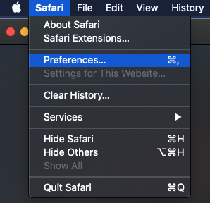

# [!DNL Data Science Workspace]疑難排解指南

>[!NOTE]
>
>Data Science Workspace已無法購買。
>
>本檔案旨在供先前有權使用Data Science Workspace的現有客戶使用。

本檔案提供有關Adobe Experience Platform [!DNL Data Science Workspace]常見問題的解答。 如需[!DNL Experience Platform] API的一般問題和疑難排解，請參閱[Adobe Experience Platform API疑難排解指南](../landing/troubleshooting.md)。

## JupyterLab Notebook查詢狀態卡在執行狀態

JupyterLab Notebook可能表示儲存格在某些記憶體不足的情況下永遠處於執行狀態。 例如，在查詢大型資料集或執行多個後續查詢時，JupyterLab Notebook可能會用儘可用的記憶體來儲存產生的資料流物件。 在此情況下可以看到一些指標。 首先，即使儲存格旁邊的[`*`]圖示顯示正在執行，核心仍會進入閒置狀態。 此外，底部列會顯示已使用/可用的RAM數量。


在資料讀取期間，記憶體可能會增加，直到達到您配置的記憶體最大數量為止。 當達到最大記憶體且核心重新啟動時，會立即釋放記憶體。 這表示在此案例中，由於核心重新啟動，使用的記憶體可能會顯示得很低，而在重新啟動之前，記憶體會非常接近配置的最大RAM。

若要解決此問題，請選取JupyterLab右上方的齒輪圖示，並將滑桿滑至右側，接著選取&#x200B;**[!UICONTROL 更新設定]**&#x200B;以配置更多RAM。 此外，如果您正在執行多個查詢，而RAM值已接近配置的最大值，除非您需要先前查詢的結果，請重新啟動核心以重設可用的RAM量。 這可確保您擁有可用於目前查詢的最大RAM量。


如果您正在配置最大記憶體(RAM)量，但仍然遇到此問題，您可以透過減少資料行或資料範圍，修改查詢以在較小的資料集大小上操作。 若要使用完整的資料量，建議您使用Spark筆記本。

## [!DNL JupyterLab]環境未在[!DNL Google Chrome]中載入

>[!IMPORTANT]
>
>此問題已解決，但可能仍存在於Google Chrome 80.x瀏覽器中。 請確定您的Chrome瀏覽器為最新狀態。

使用[!DNL Google Chrome]瀏覽器80.x版時，預設會封鎖所有第三方Cookie。 此原則可防止[!DNL JupyterLab]在Adobe Experience Platform中載入。

若要修正此問題，請使用下列步驟：

在您的[!DNL Chrome]瀏覽器中，導覽至右上角並選取&#x200B;**設定** (或者，您可以複製並貼上位址列中的&quot;chrome://settings/&quot;)。 接著，捲動至頁面底部，然後按一下&#x200B;**進階**&#x200B;下拉式清單。


**隱私權與安全性**&#x200B;區段隨即顯示。 接著，按一下&#x200B;**網站設定**，接著按一下&#x200B;**Cookie和網站資料**。


最後，將「封鎖第三方Cookie」切換為「關閉」。


>[!NOTE]
>
>或者，您可以停用第三方Cookie並新增[*。]ds.adobe.net加入允許清單。

導覽至位址列中的「chrome://flags/」。 使用右側的下拉式功能表，搜尋並停用標題為&#x200B;*「預設SameSite Cookie」*&#x200B;的標幟。


在步驟2之後，系統會提示您重新啟動瀏覽器。 重新啟動後，[!DNL Jupyterlab]應該可以存取。

## 為什麼我無法在Safari中存取[!DNL JupyterLab]？

Safari預設會在Safari &lt; 12中停用第三方Cookie。 由於您的[!DNL Jupyter]虛擬機器器執行個體與其上層框架位於不同的網域，因此Adobe Experience Platform目前需要啟用協力廠商Cookie。 請啟用第三方Cookie或切換到其他瀏覽器，例如[!DNL Google Chrome]。

對於Safari 12，您必須將使用者代理程式切換至&#39;[!DNL Chrome]&#39;或&#39;[!DNL Firefox]&#39;。 若要切換您的使用者代理程式，請開啟&#x200B;*Safari*&#x200B;功能表並選取&#x200B;**偏好設定**。 偏好設定視窗即會出現。



在Safari偏好設定視窗中，選取&#x200B;**進階**。 然後核取功能表列&#x200B;*方塊中的*&#x200B;顯示[開發]功能表。 完成此步驟後，您可以關閉偏好設定視窗。


接著，從頂端導覽列選取&#x200B;**開發**&#x200B;功能表。 從&#x200B;**開發**&#x200B;下拉式清單中，暫留在&#x200B;**使用者代理程式**&#x200B;上。 您可以選取要使用的&#x200B;**[!DNL Chrome]**&#x200B;或&#x200B;**[!DNL Firefox]**&#x200B;使用者代理字串。


## 我嘗試上傳或刪除[!DNL JupyterLab]中的檔案時，為何會看到「403禁止」訊息？

如果您的瀏覽器已啟用廣告封鎖軟體，例如[!DNL Ghostery]或[!DNL AdBlock] Plus，則每個廣告封鎖軟體都必須允許網域「\*.adobe.net」，以便[!DNL JupyterLab]正常運作。 這是因為[!DNL JupyterLab]虛擬機器器執行於[!DNL Experience Platform]網域以外的網域。

## 為什麼我的[!DNL Jupyter Notebook]的某些部分看起來是亂碼或未呈現為程式碼？

如果相關儲存格意外從「代碼」變更為「Markdown」，就可能發生這種情況。 當程式碼儲存格成為焦點時，按下按鍵組合&#x200B;**ESC+M**&#x200B;會將儲存格的型別變更為Markdown。 儲存格的型別可以透過所選儲存格記事本頂端的下拉式指示器來變更。 若要將儲存格型別變更為程式碼，請先選取您要變更的指定儲存格。 接著，按一下指出儲存格目前型別的下拉式清單，然後選取「程式碼」。


## 如何安裝自訂[!DNL Python]資料庫？

[!DNL Python]核心已預先安裝許多常用的機器學習程式庫。 不過，您可以在程式碼儲存格中執行以下命令，以安裝其他自訂程式庫：

```shell
!pip install {LIBRARY_NAME}
```

如需預先安裝的[!DNL Python]程式庫的完整清單，請參閱JupyterLab使用手冊](./jupyterlab/overview.md#supported-libraries)的[附錄區段。

## 我可以安裝自訂PySpark程式庫嗎？

很遺憾，您無法為PySpark核心安裝其他程式庫。 不過，您可以聯絡Adobe客戶服務代表，為您安裝自訂PySpark程式庫。

如需預先安裝的PySpark程式庫清單，請參閱JupyterLab使用手冊](./jupyterlab/overview.md#supported-libraries)的[附錄區段。

## 可以為[!DNL JupyterLab] [!DNL Spark]或PySpark核心設定[!DNL Spark]叢集資源嗎？

您可以將下列區塊新增至筆記本的第一個儲存格，以設定資源：

```python
%%configure -f 
{
    "numExecutors": 10,
    "executorMemory": "8G",
    "executorCores":4,
    "driverMemory":"2G",
    "driverCores":2,
    "conf": {
        "spark.cores.max": "40"
    }
}
```

如需[!DNL Spark]叢集資源組態的詳細資訊，包括可設定屬性的完整清單，請參閱[JupyterLab使用手冊](./jupyterlab/overview.md#kernels)。

## 為什麼我在嘗試為較大的資料集執行某些任務時會收到錯誤？

如果您收到錯誤的原因如`Reason: Remote RPC client disassociated. Likely due to containers exceeding thresholds, or network issues.`，這通常表示驅動程式或執行程式的記憶體不足。 如需資料限制以及如何對大型資料集執行工作的詳細資訊，請參閱JupyterLab Notebooks [資料存取](./jupyterlab/access-notebook-data.md)檔案。 通常，將`mode`從`interactive`變更為`batch`即可解決此錯誤。

此外，在寫入大型Spark/PySpark資料集時，在執行寫入程式碼之前快取資料(`df.cache()`)可大幅改善效能。

<!-- remove this paragraph at a later date once the sdk is updated -->

如果您在讀取資料時遇到問題，並且要將轉換套用至資料，請嘗試在轉換之前快取資料。 快取您的資料可防止跨網路多次讀取。 從讀取資料開始。 接著，快取(`df.cache()`)資料。 最後，執行轉換。

## 我的Spark/PySpark筆記型電腦為何要花這麼長時間來讀取和寫入資料？

如果您正在對資料執行轉換，例如使用`fit()`，則轉換可能會執行多次。 若要提高效能，請在執行`fit()`之前使用`df.cache()`快取您的資料。 這樣可確保只執行一次轉換，並防止跨網路多次讀取。

**建議的順序：**&#x200B;從讀取資料開始。 接著，執行轉換，接著快取(`df.cache()`)資料。 最後，執行`fit()`。

## 為什麼我的Spark/PySpark筆記型電腦無法執行？

如果您收到下列任何錯誤：

- 工作已中止，因為中繼失敗……只能壓縮每個資料分割中具有相同元素數量的RDD。
- 遠端RPC使用者端已解除關聯，且發生其他記憶體錯誤。
- 讀取和寫入資料集時效能不佳。

在寫入資料之前，請檢查以確定您正在快取資料(`df.cache()`)。 在筆記型電腦中執行程式碼時，使用`df.cache()`在動作（例如`fit()`）之前可大幅改善筆記型電腦效能。 在寫入資料集之前使用`df.cache()`可確保只執行一次轉換，而非多次。

## 資料科學Workspace中的[!DNL Docker Hub]限制限制

自2020年11月20日起，匿名和免費驗證使用Docker Hub的費率限制已生效。 匿名與免費[!DNL Docker Hub]使用者限製為每六小時100個容器影像提取請求。 如果您受這些變更影響，您將會收到此錯誤訊息： `ERROR: toomanyrequests: Too Many Requests.`或`You have reached your pull rate limit. You may increase the limit by authenticating and upgrading: https://www.docker.com/increase-rate-limits.`。

目前，如果您嘗試在六小時內建立100部配方筆記本，或如果您在資料科學Workspace中使用經常擴充和縮減的Spark筆記本，此限制僅會影響您的組織。 不過，這不太可能，因為這些專案執行的叢集在閒置之前會維持作用中兩個小時。 這會減少叢集處於作用中狀態時所需的提取數。 如果您收到上述任何錯誤，則需要等到重設[!DNL Docker]限製為止。

如需[!DNL Docker Hub]速率限制的詳細資訊，請瀏覽[DockerHub檔案](https://www.docker.com/increase-rate-limits)。 我們正在研究此問題的解決方案，並期待於後續版本中推出。
