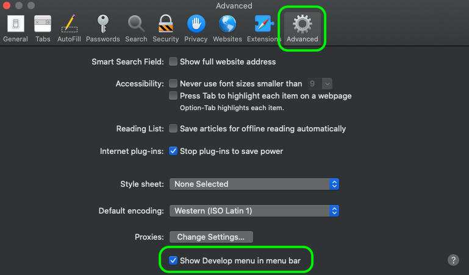

# [!DNL Data Science Workspace] 故障排除指南

本文檔提供有關Adobe Experience Platform的常見問題解答 [!DNL Data Science Workspace]。 有關 [!DNL Platform] API一般，請參見 [Adobe Experience PlatformAPI故障排除指南](../landing/troubleshooting.md)。

## JupyterLab筆記本查詢狀態停滯於執行狀態

JupyterLab筆記本可能表示在某些記憶體不足的情況下，單元格處於無限期執行狀態。 例如，在查詢大型資料集或執行多個後續查詢時，JupyterLab筆記本會耗盡可用記憶體來儲存生成的資料幀對象。 在這種情況下，可以看到一些指標。 首先，即使單元格顯示為由 [`*`] 表徵圖。 此外，底條還指示RAM的使用/可用量。


在讀取資料期間，記憶體可能會增長，直到達到您分配的最大記憶體量。 一旦達到最大記憶體並且內核重新啟動，記憶體就會釋放。 這意味著，由於內核重新啟動，此場景中使用的記憶體可能顯示為非常低，而在重新啟動之前，記憶體將非常接近已分配的最大RAM。

要解決此問題，請選擇JupyterLab右上角的齒輪表徵圖，然後將滑塊向右滑動，然後選擇 **[!UICONTROL 更新配置]** 分配更多記憶體。 此外，如果您正在運行多個查詢，並且RAM值接近最大分配量，除非您需要前面查詢的結果，否則請重新啟動內核以重置可用的RAM量。 這可確保您擁有當前查詢可用的最大RAM量。


如果您正在分配最大記憶體量(RAM)，但仍然遇到此問題，則可以通過減少資料列或資料範圍來修改查詢以在較小的資料集大小上運行。 要使用全部資料，建議您使用Spark筆記本。

## [!DNL JupyterLab] 環境未載入 [!DNL Google Chrome]

>[!IMPORTANT]
>
>此問題已解決，但仍可能存在於GoogleChrome 80.x瀏覽器中。 請確保您的Chrome瀏覽器是最新的。

使用 [!DNL Google Chrome] 瀏覽器版本80.x，預設情況下，所有第三方cookie都被阻止。 此策略可以 [!DNL JupyterLab] 從Adobe Experience Platform裝載。

要解決此問題，請執行以下步驟：

在 [!DNL Chrome] 瀏覽器，導航到右上角並選擇 **設定** (或者，您可以在地址欄中複製並貼上「chrome://settings/」)。 接下來，滾動到頁面底部，然後按一下 **高級** 下拉清單。


的 **隱私和安全** 的上界。 下一步，按一下 **站點設定** 後跟 **Cookie和站點資料**。


最後，將「阻止第三方Cookie」切換為「關閉」。


>[!NOTE]
>
>或者，您可以禁用第三方Cookie並添加 [*。]ds.adobe.net到允許清單。

導航到地址欄中的「chrome://flags/」。 搜索和禁用標題為 *&quot;預設情況下的SameSite Cookie&quot;* 使用右側的下拉菜單。


步驟2後，系統將提示您重新啟動瀏覽器。 你重開後， [!DNL Jupyterlab] 應該可以訪問。

## 為什麼我無法訪問 [!DNL JupyterLab] 在薩法里？

預設情況下，Safari在Safari &lt; 12中禁用第三方Cookie。 因為 [!DNL Jupyter] 虛擬機實例駐留在與其父幀不同的域上，Adobe Experience Platform當前要求啟用第三方cookie。 請啟用第三方Cookie或切換到其他瀏覽器，如 [!DNL Google Chrome]。

對於Safari 12，您需要將用戶代理切換到「[!DNL Chrome]或[!DNL Firefox]「 」。 要切換用戶代理，請從開啟 *薩法里* 的 **首選項**。 將出現首選項窗口。


在Safari首選項窗口中，選擇 **高級**。 然後檢查 *在菜單欄中顯示「開發」菜單* 框。 完成此步驟後，可關閉首選項窗口。



接下來，從頂部導航欄中選擇 **開發** 的子菜單。 從 **開發** 下拉，懸停 **用戶代理**。 可以選擇 **[!DNL Chrome]** 或 **[!DNL Firefox]** 要使用的用戶代理字串。


## 嘗試在中上載或刪除檔案時，為什麼看到「403禁止」消息 [!DNL JupyterLab]?

如果瀏覽器啟用了廣告阻止軟體，例如 [!DNL Ghostery] 或 [!DNL AdBlock] 此外，每個廣告阻止軟體中必須允許域「\*.adobe.net」 [!DNL JupyterLab] 正常運作。 這是因為 [!DNL JupyterLab] 虛擬機運行在不同於 [!DNL Experience Platform] 。

## 為什麼我的一些部分 [!DNL Jupyter Notebook] 看上去被置亂，還是不呈現為代碼？

如果有關的單元格意外地從「代碼」更改為「標籤」，則可能發生這種情況。 當代碼單元被聚焦時，按鍵組合 **ESC+M** 將單元格的類型更改為Markdown。 通過筆記本頂部的下拉指示器可以更改所選單元格的類型。 要將單元格類型更改為代碼，請從選擇要更改的給定單元格開始。 接下來，按一下指示單元格當前類型的下拉清單，然後選擇「代碼」。


## 如何安裝自定義 [!DNL Python] 庫？

的 [!DNL Python] 內核預裝了許多流行的機器學習庫。 但是，可以通過在代碼單元格中執行以下命令來安裝其他自定義庫：

```shell
!pip install {LIBRARY_NAME}
```

有關預安裝的完整清單 [!DNL Python] 庫，請參閱 [《 JupyterLab使用手冊》的附錄部分](./jupyterlab/overview.md#supported-libraries)。

## 是否可以安裝自定義PySpark庫？

很遺憾，您無法為PySpark內核安裝其他庫。 但是，您可以聯繫您的Adobe客戶服務代表，以便為您安裝自定義PySpark庫。

有關預安裝的PySpark庫的清單，請參見 [《 JupyterLab使用手冊》的附錄部分](./jupyterlab/overview.md#supported-libraries)。

## 是否可以配置 [!DNL Spark] 群集資源 [!DNL JupyterLab] [!DNL Spark] 還是PySpark內核？

通過將以下塊添加到筆記本的第一個單元格中，可以配置資源：

```python
%%configure -f 
{
    "numExecutors": 10,
    "executorMemory": "8G",
    "executorCores":4,
    "driverMemory":"2G",
    "driverCores":2,
    "conf": {
        "spark.cores.max": "40"
    }
}
```

有關 [!DNL Spark] 群集資源配置，包括可配置屬性的完整清單，請參見 [《 JupyterLab使用手冊》](./jupyterlab/overview.md#kernels)。

## 為什麼在嘗試為較大的資料集執行某些任務時收到錯誤？

如果您收到錯誤，原因如 `Reason: Remote RPC client disassociated. Likely due to containers exceeding thresholds, or network issues.` 這通常表示驅動程式或執行器記憶體不足。 請參閱JupyterLab筆記本 [資料存取](./jupyterlab/access-notebook-data.md) 文檔，瞭解有關資料限制以及如何在大型資料集上執行任務的詳細資訊。 通常，可以通過更改 `mode` 從 `interactive` 至 `batch`。

此外，在編寫大型Spark/PySpark資料集時，快取您的資料(`df.cache()`)之前執行寫代碼，可以大大提高效能。

<!-- remove this paragraph at a later date once the sdk is updated -->

如果您在讀取資料時遇到問題，並且正在對資料應用轉換，請嘗試在轉換之前快取資料。 快取資料可防止通過網路進行多次讀取。 從讀取資料開始。 下一步，快取(`df.cache()`)資料。 最後，執行轉換。

## 為什麼我的Spark/PySpark筆記本在讀取和寫入資料方面花費了這麼長時間？

如果要對資料執行轉換，例如使用 `fit()`，這些轉換可能正在執行多次。 要提高效能，請使用 `df.cache()` 執行 `fit()`。 這可確保只執行一次轉換，並防止跨網路進行多次讀取。

**建議訂單：** 從讀取資料開始。 接下來，執行轉換，然後執行快取(`df.cache()`)資料。 最後，執行 `fit()`。

## 為什麼我的Spark/PySpark筆記本無法運行？

如果接收到以下任何錯誤：

- 由於階段失敗而中止作業……只能壓縮每個分區中元素數相同的RDD。
- 遠程RPC客戶端已斷開關聯和其他記憶體錯誤。
- 讀取和寫入資料集時效能較差。

檢查以確保正在快取資料(`df.cache()`)。 在筆記本中執行代碼時，使用 `df.cache()` 之前，例如 `fit()` 可大大提高筆記型電腦效能。 使用 `df.cache()` 在寫入資料集之前，請確保只執行一次轉換，而不執行多次。

## [!DNL Docker Hub] 限制資料科學工作區中的限制

截至2020年11月20日，Docker Hub的匿名和免費認證使用率限制生效。 匿名和免費 [!DNL Docker Hub] 用戶每六小時只能獲取100個容器映像請求。 如果您受到這些更改的影響，您將收到以下錯誤消息： `ERROR: toomanyrequests: Too Many Requests.` 或 `You have reached your pull rate limit. You may increase the limit by authenticating and upgrading: https://www.docker.com/increase-rate-limits.`。

目前，此限制僅在您試圖在6小時內構建100個按配方設計的筆記型電腦，或您在Data Science Workspace中使用經常進行上下擴展的基於Spark的筆記本時，才會影響您的組織。 但是，這不太可能，因為這些運行在上的群集在空閒之前保持活動兩個小時。 這減少了群集處於活動狀態時所需的拉入數。 如果收到上述任何錯誤，則需要等待 [!DNL Docker] 限制已重置。

有關 [!DNL Docker Hub] 匯率限制，訪問 [DockerHub文檔](https://www.docker.com/increase-rate-limits)。 正在為此制定解決方案，並期望在隨後的版本中提供。
