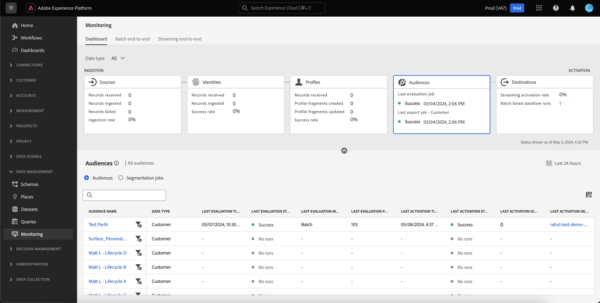
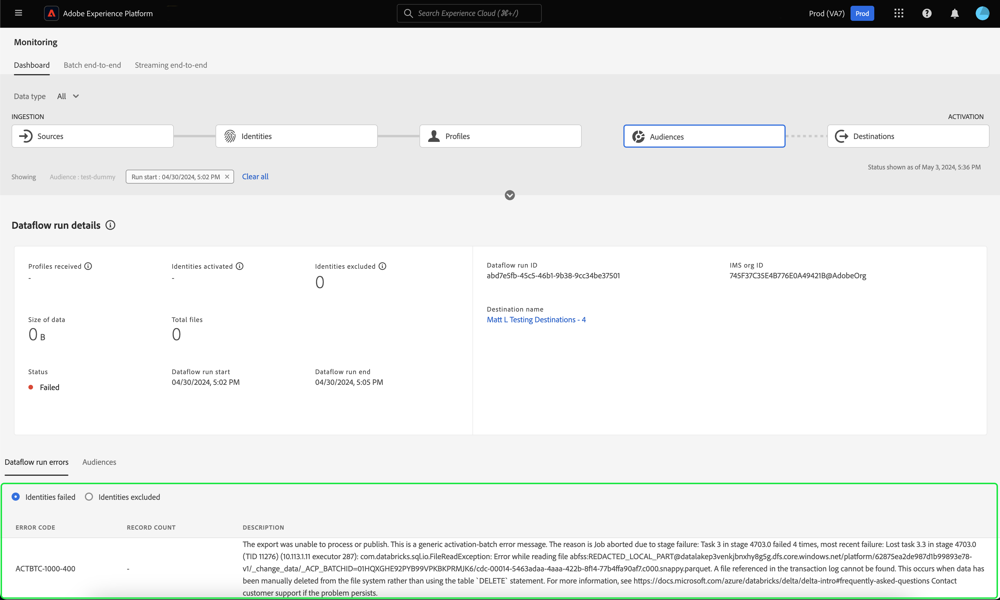

# 在UI中監視對象的資料流

區段服務可讓您透過區段定義或其他來自[!DNL Real-Time Customer Profile]資料的來源來建立對象。 Platform提供資料流，透明地追蹤從來源到目的地的資料流程。

使用監控儀表板可檢視對象中資料活動的視覺化表示法，包括資料細分的狀態。 閱讀教學課程，瞭解如何使用監視儀表板來使用Experience Platform使用者介面監視資料分段，讓您追蹤對象啟用、評估和匯出工作的狀態。

## 快速入門 {#getting-started}

本指南需要您深入了解下列 Adobe Experience Platform 元件：

- [資料流](../home.md)：資料流可呈現跨平台行動資料的資料作業。 資料流是跨不同服務設定的，有助於將資料從來源聯結器移至目標資料集、移至[!DNL Identity]和[!DNL Profile]以及移至[!DNL Destinations]。
   - [資料流執行](../../sources/notifications.md)：資料流執行是根據所選資料流的頻率設定所排程的週期性工作。
- [分段](../../segmentation/home.md)：分段可讓您從即時客戶設定檔資料建立對象。
   - [啟用工作](../../destinations/ui/activation-overview.md)：啟用工作用於將您的對象啟用到指定的目的地。
   - [評估作業](../../segmentation/tutorials/evaluate-a-segment.md#evaluate-a-segment)：評估作業是評估對象的非同步程式。
   - [匯出作業](../../segmentation/api/export-jobs.md)：匯出作業是用來將對象成員保留到資料集的非同步程式。
- [沙箱](../../sandboxes/home.md)： [!DNL Experience Platform]提供可將單一[!DNL Platform]執行個體分割成個別虛擬環境的虛擬沙箱，以利開發及改進數位體驗應用程式。

## 監視客群儀表板 {#monitoring-audiences-dashboard}

>[!CONTEXTUALHELP]
>id="platform_monitoring_segments"
>title="客群"
>abstract="客群檢視包含有關您組織之所有客群的資訊，以及有關其啟動和評估工作的詳細資訊。"

若要存取&#x200B;**[!UICONTROL 對象]**&#x200B;儀表板，請在左側導覽中選取&#x200B;**[!UICONTROL 監視]**。 在&#x200B;**[!UICONTROL 監視]**&#x200B;頁面上，選取&#x200B;**[!UICONTROL 對象]**&#x200B;卡片。

在主要&#x200B;**[!UICONTROL 受眾]**&#x200B;儀表板上，**[!UICONTROL 受眾]**&#x200B;卡片顯示上次評估工作和上次匯出工作的狀態和日期。

儀表板本身包含對象和細分作業的量度。 依預設，控制面板會顯示過去24小時的對象量度。 若要深入瞭解分段工作檢視，請閱讀[監視分段工作](#monitoring-segmentation-jobs-dashboard)區段。

>[!IMPORTANT]
>
>目前，監控對象儀表板僅支援啟用至[批次（檔案型）目的地](../../destinations/destination-types.md#file-based)的對象。

下列量度適用於此儀表板檢視：

| 量度 | 說明 |
| ------ | ----------- |
| **[!UICONTROL 對象名稱]** | 對象名稱。 |
| **[!UICONTROL 資料型別]** | 對象的資料型別。 可能的值包括&#x200B;**[!UICONTROL 客戶]**、**[!UICONTROL 帳戶]**&#x200B;和&#x200B;**[!UICONTROL 潛在客戶]**。 您可以使用卡片功能區上方的[!UICONTROL 資料型別]篩選器，檢視指定資料型別的對象。 |
| **[!UICONTROL 上次評估時間戳記]** | 對象上次執行評估工作的日期和時間。 |
| **[!UICONTROL 上次評估狀態]** | 對象最後評估工作的狀態。 可能的值包括&#x200B;**[!UICONTROL 成功]**、**[!UICONTROL 沒有回合]**&#x200B;和&#x200B;**[!UICONTROL 失敗]**。 |
| **[!UICONTROL 上次評估方法]** | 對象的評估方法。 由於僅支援批次分段，因此唯一可能的值為&#x200B;**[!UICONTROL 批次]**。 |
| **[!UICONTROL 上次評估設定檔]** | 在對象的上次評估工作中評估的設定檔數。 |
| **[!UICONTROL 上次啟用時間戳記]** | 對象上次執行啟用工作的日期和時間。 |
| **[!UICONTROL 上次啟用狀態]** | 對象上次啟用工作的狀態。 可能的值包括&#x200B;**[!UICONTROL 成功]**、**[!UICONTROL 沒有回合]**&#x200B;和&#x200B;**[!UICONTROL 失敗]**。 |
| **[!UICONTROL 上次啟用身分]** | 在對象的上次啟用工作中啟用的身分數量。 |
| **[!UICONTROL 上次啟用目的地]** | 對象上次啟用工作的目的地名稱。 |

您可以篩選結果給特定對象，並檢視其分段工作，方法是選取篩選圖示()。 區段作業會依時間順序排序，而最近的區段作業會先出現。

篩選的對象控制面板隨即顯示。 **[!UICONTROL Audiences]**&#x200B;卡片會顯示上次評估工作和上次啟用工作的狀態和日期。

儀表板本身會顯示上次評估和啟用工作的時間和狀態、顯示對象評估的設定檔計數的圖表，以及執行之區段工作的量度。 依預設，控制面板會顯示過去24小時的分段工作量度。

下列量度適用於此儀表板檢視：

| 量度 | 說明 |
| ------ | ----------- |
| **[!UICONTROL 工作開始]** | 分段工作開始的日期和時間。 |
| **[!UICONTROL 類型]** | 表示細分工作的型別。 兩個支援的工作型別為&#x200B;**啟用**&#x200B;和&#x200B;**評估**&#x200B;工作。 |
| **[!UICONTROL 工作完成]** | 分段工作完成的日期和時間。 |
| **[!UICONTROL 處理時間]** | 完成細分工作所需的時間。 |
| **[!UICONTROL 工作狀態]** | 分段工作的狀態。 支援的值包括&#x200B;**[!UICONTROL Success]**、**[!UICONTROL In Progress]**&#x200B;和&#x200B;**[!UICONTROL Failed]**。 |
| **[!UICONTROL 設定檔計數]** | 分段工作正在評估的設定檔數。 每個使用者都應該有唯一的設定檔。 |
| **[!UICONTROL 身分已啟用]** | 正在啟用細分工作的身分數。 每個設定檔都可以有多個身分。 例如，個人資料可以包含電子郵件、電話號碼和忠誠度編號作為身分。 |
| **[!UICONTROL 目的地名稱]** | 分段工作啟動的目標目的地名稱。 |

您可以進一步篩選至特定的分段工作，並藉由選取篩選圖示（)。 有兩種不同型別的細分工作可供篩選：啟動工作和評估工作。

### 啟用工作詳細資料 {#activation-job-details}

「啟動工作資料流執行詳細資料」頁面會顯示執行專案的量度、資料流執行錯誤，以及與細分工作相關的對象資訊。 啟用工作可針對指定目的地啟用您的對象。

下列量度適用於此儀表板檢視：

| 量度 | 說明 |
| ------ | ----------- |
| **[!UICONTROL 已接收設定檔]** | 啟動流程中接收的設定檔總數。 |
| **[!UICONTROL 已啟用的身分]** | 根據收到的設定檔，成功啟用至目的地的身分總數。 |
| **[!UICONTROL 排除的身分]** | 根據收到的設定檔，從啟用至目的地排除的身分總數。 由於缺少屬性或違反同意，這些身分可能會被排除。 |
| **[!UICONTROL 資料大小]** | 正在啟用的資料流的大小。 |
| **[!UICONTROL 檔案總數]** | 在資料流中啟用的檔案總數。 |
| **[!UICONTROL 狀態]** | 啟動工作的目前狀態。 |
| **[!UICONTROL 資料流執行開始]** | 啟動工作開始的日期和時間。 |
| **[!UICONTROL 資料流執行結束]** | 啟動工作結束的日期和時間。 |
| **[!UICONTROL 資料流執行ID]** | 目前啟用工作的ID。 |
| **[!UICONTROL IMS組織ID]** | 啟動工作所屬的組織ID。 |
| **[!UICONTROL 目的地名稱]** | 資料啟用的目的地名稱。 |

在受眾區段底下，您可以看到啟動工作中啟動的受眾清單。

在「對象」區段，可使用下列量度：

| 量度 | 說明 |
| ------ | ----------- |
| **[!UICONTROL 名稱]** | 已啟用的對象名稱。 |
| **[!UICONTROL 已啟用的身分]** | 根據收到的設定檔，成功啟用至目的地的身分總數。 |
| **[!UICONTROL 排除的身分]** | 根據收到的設定檔，從啟用至目的地排除的身分總數。 由於缺少屬性或違反同意，這些身分可能會被排除。 |
| **[!UICONTROL 上次資料流執行狀態]** | 針對該對象執行的最後一次啟用工作的狀態。 |
| **[!UICONTROL 上次資料流執行日期]** | 針對該對象執行的上次啟用工作的日期和時間。 |

此外，您也可以檢視資料流執行錯誤的詳細資料。 在資料流執行錯誤區段下，您可以檢視失敗的身分或排除的身分。 錯誤區段包含有關錯誤代碼和失敗或排除的身分數量的詳細資訊。

### 評估工作詳細資料 {#evaluation-job-details}

「評估工作資料流執行詳細資料」頁面會顯示與細分工作相關的執行量度和對象資訊。

下列量度適用於此儀表板檢視：

| 量度 | 說明 |
| ------ | ----------- |
| **[!UICONTROL 設定檔總數]** | 正在評估的設定檔總數。 |
| **[!UICONTROL 狀態]** | 評估工作的狀態。 評估工作可能的狀態包括&#x200B;**[!UICONTROL 成功]**&#x200B;和&#x200B;**[!UICONTROL 失敗]**。 |
| **[!UICONTROL 工作開始]** | 評估工作開始的日期和時間。 |
| **[!UICONTROL 工作結束]** | 評估工作結束的日期和時間。 |
| **[!UICONTROL 工作型別]** | 細分工作的型別。 在此情況下，一律為&#x200B;**[!UICONTROL 區段評估]**&#x200B;工作。 |
| **[!UICONTROL 評估型別]** | 正在完成的評估型別。 這可以是&#x200B;**[!UICONTROL 批次]**&#x200B;或&#x200B;**[!UICONTROL 串流]**。 |
| **[!UICONTROL 工作ID]** | 評估工作的ID。 |
| **[!UICONTROL IMS組織ID]** | 評估工作所屬組織的識別碼。 |
| **[!UICONTROL 對象名稱]** | 正在評估的對象名稱。 |
| **[!UICONTROL 對象ID]** | 正在評估的對象的ID。 |

在「[!UICONTROL 對象]」區段下，您可以看到作為評估工作的一部分進行評估的對象清單。 您可以使用搜尋列依名稱篩選對象清單。

>[!IMPORTANT]
>
>此儀表板檢視目前支援最多800個對象量度。

針對[!UICONTROL 對象]區段，有以下量度可供使用：

| 量度 | 說明 |
| ------ | ----------- |
| **[!UICONTROL 名稱]** | 正在評估的對象名稱。 |
| **[!UICONTROL 設定檔計數]** | 正在評估的設定檔數。 |

## 監視分段工作儀表板 {#monitoring-segmentation-jobs-dashboard}

>[!CONTEXTUALHELP]
>id="platform_monitoring_segment_jobs"
>title="分段工作"
>abstract="分段工作檢視包含有關您所有客群之評估和匯出工作的資訊。"

若要存取&#x200B;**[!UICONTROL 分段工作]**&#x200B;儀表板，請在[!UICONTROL 對象]儀表板中選取&#x200B;**[!UICONTROL 分段工作]**。 [!UICONTROL 監視]儀表板包含評估與匯出作業的度量與資訊。

>[!NOTE]
>
>每個對象監視僅支援&#x200B;**區段評估工作**。 區段匯出作業僅支援組織層級的監控。

使用[!UICONTROL 區段工作]儀表板來瞭解設定檔評估與匯出是否準時並且沒有任何例外，以便目的地啟用的下游服務可以有評估過的最新設定檔資料。

下列量度可用於細分工作：

| 量度 | 說明 |
| ------ | ----------- |
| **[!UICONTROL 分段工作]** | 表示細分工作的名稱。 |
| **[!UICONTROL 類型]** | 指示分段工作的型別 — 匯出或評估。 請注意，在這兩種情況下，分段工作都會評估或匯出屬於組織的&#x200B;**所有**&#x200B;對象。 若要深入瞭解匯出作業，請閱讀[匯出作業端點](../../segmentation/api/export-jobs.md)的指南。 若要深入瞭解評估工作，請閱讀有關[評估區段定義](../../segmentation/tutorials/evaluate-a-segment.md#evaluate-a-segment)的教學課程。 |
| **[!UICONTROL 工作開始]** | 分段工作開始的日期和時間。 |
| **[!UICONTROL 工作結束]** | 分段工作完成的日期和時間。 |
| **[!UICONTROL 狀態]** | 已完成工作的狀態。 分段工作可能的狀態包括成功或失敗。 |
