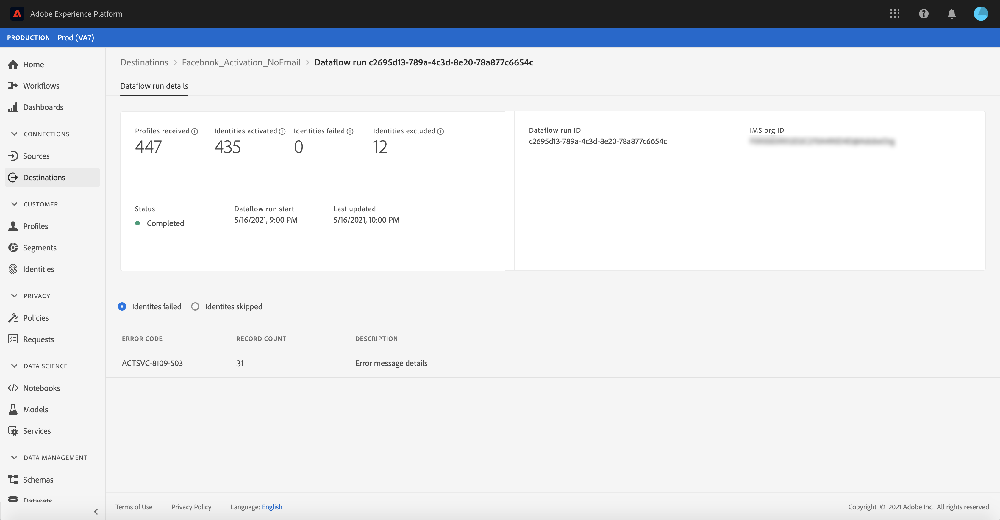
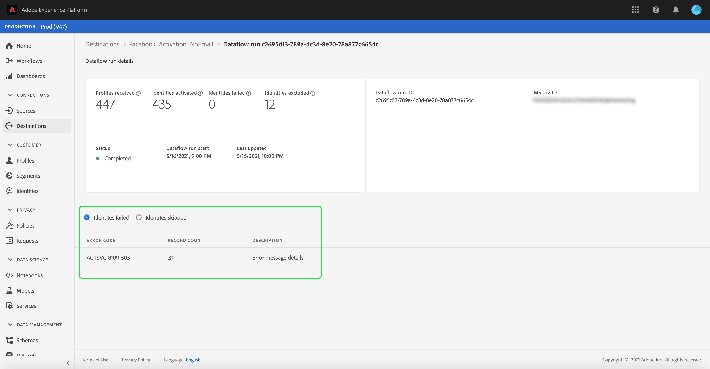
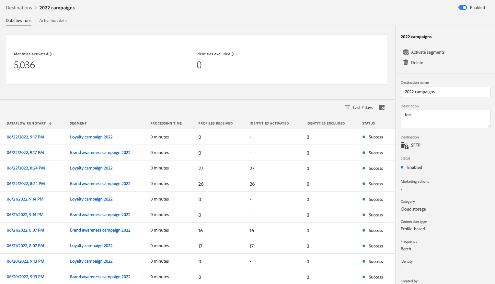
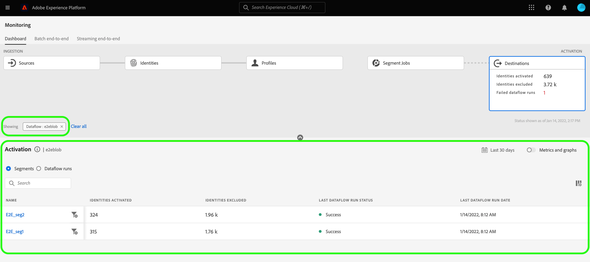
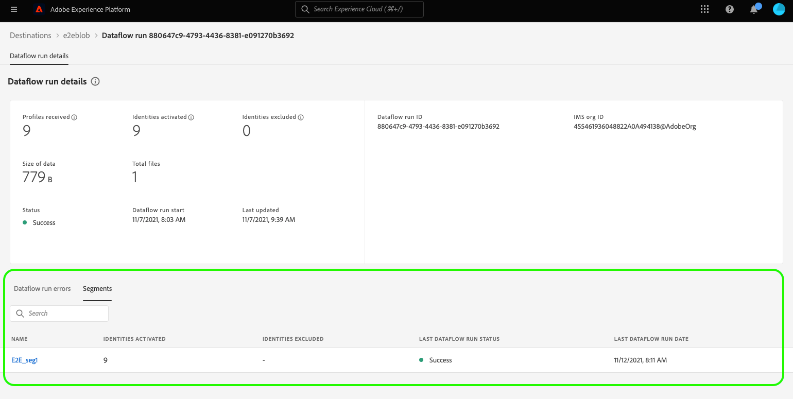

# 在UI中監視目的地的資料流

目的地可讓您從Adobe Experience Platform向無數外部合作夥伴啟用資料。 Platform借由提供資料流的透明度，讓追蹤資料流至目的地的程式更輕鬆。

監控控制面板可提供資料流歷程的視覺表示，包括資料被激活的目標。 本教學課程提供如何直接在目標工作區中監視資料流，或使用監控控制面板，使用Experience Platform使用者介面監視目標的資料流的相關說明。

## 快速入門 {#getting-started}

本指南需要妥善了解下列Adobe Experience Platform元件：

- [資料流](../home.md):資料流是跨平台移動資料的資料作業的表示。 資料流可跨不同的服務進行配置，有助於將資料從源連接器移動到目標資料集 [!DNL Identity] 和 [!DNL Profile]和 [!DNL Destinations].
   - [資料流運行](../../sources/notifications.md):資料流運行是基於所選資料流的頻率配置的循環調度作業。
- [目的地](../../destinations/home.md):目的地是與常用應用程式預先建立的整合，可順暢地啟動來自Platform的資料，以進行跨通路行銷活動、電子郵件行銷活動、目標廣告和許多其他使用案例。
- [沙箱](../../sandboxes/home.md): [!DNL Experience Platform] 提供可分割單一沙箱的虛擬沙箱 [!DNL Platform] 例項放入個別的虛擬環境，以協助開發及改進數位體驗應用程式。

## 監視目標工作區中的資料流 {#monitor-dataflows-in-the-destinations-workspace}

在 **[!UICONTROL 目的地]** Platform UI中的工作區，導覽至 **[!UICONTROL 瀏覽]** 標籤，然後選取您要檢視的目的地名稱。

將顯示現有資料流清單。 此頁面上是可查看資料流的清單，包括有關其目標、用戶名、資料流數和狀態的資訊。

如需狀態的詳細資訊，請參閱下表：

| 狀態 | 說明 |
| ------ | ----------- |
| 啟用 | 此 `Enabled` 狀態表示資料流處於活動狀態，並正在根據提供的調度導出資料。 |
| 停用 | 此 `Disabled` 狀態表示資料流處於非活動狀態，且未導出任何資料。 |
| 正在處理 | 此 `Processing` 狀態表示資料流尚未處於活動狀態。 建立新資料流後，通常會立即出現此狀態。 |
| 錯誤 | 此 `Error` 狀態表示資料流的激活過程已中斷。 |

### 用於串流目的地的資料流執行 {#dataflow-runs-for-streaming-destinations}

>[!CONTEXTUALHELP]
>id="platform_monitoring_dataflow_run_details_activation_streaming"
>title="資料流執行詳細資訊"
>abstract="目的地資料流執行詳細資訊包含區段啟用狀態的資訊，以及取自即時客戶設定檔以產生唯一身分的量度。若要深入了解，請檢閱量度定義指南。"

>[!CONTEXTUALHELP]
>id="platform_monitoring_profiles_received_streaming"
>title="收到的設定檔"
>abstract="資料流中收到的設定檔總數。此值每 60 分鐘更新一次。"

>[!CONTEXTUALHELP]
>id="platform_destinations_dataflow_identitiesactivated_streaming"
>title="啟用的身分"
>abstract="成功啟用到所選目的地之個別設定檔身分的計數。此量度包括從匯出的區段中建立、更新和刪除的身分。"

>[!CONTEXTUALHELP]
>id="platform_destinations_dataflow_identitiesexcluded_streaming"
>title="排除的身分"
>abstract="根據缺少的屬性和違規行為，從所選目的地的啟用中排除的個別設定檔記錄的計數。"

>[!CONTEXTUALHELP]
>id="platform_destinations_dataflow_identitiesfailed_streaming"
>title="失敗的身分"
>abstract="針對所選目的地失敗的個別設定檔身分的計數。請檢查錯誤診斷以取得詳細資料。"

若為串流目的地， [!UICONTROL 資料流運行] 索引標籤會每小時更新資料流執行中的量度資料。 標有「身份」標籤的最顯著統計資料。

身分代表設定檔的不同面向。 例如，如果設定檔同時包含電話號碼和電子郵件地址，該設定檔將具有兩個身分。

個別執行的清單及其特定量度會顯示，以及下列身分總計：

- **[!UICONTROL 已激活身份]**:成功啟動至所選目的地的設定檔身分總數。 此量度包括從匯出的區段中建立、更新和刪除的身分。
- **[!UICONTROL 已排除的身分]**:根據遺失屬性和同意違反而略過以進行啟用的設定檔身分總數。
- **[!UICONTROL 身份失敗]**:因錯誤而未啟動至目的地的設定檔身分識別總數。

每個資料流運行都顯示以下詳細資訊：

- **[!UICONTROL 資料流運行開始]**:資料流運行的開始時間。 對於流資料流運行，Experience Platform會根據資料流運行的開始以每小時度量的形式捕獲度量。 對於流資料流運行，如果資料流運行（例如在晚上10:30啟動），則量度在UI中將開始時間顯示為晚上10:00。
- **[!UICONTROL 處理時間]**:資料流運行處理所花費的時間。
   - 針對 **[!UICONTROL 已完成]** 執行時，處理時間量度一律顯示1小時。
   - 對於仍在 **[!UICONTROL 處理]** 狀態時，捕獲所有度量的窗口將保持開啟超過一小時，以處理與資料流運行對應的所有度量。 例如，從上午9:30開始的資料流運行可能會在處理狀態中停留1小時30分鐘，以捕獲和處理所有度量。 然後，一旦處理窗口關閉，資料流運行的狀態將更新為 **已完成**，則顯示的處理時間會變更為1小時。
- **[!UICONTROL 收到的設定檔]**:資料流中接收的配置檔案總數。
- **[!UICONTROL 已激活身份]**:在資料流運行過程中成功激活到選定目標的配置檔案標識的總數。 此量度包括從匯出的區段中建立、更新和刪除的身分。
- **[!UICONTROL 已排除的身分]**:根據遺失屬性和同意違反而從啟動中排除的設定檔身分總數。
- **[!UICONTROL 身份失敗]** 因錯誤而未啟動至目的地的設定檔身分識別總數。
- **[!UICONTROL 啟動率]**:已成功啟動或跳過的接收身份的百分比。 下列公式示範如何計算此值：
   
- **[!UICONTROL 狀態]**:表示資料流的狀態：heer [!UICONTROL 已完成] 或 [!UICONTROL 處理]. [!UICONTROL 已完成] 表示在1小時內導出了相應資料流運行的所有標識。 [!UICONTROL 處理] 表示資料流運行尚未完成。

要查看特定資料流運行的詳細資訊，請從清單中選擇運行的開始時間。

資料流運行的詳細資訊頁包含其他資訊，如接收的配置檔案數、激活的身份數、失敗的身份數以及排除的身份數。

詳細資訊頁面也會顯示失敗的身分識別清單和已排除的身分識別。 會顯示失敗和已排除身分的資訊，包括錯誤碼、身分計數和說明。 依預設，清單會顯示失敗的身分。 若要顯示已略過的身分，請選取 **[!UICONTROL 已排除的身分]** 切換。

### 針對批處理目標運行資料流 {#dataflow-runs-for-batch-destinations}

>[!CONTEXTUALHELP]
>id="platform_monitoring_dataflow_run_details_activation"
>title="資料流執行詳細資訊"
>abstract="目的地資料流執行詳細資訊包含區段啟用狀態的資訊，以及取自即時客戶設定檔以產生唯一身分的量度。若要深入了解，請檢閱量度定義指南。"
>additional-url="https://experienceleague.adobe.com/docs/experience-platform/dataflows/ui/monitor-destinations.html#dataflow-runs-for-streaming-destinations" text="用於串流目的地的資料流執行"

>[!CONTEXTUALHELP]
>id="platform_monitoring_profiles_received_batch"
>title="收到的設定檔"
>abstract="資料流中收到的設定檔總數。此值每 60 分鐘更新一次。"

>[!CONTEXTUALHELP]
>id="platform_destinations_dataflow_identitiesactivated_batch"
>title="啟用的身分"
>abstract="成功啟用到所選目的地之個別設定檔身分的計數。此量度包括從匯出的區段中建立、更新和刪除的身分。"

>[!CONTEXTUALHELP]
>id="platform_destinations_dataflow_identitiesexcluded_batch"
>title="排除的身分"
>abstract="根據缺少的屬性和違規行為，從所選目的地的啟用中排除的個別設定檔記錄的計數。"

針對批次目的地， [!UICONTROL 資料流運行] 索引標籤提供資料流執行時的量度資料。 個別執行的清單及其特定量度會顯示，以及下列身分總計：

- **[!UICONTROL 已激活身份]**:成功啟動至所選目的地的設定檔身分總數。 此量度包括從匯出的區段中建立、更新和刪除的身分。
- **[!UICONTROL 已排除的身分]**:根據遺失的屬性和同意違反，從所選目的地的啟動中排除的個別設定檔身分識別計數。

每個資料流運行都顯示以下詳細資訊：

- **[!UICONTROL 資料流運行開始]**:資料流運行的開始時間。
- **[!UICONTROL 區段]**:與每個資料流運行關聯的段的名稱。
- **[!UICONTROL 處理時間]**:處理資料流運行所花費的時間。
- **[!UICONTROL 收到的設定檔]**:資料流中接收的配置檔案總數。 此值每 60 分鐘更新一次。
- **[!UICONTROL 已激活身份]**:在資料流運行過程中成功激活到選定目標的配置檔案標識的總數。 此量度包括從匯出的區段中建立、更新和刪除的身分。
- **[!UICONTROL 已排除的身分]**:根據遺失屬性和同意違反而從啟動中排除的設定檔身分總數。
- **[!UICONTROL 狀態]**:表示資料流所處的狀態。 這可以是三種狀態之一： [!UICONTROL 成功], [!UICONTROL 失敗]，和 [!UICONTROL 處理]. [!UICONTROL 成功] 表示資料流處於活動狀態，並正在根據其提供的調度導出資料。 [!UICONTROL 失敗] 表示資料的啟動因錯誤而暫停。 [!UICONTROL 處理] 表示資料流尚未處於活動狀態，並且通常在建立新資料流時遇到。

要查看特定資料流運行的詳細資訊，請從清單中選擇運行的開始時間。

>[!NOTE]
>
>根據目標資料流的調度頻率生成資料流運行。 對每個 [合併策略](../../profile/merge-policies/overview.md) 套用至區段。

除了資料流清單上顯示的詳細資訊之外，資料流的詳細資訊頁還顯示有關資料流的更具體資訊：

- **[!UICONTROL 資料大小]**:要導出的資料流的大小。
- **[!UICONTROL 檔案總數]**:資料流中導出的檔案總數。
- **[!UICONTROL 上次更新]**:上次更新資料流運行的時間。

詳細資訊頁面也會顯示失敗的身分識別清單和已排除的身分識別。 會顯示失敗和已排除身分的資訊，包括錯誤碼和說明。 依預設，清單會顯示失敗的身分。 若要顯示排除的身分，請選取 **[!UICONTROL 已排除的身分]** 切換。

## 監控目標控制面板 {#monitoring-destinations-dashboard}

>[!NOTE]
>
>- Experience Platform中的所有目的地目前都支援目的地監視功能 *expert* the [Adobe Target](/help/destinations/catalog/personalization/adobe-target-connection.md) 和 [自訂個人化](/help/destinations/catalog/personalization/custom-personalization.md) 目的地。
>- 若 [AmazonKinesis](/help/destinations/catalog/cloud-storage/amazon-kinesis.md), [Azure事件中心](/help/destinations/catalog/cloud-storage/azure-event-hubs.md)，和 [HTTP API](/help/destinations/catalog/streaming/http-destination.md) 目的地、與已排除、失敗和已啟動身分相關的量度會預估。 啟動資料量較大，導致量度的準確度較高。

>[!CONTEXTUALHELP]
>id="platform_monitoring_activation"
>title="啟用"
>abstract="目的地啟用視圖包含區段啟用狀態的資訊，以及取自即時客戶設定檔以產生唯一身分的量度。"

若要存取 [!UICONTROL 監控] 控制面板，選取 **[!UICONTROL 監控]** ()。 一次 [!UICONTROL 監控] 頁面，選取 [!UICONTROL 目的地]. 此 [!UICONTROL 監控] 控制面板包含目標執行作業的度量和資訊。

使用 [!UICONTROL 目的地] 控制面板，全面了解啟動流程的運作狀況。 首先，獲取所有批處理和流目標的聚合級別的深入分析，然後深入鑽研資料流、資料流運行和激活的段的詳細視圖，以深入查看激活資料。 螢幕 [!UICONTROL 監控] 控制面板會透過量度和錯誤說明提供可操作的深入分析，協助您疑難排解啟動案例中可能出現的問題。

控制面板的中心是 [!UICONTROL 啟動] 面板，其中包含度量和圖形，顯示導出到流目標的資料的激活率以及運行到批處理目標的失敗批處理資料流的資料。

依預設，顯示的資料包含過去24小時的啟動資訊。 選擇 **[!UICONTROL 過去24小時]** 調整顯示的記錄時間範圍。 可用選項包括 **[!UICONTROL 過去24小時]**, **[!UICONTROL 最近7天]**，和 **[!UICONTROL 最近30天]**. 或者，您也可以在顯示的日曆彈出式視窗中選取日期。 選取日期後，請選取 **[!UICONTROL 套用]** 來調整所顯示資訊的時間範圍。

>[!NOTE]
>
>以下螢幕截圖顯示過去30天（而不是過去24小時）的激活率和批處理資料流運行。 您可以選取 **[!UICONTROL 最近30天]**.

使用箭頭圖示()，以根據目的地類型（串流或批次）展開或關閉畫面頂端的資訊卡，顯示啟動詳細資訊的一覽：

- **[!UICONTROL 串流啟動率]**:代表已成功啟用或略過之接收身分的百分比。 用於計算此百分比的公式會在本頁的上方，於 [流目的地的資料流運行](#dataflow-runs-for-streaming-destinations) 區段。
- **[!UICONTROL 批處理資料流運行失敗]**:表示所選時間間隔內失敗的資料流運行數。

此 **[!UICONTROL 啟動]** 圖表預設會顯示，您可以停用它以展開下方的目的地清單。 選取 **[!UICONTROL 度量和圖表]** 切換為停用圖形。

此 **[!UICONTROL 啟動]** 面板會顯示至少包含一個現有帳戶的目的地清單。 此清單還包括有關接收的配置檔案、激活的身份、身份失敗、排除的身份、激活率、失敗的資料流總數以及這些目標的上次更新日期的資訊。 並非所有量度皆適用於所有目的地類型。 下表概述可依目的地類型、串流或批次使用的量度。

| 量度 | 目的地類型 |
---------|----------|
| **[!UICONTROL 收到的設定檔]** | 串流和批次 |
| **[!UICONTROL 啟用的身分]** | 串流和批次 |
| **[!UICONTROL 失敗的身分]** | 串流 |
| **[!UICONTROL 排除的身分]** | 串流和批次 |
| **[!UICONTROL 啟動率]** | 串流 |
| **[!UICONTROL 失敗的資料流總數]** | 批次 |
| **[!UICONTROL 上次更新時間]** | 串流和批次 |

您也可以篩選目的地清單，以僅顯示選取的目的地類別。 選取 **[!UICONTROL 我的目的地]** 下拉式清單，然後選取 [目的地類別](/help/destinations/destination-types.md#categories) 來篩選。

此外，您可以在搜尋列中輸入目的地，以隔離至單一目的地。 如果要查看目標的資料流，可以選擇篩選器  查看其活動資料流清單。

如果要查看所有目標中的所有現有資料流，請選擇 **[!UICONTROL 資料流]**.

此時將顯示資料流清單，按上次資料流運行排序。 通過找到要監視的目標並選擇篩選器，您可以查看特定資料流的其他詳細資訊  旁邊，然後選取篩選器  除了要獲取更多資訊的資料流之外。

選擇資料流以進行進一步檢查後，資料流詳細資訊頁將包含一個切換按鈕，該切換按鈕允許您查看資料流中已激活的資料，並按資料流運行或段細分。

### 資料流運行視圖 {#dataflow-runs-view}

當 **[!UICONTROL 資料流運行]** 已選中，您可以查看所選資料流的資料流運行清單以及有關每個運行的詳細資訊。

>[!INFO]
>
>對於流目的地的資料流，資料流運行將細分為每小時窗口。 每個每小時窗口都生成相應的資料流運行ID。
>
>對於到批處理目的地的資料流，每個段都根據段激活計畫頻率生成相應的資料流運行。 例如，如果為同一目標資料流中的五個段設定每日計畫激活，則每天將生成五個單獨的資料流運行。

使用 **[!UICONTROL 僅顯示故障]** 切換為僅顯示資料流的失敗運行。

### 區段層級檢視 {#segment-level-view}

當 **[!UICONTROL 區段]** ，您將看到選定時間範圍內已激活到選定資料流的段清單。 此螢幕包括有關激活的身份、排除的身份以及上次資料流運行的狀態和時間的段級資訊。 檢閱已排除和啟用身分的量度，即可確認區段是否已成功啟用。

例如，您要將名為「加州的忠誠會員」的區段啟用至Amazon S3目的地「加州的忠誠會員12月」。 假設選取的區段中有100個設定檔，但100個設定檔中只有80個包含忠誠度ID屬性，而您已將匯出對應規則定義為 `loyalty.id` 為必要項目。 在此情況下，在區段層級，您會看到已啟用80個身分，並排除20個身分。

>[!IMPORTANT]
>
>請注意區段層級量度的目前限制：
>- 區段層級檢視目前僅適用於批次目的地。
>- 目前僅記錄成功資料流運行的段級別度量。 系統不會針對失敗的資料流運行和排除的記錄來記錄它們。

在區段層級檢視中，量度會在所選時間範圍內，在多個資料流執行之間匯總。 如果有多個資料流運行，則可以從段級別向下鑽取，以查看每個資料流運行的劃分（按所選段篩選）。
使用篩選按鈕  要深入鑽取資料流中每個段的資料流運行視圖，請執行以下操作：

### 「資料流運行」頁 {#dataflow-runs-page}

「資料流運行」頁顯示了資料流運行的資訊，包括資料流運行開始時間、處理時間、接收的配置檔案、激活的身份、排除的身份、身份失敗、激活率和狀態。

當您從 [區段層級檢視](#segment-level-view)，您可以選擇通過以下選項篩選資料流運行：

- **[!UICONTROL 資料流以失敗的身份運行]**:對於所選段，此選項列出所有因激活而失敗的資料流運行。 要檢查某個資料流運行中的身份失敗的原因，請參見 [資料流運行詳細資訊頁](#dataflow-run-details-page) 資料流運行。
- **[!UICONTROL 資料流以跳過的身份運行]**:對於所選段，此選項列出所有資料流運行，其中某些身份未完全激活，並跳過了某些配置檔案。 要檢查特定資料流運行中的身份被跳過的原因，請參見 [資料流運行詳細資訊頁](#dataflow-run-details-page) 資料流運行。
- **[!UICONTROL 資料流以激活的身份運行]**:對於所選段，此選項列出所有具有已成功激活標識的資料流運行。

要查看有關特定資料流運行的更多詳細資訊，請選擇該篩選器  在「資料流運行開始時間」旁邊，查看「資料流運行詳細資訊」頁。

### 「資料流運行詳細資訊」頁 {#dataflow-run-details-page}

除了資料流運行清單上顯示的詳細資訊外，資料流運行詳細資訊頁還顯示有關資料流的更具體資訊：

- **[!UICONTROL 資料流運行ID]**:資料流的ID。
- **[!UICONTROL IMS組織ID]**:資料流所屬的組織。
- **[!UICONTROL 上次更新]**:上次更新資料流運行的時間。

「詳細資訊」頁還可切換資料流運行錯誤和段。 此選項僅適用於批處理目標中運行的資料流。

資料流運行錯誤視圖顯示失敗的標識清單和已排除的標識。 會顯示失敗和已排除身分的資訊，包括錯誤碼、身分計數和說明。 依預設，清單會顯示失敗的身分。 若要顯示已略過的身分，請選取 **[!UICONTROL 已排除的身分]** 切換。

當 **[!UICONTROL 區段]** ，您將看到選定資料流運行中激活的段的清單。 此螢幕包括有關激活的身份、排除的身份以及上次資料流運行的狀態和時間的段級資訊。

## 後續步驟 {#next-steps}

按照本指南，您現在知道如何監視批處理和流目的地的資料流，包括處理時間、激活率和狀態等所有相關資訊。 若要進一步了解Platform中的資料流，請閱讀 [資料流概述](../home.md). 若要進一步了解目的地，請閱讀 [目的地概述](../../destinations/home.md).