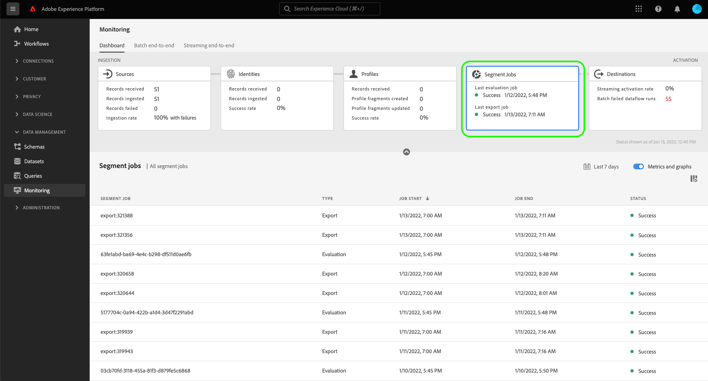

# 監視UI中目標的資料流

目標允許您將資料從Adobe Experience Platform激活到無數外部合作夥伴。 平台通過提供資料流的透明性，使跟蹤資料流到目標的過程更加輕鬆。

監視面板可以直觀地表示資料流的行程，包括資料被激活到的目標。 本教程提供了有關如何直接在目標工作區中監視資料流，或使用監視面板使用Experience Platform用戶介面監視目標的資料流的說明。

## 快速入門 {#getting-started}

本指南要求對Adobe Experience Platform的下列組成部分有工作上的理解：

- [資料流](../home.md):資料流是跨平台移動資料的資料作業的表示形式。 資料流是跨不同服務配置的，有助於將資料從源連接器移動到目標資料集 [!DNL Identity] 和 [!DNL Profile], [!DNL Destinations]。
   - [資料流運行](../../sources/notifications.md):資料流運行是基於所選資料流的頻率配置的定期調度作業。
- [目標](../../destinations/home.md):目標是預構建的與常用應用程式的整合，這些整合允許從平台無縫激活資料，用於跨渠道營銷活動、電子郵件活動、目標廣告和許多其他使用案例。
- [沙箱](../../sandboxes/home.md): [!DNL Experience Platform] 提供虛擬沙箱，將單個沙箱 [!DNL Platform] 實例到獨立的虛擬環境，以幫助開發和發展數字型驗應用程式。

## 監視目標工作區中的資料流 {#monitor-dataflows-in-the-destinations-workspace}

在 **[!UICONTROL 目標]** 工作區，導航到 **[!UICONTROL 瀏覽]** 頁籤，然後選擇要查看的目標名稱。

此時將顯示現有資料流的清單。 此頁上是可查看資料流的清單，包括有關其目標、用戶名、資料流數和狀態的資訊。

有關狀態的詳細資訊，請參閱下表：

| 狀態 | 說明 |
| ------ | ----------- |
| 啟用 | 的 `Enabled` 狀態表示資料流處於活動狀態，並正在根據提供的計畫導出資料。 |
| 停用 | 的 `Disabled` 狀態表示資料流處於非活動狀態，且未導出任何資料。 |
| 正在處理 | 的 `Processing` 狀態表示資料流尚未處於活動狀態。 建立新資料流後，通常會立即遇到此狀態。 |
| 錯誤 | 的 `Error` 狀態表示資料流的激活過程已中斷。 |

### 流目標的資料流運行 {#dataflow-runs-for-streaming-destinations}

>[!CONTEXTUALHELP]
>id="platform_destinations_dataflow_identitiesactivated"
>title="已激活身份"
>abstract="已成功激活到選定目標的單個配置檔案標識的計數。"
>text="Learn more in documentation"

>[!CONTEXTUALHELP]
>id="platform_destinations_dataflow_identitiesexcluded"
>title="排除的身份"
>abstract="基於丟失的屬性和同意違規而從選定目標的激活中排除的單個配置檔案記錄的計數。"
>text="Learn more in documentation"

>[!CONTEXTUALHELP]
>id="platform_destinations_dataflow_identitiesfailed"
>title="標識失敗"
>abstract="所選目標失敗的單個配置檔案標識的計數。 有關詳細資訊，請檢查錯誤診斷。"
>additional-url="https://adobe.com/go/destinations-monitor-dataflows-batch-en" text="瞭解有關文檔的詳細資訊"

>[!CONTEXTUALHELP]
>id="platform_monitoring_dataflow_run_details_activation_streaming"
>title="資料流運行詳細資訊"
>abstract="目標資料流運行詳細資訊包含有關段的激活狀態和從即時客戶配置檔案獲取的度量的資訊，以生成唯一標識。 要瞭解更多資訊，請查看度量定義指南。"

>[!CONTEXTUALHELP]
>id="platform_monitoring_profiles_received_streaming"
>title="收到的配置檔案"
>abstract="在資料流中接收的配置檔案總數。 此值每60分鐘更新一次。"
>text="Learn more in documentation"

>[!CONTEXTUALHELP]
>id="platform_destinations_dataflow_identitiesactivated_streaming"
>title="已激活身份"
>abstract="已成功激活到選定目標的單個配置檔案標識的計數。"
>text="Learn more in documentation"

>[!CONTEXTUALHELP]
>id="platform_destinations_dataflow_identitiesexcluded_streaming"
>title="排除的身份"
>abstract="基於丟失的屬性和同意違規而從選定目標的激活中排除的單個配置檔案記錄的計數。"
>text="Learn more in documentation"

>[!CONTEXTUALHELP]
>id="platform_destinations_dataflow_identitiesfailed_streaming"
>title="標識失敗"
>abstract="所選目標失敗的單個配置檔案標識的計數。 有關詳細資訊，請檢查錯誤診斷。"
>text="Learn more in documentation"

對於流目標， [!UICONTROL 資料流運行] 頁籤為資料流運行上的度量資料提供每小時更新。 標有標識的最顯赫統計資料是身份。

標識表示輪廓的不同小平面。 例如，如果配置檔案同時包含電話號碼和電子郵件地址，則該配置檔案將具有兩個身份。

將顯示單個運行及其特定度量的清單，以及以下標識總計：

- **[!UICONTROL 已激活身份]**:為激活而建立或更新的配置檔案標識的總數。
- **[!UICONTROL 排除的身份]**:基於缺少屬性和同意違規而跳過用於激活的配置檔案標識總數。
- **[!UICONTROL 標識失敗]**:由於錯誤而未激活到目標的配置檔案標識總數。

每個資料流運行都顯示以下詳細資訊：

- **[!UICONTROL 資料流運行啟動]**:資料流運行於的時間。
- **[!UICONTROL 處理時間]**:資料流處理所花費的時間。
- **[!UICONTROL 收到的配置檔案]**:在資料流中接收的配置檔案總數。
- **[!UICONTROL 已激活身份]**:成功激活到選定目標的配置檔案標識總數。
- **[!UICONTROL 排除的身份]**:基於缺少屬性和同意違規而被排除在激活中的配置檔案標識總數。
- **[!UICONTROL 標識失敗]** 由於錯誤而未激活到目標的配置檔案標識總數。
- **[!UICONTROL 激活率]**:已成功激活或跳過的已接收標識的百分比。 以下公式說明如何計算此值：
   
- **[!UICONTROL 狀態]**:表示資料流的狀態：或 [!UICONTROL 已完成] 或 [!UICONTROL 處理]。 [!UICONTROL 已完成] 表示在1小時內導出了相應資料流運行的所有標識。 [!UICONTROL 處理] 表示資料流運行尚未完成。

要查看特定資料流運行的詳細資訊，請從清單中選擇運行的開始時間。

資料流運行的詳細資訊頁包含其他資訊，如接收的配置檔案數、激活的標識數、失敗的標識數和排除的標識數。

詳細資訊頁面還顯示失敗的標識清單和排除的標識。 將顯示失敗和排除身份的資訊，包括錯誤代碼、身份計數和說明。 預設情況下，清單顯示失敗的標識。 要顯示跳過的標識，請選擇 **[!UICONTROL 排除的身份]** 切換。

### 為批處理目標運行資料流 {#dataflow-runs-for-batch-destinations}

>[!CONTEXTUALHELP]
>id="platform_monitoring_profiles_received"
>title="收到的配置檔案"
>abstract="在資料流中接收的配置檔案總數。 此值每60分鐘更新一次。"
>text="Learn more in documentation"

>[!CONTEXTUALHELP]
>id="platform_monitoring_dataflow_run_details_activation"
>title="資料流運行詳細資訊"
>abstract="目標資料流運行詳細資訊包含有關段的激活狀態和從即時客戶配置檔案獲取的度量的資訊，以生成唯一標識。 要瞭解更多資訊，請查看度量定義指南。"

>[!CONTEXTUALHELP]
>id="platform_monitoring_dataflow_run_details_activation_batch"
>title="資料流運行詳細資訊"
>abstract="目標資料流運行詳細資訊包含有關段的激活狀態和從即時客戶配置檔案獲取的度量的資訊，以生成唯一標識。 要瞭解更多資訊，請查看度量定義指南。"

>[!CONTEXTUALHELP]
>id="platform_monitoring_profiles_received_batch"
>title="收到的配置檔案"
>abstract="在資料流中接收的配置檔案總數。 此值每60分鐘更新一次。"
>text="Learn more in documentation"

>[!CONTEXTUALHELP]
>id="platform_destinations_dataflow_identitiesactivated_batch"
>title="已激活身份"
>abstract="已成功激活到選定目標的單個配置檔案標識的計數。"
>text="Learn more in documentation"

>[!CONTEXTUALHELP]
>id="platform_destinations_dataflow_identitiesexcluded_batch"
>title="排除的身份"
>abstract="基於丟失的屬性和同意違規而從選定目標的激活中排除的單個配置檔案記錄的計數。"
>text="Learn more in documentation"

對於批目標， [!UICONTROL 資料流運行] 頁籤提供資料流運行的度量資料。 將顯示單個運行及其特定度量的清單，以及以下標識總計：

- **[!UICONTROL 已激活身份]**:已成功激活到選定目標的單個配置檔案標識的計數。
- **[!UICONTROL 排除的身份]**:基於缺少的屬性和同意違規，從選定目標的激活中排除的單個配置檔案標識的計數。

每個資料流運行都顯示以下詳細資訊：

- **[!UICONTROL 資料流運行啟動]**:資料流運行於的時間。
- **[!UICONTROL 處理時間]**:處理資料流運行所花費的時間。
- **[!UICONTROL 收到的配置檔案]**:在資料流中接收的配置檔案總數。 此值每60分鐘更新一次。
- **[!UICONTROL 已激活身份]**:成功激活到選定目標的配置檔案標識總數。
- **[!UICONTROL 排除的身份]**:基於缺少屬性和同意違規而被排除在激活中的配置檔案標識總數。
- **[!UICONTROL 狀態]**:表示資料流處於的狀態。 這可以是三個狀態之一： [!UICONTROL 成功]。 [!UICONTROL 失敗], [!UICONTROL 處理]。 [!UICONTROL 成功] 表示資料流處於活動狀態，並正在根據其提供的時間表導出資料。 [!UICONTROL 失敗] 表示由於錯誤而暫停了資料的激活。 [!UICONTROL 處理] 表示資料流尚未處於活動狀態，並且通常在建立新資料流時遇到。

要查看特定資料流運行的詳細資訊，請從清單中選擇運行的開始時間。

>[!NOTE]
>
>根據目標資料流的調度頻率生成資料流運行。 對每個資料流執行單獨的資料流運行 [合併策略](../../profile/merge-policies/overview.md) 應用於段。

資料流的「詳細資訊」頁除了資料流清單中顯示的詳細資訊之外，還顯示了有關資料流的更具體資訊：

- **[!UICONTROL 資料大小]**:正在導出的資料流的大小。
- **[!UICONTROL 檔案總數]**:資料流中導出的檔案總數。
- **[!UICONTROL 上次更新時間]**:上次更新資料流運行的時間。

詳細資訊頁面還顯示失敗的標識清單和排除的標識。 將顯示失敗標識和排除標識的資訊，包括錯誤代碼和說明。 預設情況下，清單顯示失敗的標識。 要顯示排除的身份，請選擇 **[!UICONTROL 排除的身份]** 切換。

## 監視段作業控制面板 {#monitoring-segment-jobs-dashboard}

訪問 [!UICONTROL 段作業] 儀表板，選擇 **[!UICONTROL 監視]** ()。 在 [!UICONTROL 監視] ，選擇 [!UICONTROL 段作業]。 的 [!UICONTROL 監視] 儀表板包含有關段評估和導出作業的度量和資訊。

使用 [!UICONTROL 段作業] 控制面板，以瞭解配置檔案評估和導出是否按時進行且無任何例外，因此目標激活的下游服務可以具有最新評估的配置檔案資料。

以下度量可用於段作業：

| 量度 | 說明 |
---------|----------|
| **[!UICONTROL 段任務]** | 指示段作業的名稱。 |
| **[!UICONTROL 類型]** | 指示段作業的類型 — 導出或評估。 請注意，在這兩種情況下，段任務都會評估或導出 *全部* 屬於組織的段。 |
| **[!UICONTROL 作業開始]** | 段作業開始的日期和時間。 |
| **[!UICONTROL 作業結束]** | 段任務完成的日期和時間。 |
| **[!UICONTROL 狀態]** | 已完成作業的狀態 — 成功或失敗。 |

## 監視目標儀表板 {#monitoring-destinations-dashboard}

>[!CONTEXTUALHELP]
>id="platform_monitoring_activation"
>title="啟用"
>abstract="目標激活包含有關段的激活狀態和從即時客戶配置檔案獲取的度量的資訊，以生成唯一標識。"

>[!CONTEXTUALHELP]
>id="platform_monitoring_segment_jobs"
>title="段作業"
>abstract="段作業控制面板包含有關所有段的評估和導出作業的資訊。"

訪問 [!UICONTROL 監視] 儀表板，選擇 **[!UICONTROL 監視]** ()。 在 [!UICONTROL 監視] ，選擇 [!UICONTROL 目標]。 的 [!UICONTROL 監視] 儀表板包含有關目標運行作業的度量和資訊。

使用 [!UICONTROL 目標] 控制板，以全面瞭解激活流的運行狀況。 首先瞭解所有批處理和流式處理目標的聚合級別，然後深入查看資料流、資料流運行和激活段的詳細視圖，以深入查看激活資料。 螢幕 [!UICONTROL 監視] 儀表板通過度量和錯誤說明提供可操作的洞察力，以幫助您解決激活方案中可能出現的任何問題。

操控板的中心是 [!UICONTROL 激活] 面板，其中包含度量和圖表，這些度量和圖表顯示導出到流式目的地的資料的激活速率以及向批處理目的地運行的失敗批處理資料流的資料。

預設情況下，顯示的資料包含過去24小時的激活資訊。 選擇 **[!UICONTROL 過去24小時]** 來調整顯示的記錄的時間範圍。 可用選項包括 **[!UICONTROL 過去24小時]**。 **[!UICONTROL 最後七天]**, **[!UICONTROL 最後三十天]**。 或者，您也可以在顯示的日曆彈出窗口中選擇日期。 選擇日期後，選擇 **[!UICONTROL 應用]** 來調整顯示的資訊的時間框。

>[!NOTE]
>
>以下螢幕快照顯示了過去30天而不是過去24小時的激活率和批處理資料流運行。 通過選擇 **[!UICONTROL 最後三十天]**。

使用箭頭表徵圖()展開或關閉螢幕頂部的卡，這些卡根據目標類型（流或批）顯示有關激活詳細資訊的一覽式資訊：

- **[!UICONTROL 流激活率]**:表示已成功激活或跳過的接收標識的百分比。 用於計算此百分比的公式在本頁中的 [流目標的資料流運行](#dataflow-runs-for-streaming-destinations) 的子菜單。
- **[!UICONTROL 批處理失敗的資料流運行]**:表示所選時間間隔內失敗的資料流運行數。

的 **[!UICONTROL 激活]** 圖形預設顯示，您可以禁用它以展開下面的目標清單。 選擇 **[!UICONTROL 度量和圖形]** 切換以禁用圖形。

的 **[!UICONTROL 激活]** 面板顯示至少包含一個現有帳戶的目標清單。 此清單還包括有關接收的配置檔案、激活的標識、失敗的標識、排除的標識、激活率、失敗的資料流總數以及這些目標的上次更新日期的資訊。 並非所有度量都可用於所有目標類型。 下表概述了按目標類型、流或批處理可用的度量。

| 量度 | 目標類型 |
---------|----------|
| **[!UICONTROL 收到的配置檔案]** | 流和批處理 |
| **[!UICONTROL 已激活身份]** | 流和批處理 |
| **[!UICONTROL 標識失敗]** | 流 |
| **[!UICONTROL 排除的身份]** | 流和批處理 |
| **[!UICONTROL 激活率]** | 流 |
| **[!UICONTROL 失敗的資料流總數]** | 批 |
| **[!UICONTROL 上次更新時間]** | 流和批處理 |

您還可以過濾目標清單，以僅顯示選定的目標類別。 選擇 **[!UICONTROL 我的目的地]** 下拉，然後選擇 [目標類別](/help/destinations/destination-types.md#categories) 要過濾的。

此外，您可以在搜索欄中輸入目標，以隔離到單個目標。 如果要查看目標的資料流，可以選擇篩選器  清單。

如果要查看所有目標中的所有現有資料流，請選擇 **[!UICONTROL 資料流]**。

此時將顯示資料流清單，按上次資料流運行排序。 通過查找要監視的目標，選擇篩選器，可以查看特定資料流的其他詳細資訊  旁邊，然後選取  的子目錄。

選擇資料流以進行進一步檢查後，「資料流詳細資料」頁將包含一個切換，允許您查看資料流中按資料流運行或段細分的已激活資料。

### 資料流運行視圖 {#dataflow-runs-view}

當 **[!UICONTROL 資料流運行]** 選中後，您可以看到所選資料流的資料流運行清單以及有關每個運行的詳細資訊。

>[!INFO]
>
>對於流目標的資料流，資料流運行將分解為每小時窗口。 每個小時窗口生成相應的資料流運行ID。
>
>對於到批處理目標的資料流，每個段都基於段激活調度頻率生成相應的資料流運行。 例如，如果為同一目標資料流中的五個段設定每日計畫激活，則每天將生成五個單獨的資料流運行。

使用 **[!UICONTROL 僅顯示失敗]** 切換以僅顯示資料流的失敗運行。

### 段級視圖 {#segment-level-view}

當 **[!UICONTROL 段]** 選中後，您將看到選定時間範圍內激活到選定資料流的段的清單。 此螢幕包括有關激活的標識、排除的標識以及上次資料流運行的狀態和時間的段級資訊。 通過查看排除和激活的標識的度量，可以驗證段是否已成功激活。

例如，您正在將名為「Loyaty Members in California」的段激活到AmazonS3目標「Loyaty Members California Decer」。 假設所選段中有100個配置檔案，但100個配置檔案中只有80個包含會員ID屬性，並且您已將導出映射規則定義為 `loyalty.id` 。 在本例中，在段級別上，您將看到80個標識被激活，20個標識被排除。

>[!IMPORTANT]
>
>請注意與段級度量相關的當前限制：
>- 段層視圖當前僅可用於批目標。
>- 當前只記錄成功運行資料流的段級別度量。 沒有為失敗的資料流運行和排除的記錄記錄它們。

在段級視圖中，在所選時間範圍內跨多個資料流運行聚合度量。 如果存在多個資料流運行，則可以從段級別向下鑽取以查看每個資料流運行的細分，並按所選段進行篩選。
使用篩選器按鈕  深入查看資料流中每個段的資料流運行視圖。

### 「資料流運行」頁 {#dataflow-runs-page}

「資料流運行」頁顯示有關資料流運行的資訊，包括資料流運行開始時間、處理時間、接收的配置檔案、激活的標識、排除的標識、標識失敗、激活率和狀態。

當您從 [段級視圖](#segment-level-view)，您可以選擇通過以下選項過濾資料流運行：

- **[!UICONTROL 資料流運行時標識失敗]**:對於選定段，此選項列出了激活失敗的所有資料流運行。 要檢查特定資料流運行中的身份失敗的原因，請參見 [資料流運行詳細資訊頁](#dataflow-run-details-page) 資料流運行。
- **[!UICONTROL 資料流運行時跳過標識]**:對於所選段，此選項列出了所有資料流運行，其中某些標識未完全激活，並且跳過了某些配置檔案。 要檢查為什麼跳過某個資料流運行中的標識，請參見 [資料流運行詳細資訊頁](#dataflow-run-details-page) 資料流運行。
- **[!UICONTROL 資料流使用激活的身份運行]**:對於所選段，此選項列出所有標識已成功激活的資料流運行。

要查看有關特定資料流運行的詳細資訊，請選擇篩選器  「資料流運行開始時間」旁邊的「資料流運行詳細資訊」頁。

### 「資料流運行詳細資料」頁 {#dataflow-run-details-page}

「資料流運行詳細資料」頁除了顯示在資料流運行清單上的詳細資訊之外，還顯示了有關資料流的更具體資訊：

- **[!UICONTROL 資料流運行ID]**:資料流的ID。
- **[!UICONTROL IMS組織ID]**:資料流所屬的IMS組織。
- **[!UICONTROL 上次更新時間]**:上次更新資料流運行的時間。

「詳細資訊」頁還具有切換功能，可在資料流運行錯誤和段之間切換。 此選項僅適用於批處理目標中的資料流運行。

資料流運行錯誤視圖顯示失敗的標識清單和排除的標識。 將顯示失敗和排除身份的資訊，包括錯誤代碼、身份計數和說明。 預設情況下，清單顯示失敗的標識。 要顯示跳過的標識，請選擇 **[!UICONTROL 排除的身份]** 切換。

當 **[!UICONTROL 段]** 選中後，將看到在所選資料流運行中激活的段的清單。 此螢幕包括有關激活的標識、排除的標識以及上次資料流運行的狀態和時間的段級資訊。

## 後續步驟 {#next-steps}

通過遵循本指南，您現在知道如何監視批處理和流式處理目標的資料流，包括處理時間、激活率和狀態等所有相關資訊。 要瞭解有關平台中資料流的詳細資訊，請閱讀 [資料流概述](../home.md)。 要瞭解有關目標的詳細資訊，請閱讀 [目標概述](../../destinations/home.md)。