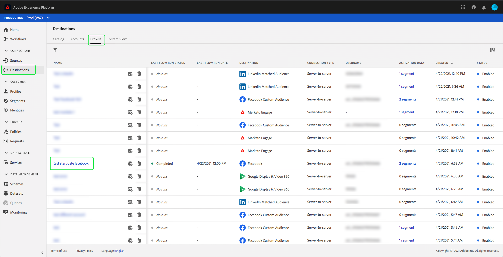
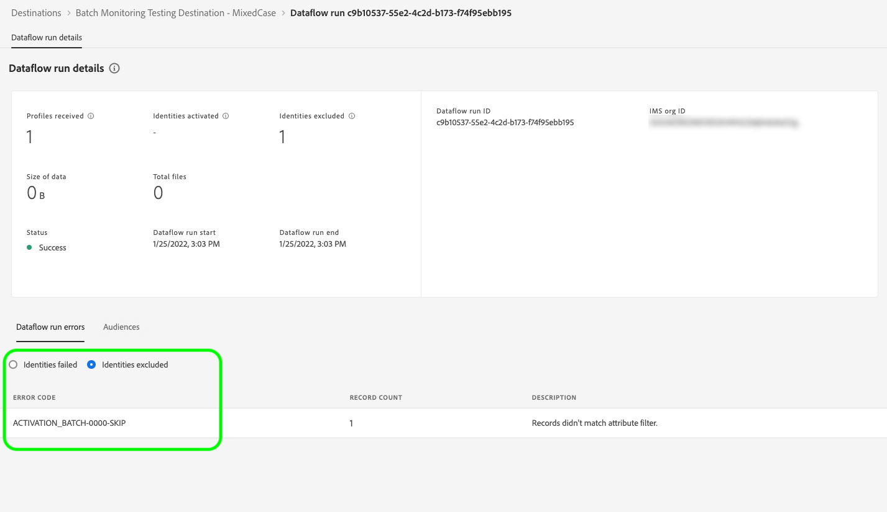

# 在UI中監視目的地的資料流

目的地可讓您從Adobe Experience Platform向無數外部合作夥伴啟用資料。 Platform借由提供資料流的透明度，讓追蹤資料流至目的地的程式更輕鬆。

監控控制面板可提供資料流歷程的視覺表示，包括資料被激活的目標。 本教學課程提供如何直接在目標工作區中監視資料流，或使用監控控制面板，使用Experience Platform使用者介面監視目標的資料流的相關說明。

## 快速入門

本指南需要妥善了解下列Adobe Experience Platform元件：

- [資料流](../home.md):資料流是跨平台移動資料的資料作業的表示。資料流可跨不同的服務進行配置，有助於將資料從源連接器移動到目標資料集、到[!DNL Identity]和[!DNL Profile]以及到[!DNL Destinations]。
   - [資料流運行](../../sources/notifications.md):資料流運行是基於所選資料流的頻率配置的循環調度作業。
- [目的地](../../destinations/home.md):目的地是與常用應用程式預先建立的整合，可順暢地啟動來自Platform的資料，以進行跨通路行銷活動、電子郵件行銷活動、目標廣告和許多其他使用案例。
- [沙箱](../../sandboxes/home.md): [!DNL Experience Platform] 提供可將單一執行個體分割成個 [!DNL Platform] 別虛擬環境的虛擬沙箱，以協助開發及改進數位體驗應用程式。

## 監視目標工作區中的資料流

在Platform UI的&#x200B;**[!UICONTROL Destinations]**&#x200B;工作區中，導覽至&#x200B;**[!UICONTROL Browse]**&#x200B;標籤，並選取您要檢視的目的地名稱。

將顯示現有資料流清單。 此頁面上是可查看資料流的清單，包括有關其目標、用戶名、資料流數和狀態的資訊。

如需狀態的詳細資訊，請參閱下表：

| 狀態 | 說明 |
| ------ | ----------- |
| 啟用 | `Enabled`狀態指示資料流處於活動狀態，並正在根據提供的時間表接收資料。 |
| 停用 | `Disabled`狀態表示資料流處於非活動狀態且未內嵌任何資料。 |
| 正在處理 | `Processing`狀態表示資料流尚未處於活動狀態。 建立新資料流後，通常會立即出現此狀態。 |
| 錯誤 | `Error`狀態表示資料流的激活過程已中斷。 |

### 流目的地的資料流運行

對於流目的地， [!UICONTROL 資料流運行]頁簽每小時更新資料流運行的度量資料。 標有「身份」標籤的最顯著統計資料。

身分代表設定檔的不同面向。 例如，如果設定檔同時包含電話號碼和電子郵件地址，該設定檔將具有兩個身分。

個別執行的清單及其特定量度會顯示，以及下列身分總計：

- **[!UICONTROL 已啟用身分]**:為啟用而建立或更新的設定檔身分識別的總數。
- **[!UICONTROL 已排除的身分]**:根據遺失屬性和同意違反而略過以進行啟用的設定檔身分總數。
- **[!UICONTROL 身份失敗]**:因錯誤而未啟動至目的地的設定檔身分識別總數。

每個資料流運行都顯示以下詳細資訊：

- **[!UICONTROL 資料流運行開始]**:資料流運行的開始時間。
- **[!UICONTROL 處理時間]**:資料流處理所花費的時間。
- **[!UICONTROL 收到的設定檔]**:資料流中接收的配置檔案總數。
- **[!UICONTROL 已啟用身分]**:成功啟動至所選目的地的設定檔身分識別總數。
- **[!UICONTROL 已排除的身分]**:根據遺失屬性和同意違規而排除以供啟用的設定檔身分總數。
- **[!UICONTROL 身]** 分識別失敗因錯誤而未啟動至目的地的設定檔身分識別總數。
- **[!UICONTROL 激活率]**:已成功啟動或跳過的接收身份的百分比。下列公式示範如何計算此值：
   
- **[!UICONTROL 狀態]**:表示資料流的狀態：完成  或處 [!UICONTROL 理]。 Completed表示在一小時內內已內嵌對應資料流執行的所有身分。 Processing表示資料流運行尚未完成。

要查看特定資料流運行的詳細資訊，請從清單中選擇運行的開始時間。

資料流運行的詳細資訊頁包含其他資訊，如接收的配置檔案數、激活的身份數、失敗的身份數以及排除的身份數。

詳細資訊頁面也會顯示失敗的身分識別清單和已排除的身分識別。 會顯示失敗和已排除身分的資訊，包括錯誤碼、身分計數和說明。 依預設，清單會顯示失敗的身分。 若要顯示已略過的身分，請選取&#x200B;**[!UICONTROL 已排除身分]**&#x200B;切換。

### 針對批處理目標運行資料流

對於批處理目的地， [!UICONTROL 資料流運行]頁簽提供資料流運行的度量資料。 個別執行的清單及其特定量度會顯示，以及下列身分總計：

- **[!UICONTROL 已啟用身分]**:已成功啟動至所選目的地的個別設定檔身分識別計數。
- **[!UICONTROL 已排除的身分]**:根據遺失的屬性和同意違規，為所選目的地排除以啟用的個別設定檔身分識別的計數。

每個資料流運行都顯示以下詳細資訊：

- **[!UICONTROL 資料流運行開始]**:資料流運行的開始時間。
- **[!UICONTROL 處理時間]**:處理資料流運行所花費的時間。
- **[!UICONTROL 收到的設定檔]**:資料流中接收的配置檔案總數。此值每60分鐘更新一次。
- **[!UICONTROL 已啟用身分]**:成功啟動至所選目的地的設定檔身分識別總數。
- **[!UICONTROL 已排除的身分]**:根據遺失屬性和同意違規而排除以供啟用的設定檔身分總數。
- **[!UICONTROL 狀態]**:表示資料流所處的狀態。這可以是三種狀態之一：[!UICONTROL Success]、[!UICONTROL Failed]和[!UICONTROL Processing]。  成功表示資料流處於活動狀態，並正在根據其提供的時間表接收資料。 失敗表示資料的啟動因錯誤而暫停。 Processing表示資料流尚未處於活動狀態，並且通常在建立新資料流時遇到。

要查看特定資料流運行的詳細資訊，請從清單中選擇運行的開始時間。

>[!NOTE]
>
>根據目標資料流的調度頻率生成資料流運行。 對應用於段的每個合併策略執行單獨的資料流運行。

除了資料流清單上顯示的詳細資訊之外，資料流的詳細資訊頁還顯示有關資料流的更具體資訊：

- **[!UICONTROL 資料大小]**:正在內嵌的資料流的大小。
- **[!UICONTROL 檔案總數]**:資料流中已內嵌的檔案總數。
- **[!UICONTROL 上次更新]**:上次更新資料流運行的時間。

詳細資訊頁面也會顯示失敗的身分識別清單和已排除的身分識別。 會顯示失敗和已排除身分的資訊，包括錯誤碼和說明。 依預設，清單會顯示失敗的身分。 若要顯示已排除的身分，請選取&#x200B;**[!UICONTROL 已排除身分]**&#x200B;切換。

## 監控目標控制面板 {#monitoring-destinations-dashboard}

要訪問[!UICONTROL 監視]儀表板，請選擇&#x200B;**[!UICONTROL 監視]**(
)。 在[!UICONTROL 監視]頁面上，選擇[!UICONTROL 目標]。 [!UICONTROL 監視]控制面板包含目標運行作業的度量和資訊。

控制面板的中央是「啟動」面板，其中包含量度和圖形，可顯示匯出至目的地之資料的啟動率資料。

依預設，顯示的資料包含過去24小時的啟動率。 選擇&#x200B;**[!UICONTROL 最近24小時]**&#x200B;以調整顯示的記錄時間範圍。 可用選項包括&#x200B;**[!UICONTROL 最近24小時]**、**[!UICONTROL 最近7天]**&#x200B;和&#x200B;**[!UICONTROL 最近30天]**。 或者，您也可以在顯示的日曆彈出式視窗中選取日期。 選取日期後，請選取&#x200B;**[!UICONTROL Apply]**&#x200B;以調整顯示資訊的時間範圍。

>[!NOTE]
>
>以下螢幕擷取畫面顯示過去30天（而非過去24小時）的啟用率。 您可以選取「**[!UICONTROL 最近30天]**」來調整時間範圍。

圖表預設會顯示，您可以停用它以展開下方的目的地清單。 選擇&#x200B;**[!UICONTROL 度量和圖形]**&#x200B;切換以禁用圖形。

**[!UICONTROL Activation]**&#x200B;面板顯示至少包含一個現有帳戶的目的地清單。 此清單還包括以下資訊：接收的配置檔案、激活的配置檔案記錄、配置檔案記錄失敗、跳過的配置檔案記錄、失敗的資料流總數，以及這些目標的上次更新日期。

您也可以篩選目的地清單，以僅顯示選取的目的地類別。 選擇&#x200B;**[!UICONTROL 我的目標]**&#x200B;下拉清單，然後選擇要篩選的目標類型。

此外，您可以在搜尋列中輸入目的地，以隔離至單一目的地。 如果要查看目標的資料流，可以選擇其旁邊的篩選器以查看其活動資料流的清單。

如果要查看所有目標中的所有現有資料流，請選擇&#x200B;**[!UICONTROL 資料流]**。

將顯示資料流清單，按每個目標分組。 通過找到要監視的目標，選擇旁邊的篩選器，然後選擇要了解更多資訊的資料流旁邊的篩選器，您可以查看特定資料流的其他詳細資訊。

「資料流運行」頁顯示了資料流運行的資訊，包括資料流運行開始時間、處理時間、接收的配置檔案、激活的身份、排除的身份、身份失敗、激活率和狀態。 要查看有關特定資料流運行的更多詳細資訊，請選擇資料流運行開始時間旁邊的篩選器。

除了資料流清單上顯示的詳細資訊之外，資料流詳細資訊頁還顯示有關資料流的更具體資訊：

- **[!UICONTROL 資料流運行ID]**:資料流的ID。
- **[!UICONTROL IMS組織ID]**:資料流所屬的IMS組織。
- **[!UICONTROL 上次更新]**:上次更新資料流運行的時間。

詳細資訊頁面也會顯示失敗的身分識別清單和已排除的身分識別。 會顯示失敗和已排除身分的資訊，包括錯誤碼、身分計數和說明。 依預設，清單會顯示失敗的身分。 若要顯示已略過的身分，請選取&#x200B;**[!UICONTROL 已排除身分]**&#x200B;切換。

## 後續步驟

按照本指南，您現在知道如何監視批處理和流目的地的資料流，包括處理時間、激活率和狀態等所有相關資訊。 若要進一步了解Platform中的資料流，請閱讀[資料流概述](../home.md)。 若要深入了解目的地，請參閱[目的地概述](../../destinations/home.md)。