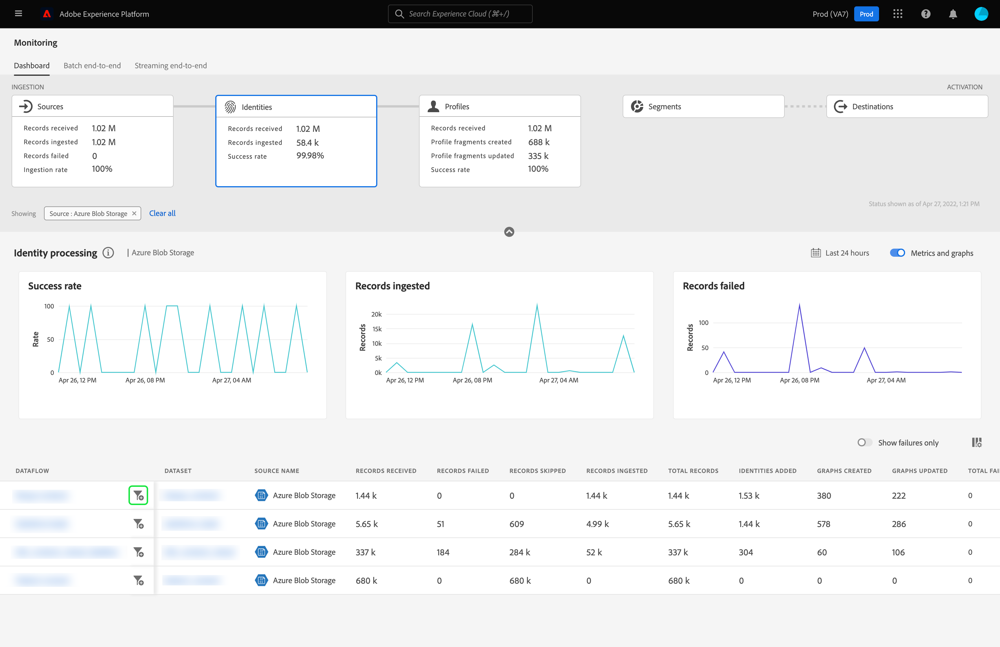

# 監視UI中身分的資料流

Adobe Experience Platform 身分識別服務透過跨裝置和系統橋接身分，為您提供客戶及其行為的全方位檢視，讓您可即時實現有影響力的個人數位體驗。

監視儀表板可讓您以視覺化方式呈現身分中的資料活動，包括資料身分的狀態。 本教學課程提供有關如何使用監視儀表板來使用Experience Platform使用者介面監視資料的身分，允許您追蹤身分處理狀態的指示。

## 快速入門 {#getting-started}

- [資料流](../home.md)：資料流可呈現跨平台行動資料的資料作業。 資料流是跨不同服務設定的，有助於將資料從來源聯結器移至目標資料集、移至[!DNL Identity]和[!DNL Profile]以及移至[!DNL Destinations]。
   - [資料流執行](../../sources/notifications.md)：資料流執行是根據所選資料流的頻率設定所排程的週期性工作。
- [身分識別服務](../../identity-service/home.md)：透過跨裝置和系統橋接身分，以更清楚瞭解個別客戶及其行為。
- [沙箱](../../sandboxes/home.md)： [!DNL Experience Platform]提供可將單一[!DNL Platform]執行個體分割成個別虛擬環境的虛擬沙箱，以利開發及改進數位體驗應用程式。

## 監視身分儀表板 {#identity-metrics}

>[!CONTEXTUALHELP]
>id="platform_monitoring_identity_processing"
>title="身分識別處理"
>abstract="身分識別處理視圖會包含有關擷取到身分識別服務的記錄的資訊，包括新增的身分識別數量、建立的圖表和更新的圖表。檢閱量度定義指南以了解有關量度和圖表的詳細資訊。"
>text="Learn more in documentation"

>[!CONTEXTUALHELP]
>id="platform_monitoring_dataflow_run_details_identity"
>title="資料流執行詳細資訊"
>abstract="資料流執行詳細資訊頁面會顯示有關身分識別資料流執行的詳細資訊，包括其組織 ID 和資料流執行 ID。"

若要存取&#x200B;**[!UICONTROL 身分]**&#x200B;儀表板，請在左側導覽中選取&#x200B;**[!UICONTROL 監視]**。 在&#x200B;**[!UICONTROL 監視]**&#x200B;頁面上，選取&#x200B;**[!UICONTROL 身分]**&#x200B;卡片。

在主要&#x200B;**[!UICONTROL 身分]**&#x200B;儀表板上，**[!UICONTROL 身分]**&#x200B;卡片會顯示有關已接收記錄總數、已擷取的記錄數以及記錄擷取成功率的資訊。

儀表板本身包含有關身分處理的量度。 預設情況下，儀表板將顯示過去24小時內您組織來源的身分處理詳細資訊。

[!UICONTROL 身分處理]頁面包含擷取到[!DNL Identity Service]的記錄資訊，包括新增的身分數目、建立的圖表和更新的圖表。

下列量度適用於此儀表板檢視：

| 身分量度 | 說明 |
| ---------------- | ----------- |
| 已接收&#x200B;**[!UICONTROL 筆記錄]** | 從資料湖接收的記錄數。 |
| **[!UICONTROL 個記錄失敗]** | 由於資料錯誤而未擷取到Platform的記錄數。 |
| **[!UICONTROL 個略過的記錄]** | 已擷取但不納入[!DNL Identity Service]的記錄數，因為記錄列只有一個識別碼。 |
| **[!UICONTROL 已擷取的記錄]** | 擷取到[!DNL Identity Service]的記錄數。 |
| **[!UICONTROL 已新增的身分]** | 新增到[!DNL Identity Service]的網路新識別碼數目。 |
| **[!UICONTROL 建立的圖表]** | 在[!DNL Identity Service]中建立的淨新身分圖表數目。 |
| **[!UICONTROL 圖表已更新]** | 以新邊更新的現有身分圖表數目。 |
| **[!UICONTROL 失敗的資料流總數]** | 失敗的資料流執行次數。 |

您可以選取來源名稱旁的篩選圖示，以檢視該所選來源資料流程的身分處理資訊。

或者，您可以在切換時選取「**[!UICONTROL 資料流]**」，以檢視貴組織過去24小時資料流的身分處理詳細資料。

下列量度適用於此儀表板檢視：

| 量度 | 說明 |
| -------| ----------- |
| **[!UICONTROL 資料流]** | 資料流的名稱。 |
| **[!UICONTROL 資料集]** | 資料流所插入的資料集名稱。 |
| **[!UICONTROL Source名稱]** | 資料流所屬的來源名稱。 |
| 已接收&#x200B;**[!UICONTROL 筆記錄]** | 從資料湖接收的記錄數。 |
| **[!UICONTROL 個記錄失敗]** | 由於資料錯誤而未擷取到Platform的記錄數。 |
| **[!UICONTROL 個略過的記錄]** | 已擷取但不納入[!DNL Identity Service]的記錄數，因為記錄列只有一個識別碼。 |
| **[!UICONTROL 已擷取的記錄]** | 擷取到[!DNL Identity Service]的記錄數。 |
| **[!UICONTROL 記錄總數]** | 所有記錄的總數，包括失敗的記錄、略過的記錄、新增的身分和重複的記錄。 |
| **[!UICONTROL 已新增的身分]** | 新增到[!DNL Identity Service]的網路新識別碼數目。 |
| **[!UICONTROL 建立的圖表]** | 在[!DNL Identity Service]中建立的淨新身分圖表數目。 |
| **[!UICONTROL 圖表已更新]** | 以新邊更新的現有身分圖表數目。 |
| **[!UICONTROL 失敗的資料流總數]** | 失敗的資料流執行次數。 |

選取資料流執行開始時間旁的篩選圖示，檢視有關您的[!DNL Identity]資料流執行的詳細資訊。

[!UICONTROL 資料流執行詳細資料]頁面會顯示您[!DNL Identity]資料流執行的詳細資訊，包括其組織ID和資料流執行ID。 此頁面也會顯示[!DNL Identity Service]提供的對應錯誤碼和錯誤訊息（如果擷取程式發生任何錯誤）。

下列量度適用於此儀表板檢視：

| 量度 | 說明 |
| -------| ----------- |
| 已接收&#x200B;**[!UICONTROL 筆記錄]** | 從資料湖接收的記錄數。 |
| **[!UICONTROL 個記錄失敗]** | 由於資料錯誤而未擷取到Platform的記錄數。 |
| **[!UICONTROL 個略過的記錄]** | 已擷取但不納入[!DNL Identity Service]的記錄數，因為記錄列只有一個識別碼。 |
| **[!UICONTROL 已擷取的記錄]** | 擷取到[!DNL Identity Service]的記錄數。 |
| **[!UICONTROL 已新增的身分]** | 新增到[!DNL Identity Service]的網路新識別碼數目。 |
| **[!UICONTROL 建立的圖表]** | 在[!DNL Identity Service]中建立的淨新身分圖表數目。 |
| **[!UICONTROL 圖表已更新]** | 以新邊更新的現有身分圖表數目。 |
| **[!UICONTROL 狀態]** | 定義資料流的整體狀態。 可能的狀態值包括： <ul><li>`Success`：表示資料流作用中，而且正在根據提供的排程擷取資料。</li><li>`Failed`：指出資料流程的啟用程式已因錯誤而中斷。 </li><li>`Processing`：表示資料流尚未啟用。 此狀態通常會在建立新資料流後立即發生。</li></ul> |
| **[!UICONTROL 資料流執行開始]** | 資料流開始執行的日期和時間。 |
| **[!UICONTROL 上次更新時間]** | 資料流上次更新的日期和時間。 |
| **[!UICONTROL 錯誤摘要]** | 如果資料流執行失敗，這會顯示錯誤代碼以及資料流執行失敗原因的摘要。 |
| **[!UICONTROL 資料流執行ID]** | 資料流執行的識別碼。 |
| **[!UICONTROL IMS組織ID]** | 資料流執行所屬的組織ID。 |

此外，您可以選取切換來檢視失敗的記錄或略過的記錄。 錯誤區段包含有關錯誤代碼和失敗或排除的記錄數的詳細資訊。
