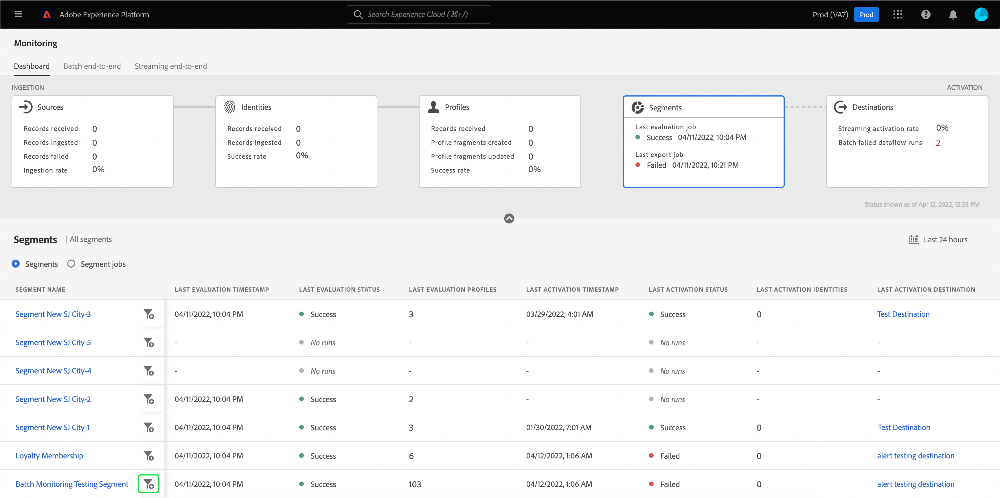
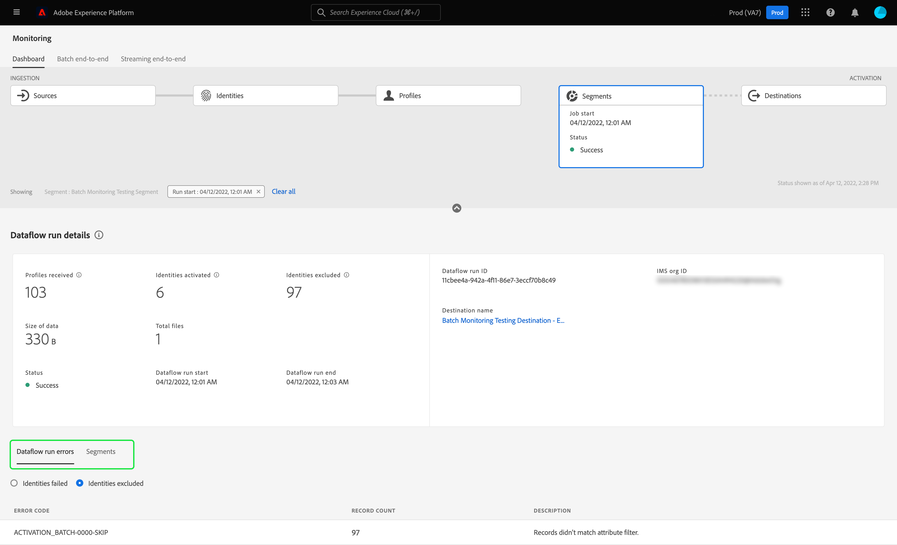

# 監視UI中區段的資料流

區段服務可讓您從Adobe Experience Platform的即時客戶設定檔資料建立區段和對象。 Platform提供資料流，以透明方式追蹤從來源到目的地的資料流。

監控控制面板可以以視覺化方式呈現區段內資料的活動，包括資料分段的狀態。 本教學課程提供相關指示，說明如何使用監控控制面板，透過Experience Platform使用者介面監控資料的分段，讓您追蹤區段啟動、評估和匯出作業的狀態。

## 快速入門 {#getting-started}

本指南需要妥善了解下列Adobe Experience Platform元件：

- [資料流](../home.md):資料流是跨平台移動資料的資料作業的表示。 資料流可跨不同的服務進行配置，有助於將資料從源連接器移動到目標資料集 [!DNL Identity] 和 [!DNL Profile]和 [!DNL Destinations].
   - [資料流運行](../../sources/notifications.md):資料流運行是基於所選資料流的頻率配置的循環調度作業。
- [區段](../../segmentation/home.md):區段可讓您透過即時客戶個人檔案資料建立區段和對象。
   - [啟動工作](../../destinations/ui/activation-overview.md):啟動工作可用來將區段啟動至指定的目的地。
   - [評估作業](../../segmentation/tutorials/evaluate-a-segment.md#evaluate-a-segment):評估工作是非同步程式，執行時會根據指定的區段建立對象區段。
   - [匯出工作](../../segmentation/api/export-jobs.md):匯出工作是非同步程式，用於將對象區段成員保留至資料集。
- [沙箱](../../sandboxes/home.md): [!DNL Experience Platform] 提供可分割單一沙箱的虛擬沙箱 [!DNL Platform] 例項放入個別的虛擬環境，以協助開發及改進數位體驗應用程式。

## 監控區段控制面板 {#monitoring-segments-dashboard}

>[!CONTEXTUALHELP]
>id="platform_monitoring_segments"
>title="區段"
>abstract="區段檢視包含您組織所有區段的相關資訊，以及其啟用和評估工作的詳細資訊。"

若要存取 **[!UICONTROL 區段]** 控制面板，選取 **[!UICONTROL 監控]** 的下一頁。 一次 **[!UICONTROL 監控]** 頁面，選擇 **[!UICONTROL 區段]** 卡片。

主要 **[!UICONTROL 區段]** 控制面板、 **[!UICONTROL 區段]** 卡片顯示上次評估作業和上次匯出作業的狀態和日期。

控制面板本身包含區段和區段作業的量度。 依預設，控制面板會顯示過去24小時的區段量度。 若要進一步了解區段作業檢視，請閱讀 [監控區段作業](#monitoring-segment-jobs-dashboard) 區段。

>[!IMPORTANT]
>
>目前，僅限啟動至的區段 [批次（檔案型）目的地](../../destinations/destination-types.md#file-based) 「監控區段」控制面板支援。

此控制面板檢視可使用下列量度：

| 量度 | 說明 |
| ------ | ----------- |
| **[!UICONTROL 區段名稱]** | 區段的名稱。 |
| **[!UICONTROL 上次評估時間戳]** | 區段上次評估工作的執行日期和時間。 |
| **[!UICONTROL 上次評估狀態]** | 區段上次評估作業的狀態。 可能的值包括 **[!UICONTROL 成功]**, **[!UICONTROL 無運行]**，和 **[!UICONTROL 失敗]**. |
| **[!UICONTROL 上次評估配置檔案]** | 在區段的上次評估工作中評估的設定檔數量。 |
| **[!UICONTROL 上次啟動時間戳記]** | 區段上次啟動工作的執行日期和時間。 |
| **[!UICONTROL 上次激活狀態]** | 區段上次啟動工作的狀態。 可能的值包括 **[!UICONTROL 成功]**, **[!UICONTROL 無運行]**，和 **[!UICONTROL 失敗]**. |
| **[!UICONTROL 上次啟用身分]** | 在區段上次啟動工作中啟動的身分數。 |
| **[!UICONTROL 上次啟用目的地]** | 區段上次啟動作業所啟動的目的地名稱。 |

您可以選取篩選圖示()。區段作業會依時間順序排序，最近的區段作業會先顯示。

篩選的區段控制面板隨即出現。 此 **[!UICONTROL 區段]** 卡片顯示上次評估作業和上次啟動作業的狀態和日期。

控制面板本身會顯示上次評估和啟動作業的時間和狀態、顯示區段評估的設定檔計數以及執行之區段作業的量度。 依預設，控制面板會顯示過去24小時的區段工作量度。

此控制面板檢視可使用下列量度：

| 量度 | 說明 |
| ------ | ----------- |
| **[!UICONTROL 工作開始]** | 區段作業開始的日期和時間。 |
| **[!UICONTROL 類型]** | 指出區段作業的類型。 支援的兩種作業類型為 **啟用** 和 **評價** 工作。 |
| **[!UICONTROL 作業完成]** | 區段作業完成的日期和時間。 |
| **[!UICONTROL 處理時間]** | 區段工作完成所花的時間。 |
| **[!UICONTROL 工作狀態]** | 區段作業的狀態。 支援的值包括 **[!UICONTROL 成功]**, **[!UICONTROL 進行中]**，和 **[!UICONTROL 失敗]**. |
| **[!UICONTROL 設定檔計數]** | 區段工作正在評估的設定檔數量。 每個使用者應有不重複的設定檔。 |
| **[!UICONTROL 身分計數]** | 區段工作正在啟用的身分數。 每個設定檔都可以有多個身分。 例如，設定檔可以有電子郵件、電話號碼和忠誠度號碼作為身分。 |
| **[!UICONTROL 目的地名稱]** | 要激活段作業的目標名稱。 |

您可以進一步篩選特定區段工作，並透過選取篩選圖示()。可篩選的區段作業有兩種不同：啟動作業和評估作業。

### 激活作業詳細資訊 {#activation-job-details}

「激活作業資料流運行詳細資訊」頁顯示有關運行的度量、資料流運行錯誤以及與段作業相關的段的資訊。 啟動工作可用來針對指定目的地啟動您的區段。 預設情況下，「詳細資訊」頁顯示資料流運行錯誤。

此控制面板檢視可使用下列量度：

| 量度 | 說明 |
| ------ | ----------- |
| **[!UICONTROL 收到的設定檔]** | 啟動流程中收到的設定檔總數。 |
| **[!UICONTROL 啟用的身分]** | 根據收到的設定檔成功啟動至目的地的身分總數。 |
| **[!UICONTROL 排除的身分]** | 根據收到的設定檔，排除不會啟動至目的地的身分總數。 由於遺失屬性或違反同意，這些身分可能會遭排除。 |
| **[!UICONTROL 資料大小]** | 要激活的資料流的大小。 |
| **[!UICONTROL 檔案總數]** | 資料流中要激活的檔案總數。 |
| **[!UICONTROL 狀態]** | 激活作業的當前狀態。 |
| **[!UICONTROL 資料流運行開始]** | 啟動作業的開始日期和時間。 |
| **[!UICONTROL 資料流運行結束]** | 啟動作業結束的日期和時間。 |
| **[!UICONTROL 資料流運行ID]** | 當前激活作業的ID。 |
| **[!UICONTROL IMS組織ID]** | 啟動工作所屬組織的ID。 |
| **[!UICONTROL 目的地名稱]** | 要啟動資料的目標名稱。 |

量度下方會顯示切換按鈕，在資料流執行錯誤和區段之間進行選取。

在資料流運行錯誤部分下，選擇切換以查看身份失敗或身份排除欄位。 「錯誤」部分包括有關錯誤代碼和失敗或排除身份數的詳細資訊。

在區段區段下，您會看到在啟動工作中啟動的區段清單。 使用搜尋列，依名稱篩選區段清單。

對於區段區段，可使用下列量度：

| 量度 | 說明 |
| ------ | ----------- |
| **[!UICONTROL 名稱]** | 已啟用的區段名稱。 |
| **[!UICONTROL 啟用的身分]** | 根據收到的設定檔成功啟動至目的地的身分總數。 |
| **[!UICONTROL 排除的身分]** | 根據收到的設定檔，排除不會啟動至目的地的身分總數。 由於遺失屬性或違反同意，這些身分可能會遭到排除。 |
| **[!UICONTROL 上次資料流運行狀態]** | 為該區段執行的上次啟動工作的狀態。 |
| **[!UICONTROL 上次資料流運行日期]** | 針對該區段執行的上次啟動工作的日期和時間。 |

### 評估作業詳細資訊 {#evaluation-job-details}

「評估作業資料流運行詳細資訊」頁顯示與段作業相關的運行度量和段的資訊。 評估工作是根據指定區段建立受眾區段的非同步程式。 若要進一步了解評估工作，請閱讀 [評估區段](../../segmentation/tutorials/evaluate-a-segment.md#evaluate-a-segment).

此控制面板檢視可使用下列量度：

| 量度 | 說明 |
| ------ | ----------- |
| **[!UICONTROL 設定檔總計]** | 要評估的設定檔總數。 |
| **[!UICONTROL 狀態]** | 評估作業的狀態。 評估作業的可能狀態包括 **[!UICONTROL 成功]** 和 **[!UICONTROL 失敗]**. |
| **[!UICONTROL 工作開始]** | 評估作業開始的日期和時間。 |
| **[!UICONTROL 作業結束]** | 評估作業結束的日期和時間。 |
| **[!UICONTROL 作業類型]** | 區段作業的類型。 在此情況下，它將永遠是區段評估工作。 |
| **[!UICONTROL 評估類型]** | 正在進行的評估類型。 這可以是 **[!UICONTROL 批次]** 或 **[!UICONTROL 串流]**. |
| **[!UICONTROL 工作ID]** | 評估作業的ID。 |
| **[!UICONTROL IMS組織ID]** | 評估作業所屬組織的ID。 |
| **[!UICONTROL 區段名稱]** | 要評估的區段名稱。 |
| **[!UICONTROL 區段ID]** | 正在評估的區段ID。 |

在區段區段下方，您可以看到評估工作中要評估的區段清單。 您可以使用搜尋列，依名稱篩選區段清單。

>[!IMPORTANT]
>
>此控制面板檢視目前最多支援800個區段量度。

對於區段區段，可使用下列量度：

| 量度 | 說明 |
| ------ | ----------- |
| **[!UICONTROL 名稱]** | 要評估的區段名稱。 |
| **[!UICONTROL 設定檔計數]** | 要評估的設定檔數。 |

## 監控區段作業控制面板 {#monitoring-segment-jobs-dashboard}

>[!CONTEXTUALHELP]
>id="platform_monitoring_segment_jobs"
>title="區段作業"
>abstract="區段作業視圖會包含有關所有區段的評估和匯出作業的資訊。"

若要存取 **[!UICONTROL 區段作業]** 控制面板，選取 **[!UICONTROL 監控]** ()。 一次 [!UICONTROL 監控] 頁面，選取 **[!UICONTROL 區段作業]**. 此 [!UICONTROL 監控] 控制面板包含區段評估和匯出作業的度量和資訊。

>[!NOTE]
>
>僅 **區段評估作業** 支援每個區段的監控。 區段匯出作業僅支援組織層級的監控。

使用 [!UICONTROL 區段作業] 控制面板，了解設定檔評估和匯出是否及時發生且無任何例外，讓目的地啟用的下游服務可以有最新評估的設定檔資料。

下列量度適用於區段作業：

| 量度 | 說明 |
---------|----------|
| **[!UICONTROL 區段作業]** | 指出區段作業的名稱。 |
| **[!UICONTROL 類型]** | 指示段作業的類型 — 導出或評估。 請注意，在這兩種情況下，區段作業都會評估或匯出 **all** 屬於組織的區段。 若要進一步了解匯出工作，請參閱 [導出作業終結點](../../segmentation/api/export-jobs.md). 若要進一步了解評估工作，請閱讀 [評估區段](../../segmentation/tutorials/evaluate-a-segment.md#evaluate-a-segment). |
| **[!UICONTROL 工作開始]** | 區段作業開始的日期和時間。 |
| **[!UICONTROL 作業結束]** | 區段作業完成的日期和時間。 |
| **[!UICONTROL 狀態]** | 已完成作業的狀態。 群體作業的可能狀態包括成功或失敗。 |
