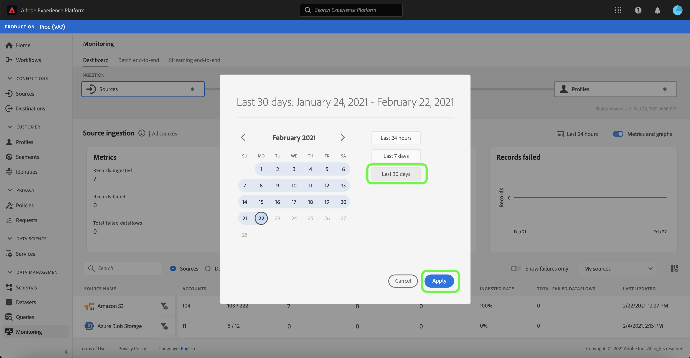

# 監視 UI 中來源的資料流

>[!IMPORTANT]
>
>串流來源，例如 [HTTP API來源](../../sources/connectors/streaming/http.md) 目前不受監視儀表板支援。 目前，您只能使用儀表板來監視批次來源。

在Adobe Experience Platform中，資料會從各種來源擷取、在Experience Platform中分析，並啟用至各種目的地。 Platform透過提供資料流透明度，讓追蹤這種潛在非線性資料流的程式變得更輕鬆。

監視儀表板可讓您以視覺化方式呈現資料流的歷程。 您可以使用彙總的監控檢視，並垂直從來源層級導覽至資料流，以及導覽至資料流執行，讓您檢視對資料流成功或失敗有貢獻的對應量度。 您也可以使用監控儀表板的跨服務監控容量，監控資料流從來源到目的地的歷程。 [!DNL Identity Service]，並至 [!DNL Profile].

本教學課程提供使用彙總監視檢視和跨服務監視來監視資料流的步驟。

## 快速入門 {#getting-started}

本教學課程需要您實際瞭解下列Adobe Experience Platform元件：

* [資料流](../home.md)：資料流能呈現資料處理作業在Platform上行動資料的情形。 資料流可跨不同服務進行設定，有助於將資料從來源聯結器移至目標資料集，以及 [!DNL Identity] 和 [!DNL Profile]，並至 [!DNL Destinations].
   * [資料流執行](../../sources/notifications.md)：資料流執行是根據所選資料流的頻率設定而定期排程的工作。
* [來源](../../sources/home.md)：Experience Platform可讓您從各種來源擷取資料，同時使用Platform服務來建構、加標籤及增強傳入資料。
* [Identity Service](../../identity-service/home.md)：透過跨裝置和系統橋接身分，更能瞭解個別客戶及其行為。
* [即時客戶個人檔案](../../profile/home.md)：根據來自多個來源的彙總資料，提供統一的即時消費者個人檔案。
* [沙箱](../../sandboxes/home.md)：Experience Platform提供的虛擬沙箱可將單一Platform執行個體分割成個別的虛擬環境，以利開發及改進數位體驗應用程式。

## 彙總監視視圖 {#aggregated-monitoring-view}

>[!CONTEXTUALHELP]
>id="platform_monitoring_source_ingestion"
>title="來源擷取"
>abstract="來源擷取視圖會包含有關資料湖服務中資料活動狀態和量度的資訊，包括擷取的記錄和失敗的記錄。檢閱量度定義指南以了解有關量度和圖表的詳細資訊。"
>text="Learn more in documentation"

>[!CONTEXTUALHELP]
>id="platform_monitoring_dataflow_run_details_ingestion"
>title="資料流執行詳細資訊"
>abstract="來源處理會包含有關資料湖服務中資料活動狀態和量度的資訊，包括擷取的記錄和失敗的記錄。檢閱量度定義指南以了解有關量度和圖表的詳細資訊。"
>text="Learn more in documentation"

在 [平台UI](https://platform.adobe.com)，選取 **[!UICONTROL 監視]** 從左側導覽存取 [!UICONTROL 監視] 儀表板。 此 [!UICONTROL 監視] 儀表板包含所有來源資料流程的量度和資訊，包括從來源到來源之資料流量的健康情況分析 [!DNL Identity Service]，並至 [!DNL Profile].

控制面板的中心是 [!UICONTROL 來源擷取] 面板，其中包含量度和圖形，可顯示擷取記錄和失敗記錄的資料。

依預設，顯示的資料包含過去24小時的擷取率。 選取 **[!UICONTROL 過去24小時]** 以調整記錄顯示的時間範圍。

此時會出現一個日曆快顯視窗，為您提供替代擷取時間範圍的選項。 選取 **[!UICONTROL 過去30天]** 然後選取 **[!UICONTROL 套用]**

這些圖形預設為啟用，您可以將其停用以展開下面的來源清單。 選取 **[!UICONTROL 度量與圖表]** 切換以停用圖形。

| 來源擷取 | 說明 |
| ---------------- | ----------- |
| [!UICONTROL 已擷取的記錄] | 擷取的記錄總數。 |
| [!UICONTROL 失敗的記錄] | 由於資料中的錯誤而未擷取的記錄總數。 |
| [!UICONTROL 失敗的資料流總數] | 具有「 」的資料流總數 `failed` 狀態。 |

來源擷取清單會顯示至少包含一個現有帳戶的所有來源。 此清單也包含每個來源的擷取率、失敗記錄數以及根據您套用之時間範圍失敗的資料流總數的資訊。

若要排序來源清單，請選取 **[!UICONTROL 我的來源]** 然後從下拉式選單中選取您選擇的類別。 例如，若要聚焦於雲端儲存，請選取  **[!UICONTROL 雲端儲存空間]**

若要檢視所有來源的所有現有資料流，請選取「 」 **[!UICONTROL 資料流]**.

或者，您可以在搜尋列中輸入來源，以隔離單一來源。 識別來源後，請選取篩選器圖示  旁邊，可檢視作用中資料流的清單。

資料流清單隨即顯示。 若要縮小清單範圍並聚焦於有錯誤的資料流，請選取「 」 **[!UICONTROL 僅顯示失敗]**.

找到您要監控的資料流，然後選取篩選圖示  在它旁邊，可檢視有關其執行狀態的詳細資訊。

「資料流執行」頁面會顯示資料流執行開始日期、資料大小、狀態及其處理持續時間的相關資訊。 選取篩選器圖示  在資料流執行開始時間旁邊，可檢視其資料流執行詳細資料。

此 [!UICONTROL 資料流執行詳細資料] 頁面會顯示資料流的中繼資料、部分擷取狀態和錯誤摘要的相關資訊。 錯誤摘要包含特定的頂層錯誤，會顯示擷取程式在哪個步驟遇到錯誤。

向下捲動以檢視有關所發生錯誤的更多具體資訊。

此 [!UICONTROL 資料流執行錯誤] 面板會顯示導致資料流擷取失敗的特定錯誤和錯誤代碼。 在此案例中，發生對應程式轉換錯誤，導致24筆記錄失敗。

選取 **[!UICONTROL 檔案]** 以取得詳細資訊。

此 [!UICONTROL 檔案] 面板包含檔案名稱和路徑的相關資訊。

如需更精細的錯誤表示法，請選取「 」 **[!UICONTROL 預覽錯誤診斷]**.

此 [!UICONTROL 錯誤診斷預覽] 視窗會出現，並在資料流中顯示最多100個錯誤的預覽。 您可以選取 **[!UICONTROL 下載]** 擷取curl指令，然後可讓您下載錯誤診斷。

完成後，選取 **[!UICONTROL 關閉]**

您可以使用頂端標題的階層連結系統，導覽回至 [!UICONTROL 監視] 儀表板。 選取 **[!UICONTROL 執行開始：2021年2月14日，晚上9:47]** 以返回上一頁，然後選取 **[!UICONTROL 資料流：忠誠度資料擷取示範 — 失敗]** 以返回「資料流」頁面。

## 後續步驟 {#next-steps}

依照本教學課程，您已使用成功監視來源層級的擷取資料流 **[!UICONTROL 監視]** 儀表板。 您也已成功識別在擷取程式期間導致資料流失敗的錯誤。 如需更多詳細資訊，請參閱下列檔案：

* [在資料流中監視身分](./monitor-identities.md)
* [在資料流中監視設定檔](./monitor-profiles.md)
