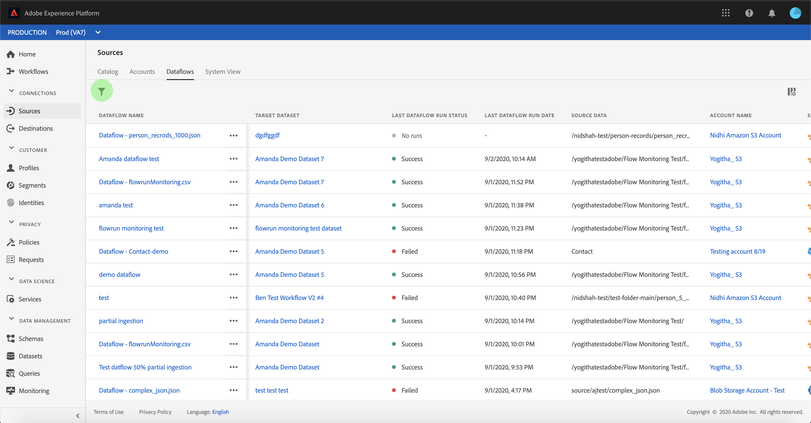

# 監視UI中源的資料流

Adobe Experience Platform中的來源連接器可讓您依計畫吸收外部來源的資料。 本教程提供了從[!UICONTROL Sources]工作區查看現有資料流的步驟。

## 快速入門

本教學課程需要對Adobe Experience Platform的下列元件有正確的認識：

- [來源](../../sources/home.md): [!DNL Experience Platform] 允許從各種來源接收資料，同時提供使用服務構建、標籤和增強傳入資料的 [!DNL Platform] 能力。
- [沙盒](../../sandboxes/home.md): [!DNL Experience Platform] 提供虛擬沙盒，可將單一執行個體分 [!DNL Platform] 割為不同的虛擬環境，以協助開發和發展數位體驗應用程式。

## 監視資料流

登入[Experience Platform UI](https://platform.adobe.com)，然後從左側導覽器選擇&#x200B;**[!UICONTROL Sources]**&#x200B;以存取[!UICONTROL Sources]工作區。 從頂部標題中選擇&#x200B;**[!UICONTROL 資料流]**&#x200B;以查看現有資料流。

將顯示現有資料流清單。 本頁列出了可查看的資料流，包括有關其源、用戶名、資料流數和狀態的資訊。

如需狀態的詳細資訊，請參閱下表：

| 狀態 | 說明 |
| ------ | ----------- |
| 啟用 | `Enabled`狀態表示資料流處於活動狀態，並正在根據提供的時間表接收資料。 |
| 停用 | `Disabled`狀態表示資料流處於非活動狀態，且未接收任何資料。 |
| 正在處理 | `Processing`狀態表示資料流尚未激活。 建立新資料流後，通常會立即出現此狀態。 |
| 錯誤 | `Error`狀態表示資料流的激活過程已中斷。 |

選擇左上角的漏斗圖示進行排序。

出現排序面板。 從滾動菜單中選擇要訪問的源，然後從右側的清單中選擇資料流。 您也可以選擇省略號(`...`)按鈕，為所選資料流啟用更多可用選項。

「**[!UICONTROL 資料流活動]**」頁包含已接收和記錄失敗的記錄數的詳細資訊，以及有關資料流狀態和處理時間的資訊。 選擇資料流上方的日曆表徵圖，以調整接收記錄的時間範圍。

日曆可讓您檢視所收錄記錄的不同時段。 您可以選擇選擇兩個預設選項「[!UICONTROL 最近7天]」或「[!UICONTROL 最近30天]」中的一個。 或者，您也可以使用日曆來設定自訂時間範圍。 選擇您選擇的時間範圍，然後選擇&#x200B;**[!UICONTROL Apply]**&#x200B;繼續。

預設情況下，**[!UICONTROL Dataflow活動]**&#x200B;顯示與資料流關聯的&#x200B;**[!UICONTROL 屬性]**&#x200B;面板。 從清單中選擇流運行以查看其關聯的元資料，包括有關其唯一運行ID的資訊。

選擇&#x200B;**[!UICONTROL 資料流運行start]**&#x200B;以訪問&#x200B;**[!UICONTROL 資料流運行概述]**。

**[!UICONTROL 資料流運行概述]**&#x200B;顯示有關資料流的資訊，包括其元資料、部分接收狀態和分配的錯誤閾值。 上方標題也包含錯誤摘要。 **[!UICONTROL 錯誤摘要]**&#x200B;包含特定的頂層錯誤，顯示擷取程式在哪個步驟遇到錯誤。

有關&#x200B;**[!UICONTROL Error summary]**&#x200B;中可能出現的錯誤，請參閱下表。

| 錯誤 | 說明 |
| ---------- | ----------- |
| `CONNECTOR-1001-500` | 從源複製資料時出錯。 |
| `CONNECTOR-2001-500` | 將複製的資料處理到[!DNL Platform]時出錯。 此錯誤可能與剖析、驗證或轉換有關。 |

螢幕的下半部分包含有關&#x200B;**[!UICONTROL 資料流運行錯誤]**&#x200B;的資訊。 您也可以從這裡檢視所擷取的檔案、預覽和下載錯誤診斷程式，或下載檔案資訊清單。

**[!UICONTROL 資料流運行錯誤]**&#x200B;部分顯示錯誤代碼、失敗記錄數以及說明錯誤的資訊。

選擇&#x200B;**[!UICONTROL 預覽錯誤診斷]**&#x200B;以查看有關攝取錯誤的詳細資訊。

出現&#x200B;**[!UICONTROL 錯誤診斷預覽]**&#x200B;面板。 此畫面會顯示擷取失敗的特定資訊，包括檔案名稱、錯誤碼、發生錯誤的欄名稱，以及錯誤的說明。

本節也包含包含錯誤的欄預覽。

>[!IMPORTANT]
>
>要啟用&#x200B;**[!UICONTROL 錯誤診斷預覽]**，配置資料流時必須激活&#x200B;**[!UICONTROL 部分攝取]**&#x200B;和&#x200B;**[!UICONTROL 錯誤診斷]**。 這樣，系統將能夠掃描在流運行期間吸收的所有記錄。

在預覽錯誤後，您可從&#x200B;**[!UICONTROL dataflow runs overview]**&#x200B;面板中選擇&#x200B;**[!UICONTROL Download]**，以存取完整錯誤診斷並下載檔案資訊清單。 如需詳細資訊，請參閱[錯誤診斷](../../ingestion/batch-ingestion/partial.md#retrieve-errors)和[下載中繼資料](../../ingestion/batch-ingestion/partial.md#download-metadata)上的檔案。

有關監視資料流和接收的詳細資訊，請參閱[監視流資料流](../../ingestion/quality/monitor-data-ingestion.md)的教程。

## 後續步驟

按照本教程，您成功訪問了&#x200B;**[!UICONTROL Sources]**&#x200B;工作區中的現有帳戶和資料流。 現在，下游[!DNL Platform]服務（例如[!DNL Real-time Customer Profile]和[!DNL Data Science Workspace]）可以使用傳入的資料。 如需詳細資訊，請參閱下列檔案：

- [即時客戶個人檔案總覽](../../profile/home.md)
- [資料科學工作區概觀](../../data-science-workspace/home.md)
