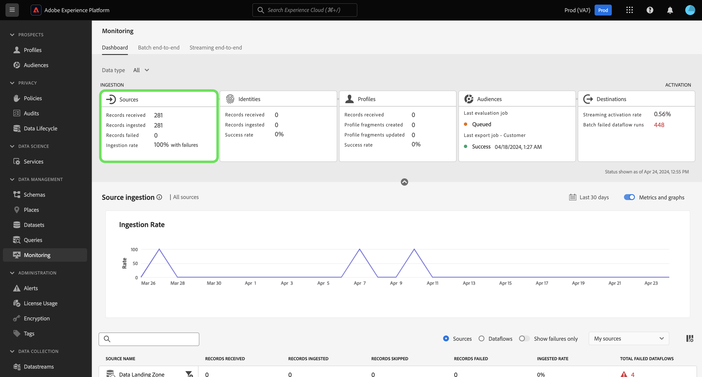
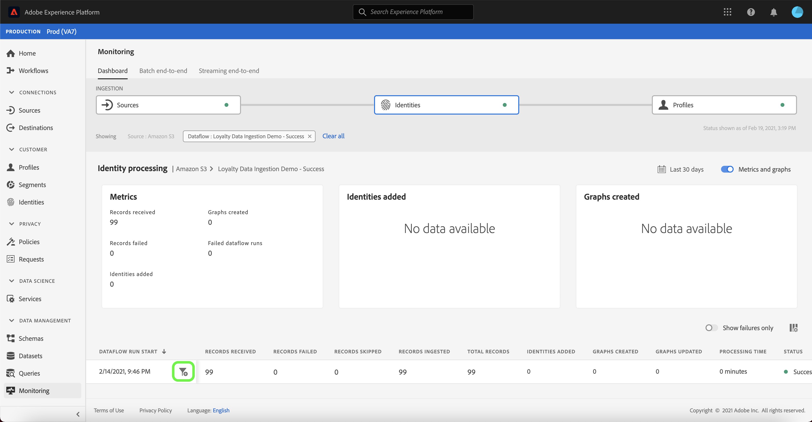
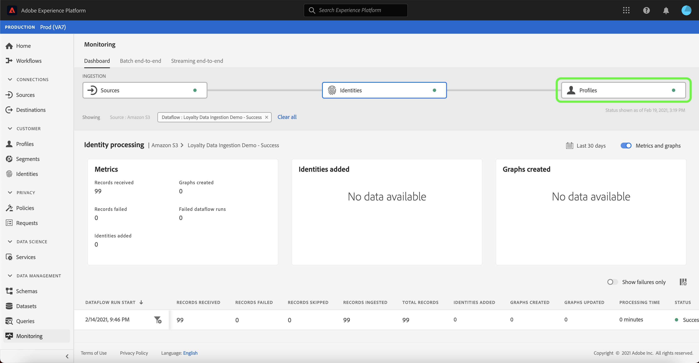

# 監視UI中源的資料流

>[!IMPORTANT]
>
>流源，如 [HTTP API源](../../sources/connectors/streaming/http.md) 監視儀表板當前不支援。 此時，您只能使用儀表板監視批源。

在Adobe Experience Platform，資料從各種來源中攝取，在Experience Platform內分析，並激活到各種目的地。 通過向資料流提供透明性，平台使跟蹤這種潛在的非線性資料流的過程變得更容易。

監視面板可以直觀顯示資料流的運行過程。 您可以使用聚合監視視圖，並從源級、資料流和資料流運行垂直導航，從而查看有助於資料流成功或失敗的相應度量。 您還可以使用監視面板的跨服務監視能力來監視資料流從源到 [!DNL Identity Service], [!DNL Profile]。

本教程提供了使用聚合監視視圖和跨服務監視來監視資料流的步驟。

## 快速入門 {#getting-started}

本教程需要對Adobe Experience Platform的以下部分進行有效的理解：

* [資料流](../home.md):資料流是跨平台移動資料的資料作業的表示形式。 資料流是跨不同服務配置的，有助於將資料從源連接器移動到目標資料集 [!DNL Identity] 和 [!DNL Profile], [!DNL Destinations]。
   * [資料流運行](../../sources/notifications.md):資料流運行是基於所選資料流的頻率配置的定期調度作業。
* [源](../../sources/home.md):Experience Platform允許從各種源接收資料，同時讓您能夠使用平台服務構建、標籤和增強傳入資料。
* [身份服務](../../identity-service/home.md):通過跨設備和系統橋接身份，更好地瞭解單個客戶及其行為。
* [即時客戶概要資訊](../../profile/home.md):基於來自多個源的聚合資料提供統一、即時的用戶配置檔案。
* [沙箱](../../sandboxes/home.md):Experience Platform提供虛擬沙箱，將單個平台實例分區為獨立的虛擬環境，以幫助開發和發展數字型驗應用程式。

## 聚合監視視圖 {#aggregated-monitoring-view}

>[!CONTEXTUALHELP]
>id="platform_monitoring_source_ingestion"
>title="源攝取"
>abstract="「源接收」視圖包含資料湖服務中資料活動狀態和度量的資訊，包括已接收的記錄和失敗的記錄。 查看度量定義指南，瞭解有關度量和圖形的詳細資訊。"
>text="Learn more in documentation"

>[!CONTEXTUALHELP]
>id="platform_monitoring_dataflow_run_details_ingestion"
>title="資料流運行詳細資訊"
>abstract="源處理包含有關資料湖服務中資料活動狀態和度量的資訊，包括接收的記錄和失敗的記錄。 查看度量定義指南，瞭解有關度量和圖形的詳細資訊。"
>text="Learn more in documentation"

在 [平台UI](https://platform.adobe.com)選中 **[!UICONTROL 監視]** 從左側導航 [!UICONTROL 監視] 控制項欄。 的 [!UICONTROL 監視] 儀表板包含有關所有源資料流的度量和資訊，包括對從源到源的資料流運行狀況的洞察 [!DNL Identity Service], [!DNL Profile]。

操控板的中心是 [!UICONTROL 源攝取] 面板，其中包含顯示所接收記錄和記錄資料的度量和圖形。

預設情況下，顯示的資料包含過去24小時的攝取率。 選擇 **[!UICONTROL 過去24小時]** 來調整顯示的記錄的時間範圍。

此時將出現一個日曆彈出窗口，為您提供了替代接收時間框架的選項。 選擇 **[!UICONTROL 最後三十天]** ，然後選擇 **[!UICONTROL 應用]**

預設情況下，圖形處於啟用狀態，您可以禁用它們以展開下面的源清單。 選擇 **[!UICONTROL 度量和圖形]** 切換以禁用圖形。

| 源攝取 | 說明 |
| ---------------- | ----------- |
| [!UICONTROL 攝取的記錄 ] | 接收的記錄總數。 |
| [!UICONTROL 記錄失敗] | 由於資料中的錯誤而未攝取的記錄總數。 |
| [!UICONTROL 失敗的資料流總數] | 具有的資料流的總數 `failed` 狀態。 |

源接收清單顯示至少包含一個現有帳戶的所有源。 該清單還包括有關每個源的接收率、失敗記錄數以及基於您應用的時間框架的失敗資料流總數的資訊。

要對源清單進行排序，請選擇 **[!UICONTROL 我的來源]** 然後從下拉菜單中選擇選擇的類別。 例如，要關注雲儲存，請選擇  **[!UICONTROL 雲儲存]**

要查看所有源的所有現有資料流，請選擇 **[!UICONTROL 資料流]**。

或者，可以在搜索欄中輸入源以隔離單個源。 確定源後，選擇篩選器表徵圖  清單。

此時將顯示資料流清單。 要縮小清單範圍並關注出錯的資料流，請選擇 **[!UICONTROL 僅顯示失敗]**。

找到要監視的資料流，然後選擇篩選器表徵圖  清單框中，選擇相應的選項。

「資料流」運行頁顯示有關資料流運行開始日期、資料大小、狀態及其處理時間持續時間的資訊。 選擇篩選器表徵圖  查看其資料流運行詳細資訊。

的 [!UICONTROL 資料流運行詳細資訊] 頁顯示有關資料流的元資料、部分接收狀態和錯誤摘要的資訊。 錯誤摘要包含特定的頂級錯誤，該錯誤顯示接收進程在哪個步驟遇到錯誤。

向下滾動，查看所發生錯誤的更具體資訊。

的 [!UICONTROL 資料流運行錯誤] 面板顯示導致資料流接收失敗的特定錯誤和錯誤代碼。 在此方案中，出現映射器轉換錯誤，導致24條記錄失敗。

選擇 **[!UICONTROL 檔案]** 的子菜單。

的 [!UICONTROL 檔案] 面板包含有關檔案名稱和路徑的資訊。

要更精確地表示錯誤，請選擇 **[!UICONTROL 預覽錯誤診斷]**。

的 [!UICONTROL 錯誤診斷預覽] 的子菜單。 可以選擇 **[!UICONTROL 下載]** 檢索curl命令，此命令允許您下載錯誤診斷。

完成後，選擇 **[!UICONTROL 關閉]**

您可以使用頂部標題中的breadcrumb系統導航回 [!UICONTROL 監視] 控制項欄。 選擇 **[!UICONTROL 運行開始：2/14/2021，晚9:47]** 返回上一頁，然後選擇 **[!UICONTROL 資料流：會員資料接收演示 — 失敗]** 返回資料流頁。

## 跨服務監視 {#cross-service-monitoring}

儀表板的上部包含從源級到 [!DNL Identity Service], [!DNL Profile]。 每個單元包括一個點標籤，該點標籤指示在攝取階段出現的錯誤。 綠點表示無錯誤攝取，而紅點表示在特定攝取階段發生錯誤。

在「資料流」頁中，找到成功的資料流並選擇篩選器表徵圖  旁邊，查看其資料流運行資訊。

的 [!UICONTROL 源攝取] 頁包含確認成功接收資料流的資訊。 從這裡，您可以開始監控資料流從源級到 [!DNL Identity Service]，然後 [!DNL Profile]。

選擇 **[!UICONTROL 身份]** 看到食物攝入 [!UICONTROL 身份] 。

### [!DNL Identity] 度量 {#identity-metrics}

>[!CONTEXTUALHELP]
>id="platform_monitoring_identity_processing"
>title="身份處理"
>abstract="「身份處理」視圖包含有關接收到身份服務的記錄的資訊，包括添加的身份數、建立的圖形和更新的圖形。 查看度量定義指南，瞭解有關度量和圖形的詳細資訊。"
>text="Learn more in documentation"

>[!CONTEXTUALHELP]
>id="platform_monitoring_dataflow_run_details_identity"
>title="資料流運行詳細資訊"
>abstract="「資料流運行詳細資料」頁顯示有關身份資料流運行的詳細資訊，包括其IMS組織ID和資料流運行ID。"

的 [!UICONTROL 身份處理] 頁面包含接收到的記錄的資訊 [!DNL Identity Service]，包括添加的標識數、建立的圖形和更新的圖形數。

選擇篩選器表徵圖  在資料流運行開始時間旁邊，查看有關 [!DNL Identity] 資料流運行。

| 標識度量 | 說明 |
| ---------------- | ----------- |
| [!UICONTROL 收到的記錄] | 從接收的記錄數 [!DNL Data Lake]。 |
| [!UICONTROL 記錄失敗] | 由於資料中的錯誤而未接收到平台的記錄數。 |
| [!UICONTROL 略過的記錄] | 攝入但未進入的記錄數 [!DNL Identity Service] 因為記錄行中只有一個標識符。 |
| [!UICONTROL 攝取的記錄] | 接收到的記錄數 [!DNL Identity Service]。 |
| [!UICONTROL 記錄總數] | 所有記錄（包括記錄失敗、跳過的記錄）的總計數， [!DNL Identities] 添加和複製記錄。 |
| [!UICONTROL 已添加標識] | 添加到的淨新標識符數 [!DNL Identity Service]。 |
| [!UICONTROL 已建立圖形] | 在中建立的淨新標識圖數 [!DNL Identity Service]。 |
| [!UICONTROL 圖形已更新] | 使用新邊更新的現有標識圖形的數量。 |
| [!UICONTROL 資料流運行失敗] | 失敗的資料流運行數。 |
| [!UICONTROL 處理時間] | 從接收開始到完成的時間戳。 |
| [!UICONTROL 狀態] | 定義資料流的總體狀態。 可能的狀態值為： <ul><li>`Success`:指示資料流處於活動狀態，並且正在根據提供的計畫接收資料。</li><li>`Failed`:指示資料流的激活過程因錯誤而中斷。 </li><li>`Processing`:指示資料流尚未處於活動狀態。 建立新資料流後，通常會立即遇到此狀態。</li></ul> |

的 [!UICONTROL 資料流運行詳細資訊] 頁面顯示有關 [!DNL Identity] 資料流運行，包括其IMS組織ID和資料流運行ID。 此頁還顯示由提供的相應錯誤代碼和錯誤消息 [!DNL Identity Service]，是否在攝取過程中出現任何錯誤。

選擇 **[!UICONTROL 運行開始：2/14/2021，晚9:47]** 的子菜單。

從 [!UICONTROL 身份處理] ，選擇 **[!UICONTROL 配置檔案]** 查看 [!UICONTROL 配置檔案] 。

### [!DNL Profile] 度量 {#profile-metrics}

>[!CONTEXTUALHELP]
>id="platform_monitoring_profile_processing"
>title="配置檔案處理"
>abstract="「配置檔案處理」視圖包含有關接收到配置檔案服務的記錄的資訊，包括建立的配置檔案片段數、更新的配置檔案片段數和配置檔案片段總數。"
>text="Learn more in documentation"

>[!CONTEXTUALHELP]
>id="platform_monitoring_dataflow_run_details_profile"
>title="資料流運行詳細資訊"
>abstract="「資料流運行詳細資料」頁顯示有關配置檔案資料流運行的詳細資訊，包括其IMS組織ID和資料流運行ID。"

的 [!UICONTROL 配置檔案處理] 頁面包含接收到的記錄的資訊 [!DNL Profile]包括建立的配置檔案片段數、更新的配置檔案片段數和配置檔案片段總數。

選擇篩選器表徵圖  在資料流運行開始時間旁邊，查看有關 [!DNL Profile] 資料流運行。

| 配置檔案度量 | 說明 |
| --------------- | ----------- |
| [!UICONTROL 收到的記錄] | 從接收的記錄數 [!DNL Data Lake]。 |
| [!UICONTROL 記錄失敗 ] | 攝入但未進入的記錄數 [!DNL Profile] 錯誤。 |
| [!UICONTROL 已添加配置檔案片段] | 淨新數 [!DNL Profile] 已添加片段。 |
| [!UICONTROL 已更新配置檔案片段] | 現有數量 [!DNL Profile] 片段更新 |
| [!UICONTROL 配置檔案碎片總數] | 寫入的記錄總數 [!DNL Profile]，包括所有現有 [!DNL Profile] 片段更新和新 [!DNL Profile] 已建立片段。 |
| [!UICONTROL 資料流運行失敗] | 失敗的資料流運行數。 |
| [!UICONTROL 處理時間] | 從接收開始到完成的時間戳。 |
| [!UICONTROL 狀態] | 定義資料流的總體狀態。 可能的狀態值為： <ul><li>`Success`:指示資料流處於活動狀態，並且正在根據提供的計畫接收資料。</li><li>`Failed`:指示資料流的激活過程因錯誤而中斷。 </li><li>`Processing`:指示資料流尚未處於活動狀態。 建立新資料流後，通常會立即遇到此狀態。</li></ul> |

的 [!UICONTROL 資料流運行詳細資訊] 頁面顯示有關 [!DNL Profile] 資料流運行，包括其IMS組織ID和資料流運行ID。 此頁還顯示由提供的相應錯誤代碼和錯誤消息 [!DNL Profile]，是否在攝取過程中出現任何錯誤。

## 後續步驟 {#next-steps}

通過遵循本教程，您已成功從源級監視接收資料流， [!DNL Identity Service], [!DNL Profile]，使用 **[!UICONTROL 監視]** 控制項欄。 您還成功識別了導致資料流在接收過程中失敗的錯誤。 有關詳細資訊，請參閱以下文檔：

* [即時客戶概要資訊概述](../../profile/home.md)
* [資料科學工作區概述](../../data-science-workspace/home.md)
