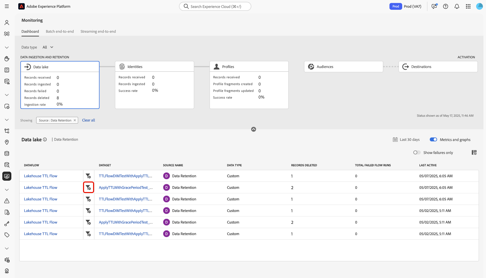

# 監視資料湖擷取

>[!IMPORTANT]
>
>監控儀表板目前不支援串流來源，例如[HTTP API來源](../../sources/connectors/streaming/http.md)。 目前，您只能使用儀表板來監視批次來源。

您可以使用Adobe Experience Platform使用者介面中的監視儀表板，擷取有關資料湖中的資料擷取和資料保留流程的量度。 使用介面中的圖表來監視一段時間內的擷取和保留趨勢，並彙總所有來源資料流程的效能。

閱讀本檔案以瞭解如何使用監視儀表板來監視Data Lake中的所有資料處理，包括擷取和保留。

## 快速入門 {#get-started}

本教學課程需要您實際瞭解下列Adobe Experience Platform元件：

* [資料流](../home.md)：資料流可呈現跨Experience Platform行動資料的資料作業。 資料流是跨不同服務設定的，有助於將資料從來源聯結器移至目標資料集、移至[!DNL Identity]和[!DNL Profile]以及移至[!DNL Destinations]。
   * [資料流執行](../../sources/notifications.md)：資料流執行是根據所選資料流的頻率設定所排程的週期性工作。
* [來源](../../sources/home.md)： Experience Platform允許從各種來源擷取資料，同時讓您能夠使用Experience Platform服務來建構、加標籤以及增強傳入的資料。
* [身分識別服務](../../identity-service/home.md)：透過跨裝置和系統橋接身分，以更清楚瞭解個別客戶及其行為。
* [即時客戶個人檔案](../../profile/home.md)：根據來自多個來源的彙總資料，提供統一的即時客戶個人檔案。
* [沙箱](../../sandboxes/home.md)： Experience Platform提供的虛擬沙箱可將單一Experience Platform執行個體分割成個別的虛擬環境，以利開發及改進數位體驗應用程式。

## 使用監視儀表板進行資料湖攝取

>[!CONTEXTUALHELP]
>id="platform_monitoring_source_ingestion"
>title="來源擷取"
>abstract="來源擷取視圖會包含有關資料湖服務中資料活動狀態和量度的資訊，包括擷取的記錄和失敗的記錄。檢閱量度定義指南以了解有關量度和圖表的詳細資訊。"
>text="Learn more in documentation"

>[!CONTEXTUALHELP]
>id="platform_monitoring_dataflow_run_details_ingestion"
>title="資料流執行詳細資訊"
>abstract="來源處理會包含有關資料湖服務中資料活動狀態和量度的資訊，包括擷取的記錄和失敗的記錄。檢閱量度定義指南以了解有關量度和圖表的詳細資訊。"
>text="Learn more in documentation"

從監視儀表板的主要標題中選取&#x200B;**[!UICONTROL 資料湖]**，以檢視您的資料湖擷取率。

[!UICONTROL 擷取率]圖表會根據您設定的時間範圍顯示您的資料擷取率。 依預設，監視控制面板會顯示過去24小時的擷取率。 如需設定時間範圍的步驟，請閱讀[設定監視時間範圍](monitor.md#configure-monitoring-time-frame)的指南。

預設會啟用圖表顯示。 若要隱藏圖表，請選取&#x200B;**[!UICONTROL 度量和圖表]**&#x200B;以停用切換並隱藏圖表。

控制面板的下方會顯示一個表格，概述所有現有來源資料流程的目前度量報表。

| 量度 | 說明 |
| --- | --- |
| 已收到的記錄 | 從指定來源接收的記錄總數。 |
| 已擷取的記錄 | 擷取到Data Lake的記錄總數。 |
| 刪除的記錄 | 由於資料湖保留設定或變更資料擷取作業而刪除的記錄總數。 |
| 略過的記錄 | 略過的記錄總數。 略過的記錄是指由於不需要擷取而被略過的欄位。 例如，如果您建立的來源資料流已啟用部分擷取，您可以設定可接受的錯誤率臨界值。 在擷取程式期間，擷取將會略過非必要欄位的記錄，例如身分欄位，只要這些欄位在錯誤臨界值內。 |
| 失敗的記錄 | 因錯誤而無法擷取的記錄總數。 |
| 擷取率 | 根據接收的記錄總數所擷取的記錄百分比。 |
| 失敗的資料流總數 | 失敗的資料流總數。 |

{style="table-layout:auto"}

您可以使用量度表格上方提供的選項來進一步篩選資料：

| 篩選選項 | 說明 |
| --- | --- |
| 搜尋 | 使用搜尋列將檢視篩選為單一來源型別。 |
| 來源 | 選取&#x200B;**[!UICONTROL 來源]**&#x200B;以篩選檢視並顯示每個來源型別的量度資料。 這是監控儀表板使用的預設顯示。 |
| 資料流 | 選取&#x200B;**[!UICONTROL 資料流]**&#x200B;以篩選檢視並顯示每個資料流的量度資料。 |
| 僅顯示失敗 | 選取&#x200B;**[!UICONTROL 僅顯示失敗]**&#x200B;以篩選檢視並僅顯示報告擷取失敗的資料流程。 |
| 我的來源 | 您可以使用[!UICONTROL 我的來源]下拉式功能表來進一步篩選檢視。 使用下拉式功能表來依類別篩選檢視。 或者，您可以選取「**[!UICONTROL 所有來源]**」來顯示所有或來源上的量度，或選取「**[!UICONTROL 我的來源]**」來僅顯示您有對應帳戶的來源。 |

{style="table-layout:auto"}

若要自訂欄顯示，請選取欄設定圖示。

接著，使用&#x200B;*[!UICONTROL 自訂表格]*&#x200B;視窗來選取您想要儀表板顯示的欄。 完成後，選取&#x200B;**[!UICONTROL 套用]**。

若要監視在特定資料流中擷取的資料，請選取來源旁的篩選圖示。

>[!TIP]
>
>您可以使用監視儀表板來監視使用資料保留原則刪除之記錄的資料刪除度量。 如需資料保留的詳細資訊，請閱讀[設定資料保留原則](../../catalog/datasets/user-guide.md#data-retention-policy)的指南。

量度表格會更新為對應至您選取之來源的活動資料流表格。 在此步驟中，您可以檢視資料流的其他資訊，包括其對應的資料集和資料型別，以及時間戳記，以指出資料流上次作用的時間。

若要進一步檢查資料流，請選取資料流旁的篩選圖示。

接下來，您會進入一個介面，該介面會列出您所選取資料流的所有資料流執行反複專案。

資料流執行代表資料流執行的例項。 例如，如果資料流排程在每小時的上午9:00、上午10:00及上午11:00執行，則您會有三個資料流執行個體。 流程執行是您的特定組織所專屬。

若要檢查特定資料流執行反複專案的量度，請選取資料流旁的篩選圖示。

使用資料流執行詳細資訊頁面來檢視您所選執行疊代的度量和資訊。

| 資料流執行詳細資訊 | 說明 |
| --- | --- |
| 已擷取的記錄 | 從資料流執行擷取的記錄總數。 |
| 失敗的記錄 | 由於資料流執行中的錯誤而未擷取的記錄總數。 |
| 檔案總數 | 資料流執行中的檔案總數。 |
| 資料的大小 | 資料流執行中包含的資料大小總計。 |
| 資料流執行 ID | 資料流執行反複專案的ID。 |
| 組織 ID | 在其中建立資料流執行的組織ID。 |
| 狀態 | 資料流執行的狀態。 |
| 資料流執行開始 | 表示資料流執行開始的時間戳記。 |
| 資料流執行結束 | 表示資料流執行何時結束的時間戳記。 |
| 資料集 | 用來建立資料流的資料集。 |
| 資料類型 | 資料流中的資料型別。 |
| 部分擷取 | 部分批次擷取是擷取包含錯誤的資料的能力，最多可達特定可設定的臨界值。 此功能可讓您將所有精確資料成功擷取到Experience Platform，同時所有不正確的資料會個別批次處理，並提供無效原因的資訊。 您可以在資料流建立過程中啟用部分擷取。 |
| 錯誤診斷 | 錯誤診斷會指示來源產生錯誤診斷，以便您稍後在監控資料集活動和資料流狀態時參考。 您可以在資料流建立過程中啟用錯誤診斷。 |
| 錯誤摘要 | 在失敗的資料流執行中，錯誤摘要會顯示錯誤碼和說明，以摘要執行反複專案失敗的原因。 |

{style="table-layout:auto"}

如果您的資料流執行報告錯誤，您可以向下捲動到頁面底部，使用[!UICONTROL 資料流執行錯誤]介面。

使用[!UICONTROL 記錄失敗]區段來檢視因錯誤而未擷取的記錄上的量度。 若要檢視完整的錯誤報告，請選取&#x200B;**[!UICONTROL 預覽錯誤診斷]**。 若要下載錯誤診斷與檔案資訊清單的復本，請選取[下載]，然後複製要與[!DNL Data Access] API一起使用的範例API呼叫。**&#x200B;**

>[!NOTE]
>
>只有在來源連線建立過程中啟用了特徵時，才能使用錯誤診斷。

## 後續步驟 {#next-steps}

透過學習本教學課程，您已瞭解如何使用&#x200B;**[!UICONTROL 監視]**&#x200B;儀表板來監視資料湖擷取率。 您也已瞭解如何識別在擷取期間導致資料流失敗的錯誤。 如需更多詳細資訊，請參閱下列檔案：

* [正在監視身分資料](./monitor-identities.md)。
* [正在監視設定檔資料](./monitor-profiles.md)。
