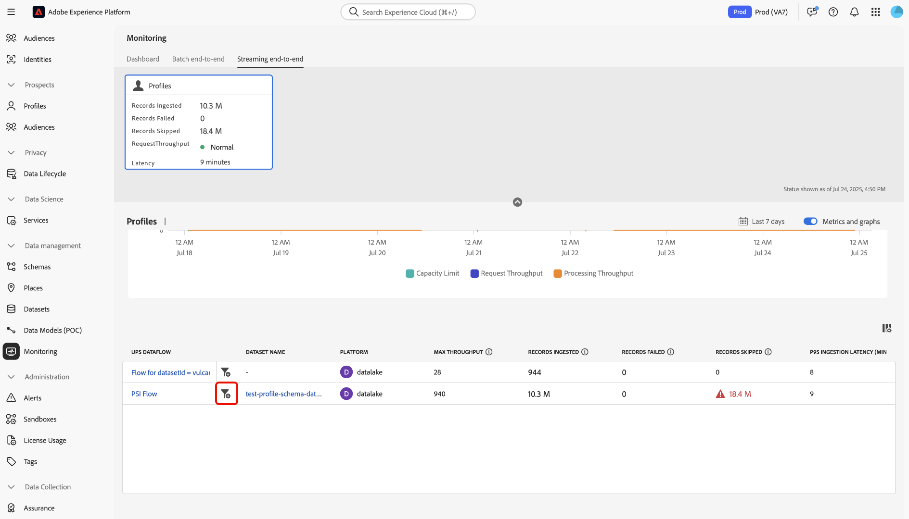

# 監視串流設定檔攝取

您可以使用Adobe Experience Platform UI中的監控儀表板，對組織內的串流設定檔擷取進行即時監控。 使用此功能來存取與串流資料相關的輸送量、延遲和資料品品質度的更高透明度。 此外，此功能用於主動警報和擷取可操作的深入分析，以協助識別潛在的容量違規和資料擷取問題。

請閱讀以下指南，瞭解如何使用監控儀表板追蹤組織中串流設定檔擷取工作的速率和量度。

## 快速入門

本指南需要您深入瞭解下列Experience Platform元件：

* [資料流](../home.md)：資料流代表跨Experience Platform傳輸資訊的資料工作。 它們可在各種服務中進行設定，以促進資料從來源聯結器移動至目標資料集以及身分服務、即時客戶設定檔和目的地。
* [即時客戶個人檔案](../../profile/home.md)：即時客戶個人檔案將來自多個來源（線上、離線、CRM和協力廠商）的資料合併成針對每個客戶的單一可操作的檢視，以實現跨所有接觸點的一致和個人化體驗。
* [串流擷取](../../ingestion/streaming-ingestion/overview.md)： Experience Platform的串流擷取可讓使用者即時從使用者端和伺服器端裝置傳送資料至Experience Platform。Experience Platform可讓您為每個個別客戶產生即時客戶設定檔，藉此促進協調、一致和相關體驗。&#x200B;URL在儘可能縮短延遲的情況下建立這些設定檔時，串流擷取會發揮關鍵作用。
* [容量](../../landing/license-usage-and-guardrails/capacity.md)：在Experience Platform中，容量可讓您知道您的組織是否超過您的護欄，並提供如何修正這些問題的資訊。

>[!NOTE]
>
>串流輸送量容量支援每秒最多1500個傳入事件。 您可以購買額外的串流區段來支援每秒最多13,500個額外傳入事件&#x200B;。 如需詳細資訊，請參閱[Real-Time CDP B2C Edition - Prime和Ultimate套件產品說明](https://helpx.adobe.com/tw/legal/product-descriptions/real-time-customer-data-platform-b2c-edition-prime-and-ultimate-packages.html)。

## 監視串流設定檔攝取的量度 {#streaming-profile-metrics}

>[!CONTEXTUALHELP]
>id="platform_monitoring_streaming_profile"
>title="監視串流設定檔攝取"
>abstract="串流設定檔的監視儀表板顯示有關輸送量、攝取率及延遲的資訊。使用此儀表板來檢視、了解及分析送入 Experience Platform 的串流設定檔的資料處理量度。"
>text="Learn more in documentation"

>[!CONTEXTUALHELP]
>id="platform_monitoring_streaming_profile_request_throughput"
>title="請求輸送量"
>abstract="此量度表示每秒進入攝取系統的事件數量。"
>text="Learn more in documentation"

>[!CONTEXTUALHELP]
>id="platform_monitoring_streaming_profile_processing_throughput"
>title="處理輸送量"
>abstract="此量度表示系統每秒成功攝取的事件數量。"
>text="Learn more in documentation"

>[!CONTEXTUALHELP]
>id="platform_monitoring_streaming_profile_p95_ingestion_latency"
>title="P95 攝取延遲"
>abstract="此量度測量從事件到達 Experience Platform 到成功攝取進入設定檔存放區為止，其延遲時間的第 95 個百分位數。"
>text="Learn more in documentation"

>[!CONTEXTUALHELP]
>id="platform_monitoring_streaming_profile_max_throughput"
>title="最大輸送量"
>abstract="此量度表示每秒進入串流設定檔攝取的最大傳入請求數。"
>text="Learn more in documentation"

>[!CONTEXTUALHELP]
>id="platform_monitoring_streaming_profile_records_ingested"
>title="已攝取的記錄"
>abstract="此量度表示在設定的時間範圍內，已攝取至設定檔存放區的記錄總數。"
>text="Learn more in documentation"

>[!CONTEXTUALHELP]
>id="platform_monitoring_streaming_profile_records_failed"
>title="攝取失敗的記錄"
>abstract="此量度表示在設定的時間範圍內，因錯誤而未能攝取至設定檔存放區的記錄總數。"
>text="Learn more in documentation"

>[!CONTEXTUALHELP]
>id="platform_monitoring_streaming_profile_records_skipped"
>title="略過的記錄"
>abstract="此量度表示在設定的時間範圍內，由於設定或容量違規而捨棄的記錄總數。"
>text="Learn more in documentation"

>[!CONTEXTUALHELP]
>id="platform_monitoring_streaming_profile_error_details"
>title="錯誤詳細資料"
>abstract="此量度表示由於錯誤而失敗的事件數量。"
>text="Learn more in documentation"

請使用量度表格取得資料流的特定資訊。 如需各欄的詳細資訊，請參閱下表。

| 量度 | 說明 | 維度 | 測量頻率 |
| --- | --- | --- | --- |
| 請求輸送量 | 此量度表示每秒進入攝取系統的事件數量。 | 沙箱/資料流 | 每60秒重新整理資料即可即時監控。 |
| 處理輸送量 | 此量度表示系統每秒成功攝取的事件數量。 | 沙箱/資料流 | 每60秒重新整理資料即可即時監控。 |
| P95 攝取延遲 | 此量度測量從事件到達 Experience Platform 到成功攝取進入設定檔存放區為止，其延遲時間的第 95 個百分位數。 | 沙箱/資料流 | 每60秒重新整理資料即可即時監控。 |
| 最大輸送量 | 此量度代表每秒進入串流設定檔擷取的傳入要求數上限 | <ul><li>沙箱/資料流</li><li>資料流執行</li></ul> |  |
| 已攝取的記錄 | 此量度表示在設定的時間範圍內，已攝取至設定檔存放區的記錄總數。 | <ul><li>沙箱/資料流</li><li>資料流執行</li></ul> | <ul><li>沙箱/資料流：即時監視，每60秒重新整理一次資料。</li><li>資料流執行：在15分鐘內分組。</li></ul> |
| 攝取失敗的記錄 | 此量度表示在設定的時間範圍內，因錯誤而未能攝取至設定檔存放區的記錄總數。 | <ul><li>沙箱/資料流</li><li>資料流執行</li></ul> | <ul><li>沙箱/資料流：即時監視，每60秒重新整理一次資料。</li><li>資料流執行：在15分鐘內分組。</li></ul> |
| 略過的記錄 | 此量度表示在設定的時間範圍內，由於設定或容量違規而捨棄的記錄總數。 | <ul><li>沙箱/資料流</li><li>資料流執行</li></ul> | <ul><li>沙箱/資料流：即時監視，每60秒重新整理一次資料。</li><li>資料流執行：在15分鐘內分組。</li></ul> |
| 錯誤詳細資料 | 此量度表示由於錯誤而失敗的事件數量。 | 資料流執行 | 以每小時為時段分組。 |

{style="table-layout:auto"}

## 使用監控儀表板來擷取串流設定檔

若要存取串流設定檔擷取的監控儀表板，請前往Experience Platform UI，從左側導覽選取「**[!UICONTROL Monitoring]**」，然後選取「**[!UICONTROL Streaming end-to-end]**」。

請參閱&#x200B;*[!UICONTROL Profile]*&#x200B;量度卡片控制面板頂端的標題。 使用此顯示畫面來檢視已擷取、失敗和略過的記錄資訊，以及要求輸送量和延遲的目前狀態資訊。

接著，使用介面檢視串流設定檔擷取量度的詳細資訊。 使用行事曆功能在不同的時間範圍之間切換。 您可以從下列預先設定的時間視窗中選取：

* [!UICONTROL Last 6 hours]
* [!UICONTROL Last 12 hours]
* [!UICONTROL Last 24 hours]
* [!UICONTROL Last 7 days]
* [!UICONTROL Last 30 days]

或者，您也可以使用行事曆手動設定自己的時間範圍。

您可以在監控儀表板中使用三種不同的量度類別來串流設定檔擷取： [!UICONTROL Throughput]、[!UICONTROL Ingestion]和[!UICONTROL Latency]。

>[!BEGINTABS]

>[!TAB 輸送量]

選取「**[!UICONTROL Throughput]**」以檢視Experience Platform在設定的時間內處理的資料量相關資訊。 請參考此量度以評估系統的效率和容量。

* **[容量](../../landing/license-usage-and-guardrails/capacity.md)**：您的沙箱在定義的條件下可以處理的最大資料量。
* **要求輸送量**：擷取系統接收事件的速率（以每秒事件數測量）。
* **處理輸送量**：系統成功擷取及處理傳入事件裝載的速率（以每秒事件數測量）。

>[!TAB 內嵌]

**內嵌**：選取&#x200B;**[!UICONTROL Ingestion]**&#x200B;以檢視您沙箱中內嵌工作的相關資訊。 這些內嵌工作會以三種不同的量度來測量。

* **擷取的記錄**：在指定期間內建立的記錄總數。 此量度代表沙箱中的成功資料擷取流程。
* **略過的記錄數**：因錯誤而未擷取的記錄總數。
* **略過的記錄數**：因違反容量限制而捨棄的記錄總數。

>[!TAB 延遲]

選取「**[!UICONTROL Latency]**」以檢視Experience Platform回應要求或在指定期間內完成作業所花費的時間的相關資訊。

>[!ENDTABS]

### 使用資料流量度表格

資料流表格會針對即時客戶個人檔案列出所有串流擷取活動及其對應的量度集。 每個資料流都會與其對應的資料集一起列出。

如果您正接近沙箱層級容量的限制，您可以參考[!UICONTROL Max throughput]欄以識別對您的耗用率有貢獻的任何現有資料流。 閱讀[最佳實務區段](#best-practices)，以取得資料流管理最佳實務的詳細資訊。

若要監視在特定資料流中擷取的資料，請選取資料流名稱旁的篩選圖示。

接下來，使用資料流量度介面來選取您要檢查的特定資料流執行。 選取資料流執行反複專案旁的篩選圖示，以檢視所選資料流執行的特定量度。

資料流執行代表資料流執行的例項。 例如，如果資料流排程在早上9:00、10:00、11:00 AM每小時執行，則您會有三個資料流執行個體。 流程執行是您的特定組織所專屬。

使用資料流執行詳細資訊頁面來檢視您所選執行疊代的度量和資訊。

## 資料流管理最佳實務 {#best-practices}

請閱讀以下章節，瞭解如何在Experience Platform上妥善管理資料流並最佳化資料消耗。

### 評估並最佳化串流擷取資料流程

為確保有效的串流擷取，請檢閱並調整您的資料流和處理策略：

* **評估目前使用量**：識別哪些資料流和資料集對輸送量的貢獻最大。
* **優先處理有價值的資料**：並非所有資料都需要。 排除不支援使用案例的資料，以減少儲存空間並提升效率。
* **最佳化處理模式**：決定是否可將部分資料從串流移轉到批次擷取。 保留串流以供需要低延遲的使用案例使用，例如即時分段。

### 針對容量和季節性流量進行規劃

如果您目前每秒&#x200B;**1,500個事件的限制**&#x200B;不足，請考慮最佳化您的資料策略或增加授權容量：

* **分析資料集和沙箱使用量**：檢閱目前和歷史資料，瞭解流量和參與如何影響串流細分輸送量。
* **季節性帳戶**：識別由週期性行銷活動或產業特定週期驅動的尖峰流量期間。
* **預測未來需求**：根據過去的季節性趨勢、計畫的行銷活動或主要事件，估計即將到來的流量和參與量。

| 貢獻因數 | 內容 | 對使用案例的影響 | 最佳做法 |
| --- | --- | --- | --- |
| 批次至串流轉換 | 批次工作負荷轉換為串流可大幅增加輸送量，進而影響效能和資源配置。 例如，在沒有速率限制的事件之後執行大量設定檔更新。 | 不需要低延遲處理時，批次使用案例就不需要串流策略。 | 評估使用案例需求。 針對批次傳出行銷，請考慮使用[批次擷取](../../ingestion/batch-ingestion/overview.md)而非串流，以更有效率地管理資料擷取。 |
| 不必要的資料擷取 | 個人化不需要擷取資料可增加輸送量，而不會增加值，進而浪費資源。 例如，不論相關性為何，都將所有Analytics流量擷取至設定檔。 | 過多的不相關資料會產生雜訊，使得識別具影響力的資料點變得更困難。 在定義和管理對象和設定檔時，這也會造成摩擦。 | 僅擷取使用案例所需的資料。 請確定您篩選掉不必要的資料。<ul><li>**Adobe Analytics**：使用[資料列層級篩選](../../sources/tutorials/ui/create/adobe-applications/analytics.md#filtering-for-real-time-customer-profile)來最佳化您的資料輸入。</li><li>**來源**：使用[[!DNL Flow Service] API來篩選所支援來源（如](../../sources/tutorials/api/filter.md)和[!DNL Snowflake]）的資料列層級資料[!DNL Google BigQuery]。</li></li>**Edge資料流**：設定[動態資料流](../../datastreams/configure-dynamic-datastream.md)，對來自WebSDK的流量執行列層級篩選。</li></ul> |

{style="table-layout:auto"}

### 常見問題 {#faq}

請閱讀本節，以取得有關監控串流設定檔擷取的常見問題解答。

#### 為什麼我的量度在容量和監控儀表板之間對於請求輸送量看起來不同？

+++回答

[!UICONTROL Monitoring]儀表板會顯示擷取和處理的即時量度。 這些數字是活動時記錄的精確量度。 相反地，[!UICONTROL Capacity]儀表板使用平滑機制來計算輸送量。 此機制有助於減少短暫的尖峰，使其不立即符合違規資格，並確保容量警報聚焦於持續趨勢，而非短暫的爆發。

由於平滑機制，您可能會注意到：

* 未出現在[!UICONTROL Monitoring]中的[!UICONTROL Capacity]小尖峰。
* [!UICONTROL Capacity]中的值比相同時間戳記的[!UICONTROL Monitoring]略低。

這兩個儀表板雖然準確，但設計用於不同的目的。

* [!UICONTROL Monitoring]：詳細的逐一操作可見度。
* [!UICONTROL Capacity]：識別使用與違規模式的策略檢視。

+++

## 後續步驟 {#next-steps}

按照本教學課程，您已瞭解如何監視組織中的串流設定檔擷取工作。 請閱讀下列檔案，以取得有關監控即時客戶個人檔案資料的更多資訊。

* [使用監視儀表板](./monitor.md)。
* [監視設定檔資料](./monitor-profiles.md)。
