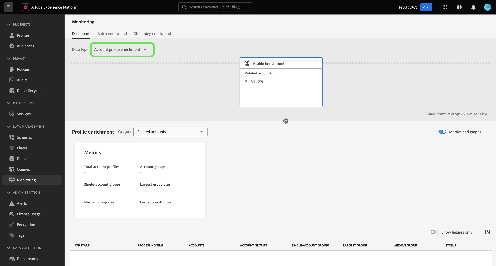
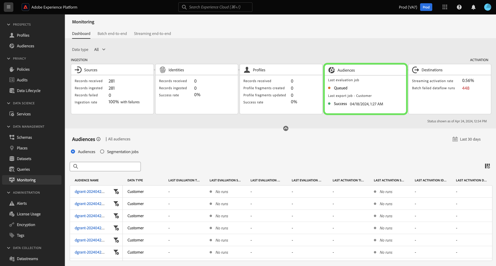

# 監視儀表板總覽

使用Adobe Experience Platform UI中的監控儀表板，檢視從擷取到啟用的資料歷程。 使用監視控制面板，您可以：

* 監控您的資料歷程，包括來源、身分服務、即時客戶個人檔案、對象，以及最終目的地。
* 根據您的資料所在階段檢視不同的量度和狀態。
* 依資料型別篩選資料監視檢視。

監控儀表板支援多種不同資料型別的檢視：

* **客戶與帳戶**：客戶資料會參考[Real-Time Customer Data Platform](../../rtcdp/home.md)中使用的資料，而帳戶資料會參考[帳戶設定檔資料](../../rtcdp/accounts/account-profile-overview.md)，此資料在訂閱[Real-Time CDP、B2B edition](../../rtcdp/b2b-overview.md)時可供存取。 如果您的Real-Time CDP授權不包含Real-Time CDP、B2B edition，則您只能使用監控儀表板來監控客戶資料。
* **潛在客戶**： [潛在客戶設定檔](../../profile/ui/prospect-profile.md)是用來代表尚未與貴公司訂婚但您想要聯絡的人。 使用潛在客戶設定檔，您可以使用受信任的第三方合作夥伴的屬性來補充您的客戶設定檔。 您必須取得Real-Time CDP （應用程式服務）、Adobe Experience Platform Activation、Real-Time CDP、Real-Time CDP Prime、Real-Time CDP Ultimate的授權，才能檢視潛在客戶資料型別。
* **帳戶設定檔擴充**：帳戶設定檔可讓您統一來自多個來源的帳戶資訊。 您必須獲得Real-Time CDP、B2B edition授權，才能監視帳戶設定檔擴充資料。

請閱讀本檔案，瞭解如何使用監視儀表板來監視不同Experience Platform服務之間的資料歷程。

## 快速入門

參閱本檔案前，請先實際瞭解下列Experience Platform元件：

* [資料流](../home.md)：資料流是跨Experience Platform行動資料的資料作業的表示法。 您可以使用來源工作區建立資料流程，將指定來源的資料擷取至Experience Platform。
* [來源](../../sources/home.md)：在Experience Platform中使用來源，從Adobe應用程式或協力廠商資料來源擷取資料。
* [身分識別服務](../../identity-service/home.md)：透過跨裝置和系統橋接身分，以更清楚瞭解個別客戶及其行為。
* [即時客戶個人檔案](../../profile/home.md)：根據來自多個來源的彙總資料，提供統一的即時客戶個人檔案。
* [分段](../../segmentation/home.md)：使用分段服務，從您的即時客戶設定檔資料建立區段和對象。
* [目的地](../../destinations/home.md)：目的地是預先建置的與常用應用程式的整合，可讓您順暢地從Experience Platform啟用資料，用於跨管道行銷活動、電子郵件行銷活動、目標定位廣告和許多其他使用案例。

## 監視儀表板指南

在Experience Platform UI中，選取左側導覽中[!UICONTROL 資料管理]下的&#x200B;**[!UICONTROL 監視]**。

選取&#x200B;**[!UICONTROL 資料型別]**，然後使用下拉式功能表選取您要檢視的資料型別。 資料型別由Experience Data Model (XDM)結構描述類別定義，以確保其資料在擷取至Experience Platform時遵循標準格式。 如需詳細資訊，請瀏覽下列檔案：

* [B2B帳戶資料型別](../../rtcdp/b2b-tutorial.md)
* [潛在客戶資料型別](../../rtcdp/partner-data/prospecting.md)

您可以根據下列資料型別來篩選檢視：

>[!BEGINTABS]

>[!TAB 全部]

選取「全部&#x200B;**[!UICONTROL 全部]**」以更新您的儀表板，並顯示指定期間內擷取至Experience Platform之所有資料的量度。

![監視資料型別設定為[全部]。](../assets/ui/monitor-overview/all.png)

>[!TAB 客戶與帳戶]

選取「**[!UICONTROL 客戶與帳戶]**」以更新您的儀表板，並顯示指定期間內擷取至Experience Platform的客戶與帳戶資料量度。

![監控資料型別設定為[客戶與帳戶]。](../assets/ui/monitor-overview/customer-account.png)

>[!TAB 潛在客戶]

選取&#x200B;**[!UICONTROL 潛在客戶]**&#x200B;以更新您的儀表板，並顯示指定期間內擷取到Experience Platform的潛在客戶資料量度。 **附註**：只有您[有權使用潛在客戶資料](../../rtcdp/partner-data/prospecting.md)，才能檢視潛在客戶資料型別活動。

![監視資料型別設定為[潛在客戶]。](../assets/ui/monitor-overview/prospect.png)

>[!TAB 帳戶設定檔擴充]

選取&#x200B;**[!UICONTROL 帳戶設定檔擴充]**&#x200B;以更新您的儀表板，並在設定檔擴充資料上顯示量度。 **附註**：如果您有權使用[B2B資料](../../rtcdp/b2b-tutorial.md)，則只能檢視帳戶設定檔擴充量度。

>[!ENDTABS]

使用控制面板的頂端標題進行跨服務監控體驗。 您可以從資料類別標題中選取您選擇的功能卡，以篩選量度和圖表檢視。

>[!BEGINTABS]

>[!TAB 來源]

選取&#x200B;**[!UICONTROL 來源]**&#x200B;以檢視來源擷取率的量度。 如需詳細資訊，請閱讀[監視來源資料](monitor-sources.md)的指南。

>[!TAB 身分]

選取&#x200B;**[!UICONTROL 身分]**&#x200B;以檢視身分識別資料的處理成功率。 如需詳細資訊，請閱讀[監視身分資料](monitor-identities.md)的指南。

>[!TAB 輪廓]

選取&#x200B;**[!UICONTROL 設定檔]**&#x200B;以檢視設定檔資料的處理成功率。 如需詳細資訊，請閱讀[監視設定檔資料](monitor-profiles.md)的指南。

>[!TAB 對象]

選取「**[!UICONTROL 對象]**」以檢視對象和細分工作的量度。 如需詳細資訊，請閱讀[監控對象資料](monitor-audiences.md)的指南。

>[!TAB 目的地]

選取&#x200B;**[!UICONTROL 目的地]**&#x200B;以檢視您[!UICONTROL 串流啟用率]和[!UICONTROL 批次失敗的資料流執行]上的量度。 如需詳細資訊，請閱讀[監視目的地資料](monitor-destinations.md)的指南。

>[!ENDTABS]

### 設定監視時間範圍 {#configure-monitoring-time-frame}

依預設，監視儀表板會顯示過去24小時內擷取之資料的量度。 若要更新時間範圍，請選取&#x200B;**[!UICONTROL 過去24小時]**。

您可以在出現的對話方塊中，為資料監視檢視設定新的時間範圍。 您可以選擇建立自訂時間範圍，或從預先設定的選項清單中選取：

* [!UICONTROL 最近24小時]
* [!UICONTROL 最近7天]
* [!UICONTROL 最近30天]

完成後，選取&#x200B;**[!UICONTROL 套用]**。

## 後續步驟

閱讀本檔案後，您現在可以透過UI中的監控儀表板快速瀏覽。 如需如何監控特定Experience Platform服務的資料資訊，請閱讀以下檔案：

* [監視來源資料](monitor-sources.md)。
* [監視身分資料](monitor-identities.md)。
* [監視設定檔資料](monitor-profiles.md)。
* [監視對象資料](monitor-audiences.md)。
* [監視目的地資料](monitor-destinations.md)。
