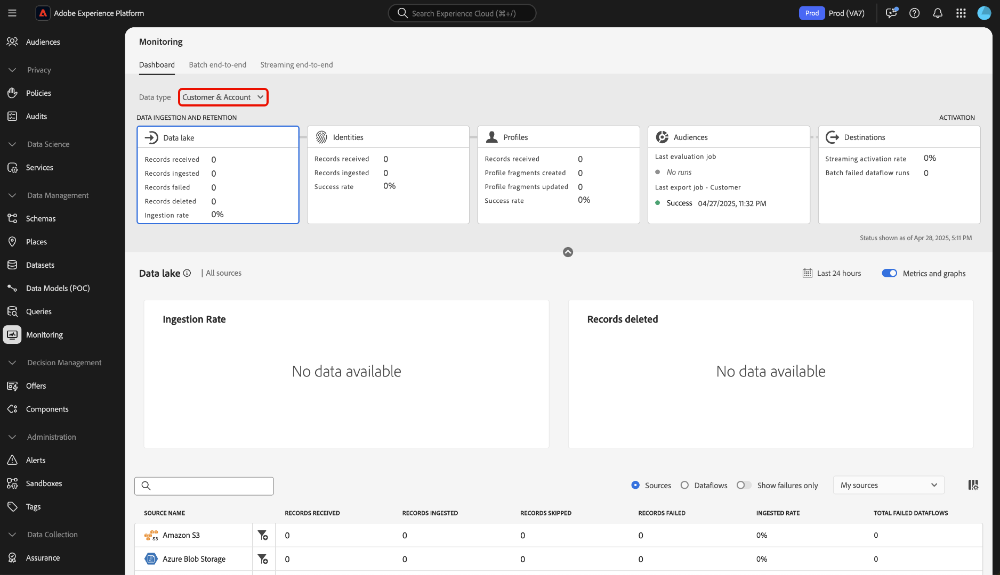

# 監視儀表板總覽

使用Adobe Experience Platform UI中的監控儀表板，檢視從擷取到啟用的資料歷程。 使用監視控制面板，您可以：

* 監控您的資料歷程，包括來源、身分服務、即時客戶個人檔案、對象，以及最終目的地。
* 根據您的資料所在階段檢視不同的量度和狀態。
* 依資料型別篩選資料監視檢視。

監控儀表板支援多種不同資料型別的檢視：

* **客戶與帳戶**：客戶資料是指以下專案所使用的資料： [Real-time Customer Data Platform](../../rtcdp/home.md)，而帳戶資料參考 [帳戶設定檔資料](../../rtcdp/accounts/account-profile-overview.md) 訂閱時可存取的 [Real-Time CDP， B2B版本](../../rtcdp/b2b-overview.md). 如果您的Real-Time CDP授權不包含Real-Time CDP， B2B Edition，則您只能使用監控儀表板來監控客戶資料。
* **潛在客戶**： [潛在客戶設定檔](../../profile/ui/prospect-profile.md) 用於代表尚未與您的公司互動但您想要聯絡的人。 使用潛在客戶設定檔，您可以使用受信任的第三方合作夥伴的屬性來補充您的客戶設定檔。 您必須取得Real-Time CDP （應用程式服務）、Adobe Experience Platform Activation、Real-Time CDP、Real-Time CDP Prime、Real-Time CDP Ultimate的授權，才能檢視潛在客戶資料型別。
* **帳戶設定檔擴充**：帳戶設定檔可讓您統一來自多個來源的帳戶資訊。 您必須獲得Real-Time CDP B2B版本的授權，才能監視帳戶設定檔擴充資料。

請閱讀本檔案，瞭解如何使用監視儀表板來監視不同Experience Platform服務之間的資料歷程。

## 快速入門

本檔案需要您實際瞭解下列Experience Platform元件：

* [資料流](../home.md)：資料流可呈現跨Experience Platform行動資料的資料作業。 您可以使用來源工作區建立資料流程，將指定來源的資料擷取至Experience Platform。
* [來源](../../sources/home.md)：在Experience Platform中使用來源從Adobe應用程式或第三方資料來源擷取資料。
* [Identity Service](../../identity-service/home.md)：透過跨裝置和系統橋接身分，更能瞭解個別客戶及其行為。
* [即時客戶個人檔案](../../profile/home.md)：根據來自多個來源的彙總資料，提供統一的即時消費者個人檔案。
* [細分](../../segmentation/home.md)：使用分段服務，從您的即時客戶設定檔資料建立區段和對象。
* [目的地](../../destinations/home.md)：目的地是預先建立的與常用應用程式的整合，可讓您順暢地從Platform啟用資料，以用於跨頻道行銷活動、電子郵件行銷活動、目標定位廣告和許多其他使用案例。

## 監視儀表板指南

在Experience Platform UI中，選取 **[!UICONTROL 監視]** 在 [!UICONTROL 資料管理] ，位於左側導覽器中。

選取 **[!UICONTROL 資料型別]** 然後使用下拉式選單來選取您要檢視的資料型別。 資料型別由Experience Data Model (XDM)結構描述類別定義，以確保將其資料內嵌到Experience Platform中時遵循標準格式。 如需詳細資訊，請瀏覽下列檔案：

* [B2B帳戶資料型別](../../rtcdp/b2b-tutorial.md)
* [潛在客戶資料型別](../../rtcdp/partner-data/prospecting.md)

您可以根據下列資料型別來篩選檢視：

>[!BEGINTABS]

>[!TAB 全部]

選取 **[!UICONTROL 全部]** 更新您的儀表板，並在指定期間內擷取到Experience Platform的所有資料上顯示量度。

>[!TAB 客戶與帳戶]

選取 **[!UICONTROL 客戶與帳戶]** 更新您的儀表板，並在客戶和帳戶資料上顯示指定期間內已擷取到Experience Platform的量度。

>[!TAB 潛在客戶]

選取 **[!UICONTROL 潛在客戶]** 更新您的儀表板，並顯示指定期間內擷取到Experience Platform之潛在客戶資料的量度。 **注意**：只有當您符合下列條件時，才能檢視潛在客戶資料型別活動： [有權取得潛在客戶資料](../../rtcdp/partner-data/prospecting.md).

>[!TAB 帳戶設定檔擴充]

選取 **[!UICONTROL 帳戶設定檔擴充]** 更新您的控制面板並顯示設定檔擴充資料的量度。 **注意**：只有當您有權檢視帳戶設定檔擴充量度時，才可檢視 [B2B資料](../../rtcdp/b2b-tutorial.md).

>[!ENDTABS]

使用控制面板的頂端標題進行跨服務監控體驗。 您可以從資料類別標題中選取您選擇的功能卡，以篩選量度和圖表檢視。

>[!BEGINTABS]

>[!TAB 來源]

選取 **[!UICONTROL 來源]** 以檢視來源擷取率的量度。 閱讀指南： [監控來源資料](monitor-sources.md) 以取得詳細資訊。

>[!TAB 身分]

選取 **[!UICONTROL 身分]** 檢視身分資料的處理成功率。 閱讀指南： [監視身分資料](monitor-identities.md) 以取得詳細資訊。

>[!TAB 設定檔]

選取 **[!UICONTROL 設定檔]** 以檢視設定檔資料的處理成功率。 閱讀指南： [監控設定檔資料](monitor-profiles.md) 以取得詳細資訊。

>[!TAB 對象]

選取 **[!UICONTROL 受眾]** 以檢視對象和細分工作的量度。 閱讀指南： [監視受眾資料](monitor-segments.md) 以取得詳細資訊。

>[!TAB 目的地]

選取 **[!UICONTROL 目的地]** 若要檢視您網站上的量度 [!UICONTROL 串流啟用率] 和 [!UICONTROL 批次失敗的資料流執行]. 閱讀指南： [監視目的地資料](monitor-destinations.md) 以取得詳細資訊。

>[!ENDTABS]

### 設定監視時間範圍 {#configure-monitoring-time-frame}

依預設，監視儀表板會顯示過去24小時內擷取之資料的量度。 若要更新時間範圍，請選取 **[!UICONTROL 過去24小時]**.

您可以在出現的對話方塊中，為資料監視檢視設定新的時間範圍。 您可以選擇建立自訂時間範圍，或從預先設定的選項清單中選取：

* [!UICONTROL 過去 24 小時]
* [!UICONTROL 過去7天]
* [!UICONTROL 過去30天]

完成後，選取 **[!UICONTROL 套用]**.

## 後續步驟

閱讀本檔案後，您現在可以透過UI中的監控儀表板快速瀏覽。 如需如何監控特定Experience Platform服務之資料的資訊，請閱讀以下檔案：

* [監視來源資料](monitor-sources.md).
* [監視身分資料](monitor-identities.md).
* [監視設定檔資料](monitor-profiles.md).
* [監視受眾資料](monitor-segments.md).
* [監視目的地資料](monitor-destinations.md).