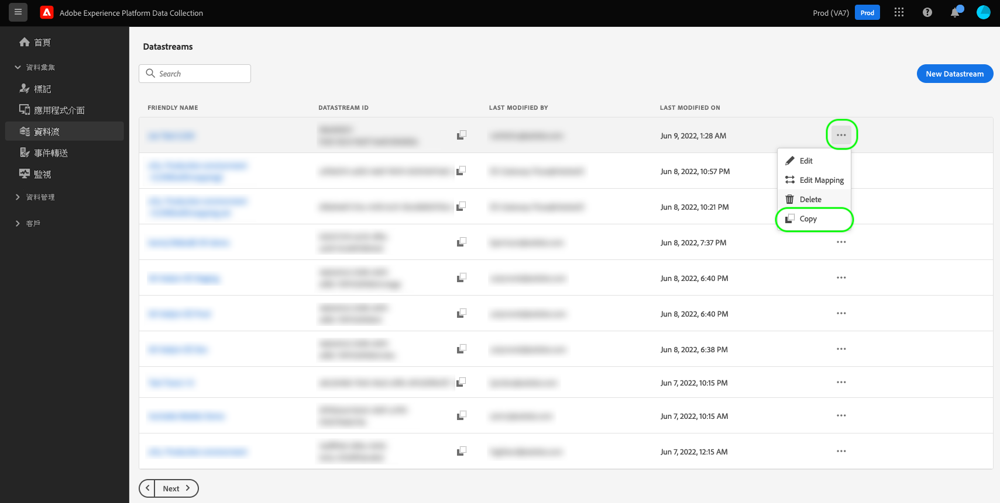
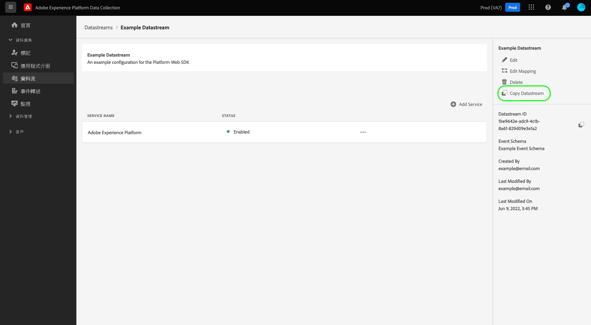

# 建立和設定資料串流

本文件會介紹在 UI 中設定[資料流](./overview.md)的步驟。

## 存取[!UICONTROL 資料流]工作區

在左側導覽中選取&#x200B;**[!UICONTROL 資料流]**，即可建立並管理資料收集 UI 或 Experience Platform UI 中的資料流。

**[!UICONTROL 資料流]**&#x200B;索引標籤會顯示現有資料流的清單，包括其易記名稱、ID 和上次修改日期。若要[檢視其詳細資料並設定服務](#view-details)，請選取資料流的名稱。

若要顯示特定資料串流的更多選項，請選取「更多」圖示(**...**)。 若要更新資料流的[基本設定](#configure)，請選取&#x200B;**[!UICONTROL 編輯]**。 若要移除資料流，請選取&#x200B;**[!UICONTROL 刪除]**。

## 建立資料串流 {#create}

若要建立資料流，首先請選取&#x200B;**[!UICONTROL 新資料流]**。

。

資料流建立工作流程隨即顯示，首先是設定步驟。在這裡，您必須提供資料流的名稱和說明 (選用)。

如果您設定要在Experience Platform中使用的資料串流，並且也使用網路SDK，您還必須選取[事件型體驗資料模型(XDM)結構描述](../xdm/classes/experienceevent.md)來代表您計畫擷取的資料。

### 設定地理位置與網路查閱 {#geolocation-network-lookup}

地理位置和網路查詢設定可協助您定義要收集的地理和網路層級資料的詳細程度。

展開&#x200B;**[!UICONTROL 地理位置與網路查詢]**&#x200B;區段，以設定下述設定。

| 設定 | 說明 |
| --- | --- |
| [!UICONTROL 地理查詢] | 根據訪客的IP位址啟用所選選項的地理位置查閱。 可用的選項包括： <ul><li>**國家**：填入`xdm.placeContext.geo.countryCode`</li><li>**郵遞區號**：填入`xdm.placeContext.geo.postalCode`</li><li>**州/省**：填入`xdm.placeContext.geo.stateProvince`</li><li>**DMA**：填入`xdm.placeContext.geo.dmaID`</li><li>**城市**：填入`xdm.placeContext.geo.city`</li><li>**緯度**：填入`xdm.placeContext.geo._schema.latitude`</li><li>**經度**：填入`xdm.placeContext.geo._schema.longitude`</li></ul>無論選取其他什麼選項，選取&#x200B;**[!UICONTROL 城市]**、**[!UICONTROL 緯度]**&#x200B;或&#x200B;**[!UICONTROL 經度]**&#x200B;都會提供最多兩個小數點的座標。這被視為城市層級的詳細程度。   未選取任何選項會停用地理位置查詢。 地理位置發生在[!UICONTROL IP模糊化]之前，這表示它不受[!UICONTROL IP模糊化]設定影響。 |
| [!UICONTROL 網路查詢] | 根據訪客的IP位址啟用所選選項的網路查閱。 可用的選項包括： <ul><li>**行動電信業者**：填入`xdm.environment.carrier`</li><li>**網域**：填入`xdm.environment.domain`</li><li>**ISP**：填入`xdm.environment.ISP`</li><li>**連線型別**：填入`xdm.environment.connectionType`</li></ul> |

如果您啟用任何上述欄位以進行資料收集，請確定您在設定Web SDK時已正確設定[`context`](/help/web-sdk/commands/configure/context.md)陣列屬性。

地理位置查閱欄位使用`context`陣列字串`"placeContext"`，而網路查閱欄位使用`context`陣列字串`"environment"`。

此外，請確定您的結構描述中存在每個所需的XDM欄位。 如果不適用，您可以將Adobe提供的`Environment Details`欄位群組新增到結構描述。

### 設定裝置查詢 {#geolocation-device-lookup}

**[!UICONTROL 裝置查詢]**&#x200B;設定可讓您選取要收集的裝置特定資訊。

展開&#x200B;**[!UICONTROL 裝置查詢]**&#x200B;區段以設定下述設定。

>[!IMPORTANT]
>
>下表中所示的設定是互斥的。 您無法同時選取使用者代理程式資訊&#x200B;*和*&#x200B;裝置查閱資料。

| 設定 | 說明 |
| --- | --- |
| **[!UICONTROL 保留使用者代理程式和使用者端提示標頭]** | 選取此選項可僅收集儲存在使用者代理字串中的資訊。 此設定預設為選取。 填入`xdm.environment.browserDetails.userAgent` |
| **[!UICONTROL 使用裝置查詢來收集下列資訊]** | 如果要收集下列一或多個裝置特定資訊，請選取此選項： <ul><li>**[!UICONTROL 裝置]**&#x200B;資訊：<ul><li>**裝置製造商**：填入`xdm.device.manufacturer`</li><li>**裝置模型**：填入`xdm.device.modelNumber`</li><li>**行銷名稱**：填入`xdm.device.model`</li></ul></li><li>**[!UICONTROL 硬體]**&#x200B;資訊： <ul><li>**硬體型別**：填入`xdm.device.type`</li><li>**顯示高度**：填入`xdm.device.screenHeight`</li><li>**顯示寬度**：填入`xdm.device.screenWidth`</li><li>**顯示色彩深度**：填入`xdm.device.colorDepth`</li></ul></li><li>**[!UICONTROL 瀏覽器]**&#x200B;資訊： <ul><li>**瀏覽器廠商**：填入`xdm.environment.browserDetails.vendor`</li><li>**瀏覽器名稱**：填入`xdm.environment.browserDetails.name`</li><li>**瀏覽器版本**：填入`xdm.environment.browserDetails.version`</li></ul></li><li>**[!UICONTROL 作業系統]**&#x200B;資訊： <ul><li>**OS廠商**：填入`xdm.environment.operatingSystemVendor`</li><li>**OS名稱**：填入`xdm.environment.operatingSystem`</li><li>**OS版本**：填入`xdm.environment.operatingSystemVersion`</li></ul></li></ul>裝置查詢資訊無法與使用者代理程式和使用者端提示一起收集。 選擇收集裝置資訊會停用收集使用者代理程式和使用者端提示，反之亦然。 |
| **[!UICONTROL 不收集任何裝置資訊]** | 如果您不想收集任何裝置查詢資訊，請選取此選項。 未收集任何裝置、硬體、瀏覽器、作業系統、使用者代理程式或使用者端提示資料。 |

如果您啟用任何上述欄位以進行資料收集，請確定您在設定Web SDK時已正確設定[`context`](/help/web-sdk/commands/configure/context.md)陣列屬性。

裝置和硬體資訊使用`context`陣列字串`"device"`，而瀏覽器和作業系統資訊使用`context`陣列字串`"environment"`。

此外，請確定您的結構描述中存在每個所需的XDM欄位。 如果不適用，您可以將Adobe提供的`Environment Details`欄位群組新增到結構描述。

### 設定進階選項 {#advanced-options}

若要顯示進階設定選項，請選取&#x200B;**[!UICONTROL 進階選項]**。 您可以在此處設定其他資料流設定，例如IP模糊化、第一方ID Cookie等。

>[!IMPORTANT]
>
> 您有責任確保已取得適用法律與法規所規定的一切必要許可權、同意、許可與授權，以收集、處理及傳輸個人資料，包括精確的地理位置資訊。
> 
> 您選擇的IP位址模糊化不會影響到從IP位址衍生並傳送至您設定的Adobe解決方案的地理位置資訊層級。 地理位址查詢必須單獨限制或停用。

| 設定 | 說明 |
| --- | --- |
| [!UICONTROL IP 模糊化] | 說明要套用於資料流的 IP 模糊化的類型。任何根據客戶IP的處理會受到IP模糊化設定的影響。 這包括從資料流接收資料的所有 Experience Cloud 服務。 
可使用的選項：
 <ul><li>**[!UICONTROL 無]**：停用 IP 模糊化。完整的使用者IP位址會透過資料流傳送。</li><li>**[!UICONTROL 部分]**：若為 IPv4 位址，模糊化使用者 IP 位址的最後八位元。若為 IPv6 位址，模糊化位址的最後 80 個位元。 
範例：
 <ul><li>IPv4：`1.2.3.4` -> `1.2.3.0`</li><li>IPv6：`2001:0db8:1345:fd27:0000:ff00:0042:8329` -> `2001:0db8:1345:0000:0000:0000:0000:0000`</li></ul></li><li>**[!UICONTROL 全部]**：模糊化整個 IP 位址。 
範例：
 <ul><li>IPv4：`1.2.3.4` -> `0.0.0.0`</li><li>IPv6：`2001:0db8:1345:fd27:0000:ff00:0042:8329` -> `0:0:0:0:0:0:0:0`</li></ul></li></ul> IP 模糊化會對其他 Adobe 產品造成影響： <ul><li>**Adobe Target**：在Adobe Target中執行[!UICONTROL IP模糊化]之前，將資料流層級[!UICONTROL IP模糊化]套用至要求上存在的所有IP位址。 例如，如果資料流層級[!UICONTROL IP模糊化]選項設為&#x200B;**[!UICONTROL 完整]**，而Adobe Target IP模糊化選項設為&#x200B;**[!UICONTROL 最後一個八位元模糊化]**，Adobe Target會收到完全模糊化的IP。 如果資料流層級[!UICONTROL IP模糊化]選項設為&#x200B;**[!UICONTROL 部分]**，而Adobe Target IP模糊化選項設為&#x200B;**[!UICONTROL 全部]**，Adobe Target會收到部分模糊化的IP，然後套用完整的模糊化選項。 Adobe Target IP模糊化是獨立於資料流管理。 如需更多詳細資料，請至 [IP 模糊化](https://experienceleague.adobe.com/docs/target-dev/developer/implementation/privacy/privacy.html)和[地理位置](https://experienceleague.adobe.com/docs/target/using/audiences/create-audiences/categories-audiences/geo.html)，參閱 Adobe Target 文件。</li><li>**Audience Manager**：在Audience Manager中執行[!UICONTROL IP模糊化]之前，將資料流層級[!UICONTROL IP模糊化]設定套用至要求中存在的所有IP位址。 Audience Manager 完成的任何地理位置查詢都會受到資料流層級 [!UICONTROL IP 模糊化]選項的影響。Audience Manager中根據完全模糊化的IP進行地理位置查詢會產生未知區域，且不會實現任何根據結果地理位置資料的區段。 如需更多詳細資料，請至 [IP 模糊化](https://experienceleague.adobe.com/docs/audience-manager/user-guide/features/administration/ip-obfuscation.html)，參閱 Audience Manager 文件。</li><li>**Adobe Analytics**：如果資料流層級IP模糊化設定設為&#x200B;**[!UICONTROL 完整]**，Adobe Analytics會將IP位址視為空白。 這會影響任何依賴IP位址的Analytics處理，例如地理位置查詢和IP篩選。 若要讓Analytics接收未模糊化或部分模糊化的IP位址，請將IP模糊化設定設為&#x200B;**[!UICONTROL 部分]**&#x200B;或&#x200B;**[!UICONTROL 無]**。 部分模糊化及未模糊化的IP位址在Analytics中可能會進一步模糊化。 如需如何在Analytics中啟用IP模糊化的詳細資訊，請參閱Adobe Analytics [檔案](https://experienceleague.adobe.com/docs/analytics/admin/admin-tools/manage-report-suites/edit-report-suite/report-suite-general/general-acct-settings-admin.html)。 如果IP位址已完全模糊化，而且頁面點選既沒有[!DNL ECID]也沒有[!DNL VisitorID]，則Analytics會捨棄點選，而非產生部分以IP位址為基礎的[遞補ID](https://experienceleague.adobe.com/docs/id-service/using/reference/analytics-reference/analytics-ids.html?lang=en)。</li></ul> |
| [!UICONTROL 第一方 ID Cookie] | 啟用後，在查詢[第一方裝置 ID](../web-sdk/identity/first-party-device-ids.md) 時，此設定會告知 Edge Network 參照指定的 cookie，而不是在身分識別對應中查詢這個值。  啟用此設定時，您必須提供應儲存ID的Cookie名稱。 |
| [!UICONTROL 協力廠商 ID 同步] | 將 ID 同步分組至不同的容器中，即可讓不同的 ID 同步在不同時間執行。啟用後，此設定會讓您指定為此資料流執行哪個 ID 同步的容器。 |
| [!UICONTROL 協力廠商 ID 同步容器 ID] | 用於協力廠商 ID 同步之容器的數值 ID。 |
| [!UICONTROL 容器 ID 覆寫] | 在此區段中，您可以定義其他第三方ID同步容器ID，以用來覆寫預設的ID。 |
| [!UICONTROL 存取類型] | 定義 Edge Network 接受資料流的驗證類型。 <ul><li>**[!UICONTROL 混合驗證]**：選取此選項時，Edge Network 會同時接受已驗證和未驗證的要求。當您計劃使用 Web SDK 或 [Mobile SDK](https://developer.adobe.com/client-sdks/home/) 以及[伺服器 API](../server-api/overview.md) 時，請選取此選項。 </li><li>**[!UICONTROL 僅限已驗證]**：選取此選項時，Edge Network 只接受已驗證的要求。當您計劃只使用伺服器 API 並希望防止 Edge Network 處理任何未驗證的要求時，請選取此選項。</li></ul> |
| [!UICONTROL Media Analytics] | 啟用透過Experience Platform SDK或[Media Edge API](https://developer.adobe.com/cja-apis/docs/endpoints/media-edge/getting-started/)處理Edge Network整合的串流追蹤資料。 從[檔案](https://experienceleague.adobe.com/docs/media-analytics/using/media-overview.html?lang=zh-Hant)瞭解Media Analytics。 |

如果您正在設定Experience Platform的資料串流，請先按照[資料收集的資料準備](./data-prep.md)上的教學課程將資料對應到Experience Platform事件結構描述，然後再返回本指南。 否則，請選取「**[!UICONTROL 儲存]**」，並繼續進行下一區段。

## 檢視資料流詳細資料 {#view-details}

設定新資料流或選取要檢視的現有資料流後，該資料流的詳細資料頁面會隨即顯示。您可以在此處找到有關資料流的進一步資訊，包括其 ID。

在資料流詳細資料畫面中，您可以[新增服務](#add-services)，以啟用您有權存取的 Adobe Experience Cloud 產品的功能。您還可以編輯資料流的[基本設定](#create)、更新其[對應規則](./data-prep.md)、[複製資料流](#copy)，或將其完全刪除。

## 將服務新增至資料流 {#add-services}

在資料流的詳細資料頁面上，選取&#x200B;**[!UICONTROL 新增服務]**，即可開始為該資料流新增可用的服務。

![選取[新增服務]以繼續。](assets/configure/add-service.png)

在下一個畫面上，使用下拉選單選取要為此資料流設定的服務。此清單中只會顯示您有權存取的服務。

選取所需的服務，填寫顯示的設定選項，然後選取「**[!UICONTROL 儲存]**」，即可將服務新增至資料流。所有已新增的服務都會顯示在資料流的詳細資料檢視中。

以下子區段會說明每項服務的設定選項。

>[!NOTE]
>
>每個服務設定都包含「**[!UICONTROL 已啟用]**」開關，選取服務時會自動啟動。若要停用為此資料流選取的服務，請再次選取「**[!UICONTROL 已啟用]**」開關。

### Adobe Analytics 設定 {#analytics}

此服務會控制是否將資料傳送到 Adobe Analytics 以及傳送方式。請參閱[傳送資料至Adobe Analytics](/help/web-sdk/use-cases/adobe-analytics.md)。

| 設定 | 說明 |
| --- | --- |
| [!UICONTROL 報告套裝 ID] | **(必要)** 您要將資料傳送到的 Analytics 報告套裝的 ID。此 ID 可以在「[!UICONTROL 管理員] > [!UICONTROL 報告套裝]」下的 Adobe Analytics UI 中找到。如果指定多個報告套裝，則資料會複製到每個報告套裝。 |
| [!UICONTROL 訪客ID名稱空間] | （選用）您要用於Adobe Analytics [visitorID](https://experienceleague.adobe.com/docs/analytics/implementation/vars/config-vars/visitorid.html?lang=zh-Hant)的名稱空間。 當您傳送具有為此名稱空間指定值的事件時，系統會自動將其用作Analytics中的`visitorID`。 |
| [!UICONTROL 報告套裝覆寫] | 在本區段中，您可以新增其他報告套裝 ID，以用於覆寫預設的報告套裝 ID。 |

### Adobe Audience Manager 設定 {#audience-manager}

此服務會控制是否將資料傳送到 Adobe Audience Manager 以及傳送方式。若要將資料傳送到 Audience Manager，需要做的就是啟用本區段。其他設定為選用，但建議使用。

| 設定 | 說明 |
| --- | --- |
| [!UICONTROL 已啟用 Cookie 目的地] | 允許 SDK 透過 [cookie 目的地](https://experienceleague.adobe.com/docs/audience-manager/user-guide/features/destinations/custom-destinations/create-cookie-destination.html)從 [!DNL Audience Manager] 共用區段資訊。 |
| [!UICONTROL 已啟用 URL 目的地] | 允許 SDK 透過 [URL 目的地](https://experienceleague.adobe.com/docs/audience-manager/user-guide/features/destinations/custom-destinations/create-url-destination.html)從 [!DNL Audience Manager] 共用區段資訊。 |

### Adobe Experience Platform 設定 {#aep}

>[!IMPORTANT]
>
>為Experience Platform啟用資料串流時，請記下您目前使用的Experience Platform沙箱，如UI的頂端功能區中所示。
>
>
>
>沙箱是 Adobe Experience Platform 中的虛擬分區，可讓您將資料和實作與貴組織中的其他項目隔離。資料流建立後，其沙箱即無法變更。如需在 Experience Platform 中的沙箱角色的更多詳細資料，請參閱[沙箱文件](../sandboxes/home.md)。

此服務會控制是否將資料傳送到 Adobe Experience Platform 以及傳送方式。

| 設定 | 說明 |
|---| --- |
| [!UICONTROL 事件資料集] | **（必要）**&#x200B;選取將串流至客戶事件資料的Experience Platform資料集。 此結構描述必須使用 [XDM 體驗事件類別](../xdm/classes/experienceevent.md)。若要新增其他資料集，請選取&#x200B;**[!UICONTROL 新增事件資料集]**。 |
| [!UICONTROL 輪廓資料集] | 選取將傳送客戶屬性資料的Experience Platform資料集。 此結構描述必須使用 [XDM 個人輪廓類別](../xdm/classes/individual-profile.md)。 |
| [!UICONTROL Offer Decisioning] | 為Web SDK實作啟用Offer Decisioning。 如需更多實作詳細資訊，請參閱[搭配使用Offer Decisioning與Web SDK](../web-sdk/personalization/offer-decisioning/offer-decisioning-overview.md)指南。  如需有關 Offer Decisioning 功能的詳細資訊，請參閱 [Adobe Journey Optimizer 文件](https://experienceleague.adobe.com/docs/journey-optimizer/using/offer-decisioning/get-started-decision/starting-offer-decisioning.html?lang=zh-Hant)。 |
| [!UICONTROL 邊緣分段] | 啟用此資料流的[邊緣分段](../segmentation/methods/edge-segmentation.md)。 當[網頁SDK](../web-sdk/home.md)或[Edge Network伺服器API](../server-api/overview.md)透過啟用邊緣細分的資料流傳送資料時，相關設定檔的任何更新對象會傳回回應。  您可以透過[邊緣目的地](../destinations/ui/activate-edge-personalization-destinations.md)或[!DNL Offer Decisioning]，將此選項與&#x200B;**[!UICONTROL Personalization目的地]**&#x200B;搭配用於相同頁面和下一頁個人化使用案例。 |
| [!UICONTROL 個人化目的地] | 啟用[!UICONTROL 邊緣分段]核取方塊後再啟用此功能時，此選項可讓資料流連線至個人化目的地，例如[自訂個人化](../destinations/catalog/personalization/custom-personalization.md)。  如需有關[設定個人化目的地](../destinations/ui/activate-edge-personalization-destinations.md)的具體步驟，請參閱目的地文件。 |
| [!UICONTROL Adobe Journey Optimizer] | 啟用此資料流的[Adobe Journey Optimizer](https://experienceleague.adobe.com/docs/journey-optimizer/using/ajo-home.html)。   啟用此選項可讓資料流從 [!DNL Adobe Journey Optimizer] 中以 Web 和應用程式為主的傳入行銷活動傳回個人化內容。此選項需要[!UICONTROL 邊緣分段]才能啟用。如果未勾選[!UICONTROL Edge分段]，則此選項會變灰。 |

### Adobe Target 設定 {#target}

此服務會控制是否將資料傳送到 Adobe Target 以及傳送方式。

| 設定 | 說明 |
| --- | --- |
| [!UICONTROL 屬性語彙基元] | [!DNL Target]允許客戶使用屬性控制許可權。 如需有關屬性的詳細資訊，請至[設定企業權限](https://experienceleague.adobe.com/docs/target/using/administer/manage-users/enterprise/properties-overview.html) (在 [!DNL Target] 文件中)，詳閱指南。  如需屬性語彙基元，可以在「[!UICONTROL 設定] > [!UICONTROL 屬性]」下的 Adobe Target UI 中找到。 |
| [!UICONTROL 目標環境 ID] | [Adobe Target 中的環境](https://experienceleague.adobe.com/docs/target/using/administer/hosts.html)可協助您管理全部開發階段的實作。此設定會指定您將使用此資料流的環境。  最佳做法是針對您的每個 `dev`、`stage` 和 `prod` 資料流環境對此做不同的設定，以保持事情簡單。但是，如果您已經定義了 Adobe Target 環境，則可以使用已定義的環境。 |
| [!UICONTROL Target 協力廠商 ID 命名空間] | 您要用於此資料流之 `mbox3rdPartyId` 的身分識別命名空間。如果您使用Adobe Target的[!DNL Customer Attributes]整合，或透過[Adobe Target設定檔API](https://experienceleague.adobe.com/en/docs/target-dev/developer/api/profile-apis/profiles-api)使用`thirdPartyId`來更新或建立設定檔，您必須提供您選擇的名稱空間值。 您必須在XDM結構描述的`IdentityMap`區段中使用此名稱空間，以傳送用於客戶屬性檔案上傳或設定檔更新API呼叫的`customerID`或`thirdPartyId`。  如需詳細資訊，請至[實作 `mbox3rdPartyId` 和 Web SDK](../web-sdk/personalization/adobe-target/using-mbox-3rdpartyid.md)，詳閱指南。 |
| [!UICONTROL 屬性語彙基元覆寫] | 在此區段中，您可以定義其他可用來覆寫預設屬性代號的屬性。 |

### [!UICONTROL 事件轉送]設定

此服務會控制是否將資料傳送到[事件轉送](../tags/ui/event-forwarding/overview.md)以及傳送方式。

資料流設定畫面的

| 設定 | 說明 |
| --- | --- |
| [!UICONTROL 啟動屬性] | **(必要)** 您要將資料傳送到的事件轉送屬性。 |
| [!UICONTROL 啟動環境] | **(必要)** 您要將資料傳送到的選取屬性內的環境。 |

>[!NOTE]
>
>選取&#x200B;**[!UICONTROL 手動輸入 ID]**，即可鍵入屬性和環境名稱，而不用使用下拉選單。

## 複製資料流 {#copy}

您可以建立現有資料流的副本並根據需要變更其詳細資料。

>[!NOTE]
>
>資料流只能在相同的[沙箱](../sandboxes/home.md)內複製。換句話說，您無法將資料流從一個沙箱複製到另一個沙箱。

在[!UICONTROL 資料流]工作區中的主要頁面，選取要複製之資料流的省略符號 (**....**)，然後選取「**[!UICONTROL 複製]**」。

或者，您可以從特定資料流的詳細資料檢視中選取&#x200B;**[!UICONTROL 複製資料流]**。

確認對話框隨即顯示，提示您為要將建立的新資料流提供唯一名稱，以及有關將複製的設定選項的詳細資料。就緒後，請選取&#x200B;**[!UICONTROL 複製]**。

[!UICONTROL 資料流]工作區的主要頁面會隨即重新顯示，並列出新的資料流。

## 後續步驟

本指南會介紹如何在資料收集 UI 中管理資料流。如需有關如何在設定資料流後安裝並設定 Web SDK 的詳細資訊，請參閱[資料收集 E2E 指南](../collection/e2e.md#install)。
